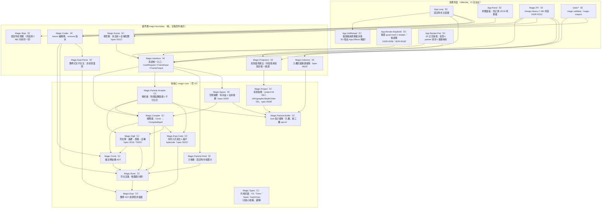
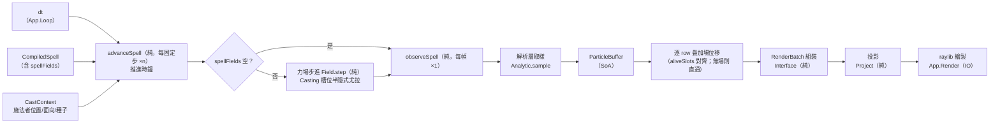
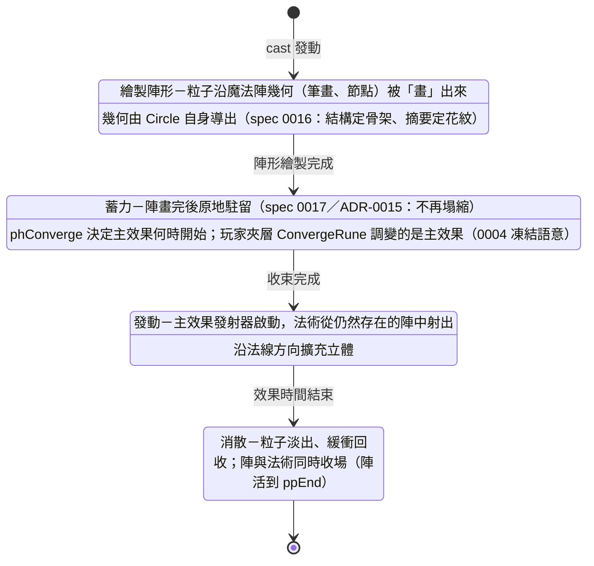

# 粒子魔法系統 — 系統架構設計書

> 版本：1.3（2026-08-18：本檔遷入 `docs/arch/`，並依 dev-flow 慣例補上 §2.1「子系統劃分」與 frontmatter 的 `subarchs` 權威清單——六份 `subarch-*` 承接子系統內部的元件、資料流與演算法細節，本檔自此只寫到子系統邊界的顆粒度。同輪把 §2 的模組圖補到與程式碼一致——加入七個早已存在卻未入圖的模組（`Magic.Sigil`／`Magic.Space`／`Magic.Expr.Code`／`Magic.Expr.Parse`／`Magic.Columns`／`Magic.Step`／`Magic.Types`）、補上 `tools/*` 這條第三種消費路徑，並修掉兩處與 import 圖不符的邊（`App.HotReload → Magic.Codec` 這條 import 實際不存在——讀檔的 `Magic.Codec` 呼叫在 `App.Loop`，而 `App.HotReload` 的 IO 半邊由 `App.Effects` 解譯，故改為 `App.Loop → App.HotReload`；FFI 與 2D 後端的虛線在 spec 0009／0008 交付後改為實線）。**既有節號與設計語意一字未動**）；1.2（2026-08-16：spec 0023 的收尾修訂——§4.5 `ParticleBuffer` 更新為九欄並說明 opt-in 不變量、§5.2 的「輸出零 raylib 型別」保證加註被正面檢驗並維持、§7「明確不做」補上軟粒子／後處理的邊界修訂（三項永久非目標一字不動）、§11 第 3 列補上加欄的方式與實測代價、§12 補 ADR 0017／0018／0019 三列。語意設計不變）；1.1（2026-08-13：對齊 spec 0001–0005 交付現實——§4.3/§5.1 Expr 合約更正、§5.3 函數清單、§7/§9.2 渲染路線改依 ADR-0009、型別落點註記；語意設計不變）
> 狀態：設計定案（POC 實作中）
> 相關文件：[Init.md](../../Init.md)（原始需求）、[ADR 索引](#12-adr-索引)

---

## 1. 概述與設計理念

本系統是一套**粒子魔法系統**：玩家透過參數與符文組合出魔法，魔法的一切表現皆由粒子系統建構。設計圍繞五個核心理念：

### 1.1 Circle as Data（魔法陣即資料）

魔法陣不是程式碼，而是一份**純資料**（Haskell ADT，可序列化為 JSON）。一個預先寫好的**解釋器**（`Magic.Compile`）將這份資料編譯成粒子發射器集合。魔法的表達力來自資料的組合空間，而非程式碼的分支——這是用 Haskell 代數資料型別的強項，讓「無窮無盡的魔法」成為資料組合問題。

### 1.2 特效即魔法（不是裝飾）

粒子不是魔法結算後補上的視覺糖衣。魔法陣的每個槽位、每個符文都直接決定粒子的數學行為：核心決定本質（屬性、強度）、內圈決定行為（軌跡、數學式）、夾層決定調變（收束、增幅）、外圈決定展現（形狀、範圍、輻射）。看到的粒子形態**就是**魔法的語意。

### 1.3 純函數核心

核心模組（`Magic.*`）**零 IO**。粒子狀態主要是時間的純函數（解析式模型），可選的力場層也是純的狀態轉移函數。所有效果（渲染、檔案監看、時鐘）被推到 `effectful` 管理的外殼層（`App.*`）。這帶來：完全確定性、可重播（快轉/倒帶）、可用純函數測試整個魔法系統。

### 1.4 由內而外設計

魔法陣的語意由內而外展開：**核心（本質）→ 內圈（行為）→ 夾層（調變）→ 外圈（展現）**。解釋器是一個由內而外的 fold：先確立魔法的本質，逐層向外套用轉換，最後產出具體的發射器集合。系統架構同樣由內而外：純核心 → 邊界層 → 效果外殼。

### 1.5 維度無關

核心在**抽象 3D 空間**中運作，不知道最終投影到 2D 還是 3D。系統輸出是維度無關的 `RenderBatch`（粒子位置皆為 3D 向量），由外殼層的投影後端決定映射方式——3D 透視、2D 正交（丟棄一軸）皆為投影特例。換遊戲、換引擎、換維度，只需替換外殼層。

---

## 2. 系統架構圖

系統分三環：**純核心**（零 IO，魔法語意全在此）、**邊界層**（純，定義系統對外的輸入/輸出格式）、**效果外殼**（effectful，所有 IO）。依賴方向嚴格由外向內，核心不知道外殼的存在。



節點標籤的〔n〕是 §2.1 的第 n 個子系統，讓這張模組圖與子系統劃分對得起來。

**關鍵約束**：

- `Magic.*` 之間不 import 任何 `App.*` 或 IO；以模組邊界＋cabal sublibrary 依賴清單強制（`BoundarySpec` 機械守護；`magic-core`/`magic-boundary` 為 `visibility: public` 的公開 sublibrary，外部專案可直接依賴）。
- 外殼只透過 `Magic.Interface` 使用核心——它是系統對外的**唯一依賴點**（Init.md「完美的介面化」目標）。
- `Magic.Codec` 屬邊界層而非核心：核心只認識 ADT，不認識 JSON 或數學式文字語法。

### 2.1 子系統劃分

三環之下再切六個**子系統**，每一個對應一份 `docs/arch/subarch-000x-*.md`，承接本節定下的邊界往內展開（元件切分、內部資料流、關鍵演算法、功能路線圖）。切分依據是 cabal 的實際依賴邊界與模組歸屬，不是概念分類——每一塊都指得到具體檔案。

| 子系統 | 所在環 | 職責（做什麼） | 明確不做 | 文件 |
|---|---|---|---|---|
| 魔法語意 | 純核心 | 魔法陣 ADT、四類符文詞彙、由內而外解釋器、符文陣幾何與生命週期時間表——「魔法是什麼」 | 不求值數學式、不取樣粒子、不認識 JSON 文字 | [subarch-0001](subarch-0001-magic-semantics.md) |
| 數學式 Expr | 核心＋邊界（縱切） | 玩家可寫的小型算式語言：AST、求值器、常數摺疊／CSE／bytecode、文字文法剖析與還原 | 不決定式子掛在哪個槽位（那是語意子系統的事） | [subarch-0002](subarch-0002-expr-language.md) |
| 粒子模擬 | 純核心（＋邊界的 `Magic.Step`） | `CompiledSpell` × 時間 → `ParticleBuffer`：解析取樣、力場積分、SoA 緩衝、固定時步、平行與預算 | 不編譯魔法陣、不繪製、不做粒子間互動 | [subarch-0003](subarch-0003-particle-simulation.md) |
| 邊界與宿主整合 | 邊界層＋FFI 外殼 | 系統對外的唯一合約面：`Magic.Interface`／`Magic.Codec`、場景層、投影與空間查詢、C ABI 與各語言綁定 | 不含任何魔法語意，不選繪圖 API | [subarch-0004](subarch-0004-boundary-host.md) |
| 渲染外殼 | 效果外殼 | demo 遊戲外殼與全部 IO：主迴圈、熱重載、raylib 3D／2D 後端、quad mesh、shader 與後處理、HUD 與參數面板 | 不定義任何對外合約；整組可替換 | [subarch-0005](subarch-0005-render-shell.md) |
| 作者工具與工程化 | 執行期之外 | 寫陣的人與發布的人用的東西：三支 CLI、JSON Schema、文件↔程式碼守門測試、CI 矩陣與發布政策 | 不進庫、不影響任何執行期行為 | [subarch-0006](subarch-0006-authoring-engineering.md) |

**劃分原則**：1 與 3 都住 `magic-core` 卻分開，因為前者答「魔法是什麼」、後者答「這一幀長什麼樣」，兩者的變更理由完全不同；2 是唯一橫跨核心與邊界的**縱切**子系統，理由是同一個語言的 AST 在核心、文字語法在邊界（核心不認識文字，ADR-0002）；4 把 `src/ffi` 這個外殼位階的元件收進來，因為它與邊界層共用同一份合約、只是換一種呼叫慣例；6 不在三環裡，它的產物一行都不進出貨的庫。

---

## 3. 資料流架構

### 3.1 編譯期資料流（魔法陣 → 可執行魔法）

發生在魔法陣載入或熱重載時，一次性、全純：


### 3.2 每幀資料流（時間 → 畫面）



**純與不純的分界**：整條管線只有最左端（讀時鐘、讀檔）與最右端（繪製）有 IO。中間一切是 `純函數(輸入) → 輸出`，同樣的 `(CompiledSpell, CastContext, dt 序列)` 永遠產生同一串畫面——這就是可重播性的來源。無力場的魔法退化為每幀一次 `sample`（ADR-0010 D9：結構性跳過整層，逐位元等同力場層存在之前）。

### 3.3 魔法生命週期

回應 Init.md 的問題「如何先生成魔法陣（粒子），再收束發出粒子魔法」：魔法是一個分階段的生命週期，**魔法陣本身的幾何就是繪製階段的粒子來源**。



- `CompiledSpell` 內含各階段的發射器與時間包絡（`Envelope`）；階段切換由**時間**驅動，不是狀態機事件——整個生命週期仍是 `t` 的純函數。
- **陣不是被消耗掉的**（spec 0017／ADR-0015）：陣形發射器的生存窗延到 `ppEnd`，所以魔法陣從畫出來的那一刻起持續存在到法術結束，法術是**從陣裡射出來**而不是把陣燒掉。`Converging` 這個階段名稱保留（它是 C 線碼的一部分），語意為「畫完後原地蓄力」。陣形發射器維持 `emPhase = Drawing`，於是力場只作用於施放粒子（ADR-0010 D6）——重力井吸得動法術，吸不動陣。
- **陣會轉**（spec 0020／ADR-0020）：整陣繞面心自轉、相鄰環反向、`Converging` 期間轉速攀升（「原地蓄力」的視覺兌現），`castStart` 之後維持恆速直到法術結束。轉角是施法秒數的分段閉式函數（`Magic.Sigil.spinAngle`），屬**調變層**語意故吃施法時鐘而非粒子年齡；旋轉繞面平面原點因而保長，`emitterBounds` 與剔除邏輯不受影響。逐位元邊界為 `t = 0`：靜態的陣沒有被改變，只有時間讓它轉。
- **無魔法陣的施法**（Init.md：「沒有魔法陣就是單純的魔力放出」）：全空的 `Circle`（所有槽位 `Nothing`）編譯為一個跳過 Drawing/Converging、只有預設放出發射器的 `CompiledSpell`。空陣即素放——不需特例分支。

---

## 4. 核心型別設計

以下為設計草圖（非最終程式碼），展示型別系統如何承載魔法語意。

### 4.1 魔法陣結構（`Magic.Circle`）

```haskell
-- 固定兩層的環，槽位皆為 Optional（玩家自由組合）
data TwoOf a = TwoOf { ringA :: a, ringB :: a }

data Circle = Circle
  { outerRings :: TwoOf (Maybe OuterRune)   -- 外圈 2 層：展現
  , interLayer :: Maybe BridgeRune          -- 夾層 1 層：調變（界接內外的關鍵因子）
  , innerRings :: TwoOf (Maybe InnerRune)   -- 內圈 2 層：行為
  , core       :: Core                      -- 核心：本質
  }

data Core = Core
  { coreCenter :: Maybe EssenceRune         -- 最中心
  , coreNodes  :: Nodes (Maybe NodeRune)    -- 上下左右節點
  }

data Nodes a = Nodes { north :: a, south :: a, east :: a, west :: a }
```

**設計要點**：槽位的職責由**型別**決定——外圈槽位只能放 `OuterRune`，內圈只能放 `InnerRune`。「把行為符文放進外圈」這種不合法的魔法陣**無法被表示**，錯誤在型別層就被排除，解釋器不需要防禦性檢查。

### 4.2 符文（`Magic.Rune`）——依職責分類

```haskell
-- 外圈：展現（範圍、形狀、輻射）
data OuterRune
  = ShapeRune   FaceShape        -- 初始面形狀
  | RadiateRune RadiationMode    -- 依形狀輻射
  | RangeRune   Expr             -- 範圍（可為時間函數）

data FaceShape
  = HollowSquare Double          -- 口字型（九宮格中心空）
  | Rect V2                      -- 長形/矩形
  | Ring Double Double           -- 圓環
  | Diamond Double               -- 菱形

-- 夾層：調變（內外傳導）
data BridgeRune
  = ConvergeRune Expr            -- 收束強度曲線
  | AmplifyRune  Expr            -- 增幅
  | PhaseRune    Seconds         -- 時序位移

-- 內圈：行為（軌跡、時序、數學式）
data InnerRune
  = TrajectoryRune Trajectory    -- 內建軌跡（直進、螺旋、環繞…）
  | TimingRune     Envelope      -- 生成/持續時間包絡
  | FormulaRune    ExprV3        -- 玩家自訂數學式：t ↦ 位移向量

-- 核心：本質
data EssenceRune = EssenceRune
  { essElement :: Element        -- 屬性（決定顏色、混合模式）
  , essPower   :: Double         -- 強度
  }

data NodeRune = DirBias Double | ...  -- 上下左右節點：方向性偏置
```

新增一種符文＝在對應的 sum type 加一個建構子＋在解釋器加一個 case。GHC 的 exhaustiveness check 會指出所有需要更新的地方——這是「容易擴充」的機制保證（§10）。

### 4.3 數學表達式（`Magic.Expr`）

實際凍結合約（spec 0003/0004 交付；早期草圖以此為準——`Float` 精度、無 `Lerp`、`Chan` 為獨立建構子）：

```haskell
data Expr
  = Lit !Float
  | Var !Var
  | Chan !Int                          -- 確定性隨機通道 0..1（(Seed, 粒子索引, 通道) 雜湊）
  | Neg Expr
  | Bin !BinOp Expr Expr               -- Add | Sub | Mul | Div | Pow
  | Fun1 !Fun1 Expr                    -- sin cos abs sqrt floor sign
  | Fun2 !Fun2 Expr Expr               -- min max
  | Fun3 !Fun3 Expr Expr Expr          -- clamp

data Var
  = VarT       -- 時間軸依掛載點分層（spec 0004）：行為層 t＝粒子年齡、調變層 t＝施法秒數
  | VarLife    -- 粒子正規化生命週期 0..1
  | VarPIndex  -- 粒子索引正規化 0..1（同批粒子錯開相位用）

evalExpr :: Expr -> ExprEnv -> Float   -- 全函數（total）；evalFinite 保證有限值
data ExprV3 = ExprV3 Expr Expr Expr    -- 三分量向量式
```

**設計要點**：

- `Expr` 是**封閉、一階、無遞迴綁定**的小型 AST——不是 λ 演算。這保證求值必然終止、可序列化、可分析（例如靜態求出範圍上界做剔除）。
- 隨機性透過 `Chan Int` 變數注入：值由 `(Seed, 粒子索引, 通道)` 雜湊導出，**求值本身零狀態**，確定性與可重播性不被隨機性破壞。
- 使用者在 JSON 中以文字寫式子（如 `"sin(t*6)*0.3"`），文字→AST 的剖析在邊界層 `Magic.Codec`，核心只見 AST。

### 4.4 編譯結果（`Magic.Compile`）

實際凍結合約（spec 0002 交付、0006 補 phases、0007 補 fields；結構化 `ParticleBudget` 留待效能 spec）：

```haskell
data CompiledSpell = CompiledSpell
  { spellLifetime :: !Seconds            -- 最後一批粒子死盡的時刻
  , spellBudget   :: !Int                -- Σ emCount（編譯期算出；結構化 ParticleBudget 待效能 spec）
  , spellEmitters :: !(Vector EmitterSpec) -- 各階段發射器（含 0006 的陣形繪製發射器）
  , spellPhases   :: !PhasePlan          -- Drawing/Converging/Casting/Dissipating 絕對時間界標（spec 0006）
  , spellFields   :: ![ForceField]       -- 陣的力場環境（spec 0007；由 circleFields 直通，不參與 fold）
  }

data EmitterSpec = EmitterSpec
  { emAnchor     :: !Anchor        -- 發動點（相對施法者面向）＋法線
  , emCount      :: !Int
  , emSpawn      :: !Envelope      -- 發動時間/生成包絡（Envelope 實際定義於 Magic.Rune）
  , emMotion     :: !Motion        -- 位置：形狀取樣＋軌跡＋數學式的組合（資料）
  , emAppearance :: !Appearance    -- 顏色曲線（屬性導出）、尺寸、混合模式（BlendMode 實際定義於 Magic.Compile）
  , emPhase      :: !Phase         -- 所屬生命週期階段（spec 0006；中繼資料）
  }

compile :: Circle -> Either CompileError CompiledSpell
```

`Motion`、`Appearance` 都是**資料**而非函數，因此 `CompiledSpell` 整體可序列化、可快取、可在編譯期做粒子預算分析。

### 4.5 粒子緩衝（`Magic.Particle.Buffer`）——SoA

```haskell
data ParticleBuffer = ParticleBuffer
  { pbPosX, pbPosY, pbPosZ :: !(U.Vector Float)   -- Structure of Arrays
  , pbSize, pbLife         :: !(U.Vector Float)
  , pbColor                :: !(U.Vector Word32)  -- RGBA packed
  -- 速度（spec 0023／ADR-0018 D2）：opt-in，空向量 = 這個法術不需要
  , pbVelX, pbVelY, pbVelZ :: !(U.Vector Float)
  , pbCount                :: !Int
  }
```

SoA + `Data.Vector.Unboxed`：無指標追蹤、快取友善、GC 只見少數大型 pinned 區塊而非十萬個小物件；且 `pbPos*` 可直接以連續記憶體餵給 raylib 的 instanced rendering（§7）。

**九欄，且第七至九欄是 opt-in**（spec 0023）：只有含 `BillboardTrail` 的魔法會算速度，其餘留空向量，`sample` 在進迴圈前選一次建構子而非逐粒子分支——成本與加寬前完全相同（實測見 0023 §9.3）。不變量因此多一條：每個速度欄的長度要嘛 0、要嘛 `pbCount`，且三欄同步；消費者問一次 `hasVelocity` 就夠，不必各自防禦。前六欄的名稱、型別、順序、語意自 spec 0001 起**逐位元未變**。

### 4.6 混合粒子模型的每幀函數

實際交付簽名（spec 0007；ADR-0010 把組合點語意釘死為「相加式位移疊加」）：

```haskell
-- 解析層：無狀態。同樣輸入 → 同樣輸出
sample :: CompiledSpell -> CastContext -> Time -> ParticleBuffer

-- 解析層的兩個外露半邊（單一事實來源，供力場層對齊）
particlePosition :: CastContext -> Time -> EmitterSpec -> Int -> Double -> V3
aliveSlots       :: CompiledSpell -> Time -> [(Int, Int)]   -- = buffer row 順序

-- 力場層：純狀態轉移，鍵為穩定槽位 (emitterIndex, particleIndex)
data FieldState        -- 每槽位 (lastAge, 速度, 累積位移)
data SlotState = SlotState { ssVel :: !V3, ssDisp :: !V3 }

fieldAccel :: [ForceField] -> V3 -> V3
step :: [ForceField] -> DeltaTime
     -> Vector (Vector (Maybe (Double, V3)))   -- 各槽位本步的 (age, 解析基準位置)
     -> FieldState -> FieldState
displacementsInOrder :: FieldState -> [(Int, Int)] -> [V3]

-- 組合：renderedPos = analyticPos + disp（Interface 內，簽名零變更）
```

`step` 不吃 `ParticleBuffer`：buffer 的 row 每幀變動，不能當身分（ADR-0010 D2）。力場層以編譯期固定的槽位空間為鍵，疊加時用 `aliveSlots` 這一份列舉對齊 row。

無力場的魔法：每幀就是一次 `sample`，零狀態、可任意快轉倒帶。有力場的魔法：`FieldState` 是唯一跨幀狀態，且轉移是純函數＋固定時步——重播只需重放 `(dt 序列, Seed)`。

### 4.7 施法上下文與系統介面（`Magic.Interface`）

（型別落點註記：`CastContext` 實際定義於 `Magic.Types`、經 `Magic.Interface` re-export——對宿主的可見面不變。）

```haskell
data CastContext = CastContext
  { casterPos    :: V3      -- 施法者位置
  , casterFacing :: V3      -- 面向（發動點相對此解算）
  , seed         :: Seed    -- 確定性隨機種子
  }

-- 系統輸入
data CastRequest = CastRequest { circleOf :: Circle, ctxOf :: CastContext }
data FrameInput  = FrameInput  { frameDt :: DeltaTime }

-- 系統輸出（維度無關）
data FrameOutput = FrameOutput { batches :: [RenderBatch] }
data RenderBatch = RenderBatch
  { rbParticles :: ParticleBuffer   -- 抽象 3D 空間座標
  , rbBlend     :: BlendMode
  , rbShape     :: BillboardShape
  }
```

---

## 5. 系統介面規格

### 5.1 輸入格式：魔法陣 JSON

由 `Magic.Codec`（Aeson）定義，**含版本欄位**，是系統對外承諾的合約：

```json
{
  "version": 1,
  "name": "spiral-fire-burst",
  "circle": {
    "phases": { "draw": 1.2, "converge": 0.6 },
    "fields": [
      { "kind": "gravity",   "accel": [0, -3.0, 0] },
      { "kind": "attractor", "center": [0, 0, 4], "strength": 6.0, "softening": 0.5 },
      { "kind": "vortex",    "center": [0, 0, 0], "axis": [0, 0, 1], "strength": 2.0, "falloff": 0.3 }
    ],
    "outer": [
      { "rune": "shape", "shape": { "kind": "hollow-square", "size": 3.0 } },
      { "rune": "radiate", "mode": "along-normal" }
    ],
    "bridge": { "rune": "converge", "expr": "1 - life^2" },
    "inner": [
      { "rune": "trajectory", "kind": "forward", "speed": 8.0 },
      { "rune": "formula", "x": "sin(t*6)*0.3", "y": "cos(t*6)*0.3", "z": "0" }
    ],
    "core": {
      "center": { "element": "fire", "power": 1.5 },
      "nodes": { "north": null, "south": null, "east": null, "west": null }
    }
  }
}
```

規則：

- 一切槽位可為 `null`（Optional 語意）；全 `null` 即「素放」。
- `phases`（spec 0006）與 `fields`（spec 0007）是**陣層級屬性**而非符文槽，兩者皆選配：缺鍵或 `null` 等同「無」，因此 v1 的舊魔法檔逐位元照舊（`fields` 缺鍵＝`[]`＝力場層結構性跳過，ADR-0010 D9）。`fields` 的三種 `kind`（`gravity`/`attractor`/`vortex`）參數在邊界驗證：`softening > 0`、`falloff >= 0`、`axis` 非零。
- 數學式為文字，文法（spec 0003 凍結）：實數、常數 `pi`、變數 `t`/`life`/`pindex`、隨機通道 `chan(n)`、`+ - * / ^`、函數 `sin cos abs sqrt floor sign min max clamp`、括號。剖析失敗＝載入錯誤，附行列位置。
- **版本策略**：`version` 遞增時，`Magic.Codec` 保留舊版解碼器並提供 `migrate :: CircleV1 -> CircleV2`；核心永遠只處理最新版 ADT。

### 5.2 輸出格式：RenderBatch 串流

每幀輸出 `[RenderBatch]`：粒子位置為抽象 3D 座標的 SoA 緩衝＋混合模式＋billboard 形狀。**輸出不含任何 raylib 型別**——這是渲染後端可替換性的保證。

> 這條保證在 spec 0023 被**正面檢驗過並且維持**：那一輪讓自訂 shader、RenderTexture、bloom 鏈與軟粒子全部進場，但**全部住在殼層 `app/*`**，`FrameOutput`／`RenderBatch`／`ParticleBuffer` 一個 raylib 型別都沒多。緩衝多了三欄浮點數（速度），**那是資料不是渲染**——C ABI 宿主拿到速度之後要不要做拖尾、用哪個圖形 API，完全是宿主的事，庫不提供 shader 也不假設。ADR-0018 取代的是 ADR-0009 的「不自訂 shader」前提，不是這條保證。

宿主（遊戲）的責任：

1. 把 `RenderBatch` 交給投影後端（3D 透視 / 2D 正交）。
2. 依 `BlendMode` 設定管線狀態，整批繪製（渲染路徑見 ADR-0009：動態 quad mesh，draw call 數 = batch 數）。

### 5.3 對外唯一入口

外殼（或任何宿主遊戲）只允許 import `Magic.Interface` 與 `Magic.Codec`。套件層現況（2026-08-13 套件化回合落地）：`magic-core`/`magic-boundary` 是 `visibility: public` 的具名 sublibrary、依賴帶 PVP 上界（`^>=`），**外部 cabal 專案可經 `source-repository-package` 直接 `build-depends: particle-magic:magic-boundary`**（作法見 README.md）；exe 不依賴 `magic-core` 由 `BoundarySpec` 測試強制。宿主的完整使用面積（spec 0001 交付；0005 加 `advanceSpell`/`observeSpell`）：

```haskell
-- Magic.Codec
loadCircle      :: ByteString -> Either LoadError Circle
saveCircle      :: Circle -> ByteString
renderLoadError :: LoadError -> String

-- Magic.Interface
castSpell  :: CastRequest -> Either CompileError ActiveSpell
stepSpell  :: FrameInput -> ActiveSpell -> (ActiveSpell, FrameOutput)
isFinished :: ActiveSpell -> Bool
spellAge   :: ActiveSpell -> Time
-- spec 0005（推進/取樣分離；stepSpell ≡ advance 後 observe）：
advanceSpell :: FrameInput -> ActiveSpell -> ActiveSpell
observeSpell :: ActiveSpell -> FrameOutput
```

**第二種消費模式——C ABI（ADR-0011，spec 0009 已交付）**：非 Haskell 宿主（Unity／Godot／C/C++ 引擎）經 cabal `foreign-library` 產出的 `.dll`/`.so` 串接，合約為 `include/particle_magic.h`：JSON 字串進（重用 `Magic.Codec`）、SoA 六欄 copy-out 出、`pm_cast → pm_advance → pm_observe → pm_free` 的 handle 生命週期；FFI 外殼與 exe 同位階、同依賴紀律（僅 magic-boundary＋marshalling 用的 bytestring/vector），核心零變更，決定論跨邊界成立（FFI 路徑 ≡ Haskell 路徑為可測等價律，`test/Acceptance9Spec.hs`）。繪圖始終在庫外——宿主拿六條陣列自行餵頂點緩衝。

凍結的 C 合約（spec 0009 §4.4）：

```c
void     pm_init(void);            /* 冪等；啟動 GHC RTS */
void     pm_shutdown(void);
int      pm_abi_version(void);     /* == PM_ABI_VERSION == 1 */
PmSpell* pm_cast(const char* circle_json, const float pos[3], const float facing[3],
                 uint64_t seed, char* err_buf, int err_len);   /* NULL = 失敗 */
int      pm_cast_ex(...同上..., PmSpell** out_spell);          /* 失敗分類：PM_ERR_JSON / PM_ERR_BUDGET */
void     pm_advance(PmSpell*, float dt);
int      pm_is_finished(const PmSpell*);
double   pm_age(const PmSpell*);
int      pm_observe(PmSpell*, float* x, float* y, float* z, float* size, float* life,
                    uint32_t* color, int capacity, int* batch_info, int max_batches);
void     pm_free(PmSpell*);
```

---

## 6. 解釋器設計（由內而外）

`compile :: Circle -> Either CompileError CompiledSpell` 是一個由內而外的 fold，每層職責是**轉換上一層的結果**：

| 步驟 | 層 | 輸入 → 輸出 | 語意 |
|---|---|---|---|
| 1 | 核心 | `Core → SpellSeed` | 確立本質：屬性→顏色曲線/混合模式，強度→能量預算，節點→方向偏置。核心空缺時使用「素魔力」預設值 |
| 2 | 內圈（由內層到外層） | `SpellSeed → BehaviorProto` | 疊上行為：軌跡、時序包絡、玩家數學式，組合成 `Motion` 資料 |
| 3 | 夾層 | `BehaviorProto → ModulatedProto` | 調變：收束曲線、增幅係數、時序位移。夾層是「界接內外的關鍵因子」——內圈行為經它轉換後才交給外圈 |
| 4 | 外圈（由內層到外層） | `ModulatedProto → Vector EmitterSpec` | 具現：初始面形狀取樣出發射位置、範圍縮放、輻射模式展開為發射器集合 |
| 5 | 陣形自身 | `Circle 幾何 → Vector EmitterSpec` | 從魔法陣的環/槽位幾何直接導出 Drawing/Converging 階段的陣形粒子發射器（spec 0006 認領） |

**Init.md 參數對照表**（驗證原始需求全數落地）：

| Init.md 參數 | 落點 |
|---|---|
| 發動點位置（相對於角色面向） | `EmitterSpec.anchor` ＋ `CastContext.casterFacing` |
| 向量方向 | `Anchor` 的法線；初始面沿法線擴充立體（步驟 4 的形狀取樣＋`RadiationMode`） |
| 初始面範圍（口字型、長形、矩形） | `FaceShape`（`HollowSquare`/`Rect`/…） |
| 發動時間 | `Envelope`（`TimingRune`）＋ `PhasePlan` |
| 顏色（屬性） | `EssenceRune.essElement → Appearance` |
| 依形狀輻射 | `RadiateRune RadiationMode` |
| 收束強度 | `BridgeRune ConvergeRune`（解析曲線）；需粒子互動時用 `ForceField` |
| 多個效果疊 | `CompiledSpell` 為 `Semigroup`／`Monoid`：多張魔法陣的編譯結果合併＝發射器與力場串接、預算相加、`PhasePlan` **逐界標取 max**——**已落地**（spec 0012；`compileMany`／`Magic.Interface.castSpells`）。合成總量對同一個 `budgetCap` 檢查、沿用 `BudgetExceeded`；合併律與場作用域（完全融合）的裁決見 [ADR-0012](../adr/adr-0012-multi-circle-scene.md)。多法術共存另有場景層 `Magic.Scene`（全域配額，先到先得） |
| 強度 | `EssenceRune.essPower` |
| 數學式 | `FormulaRune ExprV3` |

---

## 7. 效能設計（目標：1 萬～10 萬粒子）

> 現況註記（spec 0010 交付後更新）：本節的手段已由 **func-spec 0010** 落地並實測，逐項狀態見下表「現況」欄。**實測結果**：4096 粒每幀純 CPU 0.73 ms → **0.27 ms**；取樣常數因子 161 → **65 ns/粒**；合成 10 萬粒取樣 **6.5 ms**（60 fps 預算的 39%）——1 萬～10 萬的目標在單執行緒下成立。**護欄 `budgetCap` 已由 func-spec 0012 提升為 16384**（原為 spec 0002 的骨架渲染護欄 4096）：選值規則＝「單幀純 CPU（取樣＋quad 展開）≤ 2 ms 的最大 2 的冪」，同機實測 16384 → **1.45 ms**、32768 → 2.87 ms（0012 §9.2；ADR-0012 D7）。提升未動到任何對外合約——`PM_MAX_PARTICLES` 永釘 4096，宿主改用 `pm_max_particles()`／`maxSpellParticles` 查詢。
>
> 現況註記（spec 0022 交付後追加）：ADR-0012 §後果指名的兩件「再抬上限的前提」——Expr bytecode 與多執行緒取樣——**都已到位**（§8.2、本表新增列）。同機（AMD Ryzen 7 9800X3D，8 核 16 緒）實測：單執行緒 100k 粒取樣 8.4 ms、16 緒 **2.5 ms**（3.9×）；`budgetCap` 現值 16384 的一幀取樣自 1.5 ms 降至 **1.0 ms**（-N8，1.51×）。**本輪不改 `budgetCap` 的值**：改它要依 ADR-0012 D7 的同一條規則重新量測，並同步 `pmMaxParticles`，屬另一輪的檔案（ADR-0017 D5）。

| 手段 | 說明 | 現況 |
|---|---|---|
| SoA + Unboxed Vector | §4.5。核心熱路徑（`sample`、`step`）在 unboxed 連續記憶體上以緊密迴圈運算，無 box、無指標追蹤 | ✅ 0010 S2／S4：`sample` 走 count-then-fill（`ST` 六欄 exact-size 單趟寫入，零 boxed 中介），`FieldState` 改為攤平 unboxed 欄 |
| 緩衝重用 | `ParticleBuffer` 底層以預配置的 mutable 緩衝（`ST` 內部、對外仍是純介面）每幀重寫，避免每幀配置十萬元素的新 vector 造成 GC 壓力 | **改判：純介面下不做**（0010 §2／§9.4-10）。`observeSpell` 回傳的 buffer 是宿主可長期持有的**純值**，跨幀重寫同一塊會偷改上一幀，違反 ADR-0007 的引用透明。純介面下的正解是「每幀恰好六次 exact-size 配置、零中介」，已落地；真正的跨幀 mutable 重用需要不同的 API 合約（租借式緩衝或 arena），且量測顯示配置目前不是瓶頸 |
| 編譯期粒子預算 | `compile` 時即算出各發射器最大粒子數（`ParticleBudget`），緩衝一次配足，執行期零成長 | ✅ 0010 S7：`ParticleBudget`（per-emitter＋total）入 `CompiledSpell.spellBudgetPlan`，經 `Magic.Interface.budgetPlanOf` 對宿主開放 |
| 發射器層級剔除 | 解析模型下每個發射器的空間包絡可靜態估計上界 → 視錐外整個發射器跳過取樣 | ✅ 兩半都交付，但**分工釐清**：核心交 `emitterBounds`（區間算術得到的保守 AABB，0010 S7），**視錐判定本身是宿主責任**——核心沒有相機概念（ADR-0008）。另加**時間**維度的剔除（0010 S3）：每發射器的存活索引由 `aliveRanges` 以 `O(log n)` 二分求出，死窗發射器零逐粒成本 |
| 批次渲染（[ADR-0009](../adr/adr-0009-dynamic-quad-mesh-rendering.md)） | raylib 端以動態 quad mesh＋`c'` 指標 API 繪製整個 batch，draw call 數 = batch 數而非粒子數（instancing 經實證否決：無 per-instance 顏色、需自訂 shader） | ✅ spec 0005 |
| GHC 設定 | `-O2 -fllvm`（視環境）；熱路徑函數 `INLINE`/`SPECIALIZE`；必要時 `-threaded` 讓 GC 與模擬並行 | 部分：`-O2` ✅（0005）、`evalFinite`/`evalFiniteV3` `INLINE`＋`evalExpr` `INLINABLE` ✅（0010 S6）；**多執行緒取樣 ✅ 0022 S4**（`Control.Parallel.Strategies` 逐發射器分片，ADR-0017；exe／tool／test／bench 皆帶 `-threaded -rtsopts "-with-rtsopts=-N"`，foreign library 的能力數由宿主 `hs_init` 決定）；`-fllvm` 仍未做（0022 §8-2：屬建置環境變數，與 CI 一起評估） |
| **平行取樣**（0022 追加） | 取樣工作按「發射器 × 索引區間」切成分片，以純 Strategies 平行求值後定序串接；決定論由切分方式結構性保證（律 2，ADR-0017 D2） | ✅ 0022 S4。粒子數 ≥ `parallelThreshold`（8192，實測選定）才走此路。同機（8 核 16 緒）實測 16384 粒 **1.4–1.5×**、100k 粒 **3.9×**；閾值以下平行較慢，故不走 |
| **per-emitter 提升**（0010 追加） | 位置公式中不隨粒子改變的部分（施法者座標系、世界座標錨點、面法線與其平面基底、節點漂移）每發射器每幀算一次，而非每粒子算一次 | ✅ 0010 S2。**這一步就是本輪一半以上的加速**（`observeSpell@4096` 471 → 195 µs）——原本每顆粒子要重算 4 次 `normalize`＋2 次 `basisFromNormal` |

**明確不做**（POC 範圍外）：GPU compute/transform feedback、粒子間碰撞、空間分割結構。力場層僅支援「場對粒子」（重力、吸引、渦流），不支援「粒子對粒子」。**這三項在 spec 0023 之後仍是永久非目標**，一字未鬆動。

> **spec 0023 的修訂（2026-08-16）**：軟粒子與後處理**從來不在上面那份清單裡**，但 ADR-0009 的「不自訂 shader」前提實質上禁止了它們——這是一條沒有被寫進 §7 卻真實存在的邊界。ADR-0018 取代該前提之後，兩者**已交付**（bloom 三 pass 鏈、深度取樣的軟粒子），連同速度驅動的拖尾與跨 batch 深度交錯。所有 shader 資產與後處理都住殼層，§5.2 的保證不受影響。
>
> 界線因此要說清楚：**「渲染細節不進庫」仍是永久原則**，變的只是「殼層能不能用 shader」。玩家在 JSON 裡寫 GLSL 是**永久非目標**（會把 GPU API 帶進輸入合約，破壞 ADR-0005 的可攜性）；HDR 管線與色調映射記帳於 0023 §8-5，屬另一輪而非非目標。

**力場層的成本模型**（spec 0007 交付後）：帶場的魔法每個**固定步**（非每幀）要對存活的 Casting 槽位重算解析基準位置並積分，成本 O(存活 Casting 粒子)×每步；上限由 `Magic.Step.plan` 的 maxSteps clamp 保護。零場的魔法**結構性跳過**整層（ADR-0010 D9），成本與力場層不存在時完全相同——0010 §9.2 量到零場 `advanceSpell` 為 ~1.1 ns／步，這條快路徑實質免費。`FieldState` 已於 spec 0010 S4 改為攤平 unboxed 欄（**表徵仍不凍結**，spec 0007 §4.7 照舊）；帶場成本實測 ≈ 38 ns／槽·步，其中主成本是每步重算一次解析基準位置（`fieldInputs`），不是積分本身。

---

## 8. 未來可能遇到的問題

1. **符文組合爆炸與平衡性**：固定職責限制了語意發散，但外圈×夾層×內圈×核心的組合數仍隨符文種類多項式成長。編譯期的 `ParticleBudget` 與能量預算（`essPower` 封頂）是第一道閘門；長期需要「魔法代價」系統在遊戲層約束。
2. **Expr 求值效能**：AST 直譯在十萬粒子 × 每粒子多個式子時可能成為熱點。緩解路徑（依序）：求值器對常見形狀 SPECIALIZE → 編譯期常數摺疊/共同子式消去 → 將 `Expr` 編成扁平的 bytecode 陣列以緊密迴圈求值。AST 介面不變，只換求值器。——**三階全數交付**：第一階由 spec 0010 S6（`foldConstants`，律：`evalExpr . foldConstants ≡ evalExpr`，逐位元），第二、三階由 **spec 0022**（`Magic.Expr.Code`：hash-consing 的 `cse` ＋ 扁平 `ExprCode`／`evalCode`，律：`evalCode . compileExpr ≡ evalExpr`，逐位元）。「AST 介面不變，只換求值器」被做到字面上：**`Magic/Expr.hs` 一個字都沒改**，`evalExpr` 降級為等價律的參照實作。

   **0010 的發現在本輪之後仍然成立，而且是本輪最重要的量測結論**：熱點確實不在 Expr。同機實測（0022 §9）——重複子式多的式子 bytecode 快 **1.57×**，但**已出貨的三張帶公式範例陣，整體取樣時間 −12% 到 +2%，即打平**。真正的量級改善來自平行取樣（同節 §7），不是來自這條階梯。階梯的價值在於它隨式子複雜度成長（193 節點的深式子 CSE 砍掉 33% 節點），而玩家的式子只會愈寫愈長。

   尚未處理的相鄰瓶頸（0022 §9 量測時浮現）：取樣器每粒子配置約 460 位元組的中介 `V3`。若要再抬 `budgetCap`，去掉它的收益可能大於再加核心。
3. **熱重載下的狀態遷移**：魔法陣 JSON 改變時，進行中的 `ActiveSpell` 怎麼辦？POC 策略：重載＝重新施法（狀態歸零）——spec 0007 交付力場層後這條由預告變成實際政策（ADR-0010 D8：`castSpell` 一律以全靜止的 `FieldState` 起步，不遷移）。未來若要「編輯中即時 morphing」，解析式模型天然支援（同一個 `t` 用新 spell 取樣即可），但 `FieldState` 無法對應遷移，需定義淡出/淡入規則。
4. **多魔法並行的緩衝管理**：多個 `ActiveSpell` 各持有預算緩衝，總量需要全域上限與配額策略（先到先得？按 power 分配？）——**已由 spec 0012 落地**：`Magic.Scene` 是 `Magic.Interface` 之上的純值組合層，以 `SceneConfig.scGlobalCap` 表達全域上限、以 `ParticleBudget` 記帳，v1 策略取**先到先得**（拒收回 `QuotaExceeded 需求 剩餘`，場景不變；已用量由現存法術即時求和，法術結束即釋放）。按 power 加權與優先權搶佔明文否決並記在 [ADR-0012](../adr/adr-0012-multi-circle-scene.md) D6——它們需要「重要性」這個遊戲層詞彙，庫給的是拒收與剩餘量。**尚未上 C ABI**（同 ADR D8）。
5. **h-raylib 的 FFI 邊界開銷**：每幀把 SoA 緩衝交給 raylib instanced 繪製，若 h-raylib 的綁定強制逐元素 marshalling 會抵銷 SoA 的優勢；需要確保走 `unsafeWith`/指標直傳路徑（見 §9）。
6. **2D 後端實際落地時的投影語意**：正交投影丟一軸在數學上簡單，但「沿法線擴充立體」的魔法在 2D 下的可讀性（深度重疊）需要視覺設計介入，可能要在 `Magic.Project` 加深度排序/壓平策略。——**已由 spec 0008 落地**：`Magic.Project` 加了 `ViewPlane`/`orthographic`/`depthOrder`（painter 穩定置換），demo 可即時切 3D／2D 側視／2D 俯視。深度排序這一半已兌現；**可讀性的視覺設計解仍未做**——俯視就是把重疊問題暴露出來的實驗台，壓平比例、輪廓強調等留給後續視覺 spec。

## 9. 目前技術困難

1. **h-raylib 在 Windows 的首次建置**：h-raylib 內含 raylib C 原始碼，首次 `cabal build` 需要可用的 C 工具鏈（ghcup 附的 MinGW 可用）且耗時長。GHC 9.14.1 很新，h-raylib 對新版 GHC 的相容性需在骨架階段最先驗證——這是整個技術棧風險最高的一點。
2. **h-raylib 的 instancing 支援面**：~~raylib C API 有 `DrawMeshInstanced`，但 h-raylib 綁定的完整度與零拷貝傳遞需要實測~~——**已裁決（[ADR-0009](../adr/adr-0009-dynamic-quad-mesh-rendering.md)）**：instancing 否決，改走動態 quad mesh＋`c'` 指標路徑；已由 spec 0005 S0 spike 實機確證並交付（0005 §10 驗收，bench 基線：4096 粒 buildQuads ≈71µs、每幀純 CPU ≈0.73ms）。
3. **effectful 與 raylib 命令式 API 的整合**：raylib 是 `IO` 命令式風格（`beginDrawing`/`endDrawing` 配對）。需要一層 `Raylib :: Effect` 封裝配對呼叫（bracket 模式），樣板量中等，但屬一次性成本。
4. **GC 停頓**：十萬粒子若逐幀產生新 boxed 結構，minor GC 會吃掉幀預算。§7 的緩衝重用＋unboxed 策略是針對性解法，但需要以 `-s`/eventlog 實測驗證，不能只靠推測。
5. **數學式剖析器**：需要一個小型剖析器（建議 megaparsec）處理文字式子→`Expr`，含錯誤位置回報。技術上成熟，但錯誤訊息品質（玩家會直接面對）需要投入。

## 10. 容易擴充的地方（設計刻意保證）

| 擴充點 | 作法 | 為何便宜 |
|---|---|---|
| 新符文 | 對應 sum type 加建構子＋解釋器加 case | GHC exhaustiveness check 列出所有需補的位置；不動介面 |
| 新初始面形狀 | `FaceShape` 加建構子＋形狀取樣器加 case | 形狀取樣是獨立純函數 `FaceShape -> Int -> [V3]` |
| 新 Expr 運算子 | `Expr` 加建構子＋`eval` 加 case＋剖析器加規則 | 求值器是單一 fold；序列化自動涵蓋（tagged JSON） |
| 新屬性元素 | `Element` 加建構子＋顏色/混合對照表加一列 | 屬性只在步驟 1 轉成 `Appearance`，影響面封閉 |
| 新渲染後端/新遊戲宿主 | 實作新的 `App.Render.*`，消費 `FrameOutput` | 輸出格式零 raylib 依賴（§5.2）；核心完全不動 |
| 新投影（2D） | `Magic.Project` 加投影函數 | 核心座標本來就是抽象 3D（§1.5）；**已由 spec 0008 實證**：同一份 `FrameOutput`，換投影即換維度，核心零變更 |
| 新生命週期階段 | `Phase` 加建構子＋`PhasePlan` 排程 | 階段是資料驅動的時間表，不是硬編碼狀態機 |

## 11. 不容易擴充與改動的地方（明知的代價）

| 硬點 | 為何昂貴 | 緩解 |
|---|---|---|
| **槽位職責語意**（外圈=展現、內圈=行為…） | 這是 ADR-0003 的核心決策。改變某層的職責＝所有既存 JSON 魔法陣的**語意**改變，即使格式沒變。這是語意層的破壞，schema 版本號救不了 | 職責定義寫進本文件與 ADR 作為合約；真要改，視同重新設計符文系統 |
| **環層數結構**（外2/夾1/內2/核心） | `Circle` 型別與 JSON schema、陣形幾何、解釋器 fold 順序都依賴此結構 | 若未來要可變層數，`TwoOf` 需換成帶長度約束的向量並遷移 schema——當作大版本處理 |
| **SoA 緩衝欄位佈局** | `ParticleBuffer` 欄位被熱路徑、FFI 傳遞、渲染後端三方依賴；加欄位＝三處同步改 | 欄位增減集中在單一模組；用 pattern synonym/record 輔助函數隔離直接欄位存取。**spec 0023 第一次真的加了欄**（六 → 九，速度），走出一條可重複的路：熱路徑用 **opt-in ＋ 進迴圈前選建構子**（不是逐粒子分支）、把「空或滿、絕不半滿」寫進 `bufferInvariant`、FFI 與邊界層一律**加新函數不動舊簽名**（`pm_observe_ex`／`fromColumnsWithVelocity`）。**實測代價**：無新欄的取樣沒有變慢（同機對照交付前 build，實測反而快約 1.6×，是 opt-in hook 的 `INLINE` 重構帶來的，輸出逐位元不變）；真的要速度的魔法付 2.3×，那是有限差分的定義代價。**但書**：這不表示以後加欄變便宜——上述每一處都要重付，而 0023 有一半是運氣（速度欄同時結清了 ADR-0013 D1 那筆欠款）。詳見 ADR-0006 文末與 ADR-0018 D2 |
| **Expr 的破壞性變更**（改變既有運算子語意、變數重新命名） | 玩家寫的式子存在 JSON 裡；語意變更會靜默改變舊魔法的行為 | 只加不改；真要改走 schema 版本＋`migrate` 重寫 AST |
| **`hashCircle` 摘要函數**（ADR-0014 D3） | 摘要決定符文陣的長相，玩家以外觀辨識法術。改摘要＝**靜默改變每一個法術的長相**，與上一列同級；浮點必須以位元進入摘要，否則同一份 JSON 在不同平台畫出不同的陣 | 交付即凍結；`emptyCircle` 的摘要值在測試裡當哨兵。真要改視同重新設計視覺辨識，需盤點所有既存法術 |
| **固定時步假設** | 力場層的確定性與重播依賴固定 `dt`；改成可變時步會破壞重播與測試基準 | 視為系統公理。渲染幀率與模擬時步以 accumulator 解耦，模擬永遠固定步 |
| **「粒子對粒子」互動** | 目前模型（解析＋場對粒子）從根本上沒有粒子間查詢；要加需要空間分割結構與完全不同的複雜度等級 | 明確列為非目標（§7）；若未來必要，以獨立的模擬層模組並存，不改造現有兩層 |

## 12. ADR 索引

| ADR | 決策 |
|---|---|
| [ADR-0001](../adr/adr-0001-hybrid-particle-model.md) | 混合粒子模型：解析為主，可選力場層 |
| [ADR-0002](../adr/adr-0002-layered-dsl.md) | 分層式 DSL，不採深度 GADT DSL |
| [ADR-0003](../adr/adr-0003-fixed-role-slots.md) | 槽位固定職責＋符文 |
| [ADR-0004](../adr/adr-0004-no-ecs-dataflow.md) | 不用 ECS，採資料流架構 |
| [ADR-0005](../adr/adr-0005-json-hot-reload-interface.md) | JSON（Aeson）＋熱重載作為系統輸入介面 |
| [ADR-0006](../adr/adr-0006-soa-unboxed-buffer.md) | SoA + Unboxed Vector 粒子緩衝 |
| [ADR-0007](../adr/adr-0007-effectful-boundary.md) | effectful 效果邊界，核心零 IO |
| [ADR-0008](../adr/adr-0008-dimension-agnostic-3d-first.md) | 維度無關核心，3D 優先投影 |
| [ADR-0009](../adr/adr-0009-dynamic-quad-mesh-rendering.md) | 渲染路徑採動態 quad mesh，不採 instancing（其「不自訂 shader」前提已由 ADR-0018 取代；繪製路徑保留） |
| [ADR-0010](../adr/adr-0010-force-field-composition.md) | 力場層組合點語意：加法位移疊加、穩定槽位身分、熱重載歸零 |
| [ADR-0011](../adr/adr-0011-ffi-c-abi-boundary.md) | C ABI FFI 邊界：foreign-library、JSON 進、SoA copy-out、handle 生命週期 |
| [ADR-0012](../adr/adr-0012-multi-circle-scene.md) | 多陣合成與場景層配額 |
| [ADR-0013](../adr/adr-0013-billboard-vocabulary.md) | 告示板詞彙：無參數列舉、型別落點遷移、程序生成貼圖 |
| [ADR-0014](../adr/adr-0014-sigil-from-circle-hash.md) | 符文陣由魔法陣資料導出：摘要即合約、混合導出、逐位元豁免只到 Drawing／Converging（D5 已由 ADR-0015 取代） |
| [ADR-0015](../adr/adr-0015-sigil-persists-through-cast.md) | 陣駐留到法術結束：取消陣形收束、逐位元邊界收窄（D4 已由 ADR-0020 取代） |
| [ADR-0017](../adr/adr-0017-parallel-sampling-determinism.md) | 平行取樣的決定論：以純 Strategies 分片，切分方式結構性保證逐位元；核心依賴白名單 +`parallel` |
| [ADR-0018](../adr/adr-0018-custom-shader-and-columns.md) | 自訂 shader 進殼層（取代 ADR-0009 的「不自訂 shader」前提，繪製路徑保留）、SoA 六欄以「加欄＋新查詢」鬆綁為九欄、速度以固定步長有限差分定義、跨批交錯靠貼圖 atlas 的單次繪製 |
| [ADR-0019](../adr/adr-0019-spatial-summary-and-anchors.md) | 空間摘要是輸出不是模擬結構：貼合有向盒與佔用格網走查詢、格網框的可比較性律、多發動點的能量等分 |
| [ADR-0020](../adr/adr-0020-sigil-spin-bitexact-boundary.md) | 陣會自轉：逐位元邊界收窄至 `t = 0`、兩條零影響律（主效果／無 `phases`）、陣形 golden 改結構性斷言 |
