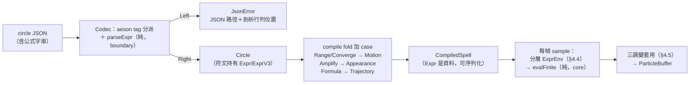

# Func-Spec 0004：Expr 符文接線（Expr Rune Wiring）

> 狀態：設計定案，待實作
> 性質：一般 —— 本 spec 交付的符文語意與 JSON tag 完成後依 0002 §2 的可擴充 sum 合約凍結，但它不是後續 spec 的共同地基（生命週期、力場各自依賴 0002/0003，不依賴本 spec）。
> 前置依賴：spec 0002（**已完成**，2026-08-12 驗收）＋ spec 0003（**已完成**，2026-08-12 驗收）——重大基建動工門檻已解除，本 spec 可認領實作。0003 交付與設計零偏差（其 §10 無實作期修訂），本 spec §0.2 引用的凍結介面全數如列交付；環境紀錄：megaparsec 9.8.1 × parser-combinators 1.3.1 × GHC 9.14.1，無需 allow-newer。
> 依據：[architecture.md](../architecture.md) §4.1（四符文原始定義）、§4.2（Expr 設計要點）、§6 對照表（「收束強度」「數學式」）；ADR-0002（分層 DSL）、ADR-0003（固定職責槽位）
> 範圍：四種 Expr 符文（`RangeRune`／`ConvergeRune`／`AmplifyRune`／`FormulaRune`）與魔法陣的完整接線——Rune sum 加建構子、`ExprV3` 定型、fold 加 case、Codec 加 tag（公式字串 ⇄ `parseExpr`/`renderExpr`）、`sample` 建 `ExprEnv` 求值。玩家第一次能在 JSON 裡寫 `"sin(t*6)*0.4"` 讓粒子照數學式運動。

---

## 0. 起點：引用的凍結介面與檔案盤點

### 0.1 引用的 0002 凍結介面（0002 §10 凍結清單）

| 介面 | 本 spec 的用法 |
|---|---|
| 可擴充 sum 合約（`OuterRune`／`BridgeRune`／`InnerRune`／`Trajectory`） | 以「加建構子＋fold 加 case＋Codec 加 tag」擴充——0002 明文宣告此為合法擴充、不視為破壞凍結；`⚠ 0004 擴充` 孔位即本 spec |
| 永久 record 只可加欄位 | `Motion`／`Appearance` 各加 `Maybe Expr` 欄位（§4.3） |
| 內圈「同類別後者覆蓋」規則 | `FormulaRune` 與 `TrajectoryRune` 同屬軌跡類：ringA→ringB 依序套用、外側層勝出——經 `motTraject` 單一欄位自動成立 |
| `sample` 取樣管線（`firstBirth`／`particleAge`／`trajectoryOffset`、`basisFromNormal` 面基底、循環重生排程） | 調變的套用點；出生時刻／年齡／life 全部已是管線中可得的量 |
| JSON v1 tag 機制（`"rune"` tag、未知 tag＝載入錯誤、`LoadError` 不加建構子） | 四個新 tag 純加入；0002 能解的文件本輪全部照舊能解 |
| `budgetCap = 4096`、`spellBudget` 編譯期計算 | 本 spec 不引入任何動態粒子數——預算安全性不變 |

### 0.2 引用的 0003 凍結介面（0003 §4／§10 語言合約）

| 介面 | 本 spec 的用法 |
|---|---|
| `Expr` AST（`Magic.Expr`，封閉、一階、必終止） | 符文酬載；`Circle`（core）直接持有 `Expr`——`Motion`/`Appearance` 仍是資料非函數（`Expr` 可序列化），0002 原則保持 |
| `ExprEnv(..)`＋`evalFinite`（NaN/±Inf → 0） | 取樣端**唯一**求值入口；`envT` 餵什麼值是接線層職權（0003 凍結的是欄位與求值語意，非呼叫端的取值來源）——本 spec §4.4 的分層時間框架據此定義 |
| `parseExpr`／`renderExpr`／`ExprParseError`／`renderExprParseError`／`maxExprNodes` | Codec 嵌入（§4.6）；roundtrip property（0003 T3）保證 `saveCircle` 反渲染可逆 |
| 「`chan` 限非負整數字面量」與剖析層四項守門 | 公式字串在 Codec 剖析時即全數把關，核心零防禦檢查 |
| `ExprV3` 預留註記（0003 §4.5：三條 `Expr` 分量，由本 spec 定型） | §4.2 定義 |
| `test/ExprGen.hs` 的 `Arbitrary Expr`（sized＋shrink） | 本 spec roundtrip／property 測試直接重用 |

### 0.3 檔案盤點（SKILL.md 規則 4）

本 spec 觸碰：`Magic/Rune.hs`、`Magic/Compile.hs`、`Magic/Particle/Analytic.hs`、`Magic/Expr.hs`（core）；`Magic/Codec.hs`（boundary）；`particle-magic.cabal`（test-suite other-modules 純加行）；新測試 4 檔＋新 assets 3 檔。動工時 0002/0003 皆已完成，無平行 spec 衝突；**本 spec 實作期間，其他新 spec 不得觸碰上列模組檔**（規則 4 反向適用）。

**回歸紀律（加欄位的既定代價）**：`Motion`／`Appearance` 加欄位後，0002 測試中以完整 record 語法建構期望值處需**機械補欄**（一律 `= Nothing`）。既有測試的**斷言語意一字不得變**；被補欄的測試檔清單須列入 §10 驗收紀錄。0001/0003 測試零觸碰。

---

## 1. 目標與完成定義

讓「魔法即數學」閉環：公式字串進 JSON、經剖析進 `CompiledSpell`、每幀每粒子求值驅動畫面。

```
lissajous.json（"x":"sin(t*3)*0.6"…）→ loadCircle（parseExpr 嵌入）
  → compile（fold 加 case）→ 每幀 sample（ExprEnv → evalFinite）→ 粒子畫出 Lissajous 軌跡
```

完成定義：

1. 四符文全部接通：JSON tag（§4.6）→ Rune 建構子 → fold 落點（§4.3）→ `sample` 求值（§4.5），每一段有對應測試；
2. **公式軌跡機械可證**：`FormulaRune` 粒子位置 == 手算 `evalFiniteV3`（同座標系組裝）；兩粒子出生時刻不同、年齡相同 → formula 位移相同（t=年齡的機械證明）；
3. **向後相容**：0002 的三份範例與 `empty.json` 位元組原樣仍可載入；空陣與純 0002 符文的陣，編譯產物中新欄位皆為 `Nothing`、取樣行為與 0002 bit-for-bit 相同；
4. 壞公式（語法錯、未知識別字、超節點上限、`chan` 非字面量）→ 載入錯誤，訊息含 JSON 路徑＋剖析位置；
5. 至少 3 份新範例魔法陣（§8 S4）視覺可辨識差異，且四符文皆被至少一份範例覆蓋；
6. 確定性保持：同 `(Circle, CastContext, t)` 兩次取樣 bit-for-bit 相等；
7. `cabal build all` 與 `cabal test` 全綠（0001/0002/0003 全部回歸；0002 測試僅允許 §0.3 的機械補欄）。

---

## 2. 使用到的架構與技巧

| 項目 | 選擇 | 說明 |
|---|---|---|
| 擴充方式 | **加建構子＋加欄位＋加 case＋加 tag**（0002 可擴充 sum 合約的首次行使） | 零簽名變更、零新模組；GHC exhaustiveness check 列出所有需補 case 的位置，機械可循 |
| t 的分層時間框架 | **行為層 t＝粒子年齡；展現/調變層 t＝施法後秒數** | `FormulaRune` 與內建軌跡同語意（age 的函數），公式自然散開不擠團；`Range`/`Converge`/`Amplify` 是全陣曲線（`1+sin(t*2)*0.5` 整團脈動）。每符文變數語意表（§4.4）凍結 |
| 求值安全 | **一律 `evalFinite`**（0003 安全線） | 任意玩家公式 → 必有限值；尺寸另 clamp ≥ 0（負尺寸無意義）。核心零防禦檢查——不合法輸入在 Codec 剖析層已全數擋掉 |
| 調變的套用點 | **`sample` 內、既有管線的三個明確位置**（§4.5） | Range 乘出生偏移、Converge 乘橫向分量、Amplify 乘尺寸——三者正交，各自一行數學定義 |
| 覆蓋規則 | **`FormulaRune` 併入 `Trajectory` sum**（`Trajectory += Formula ExprV3`） | 與 `TrajectoryRune` 的同類覆蓋經 `motTraject` 單一欄位自動成立，不需新規則 |
| 公式進 JSON | **公式字串欄位 ＋ Codec 層 `parseExpr`**（0003 既定） | 剖析失敗以 aeson `Parser` 失敗回報 → 既有 `JsonError`（自帶 `$.circle.outer[0].expr` 式路徑）＋ `renderExprParseError` 的行列位置；**不新增 `LoadError` 建構子** |
| 隨機性 | 沿用 `ExprEnv.envSeed`＝cast seed、`envPIndex`＝粒子索引 | `chan(n)` 走 0001 `hashChan`，零狀態、bit-for-bit 確定 |
| 測試 | 判例為主＋既有產生器重用 | 語意落點與調變數學用判例；roundtrip 重用 `ExprGen` 的 `Arbitrary Expr`（0003）自建含 Expr 符文的 `Circle` 產生器 |

---

## 3. 模組變更總覽（delta）

```
src/core/    Magic/Expr.hs              -- 擴充：ExprV3、evalFiniteV3（0003 §4.5 預留的定型）
             Magic/Rune.hs              -- 擴充：三個 sum 各加建構子（§4.1）
             Magic/Compile.hs           -- 擴充：Trajectory += Formula；Motion/Appearance 加欄位；fold 加 case
             Magic/Particle/Analytic.hs -- 擴充：ExprEnv 建構（分層時間）＋三調變套用；sample 簽名不變
src/boundary/Magic/Codec.hs             -- 擴充：四個新 rune tag；公式字串 ⇄ parseExpr/renderExpr
assets/      spells/lissajous.json、converge-flame.json、pulse-ring.json  -- 新增
test/        CompileExprSpec.hs / RuneCodecSpec.hs / SampleExprSpec.hs / Acceptance4Spec.hs  -- 新增
             （0002 測試檔僅允許機械補欄，見 §0.3）
```

### 3.1 `particle-magic.cabal` 純加行 delta

| stanza | 欄位 | 加入 |
|---|---|---|
| `test-suite spec` | `other-modules` | `CompileExprSpec`、`RuneCodecSpec`、`SampleExprSpec`、`Acceptance4Spec` |

僅此一處。`magic-core`／`magic-boundary` 的 exposed-modules 與 build-depends **零變更**（`ExprV3` 落在既有 `Magic.Expr`；Codec 對 `Magic.Expr.Parse` 的 import 是套件內模組引用）。

---

## 4. ADT

### 4.1 `Magic.Rune` 擴充（填上 0002 預留的 `⚠ 0004 擴充` 孔位）

```haskell
data OuterRune
  = ShapeRune   FaceShape        -- 0002，凍結
  | RadiateRune RadiationMode    -- 0002，凍結
  | RangeRune   Expr             -- 本輪新增：出生範圍曲線

data BridgeRune
  = PhaseRune    !Seconds        -- 0002，凍結
  | ConvergeRune Expr            -- 本輪新增：收束強度曲線
  | AmplifyRune  Expr            -- 本輪新增：尺寸增幅曲線

data InnerRune
  = TrajectoryRune Trajectory    -- 0002，凍結
  | TimingRune     Envelope      -- 0002，凍結
  | FormulaRune    ExprV3        -- 本輪新增：自訂軌跡數學式
```

### 4.2 `Magic.Expr` 擴充：`ExprV3`（永久；0003 §4.5 預留註記的定型）

```haskell
data ExprV3 = ExprV3 { exX :: Expr, exY :: Expr, exZ :: Expr }  deriving (Eq, Show)

evalFiniteV3 :: ExprV3 -> ExprEnv -> V3   -- 三分量各自 evalFinite（各自獨立歸零）
```

### 4.3 `Magic.Compile` 產物擴充（凍結 record 只加欄位；凍結 sum 只加建構子）

```haskell
data Trajectory
  = Forward !Double | Spiral !Double !Double !Double | Orbit !Double !Double  -- 0002，凍結
  | Formula ExprV3               -- 本輪新增：位移 = evalFiniteV3（座標系見 §4.5）

data Motion = Motion
  { motSpawn     :: !SpawnPattern          -- 0002，凍結
  , motTraject   :: !Trajectory            -- 0002，凍結（FormulaRune 經此欄位覆蓋）
  , motRadiation :: !RadiationMode         -- 0002，凍結
  , motDrift     :: !V3                    -- 0002，凍結
  , motRange     :: !(Maybe Expr)          -- 本輪新增：Nothing = 不調變
  , motConverge  :: !(Maybe Expr)          -- 本輪新增：Nothing = 不調變
  }

data Appearance = Appearance
  { appColor   :: !ColorRamp               -- 0002，凍結
  , appSize    :: !Float                   -- 0002，凍結
  , appBlend   :: !BlendMode               -- 0002，凍結
  , appAmplify :: !(Maybe Expr)            -- 本輪新增：Nothing = 不調變
  }
```

fold 落點（0002 §4.6 語意速查表的四行新增）：

| 符文 | 落點 | 語意 |
|---|---|---|
| `RangeRune e`（外圈） | `motRange = Just e` | 出生偏移縮放曲線 |
| `ConvergeRune e`（夾層） | `motConverge = Just e` | 橫向位移乘數曲線 |
| `AmplifyRune e`（夾層） | `appAmplify = Just e` | 尺寸乘數曲線 |
| `FormulaRune v3`（內圈） | `motTraject = Formula v3` | 覆蓋內建軌跡（同類覆蓋規則） |

同槽位既有規則照舊：外圈／內圈兩層 A→B 依序套用、同類外側勝出（兩個 `RangeRune` → ringB 勝）；夾層單槽無覆蓋問題。空缺＝`Nothing`＝不調變，空陣與純 0002 符文的陣行為零變化。

### 4.4 每符文變數語意表（凍結——分層時間框架）

| 符文 | `envT` | `envLife` | `envPIndex` | `envSeed` | 求值時機 |
|---|---|---|---|---|---|
| `RangeRune` | 該粒子**本次出生時刻**（施法後秒數；循環重生每代重算） | `0`（出生瞬間的定義值） | 粒子索引 | cast seed | 出生時定格（分析式取樣每幀重算、值恆同，不隨幀漂移） |
| `ConvergeRune` | **施法後秒數**（全域） | 該粒子當前 life（0..1） | 粒子索引 | cast seed | 每幀每粒子 |
| `AmplifyRune` | **施法後秒數**（全域） | 當前 life | 粒子索引 | cast seed | 每幀每粒子 |
| `FormulaRune` | **粒子年齡**（本次出生起算秒數） | 當前 life | 粒子索引 | cast seed | 每幀每粒子 |

設計理由（凍結為合約的一部分）：行為層（軌跡）是「每粒子自己的時間」——與內建軌跡同為 age 的函數，公式自然散開；展現/調變層是「全陣共同的時間」——`1+sin(t*2)*0.5` 讓整團一起呼吸。`life`/`pindex`/`chan(n)` 四符文皆可用作個體差異。

### 4.5 調變套用語意（`sample` 內的數學定義，凍結）

0002 取樣管線的三個插入點（`b_x, b_y` = `basisFromNormal` 面基底、`d` = 該粒子行進方向單位向量，依 `motRadiation` 與 0002 語意）：

1. **Range（出生偏移縮放）**：形狀取樣點 `p :: V2`（面座標）改為 `k_r · p`，`k_r = evalFinite range envBirth`。`SpawnAtAnchor`（出生偏移＝0）下為 **no-op**——Range 只在有 `ShapeRune` 時有效，文檔與錯誤訊息不擋（合法但無效果，同「空槽」哲學）。負值合法（鏡射取樣點），不 clamp。
2. **Converge（橫向收束）**：令 `r = pos − anchor` 為套用前的總位移，`axial = (r·d)d`、`trans = r − axial`；套用後 `pos' = anchor + axial + k_c · trans`，`k_c = evalFinite converge env`。`k_c = 0` → 粒子貼行進軸（光束化）；`= 1` → 不變；`> 1` → 反向擴散。`AlongNormal` 時全體收向陣中心軸；`RadialOutward` 時各粒子收向自己的放射線。
3. **Amplify（尺寸增幅）**：`size' = appSize · max 0 k_a`，`k_a = evalFinite amplify env`（負值視為 0——尺寸下限）。
4. **Formula（自訂軌跡）**：軌跡位移項 = `x·b_x + y·b_y + z·d`，`(x,y,z) = evalFiniteV3 v3 env`。`AlongNormal` 時 `(b_x, b_y, d)` 為正交基底；`RadialOutward` 時 `d` 為每粒子放射方向（架構既定語意）。**只取代軌跡項**——出生位置、節點 `motDrift·age`、素放 `hashChan` 漂移照 0002 疊加不變。

套用順序：出生偏移（含 Range）→ 軌跡（含 Formula）＋漂移項 → Converge（對總位移的橫向分量）→ Appearance（含 Amplify）。

### 4.6 `Magic.Codec`——JSON v1 純擴充（新 tag；凍結）

```json
{ "rune": "range",    "expr": "1 + t*0.5" }
{ "rune": "converge", "expr": "1 - life" }
{ "rune": "amplify",  "expr": "1 + sin(t*3)*0.5" }
{ "rune": "formula",  "x": "sin(t*3)*0.6", "y": "sin(t*2)*0.6", "z": "t*2" }
```

規則：

- 合法 tag 新增：外圈 `range`、夾層 `converge`｜`amplify`、內圈 `formula`。槽位錯置（如 `range` 放內圈）照 0002 既有機制＝載入錯誤附合法 tag 清單（清單本輪隨之更新）。
- 公式欄位為字串，Codec 內以 `parseExpr` 剖析；失敗 → aeson `Parser` 失敗，訊息 = `renderExprParseError`（行列位置）→ 既有 `JsonError`（JSON 路徑），**`LoadError` 不加建構子**（0003 §4.4 預定路徑）。`maxExprNodes = 512` 由 `parseExpr` 內建把關，`formula` 三分量各自計算。
- `saveCircle` 以 `renderExpr` 反渲染公式欄位；`Circle` roundtrip 由 0003 T3 的 roundtrip property 傳遞成立。
- 0002 既有 tag 集與文件全部照舊；`version` 維持 1（純擴充）。

### 4.7 凍結範圍

本輪完成後凍結：四符文建構子語意（§4.1／§4.3 落點）、變數語意表（§4.4）、調變數學定義（§4.5）、四個 JSON tag 與欄位名（§4.6）、`ExprV3`／`evalFiniteV3` 簽名。後續擴充依 0002 可擴充 sum 合約照舊開放。

---

## 5. 資料流（pipeline）



- 剖析一次性（載入/熱重載）；求值在熱路徑（每粒子×每幀，最多 4 條 Expr：range 定格值＋converge＋amplify＋formula 三分量）。budgetCap 4096 下樸素直譯無壓力（0003 既定）。
- IO 分界與 0001–0003 相同：本 spec 所有新碼在純核心／純邊界層，零效果。

---

## 6. 資料結構與儲存方式

| 資料 | 結構 | 存放 | 生命週期 |
|---|---|---|---|
| 公式原文 | JSON 字串欄位 | `assets/spells/*.json` | 使用者編輯；熱重載重剖析 |
| `Expr`／`ExprV3` | 不可變有限樹 | `Circle` 符文酬載 → `CompiledSpell`（`Motion`/`Appearance`/`Trajectory`） | 載入時建立，施法期唯讀 |
| `ExprEnv` | 暫態 record | `sample` 內每粒子每幀建構（棧上） | 單粒子單幀 |
| 範例魔法陣 | JSON v1 | `assets/spells/lissajous.json` 等 3 份 | 驗收與示範 |

---

## 7. 搭建方式（實作順序，風險優先）

| 步驟 | 內容 | 為什麼在這個位置 |
|---|---|---|
| S1 | ADT 擴充全套（Rune 建構子、`ExprV3`、`Trajectory += Formula`、`Motion`/`Appearance` 加欄位）＋ fold 加 case＋0002 測試機械補欄 | 型別先行：加欄位的漣漪（exhaustiveness、record 建構處）一次清完，全輪基礎；空陣零變化在此步即可斷言 |
| S2 | Codec 四 tag＋`parseExpr`/`renderExpr` 嵌入 | **schema 是對外合約，設計錯誤最貴**（0002 同紀律）；壞公式的錯誤體驗（路徑＋位置）最早暴露 |
| S3 | `sample` 接線：分層 `ExprEnv` 建構＋三調變套用（§4.5 數學定義逐條落地） | 語意核心：t 分層框架與調變順序是本 spec 風險最高處；依賴 S1 的型別與 0003 的求值器 |
| S4 | 3 份範例魔法陣 assets＋端到端驗收（headless＋手動 smoke） | 壓軸：四符文全部就緒後的合成驗收 |

每步紀律同前：**完成一個 Sx ＝ 對應測試 Tx 綠**，不積欠。

---

## 8. Todo List 與 1-to-1 測試對應

| ✅ | Todo | 測試（`test/` 下） | 測試內容（完成即斷言） |
|---|---|---|---|
| ☐ | **S1** ADT 擴充＋fold 落點 | `CompileExprSpec.hs` | 四符文各自落點判例（§4.3 表逐行）；`FormulaRune` × `TrajectoryRune` 同類覆蓋（內圈兩層四種組合：外側勝出）；兩個 `RangeRune` → ringB 勝；空陣與純 0002 符文陣 → 新欄位全 `Nothing`／`motTraject` 非 `Formula`；0002 `CompileCoreSpec`/`CompileFoldSpec` 補欄後仍綠 |
| ☐ | **S2** Codec 四 tag | `RuneCodecSpec.hs` | 四 tag 各自解碼判例＋含 Expr 符文的 `Circle` roundtrip property（`decode . encode == id`，重用 `ExprGen`）；壞公式（語法錯／未知識別字／`chan(t)`／>512 節點）→ 錯誤含 JSON 路徑＋剖析位置；槽位錯置 `range` 進內圈 → 錯誤附合法 tag 清單；0002 三份範例＋`empty.json` 位元組原樣仍可載入 |
| ☐ | **S3** `sample` 接線 | `SampleExprSpec.hs` | formula 粒子位置 == 手算 `evalFiniteV3` 同座標系組裝（判例＋property）；**t=年齡機械證明**：兩粒子出生時刻不同、同年齡 → 同 formula 位移；converge `Lit 0` → 粒子位置貼行進軸（橫向分量 ≈ 0）、`Lit 1` → 與無符文 bit-for-bit 同；amplify 判例：尺寸 == `appSize × max 0 k`；range 判例：出生偏移縮放且出生後定格；同 `(Circle, CastContext, t)` 兩次取樣 bit-for-bit 相等；0002 `SampleSpec` 補欄後仍綠 |
| ☐ | **S4** 範例與端到端 | `Acceptance4Spec.hs` ＋手動 smoke | 自動：三份新範例 headless 跑 N 幀（JSON bytes → FrameOutput 非空 → finished），輸出兩兩可區分；四符文皆被範例覆蓋。手動：開窗目視 lissajous 軌跡／收束火焰／脈動環，熱重載改公式即時生效，結果回填 §10 |

規則同前：**一個 Todo 打勾的前提是對應測試存在且綠**。0001/0003 測試零觸碰、全程必須保持綠；0002 測試僅允許機械補欄（§0.3），斷言語意一字不變。

---

## 9. 非目標（本 spec 明確不做）

- **生命週期四階段**（Drawing/Converging/Casting/Dissipating）、`PhasePlan`、陣形幾何發射器 —— 生命週期 spec（依賴 0002，不依賴本 spec）
- 力場層（`ForceField`／`FieldState`）——「需粒子互動的收束」歸力場層（architecture.md §6 明文），本 spec 的 `ConvergeRune` 是解析曲線
- `chan` 通道索引可計算化、Expr 語言本體的任何變更 —— 0003 凍結合約；語言擴充另立 spec
- Expr 靜態分析（範圍上界推導、編譯期常數摺疊、剔除） —— 效能/分析 spec
- 動態粒子數（公式驅動 `emCount`） —— 預算安全性本輪不動搖；如需求出現，另立 spec 連同 `budgetCap` 治理一起設計
- staged/bytecode 求值 —— 效能 spec（0003 既定延後）
- `CompiledSpell` 的 `Semigroup`（多陣合併）、2D 投影後端、schema version 2

## 10. 驗收紀錄（實作時回填）

| 項目 | 日期 | 結果 |
|---|---|---|
| S4：三份範例目視可辨識差異＋熱重載改公式即時生效 | | |
| 0002 測試機械補欄清單（檔名＋補欄位置；斷言語意零變更之確認） | | |
| 0001/0003 測試零觸碰、全綠 | | |
| `cabal test` 全綠（回歸＋本輪 4 個新測試模組） | | |
| 凍結清單確認（§4.7：四符文語意、變數語意表、調變數學定義、JSON tag、`ExprV3` 簽名） | | |
