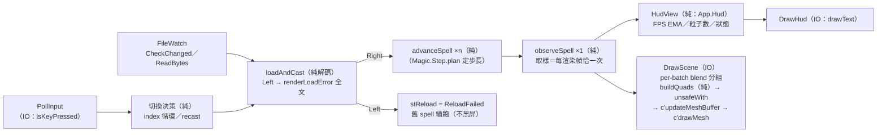

# Func-Spec 0005：渲染落實與觀測（Render Realization & Observability）

> 狀態：已完成（驗收紀錄見 §10）
> 性質：一般 —— 本 spec 兌現 architecture §5.2/§7 對渲染宿主的既定承諾並補齊觀測面；它不是後續 spec 的共同地基，但其量測基線（§8 S8）是未來 10k–100k 效能 spec 的動工前提資料。
> 前置依賴：spec 0001／0002／0003（皆**已完成**）。**與 spec 0004 平行**：0004（設計定案，待實作）鎖定 `Magic/Rune.hs`、`Magic/Compile.hs`、`Magic/Particle/Analytic.hs`、`Magic/Expr.hs`、`Magic/Codec.hs`——本 spec 檔案清單與之**零交集**（§0.3 附盤點證明），兩 spec 可同時認領實作。
> 依據：[architecture.md](../architecture.md) §5.2（宿主責任：blend 管線狀態、instanced 繪製）、§7（「draw call 數 = batch 數而非粒子數」、GHC 設定）、§8 風險 5（h-raylib FFI 邊界開銷，「需實測不能推測」）、§9.2（instancing 支援面是開放問題）；ADR-0005（負面：「錯誤訊息品質需要投入」）、ADR-0007（效果只在殼層）
> 範圍：渲染路徑從「逐粒子 `drawCubeV` 立方體、blend/billboard 被丟棄」升級為「動態 quad mesh 單 draw call、`rbBlend`/`rbShape` 真正生效」；HUD 與載入錯誤上屏（`renderLoadError` 終於有呼叫點）；鍵盤切換範例魔法陣；全套件 `-O2` 與 benchmark 基線。**核心語意零變更**——本 spec 不碰任何 `Magic.*` 純核心模組。

---

## 0. 起點：引用的凍結介面、API 調查紀錄、檔案盤點

### 0.1 引用的 0001 凍結介面（0001 §4.6/§4.7 合約）

| 介面 | 本 spec 的用法 |
|---|---|
| `stepSpell :: FrameInput -> ActiveSpell -> (ActiveSpell, FrameOutput)` 等四函數＋`spellAge` | **簽名一律不動**。加法式新增 `advanceSpell`/`observeSpell`（§4.1），`stepSpell` 內部改為兩者組合，行為 bit-for-bit 相同（分解定律，S1 property 守護） |
| `RenderBatch { rbParticles, rbBlend, rbShape }`／`FrameOutput { batches }` | 消費端終於完整：`rbBlend` 對映 raylib blend mode、`rbShape` 決定 quad 幾何。欄位零變更 |
| `ParticleBuffer` 唯讀視圖（六欄 SoA） | `buildQuads` 的輸入；SoA 欄位直接展開為頂點串流——ADR-0006 的 SoA 決策首次兌現到渲染端 |
| `Raylib` 效果（`WithWindow`/`WithFrame`/`DrawBatch`/`ShouldClose`，bracket 高階 op） | **加法式**新增三個 op（§4.2）；`DrawBatch` 保留不刪（凍結介面不縮減），迴圈改用 `DrawScene` |
| `Clock`/`FileWatch` 效果、`runFileWatchIO`（mtime 輪詢） | 照用；`FileWatch` 的 `CheckChanged path` 以參數帶路徑，切換 spell 後自然跟隨新路徑，效果介面零變更 |
| `App.TestInterp` 雙直譯器紀律（exe 與 test 都編譯，防 rot） | 新 op 必須同步落在 IO 直譯器與 headless 直譯器；`HeadlessLog` 加欄位（record 加欄位＝合法擴充） |
| `Magic.Step.plan`（定步長規劃、位元級精確） | 照用不動；`advanceSpell ×n ＋ observeSpell ×1` 只改變取樣次數，不改變時間推進語意 |
| `renderLoadError`（0001）／`renderExprParseError`（0003，經 0004 嵌入 `JsonError`） | HUD 錯誤文字來源。0004 交付後，玩家公式的剖析錯誤（含 JSON 路徑＋行列位置）**自動**經同一條路上屏——零耦合，無需引用 0004 任何介面 |

### 0.2 h-raylib 5.6.0.0 API 調查紀錄（設計期已完成，讀自 cabal 快取原始碼）

本 spec 的渲染路線選擇建立在以下實證，記錄於此供實作者與後續效能 spec 引用：

1. **所有 FFI 皆為 `ccall safe`**（h-raylib TH 產生器 `Raylib.Internal.TH` 統一宣告）——每次呼叫 ~百 ns 級開銷。推論：任何「逐粒子呼叫」路線（`drawCubeV`、`drawBillboard`、rlgl 逐頂點 immediate mode）都不可規模化；設計原則定為**每幀 O(1) 次 FFI**。
2. **`drawMeshInstanced` 路線否決**：簽名吃 `[Matrix]`（每幀逐元素 marshal 4096×16 float）；raylib C 端要求 material 掛自訂 instancing shader（預設 shader 無 `instanceTransform` attribute）；每 instance 只有 transform、**無 per-instance 顏色**——`ColorRamp` 的逐粒子顏色會丟失。
3. **交付路線＝動態 quad mesh ＋ `c'` 指標 API**：`uploadMesh mesh True`（dynamic）初始化一次；每幀 `Data.Vector.Storable.unsafeWith` 餵 `c'updateMeshBuffer`（零拷貝）→ poke `p'mesh'triangleCount`（變長繪製）→ `c'drawMesh`。高階 `drawMesh` 每呼叫重 marshal 整個 `Mesh` record（含 list 欄位），故必走 `c'drawMesh :: Ptr Mesh -> Ptr Material -> Ptr Matrix -> IO ()`＋`p'mesh'*` 欄位指標——官方 `examples/bunnymark` 明文背書此慣用法（"Writing performant h-raylib code requires the use of pointers"）。raylib 預設 shader 支援 mesh 頂點色（quad 四頂點同色＝逐粒子顏色），**免自訂 shader**。
4. 齊備的配套 API：`loadMaterialDefault`（自帶白貼圖）；`beginBlendMode`/`endBlendMode`（`Raylib.Types` 的 `BlendMode` 含 `BlendAdditive`，與 `Magic.Compile.BlendMode` 撞名，Raylib3D 內 qualified 對映）；`rlDisableDepthMask`/`rlEnableDepthMask`（additive 粒子關深度寫入避免順序假影）；`drawText`/`measureText`（HUD）；`isKeyPressed`＋`KeyboardKey`（輸入）。
5. 頂點數上界：`budgetCap = 4096` 粒 × 4 頂點 = 16384 < 65536，**索引緩衝可用 `Word16`**（每 quad 固定 `0,1,2, 0,2,3` 模式，初始化寫一次）。

### 0.3 檔案盤點（SKILL.md 規則 4——與 0004 平行的零交集證明）

**修改**：`app/Main.hs`、`app/App/Loop.hs`、`app/App/Effects.hs`、`app/App/TestInterp.hs`、`app/App/Render/Raylib3D.hs`、`src/boundary/Magic/Interface.hs`（僅加法：兩個新函數＋export）、`particle-magic.cabal`、`SKILL.md`（索引行）。
**新增**：`app/App/Hud.hs`、`app/App/Render/Quads.hs`、`bench/Bench.hs`、測試 8 檔（§8）。

0004 §0.3 鎖定清單（`Rune`/`Compile`/`Analytic`/`Expr`/`Codec`）：**一個都不碰** ✔。0004 也不碰本清單中任何檔案 ✔。

**共用檔協調備註**（cabal 與 SKILL.md 是設定/文件，非模組檔，規則 4 不禁止，但需明訂合併規則）：

- `particle-magic.cabal`：0004 與 0005 都對 `test-suite spec` 的 `other-modules` 純加行——合併規則為**兩組行的聯集**，後合併者負責解衝突（機械操作，零語意風險）。0005 另新增 `benchmark` stanza、exe `other-modules` 加行、各 stanza `ghc-options` 加 `-O2`，皆與 0004 的 delta 不相交。
- `SKILL.md` 索引表：0004 改自己那列的狀態欄、0005 新增一列——逐行聯集。

**0001 殼層測試的既定代價**：迴圈改寫後，`EffectsSpec`/`HotReloadSpec`/`PipelineSpec`/`AcceptanceSpec`/`Acceptance2Spec` 因 `LoopConfig` 加欄位（§4.4）與 `runRaylibHeadless` 回傳型別擴充需**機械適配**（建構處補欄位、`HeadlessLog` 語意見 §4.3——`hlDrawCalls` 重定義為「收到的 batch 總數」使既有計數斷言照舊成立）。**斷言語意（frames/simSteps/casts/finalAge 的數值關係）一字不得變**；被適配的測試檔清單列入 §10 驗收紀錄。`Magic.*` 相關測試（0002/0003 全部、0001 的 core/boundary 測試）零觸碰。

---

## 1. 目標與完成定義

把「畫得對、看得見、切得動、量得到」一次補齊——系統輸出合約（`RenderBatch`）兩年前就完整了，本輪讓消費端配得上它：

```
FrameOutput → DrawScene：per-batch beginBlendMode（additive 發光疊加）
            → buildQuads（純：SoA → 面向相機 quad 頂點串流）
            → c'updateMeshBuffer ×2 ＋ c'drawMesh ×1（單 draw call）
LoopState  → HudView → DrawHud：FPS/粒子數/spell 路徑/年齡/重載狀態（含完整錯誤文字）
PollInput  → ←/→ 循環 assets/spells/*.json，R 重施法
```

完成定義：

1. **畫得對**：`rbBlend = BlendAdditive` 走 additive 混合（fire/lightning 目視發光疊加）；`rbShape = BillboardSquare` 畫成面向相機的 quad（不再是立方體）；GL draw call 數 = batch 數（architecture §7 承諾兌現）；逐粒子顏色（`ColorRamp` 輸出）保留。
2. **看得見**：HUD 顯示 FPS（EMA）、粒子數、當前 spell 路徑、spell 年齡、最近一次重載結果；載入/剖析錯誤**上屏**且舊 spell 續跑；初次載入失敗不再黑畫面。`renderLoadError` 從此有呼叫點（`show` 替換掉）。
3. **切得動**：鍵盤循環切換 `assets/spells/` 全部範例，不改 `Main.hs` 即可目視非空魔法陣。
4. **量得到**：core/boundary/exe 皆 `-O2`；`cabal bench` 產出 4096 粒下 `castSpell`／`observeSpell`／`buildQuads` 的耗時基線，數字回填 §10——後續效能 spec 的地面真值。
5. **取樣次數＝每渲染幀恰一次成為構造保證**（`advanceSpell ×n ＋ observeSpell ×1`），不再依賴惰性巧合（§2 分析）。
6. `cabal build all && cabal test` 全綠（0001–0003 全回歸；殼層測試僅允許 §0.3 的機械適配）；`cabal run` 開窗手動驗收（§8 S7/S9）。

---

## 2. 使用到的架構與技巧

| 項目 | 選擇 | 說明 |
|---|---|---|
| 批次渲染 | **動態 quad mesh ＋ `c'` 指標直傳**（非 instancing） | 否決理由與實證見 §0.2——per-instance 顏色、免 shader、每幀 ~4 次 FFI、單 draw call；同時是未來 100k 效能 spec 的正確地基（屆時只需換 staging 填充策略，GPU 路徑不變） |
| Billboard 面向相機 | **CPU 端由 `Camera` 純函數算基底展開 quad** | `buildQuads` 是純函數（`Camera` 是殼層自有型別，零 h-raylib 依賴）→ headless 可 property 測試；raylib 的 `drawBillboard` 逐粒子 safe call，僅充當 S0 spike 對照組 |
| 取樣/推進分離 | `advanceSpell`/`observeSpell` 加法式擴充（boundary） | 現況：迴圈每幀最多 8 步 `stepSpell`、丟棄 7 份 `FrameOutput`——**惰性目前恰好避免了浪費**（`RenderBatch` 無 bang、中間 thunk 未被 force），但這是脆弱巧合：任何加 bang／NFData force／HUD 讀中間幀的改動都會靜默把取樣成本 ×8。分離後浪費在構造上不可能發生。先例：0001 交付時的 `spellAge`/`ReadBytes` 加法擴充 |
| HUD | 純格式化（`App.Hud`）＋效果 op `DrawHud` | 決策與文字內容 headless 可斷言；IO 直譯器只負責 `drawText`。FPS 用 EMA（殼層自算，不用 raylib `getFPS`——headless 測試才有一致值） |
| 輸入 | 效果 op `PollInput :: Raylib m DemoInput`（自有型別） | 與 `Camera` 同理：效果層零 h-raylib 型別；headless 直譯器可腳本化輸入序列 |
| 整景繪製 | `DrawScene Camera [RenderBatch]` 取代迴圈裡的 `mapM_ drawBatch` | blend 分組、grid 一次、mesh 更新——這些是「整景」層級的決策，逐 batch 的 op 表達不了；`DrawBatch` 保留（凍結介面不縮減） |
| 錯誤上屏 | `loadAndCast` 回傳 `Either String`，錯誤文字＝`renderLoadError` | ADR-0005 負面條款的補課；0004 的 Expr 剖析錯誤（JSON 路徑＋行列位置）經同一條路自動上屏 |
| 基準 | tasty-bench（依賴樹輕；備案 `GHC.Clock` 手寫計時） | 獨立 `benchmark` stanza，不受 `BoundarySpec` 白名單管轄（其只檢查 library/executable stanza） |
| 測試 | property 為主（分解定律、quad 幾何不變量）＋腳本化劇本判例 | 沿用 0001 的「真實 `runLoop` 跑在測試直譯器上」手法 |

---

## 3. 模組變更總覽（delta）

```
src/boundary/Magic/Interface.hs   -- 加法：advanceSpell、observeSpell（stepSpell 內部改組合，簽名/行為不變）
app/App/Effects.hs                -- 加法：Raylib 效果 + DrawScene/DrawHud/PollInput；HudView/ReloadStatus/DemoInput 型別
app/App/TestInterp.hs             -- 擴充：三新 op 的 headless 直譯；HeadlessLog 加欄位；runFileWatchScriptMap（多檔腳本）
app/App/Loop.hs                   -- 改寫：advance/observe 分離、錯誤狀態維護、spell 清單切換、FPS EMA、DrawScene/DrawHud
app/App/Render/Raylib3D.hs        -- 改寫：動態 quad mesh 管線（§0.2 路線）、blend 分組、HUD 文字、鍵盤輪詢；drawCubeV 移除
app/App/Hud.hs                    -- 新增（純）：formatHud、FPS EMA
app/App/Render/Quads.hs           -- 新增（純）：QuadBatch、buildQuads（零 h-raylib、零效果依賴）
app/Main.hs                       -- 改寫：啟動時掃描 assets/spells/*.json 組成清單
bench/Bench.hs                    -- 新增：tasty-bench 基準
test/                              -- 新增 8 檔（§8）；0001 殼層測試機械適配（§0.3）
```

### 3.1 `particle-magic.cabal` delta

| stanza | 欄位 | 變更 |
|---|---|---|
| `library magic-core` | `ghc-options` | 加 `-O2` |
| `library magic-boundary` | `ghc-options` | 加 `-O2` |
| `executable particle-magic` | `ghc-options`／`other-modules` | 加 `-O2`；`other-modules` 加 `App.Hud`、`App.Render.Quads` |
| `test-suite spec` | `other-modules` | 加 8 個新測試模組＋`App.Hud`、`App.Render.Quads`（TestInterp 紀律：與 exe 共編譯） |
| `benchmark bench`（**新 stanza**） | 全部 | `main-is: Bench.hs`、`hs-source-dirs: bench app`、依賴 `magic-boundary`＋`tasty-bench`＋`vector`、`-O2` |

`magic-core`／`magic-boundary` 的 **build-depends 零變更**（`BoundarySpec` 白名單照舊成立；`Data.Vector.Storable` 屬 `vector` 套件，exe/bench 既有依賴）。與 0004 的 delta 交集僅 `test-suite other-modules` 的同欄位加行——聯集合併（§0.3）。

---

## 4. ADT

### 4.1 `Magic.Interface` 加法式擴充（永久；凍結簽名零變更）

```haskell
-- | Advance time only — no sampling. Pure state transition.
advanceSpell :: FrameInput -> ActiveSpell -> ActiveSpell

-- | Sample at the spell's current age. Pure observation.
observeSpell :: ActiveSpell -> FrameOutput

-- 分解定律（S1 property，凍結為合約）：
--   stepSpell fi s ≡ let s' = advanceSpell fi s in (s', observeSpell s')
-- stepSpell 保留原簽名，內部改為以上組合；對既有呼叫端 bit-for-bit 無感。
```

### 4.2 `App.Effects` 擴充（`Raylib` 效果加三 op；`DrawBatch` 保留）

```haskell
data Raylib :: Effect where
  WithWindow  :: Int -> Int -> String -> m a -> Raylib m a   -- 0001，凍結
  WithFrame   :: m a -> Raylib m a                            -- 0001，凍結
  DrawBatch   :: Camera -> RenderBatch -> Raylib m ()         -- 0001，凍結（保留；迴圈不再使用）
  ShouldClose :: Raylib m Bool                                -- 0001，凍結
  DrawScene   :: Camera -> [RenderBatch] -> Raylib m ()       -- 本輪新增：整景一次（blend 分組、grid、mesh 更新）
  DrawHud     :: HudView -> Raylib m ()                       -- 本輪新增：文字疊加層
  PollInput   :: Raylib m DemoInput                           -- 本輪新增：本幀輸入快照

-- 渲染器無關的觀測/輸入型別（永久；殼層詞彙，零 h-raylib 依賴）
data HudView = HudView
  { hvFps       :: !Double         -- EMA 平滑後
  , hvParticles :: !Int            -- 本幀 batches 粒子總數
  , hvSpellPath :: !FilePath
  , hvSpellAge  :: !Double
  , hvReload    :: !ReloadStatus
  } deriving (Eq, Show)

data ReloadStatus
  = ReloadIdle                     -- 啟動以來未發生重載
  | ReloadOk     !Double           -- 上次重載成功（施法時鐘時刻）
  | ReloadFailed !Double !String   -- 上次重載失敗（時刻＋renderLoadError 全文；舊 spell 續跑）
  deriving (Eq, Show)

data DemoInput = DemoInput
  { diNextSpell :: !Bool           -- →
  , diPrevSpell :: !Bool           -- ←
  , diRecast    :: !Bool           -- R
  } deriving (Eq, Show)
```

### 4.3 `App.TestInterp` 擴充（雙直譯器紀律）

```haskell
data HeadlessLog = HeadlessLog
  { hlFrames    :: !Int              -- 0001，凍結
  , hlDrawCalls :: !Int              -- 0001 欄位；語意重定義為「收到的 batch 總數」
                                     --   （DrawBatch 每呼叫 +1；DrawScene 每呼叫 +length batches）
                                     --   現況每幀單 batch ⇒ 計數與 0001 行為一致，既有斷言照舊成立
  , hlScenes    :: ![(BlendMode, Int)]  -- 本輪新增：每次 DrawScene 的 (blend, pbCount) 摘要序列
  , hlHuds      :: ![HudView]           -- 本輪新增：DrawHud 收到的序列
  }

-- 多檔腳本 watch：不同路徑各自供給 bytes 與變更腳本（spell 切換測試用）
runFileWatchScriptMap :: Map FilePath (BS.ByteString, [Bool]) -> Eff (FileWatch : es) a -> Eff es a
-- runFileWatchScript（0001）保留不動，既有測試零觸碰

-- headless 輸入腳本：第 n 幀回應第 n 個 DemoInput（耗盡後回應全 False）
runRaylibHeadless 增加參數或伴生函數 runRaylibHeadlessWith :: [DemoInput] -> ...
--（0001 的 runRaylibHeadless 保留原簽名 = runRaylibHeadlessWith []）
```

### 4.4 `App.Loop` 型別演進（`LoopConfig`/`LoopState` 非凍結型別）

```haskell
data LoopConfig = LoopConfig
  { ...既有欄位...                       -- lcSpellPath 改為：
  , lcSpellPaths :: ![FilePath]          -- 啟動時掃描的清單（非空；Main 保證）
  , lcSpellIndex :: !Int                 -- 起始索引
  }

-- LoopState 加：stPath（當前路徑）、stReload :: ReloadStatus、stFpsEma :: Double、stIndex :: Int
-- LoopStats（0001 觀測合約）零變更
```

### 4.5 `App.Render.Quads`（新純模組；內部型別，非永久介面）

```haskell
-- staging 資料：面向相機的 quad 頂點串流（interleave 前的 SoA 展開）
data QuadBatch = QuadBatch
  { qbPositions :: !(S.Vector Float)   -- qbCount*4 頂點 × (x,y,z)
  , qbColors    :: !(S.Vector Word8)   -- qbCount*4 頂點 × (r,g,b,a)
  , qbCount     :: !Int                -- = pbCount
  }

-- (camPos, camTarget, camUp) → 相機右/上單位基底 → 每粒子中心 ± 半邊長展開四頂點
buildQuads :: V3 -> V3 -> V3 -> ParticleBuffer -> QuadBatch
```

幾何定義（S2 property 依此）：`forward = normalize (target − pos)`、`right = normalize (forward × up)`、`upv = right × forward`；粒子 `i` 的四頂點 = `center ± (right·s/2) ± (upv·s/2)`（`s = pbSize`），顏色四頂點同 `pbColor` 展開 RGBA。索引緩衝為靜態 `0,1,2, 0,2,3` 模式（`Word16`，§0.2 第 5 點），初始化寫一次、不屬 `QuadBatch`。

### 4.6 `App.Hud`（新純模組）

```haskell
formatHud :: HudView -> [String]              -- 每元素一行；錯誤文字含換行時展開
fpsEma :: Double -> Double -> Double -> Double -- alpha -> frameDt -> ema -> ema'
```

### 4.7 凍結範圍

本輪完成後凍結：`advanceSpell`/`observeSpell` 簽名與分解定律（§4.1）；`Raylib` 效果七 op 形狀與 `HudView`/`ReloadStatus`/`DemoInput` 欄位（§4.2）；`hlDrawCalls` 的「batch 總數」語意（§4.3）。`QuadBatch`/`buildQuads`/`App.Hud` 為殼層內部，後續 spec（效能）可自由演進。

---

## 5. 資料流（pipeline）



- IO 仍只在圖兩端（效果直譯器內）；`buildQuads` 在 IO 直譯器內被呼叫但本身是純函數（headless 測試直接呼叫）。
- 熱路徑每幀成本：`observeSpell` 一次（sample＋fromParticles，0002 既有）＋`buildQuads` 一次（S.Vector 生成）＋FFI ~4 次。staging buffer 每幀重建——**重用屬效能 spec**（§9），本輪先量測。

---

## 6. 資料結構與儲存方式

| 資料 | 結構 | 存放 | 生命週期 |
|---|---|---|---|
| GPU quad mesh | `Ptr Mesh`（`malloc`＋poke 一次）＋dynamic VBO（budgetCap×4 頂點）＋`Word16` 索引（靜態模式） | `Raylib3D` IO 直譯器內部，`WithWindow` bracket 建立/釋放 | 視窗 |
| `Ptr Material` | `loadMaterialDefault` 後 poke 一次 | 同上 | 視窗 |
| staging（`QuadBatch`） | `Data.Vector.Storable`（positions/colors） | 每幀由 `buildQuads` 生成 | 單幀（重用＝效能 spec 非目標） |
| HUD 狀態（`ReloadStatus`/FPS EMA） | `LoopState` 純值欄位 | 迴圈遞迴參數 | 行程 |
| spell 清單 | `[FilePath]`（`listDirectory`＋排序，一次） | `LoopConfig` | 行程（清單熱掃描＝非目標） |

---

## 7. 搭建方式（實作順序，風險優先）

| 步驟 | 內容 | 為什麼在這個位置 |
|---|---|---|
| S0 | **渲染路徑 spike**（拋棄式碼）：dynamic mesh＋`c'updateMeshBuffer`（確認 positions/colors 的 VBO 索引對映）＋poke `p'mesh'triangleCount` 變長繪製＋`c'drawMesh`＋`beginBlendMode BlendAdditive`＋`rlDisableDepthMask`，Windows/OpenGL 實機確認 | 全 spec 唯一無法靜態確認的環節（§0.2 是讀碼結論，VBO 索引慣例與「無 normals mesh 走預設 shader」需實機證實）。備案階梯：(a) 每幀 `uploadMesh` 重建（慢但正確）→ (b) 逐粒子 `drawBillboard`（1×1 白貼圖）→ (c) instancing＋`loadShaderFromMemory` 內嵌 GLSL＋lifeFrac 走私進矩陣。結論回填 §10，交付路線據此定案 |
| S1 | `advanceSpell`/`observeSpell`＋`stepSpell` 改組合 | 純 boundary 先行；S4–S6 的迴圈改寫都踩在它上面 |
| S2 | `App.Render.Quads`（`buildQuads`） | 純函數先測後用；S0 已證實消費端可行 |
| S3 | `App.Effects` 三新 op＋`TestInterp` 全套擴充（`hlScenes`/`hlHuds`、`runFileWatchScriptMap`、輸入腳本） | 迴圈改寫前先有 headless 觀測儀——之後每一步都有斷言工具 |
| S4 | 錯誤可觀測：`loadAndCast` 回傳 `Either String`（`renderLoadError` 全文）、`stReload` 維護、初載失敗不黑屏 | 迴圈改寫第一刀，劇本測試立即可寫 |
| S5 | `App.Hud`：`formatHud`＋FPS EMA | 純函數，體積小 |
| S6 | spell 切換：`PollInput` → index 循環 → 重載重施；watch 跟隨新路徑 | 依賴 S3 的輸入腳本與 S4 的載入路徑 |
| S7 | `Raylib3D` 轉正（S0 spike 定案路線落地）：`DrawScene`/`DrawHud`/`PollInput` IO 直譯、blend 分組、`drawCubeV` 移除 | 目視驗收點；所有 headless 邏輯已綠，此步只剩 IO 對映 |
| S8 | `-O2` 全套＋`bench/Bench.hs`（三範例 `castSpell`；4096 粒陣在多個 t 的 `observeSpell`；同 buffer 的 `buildQuads`），數字回填 §10 | 量測必須在 `-O2` 之後才有意義 |
| S9 | 端到端驗收（headless 全劇本＋手動開窗總驗收） | 壓軸合成 |

每步紀律同前：**完成一個 Sx ＝ 對應測試綠**，不積欠。

---

## 8. Todo List 與 1-to-1 測試對應

| ✅ | Todo | 測試（`test/` 下） | 測試內容（完成即斷言） |
|---|---|---|---|
| ✅ | **S0** 渲染路徑 spike | —（手動 smoke，結果回填 §10） | 4096 顆彩色 quad 單 draw call 顯示；additive 目視疊亮；粒子數變動時變長繪製正確；VBO 索引對映與備案決策記錄 |
| ✅ | **S1** advance/observe 分離 | `StepObserveSpec.hs` | 分解定律 property：任意 dt 序列下 `stepSpell` ≡ `advanceSpell`＋`observeSpell`（`FrameOutput` 與 `spellAge` 位元級相等）；`observeSpell` 冪等（連續兩次同值）；`isFinished` 與推進一致；0001 `PipelineSpec` 照舊全綠 |
| ✅ | **S2** quad 建構 | `QuadBatchSpec.hs` | property（任意合法 buffer）：`qbCount == pbCount`、頂點數 = 4×count；四頂點平均 == 粒子位置（±ε）；quad 對角線 ⊥ 相機 forward；邊長 == pbSize；顏色 bytes == pbColor RGBA 展開；空 buffer → 空串流不崩 |
| ✅ | **S3** 效果擴充＋雙直譯器 | `SceneEffectsSpec.hs` | 真實 `runLoop` headless 跑 N 幀：每幀恰一次 `DrawScene`＋一次 `DrawHud`（`hlScenes`/`hlHuds` 長度 == `hlFrames`）；`hlScenes` 的 (blend, count) 與 `observeSpell` 輸出一致；fire 範例 bytes → 記錄到 `BlendAdditive`；`hlDrawCalls` 語意重定義後 0001 `EffectsSpec` 斷言照舊成立 |
| ✅ | **S4** 錯誤可觀測 | `ReloadStatusSpec.hs` | 劇本：第 k 幀換入壞 JSON → 舊 spell 續跑（casts 不變、粒子仍在）且 `hvReload` 為 `ReloadFailed` 含 `renderLoadError` 文字；初載即壞 → 不黑屏、HUD 有錯誤、後續修好可復原；修好後 → `ReloadOk` 且 age 歸零 |
| ✅ | **S5** HUD 內容 | `HudSpec.hs` | `formatHud` 判例：各狀態（Idle/Ok/Failed）輸出含對應欄位；錯誤多行展開；FPS EMA property：恆定 dt 收斂至 1/dt、任意輸入下非負 |
| ✅ | **S6** spell 切換 | `SpellSwitchSpec.hs` | 輸入腳本：第 k 幀 next → 路徑循環前進、發生 recast（casts +1、age 歸零）、watch 跟隨新路徑（`runFileWatchScriptMap`）；prev 反向循環；單檔清單 → next/prev 為 no-op；壞檔切入 → `ReloadFailed` 且可切走 |
| ✅ | **S7** `Raylib3D` 轉正 | —（手動 smoke，結果回填 §10） | 開窗循環三份非空範例：fire additive 發光、quad 面向相機（繞行目視）、HUD 全欄位、壞檔上屏、`drawCubeV` 已移除 |
| ✅ | **S8** `-O2`＋基準 | `OptFlagsSpec.hs` | 剖析 cabal（自帶輕量 stanza 剖析，手法同 `BoundarySpec`）：`magic-core`/`magic-boundary`/`executable` 的 `ghc-options` 含 `-O2`；`benchmark bench` stanza 存在。bench 數字為手動執行回填 §10 |
| ✅ | **S9** 端到端驗收 | `Acceptance5Spec.hs`＋手動 | headless 全劇本：真實範例 bytes → N 幀 → 場景/HUD 序列健全 → 中途切換＋壞檔＋復原一鏡到底；`LoopStats` 合約不變。手動開窗總驗收，結果回填 §10 |

規則同前：**一個 Todo 打勾的前提是對應測試存在且綠**。`Magic.*` 測試（0002/0003 全部）零觸碰；0001 殼層測試僅允許 §0.3 的機械適配，斷言語意一字不變。

---

## 9. 非目標（本 spec 明確不做）

- **staging/`ParticleBuffer` 緩衝重用、`fromParticles` 的 list 中介消除、staged Expr 求值、10k–100k 吞吐** —— 效能 spec（本輪交付其量測基線與 GPU 路徑地基）
- 粒子深度排序（alpha 混合正確性；additive 無序性本輪已迴避大半）—— 效能/渲染後續 spec
- `BillboardShape` 新建構子（貼圖、拉伸 billboard）—— 有視覺需求時另立 spec
- 相機操控（軌道/縮放）—— demo 殼層後續小步；本輪相機維持定點
- fsnotify、spell 清單熱掃描（清單啟動時定格）—— ADR-0005 既定延後
- 2D 投影後端（`Magic.Project` 仍為恆等 stub）—— ADR-0008 既定
- Expr/符文語意一切事項 —— 0004 範圍；生命週期四階段、力場層 —— 各自後續 spec
- 多 spell 並行、全域粒子配額 —— architecture §8.4，遊戲層策略未定

## 10. 驗收紀錄

環境：Windows 11、GHC 9.14.1、cabal 3.16.1.0、h-raylib 5.6.0.0、OpenGL 3.3（NVIDIA RTX 5080）。

| 項目 | 日期 | 結果 |
|---|---|---|
| S0：spike 結論（VBO 索引對映；預設 shader 頂點色；交付路線 or 備案階梯第幾層） | 2026-08-13 | **通過，走§0.2 主線路線，備案階梯一層都沒用上**。spike 為拋棄式 `spike/Spike.hs`＋暫時 `executable spike` stanza（驗收後已刪除，不入版控），它驅動的是**交付碼本身**（`runRaylibIO`／`drawScene`／`drawHud`），每個場景多跑幾幀後以 `takeScreenshot` 存圖比對。結論逐條：(1) **VBO 索引對映確認**＝raylib `UpdateMeshBuffer` 的 index 即 `DefaultShaderAttributeLocation` 序：**0 = positions、3 = colors**（圖上位置與顏色皆正確，若對映錯會是花屏）；(2) **預設 shader 直接吃 mesh 頂點色**，無需自訂 shader——4096 粒的 `ColorRamp` 橘→黃漸層逐粒子正確呈現；(3) **變長繪製成立**：poke `p'mesh'triangleCount` 後同一個 4096 容量 mesh 分別畫出 384／180／4096／0 粒，無殘留幾何；(4) **additive 確實生效**：同一份 4096 粒 buffer 分別以 `BlendAdditive`／`BlendAlpha` 出圖，additive 在噴泉根部重疊處累加爆白、alpha 維持橘色不疊亮——兩張圖肉眼可辨（`rlDisableDepthMask` 同時避免了順序假影）；(5) **billboard 面向相機**：正面與側面兩台相機拍同一份 buffer，quad 皆維持正對相機的正方形；(6) 空 batch 清單只畫格線不崩。附帶發現（spike 自身的取圖問題，非產品問題）：HUD 文字進的是 rlgl 批次、要到 `EndDrawing` 才 flush，因此 spike 需先呼叫 `rlDrawRenderBatchActive` 再取圖——真實迴圈不受影響 |
| S7：開窗目視（additive 發光／quad 面向相機／HUD／壞檔上屏） | 2026-08-13 | **通過**（證據同 S0 的截圖組，取自交付碼路徑）：additive 發光疊加 ✔、quad 兩個視角皆面向相機 ✔、HUD 六行（fps／particles／spell／age／reload／按鍵提示）完整上屏 ✔、`drawCubeV` 已從 `Raylib3D` 移除（該模組不再 import `drawCubeV`）✔。真實 exe（`cabal run particle-magic`）實機開窗跑 8 秒無異常，raylib log 顯示 `VAO: [ID 2] Mesh uploaded successfully to VRAM (GPU)`、預設字型載入成功、目標 16.667 ms/frame。**尚待人工確認的殘項**：活視窗中實按 ←／→／R 的手感與熱重載即時性——其邏輯已由 `SpellSwitchSpec`／`ReloadStatusSpec` headless 全覆蓋（含壞檔上屏與復原），但「按下去的感覺」按 SKILL.md 屬人工 smoke |
| S8：bench 基線數字（castSpell×3 範例；observeSpell@4096×多 t；buildQuads@4096） | 2026-08-13 | `cabal bench`，全套 `-O2`。**castSpell（僅編譯到 `CompiledSpell` 建構子，emitter 向量元素仍惰性）**：四份範例皆 ~17–18 ns。**castSpell ＋ 首幀取樣**（＝一次熱重載的真實成本）：ring-fire 1.71 µs／square-burst 963 ns／spiral-spark 864 ns／converge-flame 1.39 µs。**observeSpell**（bench 專用 4096 粒陣，`power = 16.0` 打到 `budgetCap`；各年齡實際存活數 30 幀=1024、60 幀=2049、120／240／480 幀=4096）：137 µs／305 µs／677 µs／665 µs／**660 µs @4096**。**buildQuads@4096**：**71.3 µs**。解讀供後續效能 spec 用：4096 粒的每幀純 CPU 成本 ≈ 0.73 ms（取樣 0.66 ms ＋ quad 0.07 ms），佔 60 fps 預算 16.7 ms 的 ~4.4%；取樣是主成本、且對粒子數近似線性（1024→4096 約 4.8×），故 10k–100k 的瓶頸將是 `observeSpell`，不是 GPU 路徑 |
| 0001 殼層測試機械適配清單（檔名＋適配位置；斷言語意零變更之確認） | 2026-08-13 | 僅 **2 檔、各 1 處**：`EffectsSpec.hs` 與 `HotReloadSpec.hs` 的 `testConfig`，`lcSpellPath = "virtual-spell.json"` 改為 `lcSpellPaths = ["virtual-spell.json"]` ＋ `lcSpellIndex = 0`（§4.4 的欄位演進；單元素清單＝0001 行為）。**斷言一字未改**——frames/simSteps/casts/finalAge 的數值關係與 `hlDrawCalls == frames` 全部原樣通過（`hlDrawCalls` 重定義為「收到的 batch 總數」，現況每幀單 batch 故計數不變，另由 `SceneEffectsSpec` 一條判例釘住）。`PipelineSpec`／`AcceptanceSpec`／`Acceptance2Spec` 預期中的適配**實際不需要**（不建構 `LoopConfig`），零觸碰 |
| 0002/0003 測試零觸碰、全綠；`cabal test` 全綠 | 2026-08-13 | 0002/0003/0004 測試零觸碰。`cabal build all` 通過、`cabal test` **309 examples, 0 failures**（0001–0004 全回歸＋本輪 8 個新模組） |
| 與 0004 的 cabal/SKILL.md 聯集合併確認（若 0004 先合併） | 2026-08-13 | 0004 已先合併（PR #6/#8）。本輪在其之上純加行：`test-suite` `other-modules` 加 8 個新模組＋`App.Render.Quads`／`App.Hud`；exe `other-modules` 加 2；三個 stanza `ghc-options` 加 `-O2`；新增 `benchmark bench` stanza。0004 的行一行未動，無衝突。`SKILL.md` 索引表僅改 0005 該列狀態 |
| 凍結清單確認（§4.7） | 2026-08-13 | 確認凍結：`advanceSpell`／`observeSpell` 簽名與分解定律（`StepObserveSpec` property 釘住，含各範例整段生命週期）；`Raylib` 效果七 op 形狀與 `HudView`／`ReloadStatus`／`DemoInput` 欄位；`hlDrawCalls` 的「batch 總數」語意。`QuadBatch`／`buildQuads`／`App.Hud` 依 §4.7 為殼層內部，後續效能 spec 可自由演進 |

實作補記（非偏差，皆在 spec 授權範圍內）：

- **`gpuCapacity = 4096` 在 `Raylib3D` 內以常數複刻 `Magic.Compile.budgetCap`**：殼層依套件邊界只能 import `magic-boundary`，而 `budgetCap` 未經 `Magic.Interface` 對外匯出。超量 batch 以夾擠（畫前 `gpuCapacity` 粒）處理而非幀中重配置；註解已標明對應關係。若日後效能 spec 提高預算，此常數需同步。
- **`LoopState.stOutput` 移除**：取樣改為每幀由 `observeSpell` 現算，前一幀輸出不再需要保留（`LoopState` 非凍結型別）。
- **`R` 的語意定為「用已載入的 circle 重施法」**（不重讀檔案，重讀是熱重載的職責）；未載入任何 circle 時為 no-op。
- **`ReloadStatus` 的時刻取自 `Clock` 的單調時鐘讀數**（虛擬時鐘下即幀序 × dt）。初次載入失敗記為 `ReloadFailed t0`（而非 `ReloadIdle`），否則「初載即壞不黑屏且說明原因」無從表達。
- **`hlScenes` 每個 batch 記一筆**（非每次 `DrawScene` 記一筆）：現況每幀單 batch 故與 `hlFrames` 等長，語意對多 batch 也成立，且與 `hlDrawCalls` 天然一致。
- **bench 的 4096 粒陣以行內 JSON fixture 產生**（`power = 16.0`），不新增 `assets/spells/` 檔案——它是量測器材，不是範例魔法陣。現有範例最密者僅 512 粒，不足以量到預算上限。
- **`castSpell` 給兩個數字**：只到建構子的 ~17 ns 是下界（`CompiledSpell` 的 emitter 向量元素仍惰性），「＋首幀取樣」才是熱重載的真實成本；§10 兩者並列以免誤讀。
