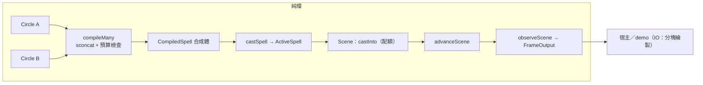

# Func-Spec 0012：多陣合成與場景層

> 狀態：**設計定案，待實作**
> 性質：一般 —— 交付後凍結 `Semigroup`/`Monoid CompiledSpell` 律、`Magic.Scene` 匯出面、提升後的上限值。
> 前置依賴：**spec 0010（需已完成）＋ spec 0011（需已完成）**——全域配額以 0010 的 `ParticleBudget` 表達且與其同碰 `Compile.hs`/`Interface.hs`；上限提升（S1）需要 0011 改寫後的契約測試（查詢鏡射律取代 4096 三方釘選）。**與 spec 0014 平行**（本 spec 觸 core/boundary/ffi 常數＋demo 上限行，0014 觸新 exe／`app/*` 熱掃描／docs——檔案零交集，§0.2 附證明；0014 另有 0013 動工門檻，見其頭部）。
> 依據：architecture §6 對照表「多個效果疊」列（**唯一未落地列**——完整度維度 A 剩下的 15%）、§8.1（預算閘門）、§8.4（多法術並行的緩衝管理）；ADR-0004（dataflow——場景層仍是純 fold）；[roadmap.md](../roadmap.md) §3.2／§4.5。合併律與配額政策屬架構級語意 → **本輪同步交付 ADR-0012**（先例：0007↔ADR-0010、0009↔ADR-0011）。
> 範圍：`CompiledSpell` 成為合法的 `Semigroup`/`Monoid`（發射器串接、預算相加、`PhasePlan` 逐界標取 max）、預算超額沿用 `BudgetExceeded`、新 boundary 模組 `Magic.Scene`（多 `ActiveSpell`＋全域配額，預設先到先得）、上限值 4096 → 依 0010 量測選定的新值正式落地。

---

## 0. 起點：引用的凍結介面、檔案盤點

### 0.1 引用的凍結介面

| 凍結物 | 本 spec 的用法 |
|---|---|
| `ParticleBudget(..)`／`budgetPlanOf`／`maxSpellParticles`（0010 交付凍結） | 全域配額的記帳單位；合成時 per-emitter 向量串接、total 相加 |
| 0011 改寫後的契約律：`PM_MAX_PARTICLES` 永釘 4096＋查詢鏡射律 `pm_max_particles ≡ budgetCap` | S1 改 `budgetCap` 值時，鏡射律要求 `pmMaxParticles` 同步（FFI 端一行）；header 一字不動——0011 §2 的設計目的在此兌現 |
| `Magic.Interface` 全匯出面（0005 凍結＋0010 加法） | 唯讀消費（`castSpell`/`advanceSpell`/`observeSpell`/`isFinished`）；`Magic.Scene` 是其上的**組合層**，不改任何既有簽名 |
| `compile :: Circle -> Either CompileError CompiledSpell`＋`CompileError = BudgetExceeded !Int !Int`（0002） | 合成超額沿用同一錯誤型別（`compileMany` 的 `Left`）；不加新建構子 |
| `PhasePlan` 不變量 `0 ≤ ppDrawEnd ≤ ppConvergeEnd ≤ ppCastingEnd ≤ ppEnd`（0006） | 合併律必須保不變量——逐界標 max 是保單調的（§2 論證） |
| `FrameInput`/`FrameOutput`/`RenderBatch`（0005 凍結） | `observeScene` 輸出仍是 `FrameOutput`（batch 串接）——宿主繪製路徑零改動 |
| `FieldState` 起步全靜止（ADR-0010 D8） | 合成 spell 的 `castSpell` 沿用；場清單串接（§2 風險節） |
| demo `gpuCapacity`（0005；0013 交付後 `app/*` 解鎖） | S1 隨上限提升同步：分塊繪製或 clamp（§2） |

### 0.2 檔案盤點（與 0014 的零交集證明）

**修改**：

| 檔案 | 變更 |
|---|---|
| `src/core/Magic/Compile.hs` | `Semigroup`/`Monoid CompiledSpell` 實體＋`compileMany`＋`budgetCap` 改值（S1/S2） |
| `src/boundary/Magic/Interface.hs` | 轉匯出 `compileMany`（或等價的多陣 `castSpell` 便利入口，設計見 §3） |
| `src/ffi/Magic/FFI.hs` | `pmMaxParticles` 跟改為新值（鏡射律；僅此一行） |
| `app/App/Render/Raylib3D.hs` | `gpuCapacity` 跟改＋超過單 mesh 容量時分塊繪製（S1） |
| `test/FFIContractSpec.hs` | 鏡射律兩側實值更新（若測試以 `budgetCap` 直接比對則零修改——實作時依 0011 交付形態） |

**新增**：`src/boundary/Magic/Scene.hs`、`test/ComposeSpec.hs`、`test/ComposeBudgetSpec.hs`、`test/SceneSpec.hs`、`test/CapacitySpec.hs`、`test/Acceptance12Spec.hs`、`docs/adr/0012-multi-circle-scene.md`。

**共用（行級聯集合併）**：`particle-magic.cabal`（magic-boundary exposed-modules +1、test other-modules +5——0014 加 executable stanza 與各自測試行，同檔異行）；`SKILL.md`（索引列）。

**明文不碰**：`app/App/{Loop,Effects,Hud,TestInterp,HotReload}.hs`、`app/Main.hs`、`app/App/Render/{Quads,Flat}.hs`（0013 交付後屬穩定面，本 spec 只碰 `Raylib3D.hs` 的容量行）、`src/boundary/{Codec,Projection,Step,Columns,Expr/Parse}.hs`、`include/particle_magic.h`（**零觸碰**——這正是 0011 鋪管道的意義）、`bindings/*`、`examples/*`、`tools/*`（0014 的新目錄）、`docs/spell-schema.md`（0014）。

**與 0014 交集**：0014 觸 `tools/`（新）、`app/Main.hs`／`Loop`／`Effects`／`HotReload`（熱掃描）、`docs/spell-schema.md`、`test/BoundarySpec.hs`。與本清單逐檔比對：**交集 = ∅**（cabal/SKILL.md 同檔異行除外）。

## 1. 目標與完成定義

**目標**：把 Init.md 對照表最後一個未落地列變成測試守護的事實——多張魔法陣可合成一個 spell、多個 spell 可在全域配額下共存；同時把粒子上限從骨架護欄提升為量測支持的值。

**完成定義**：

1. `budgetCap` 提升為依 0010 §9 量測選定的新值（選值規則：合成 100k 吞吐量測中「單幀純 CPU ≤ 2ms @ 上限粒子數」的最大 2 的冪）；`pmMaxParticles` 同步；`FFIContractSpec` 鏡射律全綠；`PM_MAX_PARTICLES` 與 header **零改動**；demo 以分塊繪製正常顯示超過 4096 粒的 spell（S1）。
2. `Semigroup`/`Monoid CompiledSpell` 合法：結合律（QuickCheck，逐位元）、`mempty` 左右恆等、合成後 `PhasePlan` 不變量保持、`spellBudgetPlan` 串接律成立（S2）。
3. `compileMany :: [Circle] -> Either CompileError CompiledSpell`：全部編譯 → fold 合成 → 總預算對 `budgetCap` 檢查，超額回 `BudgetExceeded 總需求 上限`（S3）。
4. `Magic.Scene`：全域配額下 `castInto` 先到先得（超額拒收、場景不變）、`advanceScene` 推進全部並移除已完成、`observeScene` batch 串接且決定論（同場景操作序列 ⇒ 逐位元同輸出）（S4）。
5. 合成 spell 的行為＝各成分行為的疊加：雙陣合成的 `observeSpell` 輸出 ≡ 兩個單陣分別 observe 後的粒子多重集（相同 `CastContext` 下，逐位元、順序依串接序）（S5 驗收律）。
6. ADR-0012 交付：合併律（逐界標 max）、配額政策（先到先得 v1）、場作用域（各自的場只作用於各自的發射器——見 §2 風險）的決策與被否決方案。

## 2. 使用到的架構與技巧

- **合併律＝逐界標 max**：`PhasePlan` 四界標分別取 max。單調性保持的論證：`a₁≤a₂≤a₃≤a₄`、`b₁≤b₂≤b₃≤b₄` ⇒ `max a₁ b₁ ≤ max a₂ b₂ ≤ …`（max 對每個分量單調）。語意直覺：合成陣的每個階段持續到「最慢的成分陣」結束——快的成分在自己的 envelope 內自然消退，不需要截斷任何一方。被否決方案（寫進 ADR-0012）：取 min（截斷慢方，破壞成分語意）、相加（無物理意義）、保留雙 plan（`PhasePlan` 型別要改，漣漪到 0006 全部凍結面）。
- **`spellEmitters` 串接與 index-0 慣例**：現況「index 0 = casting 發射器」是**建構慣例**而非讀取假設——場輸入以 `emPhase == Casting` 過濾、非以索引（0007 `fieldInputs`）。實作前置動作：grep 全 repo 確認無任何 `V.head`/`! 0` 讀取假設（S2 測試附一條「雙 casting 發射器合成後場語意正確」的見證）。
- **場的作用域**：`spellFields` 串接後，A 陣的場會作用到 B 陣的 Casting 粒子——這是**語意選擇**。v1 裁決：**合成 = 完全融合**（場作用於整個合成 spell 的 Casting 相位粒子），理由：玩家把兩張陣疊在一起，本來就是要它們互相作用；「隔離合成」（各場管各陣）需要 per-emitter 場路由，留待需求出現（ADR-0012 記錄兩案）。
- **`Monoid` 單位元**：`mempty` = 零發射器、零場、全零 `PhasePlan`、空 `ParticleBudget`。`compile emptyCircle` 是否恰為 `mempty` 不強求（emptyCircle 可能仍有 casting 發射器）；單位律只對 `mempty` 本身斷言。
- **場景層＝purely functional fold（ADR-0004 延續）**：`Scene` 是 `[(SpellId, ActiveSpell)]`＋配額帳＋下一個 id 的純值；`advanceScene` = map `advanceSpell` ＋ filter `isFinished`；`observeScene` = concatMap batches。無 IO、無鎖——多 spell 的**執行緒策略仍屬宿主**（0009 §9-2 立場不變）。
- **先到先得配額**：`castInto` 檢查 `usedBudget + budgetTotal (spellBudgetPlan s) ≤ scGlobalCap`；拒收回 `Left QuotaExceeded`（新型別，Scene 層自己的錯誤——不污染 `CompileError`）。已完成 spell 移除時配額自動釋放（帳跟著 spell 集合算，不另記簿）。
- **demo 分塊繪製**：單一動態 mesh 容量 `gpuCapacity` 不變大（GPU 上傳粒度維持小塊），改為每 batch 依 `gpuCapacity` 切塊多次 `uploadAndDraw`——draw call 數 = ⌈粒子數/塊⌉，仍與粒子數次線性。ADR-0009 的動態 mesh 路徑不變。

## 3. ADT

```haskell
-- Magic.Compile（加法）
instance Semigroup CompiledSpell   -- 發射器/場/預算串接；lifetime = max；PhasePlan 逐界標 max
instance Monoid    CompiledSpell   -- mempty = 空 spell（§2）
compileMany :: [Circle] -> Either CompileError CompiledSpell
  -- traverse compile → sconcat → 總預算 vs budgetCap（空清單 = Right mempty）

budgetCap :: Int   -- 4096 → 新值（S1；選值規則見 §1-1）

-- src/boundary/Magic/Scene.hs（新；交付後凍結）
newtype SpellId = SpellId Int              deriving (Eq, Ord, Show)
data SceneConfig = SceneConfig { scGlobalCap :: !Int }
data Scene                                  -- 不透明：spell 集合＋配額帳＋next id
data CastRefusal = QuotaExceeded !Int !Int  -- 需求、剩餘
  deriving (Eq, Show)

newScene     :: SceneConfig -> Scene
castInto     :: CastRequest -> Scene -> Either CastRefusal (SpellId, Scene)
dismiss      :: SpellId -> Scene -> Scene          -- 主動移除（宿主打斷施法）
advanceScene :: FrameInput -> Scene -> Scene       -- 推進全部；完成者移除、配額釋放
observeScene :: Scene -> FrameOutput               -- batch 串接（SpellId 升冪，決定論）
sceneBudget  :: Scene -> (Int, Int)                -- (已用, 上限)
```

## 4. 資料結構與儲存方式

`Scene` 內部：`Map SpellId ActiveSpell`（`containers` 已在 boundary 依賴內？——**否**，boundary 白名單無 containers；改用升冪 `[(SpellId, ActiveSpell)]` 關聯清單，場景規模＝同時存在的法術數（個位數～十位數），列表足矣且免新依賴）。配額帳＝即時求和（spell 數小，O(n) 可忽略）。

## 5. 資料流（pipeline）



## 6. 搭建方式（風險優先）

1. **S1 上限提升**——最小改動、最大解鎖；先做，讓後續合成測試能用大預算場景。
2. **S2 `Semigroup`/`Monoid`**——核心語意，含 index-0 慣例查證。
3. **S3 `compileMany`＋超額**。
4. **S4 `Magic.Scene`**。
5. **S5 端到端**（含疊加律）。
6. ADR-0012 與 S2 同步起草、S5 定稿。

## 7. Todo List 與 1-to-1 測試對應

| # | Todo | 測試 |
|---|---|---|
| S1 | `budgetCap` 改值＋`pmMaxParticles` 跟改＋`gpuCapacity` 分塊繪製＋0010 `Acceptance10Spec` 哨兵行更新 | `test/CapacitySpec.hs`（新值哨兵、`compile` 接受 >4096 的陣、鏡射律見證；分塊：`buildQuads` 分塊聯集 ≡ 整塊——純函數層可測，GPU 路徑靠既有手動 smoke） |
| S2 | `Semigroup`/`Monoid CompiledSpell`＋index-0 慣例查證 | `test/ComposeSpec.hs`（結合律/單位律 QuickCheck 逐位元、`PhasePlan` 不變量保持、界標 max 見證、雙 casting 發射器場語意見證） |
| S3 | `compileMany`＋超額 `BudgetExceeded` | `test/ComposeBudgetSpec.hs`（預算串接律、超額值正確、空清單 = `Right mempty`、單元素 ≡ `compile`） |
| S4 | `Magic.Scene` 全 API | `test/SceneSpec.hs`（配額拒收且場景不變、完成移除釋放配額、`dismiss`、決定論：同操作序列逐位元同輸出、`observeScene` 序穩定） |
| S5 | 端到端驗收＋ADR-0012 定稿 | `test/Acceptance12Spec.hs`（疊加律：雙陣合成 observe ≡ 成分粒子多重集逐位元；場景三 spell 240 幀決定論；golden 單陣行為零回歸） |

## 8. 非目標

1. 多 spell 聚合 **FFI** API（`pm_scene_*`）——等場景層在 Haskell 面穩定一輪後再上 C ABI（記帳 roadmap §3.3）。
2. 玩家面 JSON 多陣文件格式（`"circles": [...]`）——合成是 API 級操作（宿主/遊戲層動態組合）；JSON schema 仍是單陣（v1 不動）。
3. 配額政策的進階策略（按 power 加權、優先權搶佔）——ADR-0012 記錄選項，v1 只做先到先得。
4. 合成陣的視覺專屬表現（合成特效、橋接光效）——視覺語彙屬 0013 之後的視覺輪。
5. 隔離合成（per-emitter 場路由）——見 §2 場作用域裁決。
6. demo 的場景層展示 UI（多 spell 同屏鍵位）——demo 仍單 spell；場景層由 headless 測試證明（保住與 0014 的檔案零交集）。

## 9. 驗收紀錄

（實作時回填：日期、`cabal test` 結果、S1 選定的新上限值與依據量測、ADR-0012 連結；凍結清單：`Semigroup`/`Monoid` 實體律、`compileMany`、`Magic.Scene` 匯出面、新 `budgetCap` 值。）
