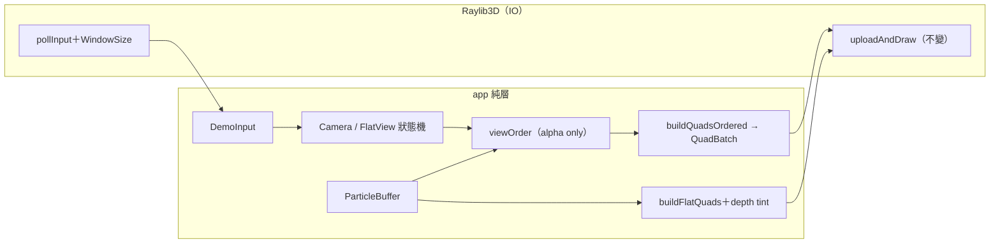

# Func-Spec 0013：視覺表現力（app/* 半場：深度排序、相機、俯視可讀性）

> 狀態：**設計定案，待實作**
> 性質：一般 —— 交付後 `App.Render.Order` 匯出面與新效果 op 依殼層加法慣例（0005）穩定。
> 前置依賴：**無**（0005/0008 已完成；純 `app/*` 工作）。**與 spec 0010、0011 三方平行**：本 spec 鎖 `app/*`，0010 鎖 core／`Interface.hs`／bench（明文不碰 `app/*`），0011 鎖 `src/ffi`＋`include`＋新目錄——檔案零交集（§0.2 附證明）。
> 依據：ADR-0009（動態 quad mesh——排序在 staging 層做，繪製路徑不變）；roadmap §3.4／§4.5（「先做純 `app/*` 的那半」）；0005 §9（3D 深度排序、相機操控記帳）、0008 §9-3/§9-8（2D 相機、俯視深度重疊暴露未解）；architecture §8.6。
> 範圍：3D alpha batch 的相機距離深度排序（app 側 staging）、3D 軌道／縮放相機、2D 平移／縮放與視窗適配、俯視深度色調線索（可讀性第一解）、對應的輸入／HUD／headless 漣漪。**核心零觸碰**——這是「視覺表現力」在不動 `BillboardShape` 前提下能吃到的全部；動核心的那半（貼圖、新形狀）記帳 §8。

---

## 0. 起點：引用的凍結介面、檔案盤點

### 0.1 引用的凍結介面（全部唯讀 import，零修改）

| 凍結物 | 本 spec 的用法 |
|---|---|
| `Magic.Interface`：`ParticleBuffer` 六欄 fields、`RenderBatch`/`BlendMode`（0005 凍結） | 深度 key 從 `pbPosX/Y/Z` 算；additive batch 免排序（加法交換）、alpha batch 排 |
| `Magic.Projection`：`ViewPlane`/`orthographic`/`depthOrder`（0008 凍結） | 2D 路徑沿用；**3D 深度 key 在 app 側自算**（視向投影需要相機，核心無相機概念——0010 的 `emitterBounds` 同款邊界劃分） |
| `QuadBatch`/`buildQuads`/`billboardBasis`（0005 凍結） | `buildQuadsOrdered` 為**加法**新增；`buildQuads` 簽名行為不變（bench 只 import `buildQuads`，0010 的 bench 工作不受影響） |
| `buildFlatQuads`/`FlatView`（0008 凍結） | `FlatView` 加欄位（記錄型別加欄位＝殼層慣例，0008 對 `HudView` 同款）；既有欄位語意不變 |
| 效果面加法慣例（0005 凍結：`Raylib` GADT 只加 op 不改既有） | `PollInput` 擴充 `DemoInput` 欄位、新增 `WindowSize` op |
| `LoopConfig`/`LoopState`（0008 現況） | 加相機／2D 視圖狀態欄位；`applyViewInput` 擴充 |
| headless 決定論（0005/0008 的 Acceptance 摘要比對） | 中心律：**零輸入時全部輸出逐位元不變**（預設相機＝`defaultCamera`、預設 2D 視圖＝0008 常數） |

### 0.2 檔案盤點（與 0010／0011 的三方零交集證明）

**修改（8）**：`app/App/Loop.hs`（相機/視圖狀態機）、`app/App/Effects.hs`（`DemoInput` 加欄、`WindowSize` op、`FlatView` 加欄）、`app/App/Hud.hs`（視圖資訊行）、`app/App/TestInterp.hs`（headless 對應）、`app/App/Render/Quads.hs`（**加法** `buildQuadsOrdered`）、`app/App/Render/Flat.hs`（深度色調、pan/zoom 接入）、`app/App/Render/Raylib3D.hs`（滑鼠/滾輪輸入、alpha batch 排序接線、視窗尺寸）、`app/Main.hs`（`LoopConfig` 新欄位初值）、`test/HudSpec.hs`／`test/ViewToggleSpec.hs`（機械補欄）。

**新增**：`app/App/Camera.hs`（純相機數學）、`app/App/Render/Order.hs`（純深度排序）、`test/CameraSpec.hs`、`test/OrderSpec.hs`、`test/FlatCameraSpec.hs`、`test/DepthTintSpec.hs`、`test/Acceptance13Spec.hs`。

**共用（行級聯集合併）**：`particle-magic.cabal`（executable/test `other-modules` 各 +2、test +5 spec 行——與 0010/0011 同檔異行）；`SKILL.md`（索引列）。

**明文不碰**：`src/core/*` 全部、`src/boundary/*` 全部、`src/ffi/*`、`include/*`、`cbits/*`、`bench/*`、`examples/*`、`bindings/*`、`app/App/HotReload.hs`（0014 的地盤）。

**三方交集**：0010 觸 core 六檔＋`Interface.hs`＋`bench/Bench.hs`（明文不碰 `app/*`）；0011 觸 ffi 四檔＋新 boundary `Columns.hs`＋新目錄。與本清單逐檔比對：**交集 = ∅**（cabal/SKILL.md 同檔異行除外；`test/HudSpec.hs`/`ViewToggleSpec.hs` 僅本 spec 觸碰）。

## 1. 目標與完成定義

**目標**：demo 從「固定機位的驗證視窗」變成「能看清楚魔法的觀察台」——alpha 混合正確（遠到近）、三維可環繞、二維可平移縮放、俯視不再糊成一團。

**完成定義**：

1. 3D 路徑 alpha batch 依相機距離遠到近排序後繪製；additive batch 不排（順序無關，維持現行 depth-mask 括號）；`buildQuadsOrdered` 對恆等置換 ≡ `buildQuads` **逐位元**（S1）。
2. 3D 軌道相機：滑鼠拖曳環繞（方位角/仰角）、滾輪縮放（半徑 clamp）、目標點不動；純函數層有守恆律（半徑/目標不變性）測試（S2）。
3. 2D 平移（拖曳）／縮放（滾輪，游標為不動點）／視窗 resize 時 `fvScreenSize` 跟隨；純函數層有不動點律測試（S3）。
4. 俯視（`TopXZ`）深度色調線索：依 painter 深度對顏色做單調暗化（近亮遠暗），係數可關（預設**關**）；關閉時輸出與 0008 逐位元相同（S4）。
5. 輸入／HUD／headless 全鏈路：新輸入經 `DemoInput` 擴充欄位流動，HUD 顯示目前相機/視圖，headless 腳本可注入（S5）。
6. **零輸入零漣漪律**：無任何新輸入時，demo 的逐幀 headless 摘要與 0008 交付狀態逐位元相同（S6 端到端）。

## 2. 使用到的架構與技巧

- **排序在 staging、不在 GPU**（ADR-0009 延續）：`App.Render.Order.viewOrder :: Camera -> ParticleBuffer -> U.Vector Int`——以視線方向點積為深度 key、遠到近、等深保 buffer 序（與 `depthOrder` 同款穩定律，同款 tie-break 手法）。`buildQuadsOrdered order …` 依置換序寫 quad 頂點，`uploadAndDraw` 完全不變。排序成本 O(n log n) @ ≤4096 可忽略；0012 提升上限後若成熱點，屆時直接受益於 0010 的排序基建（本 spec 用 `Data.List.sortOn` 起步即可——app 層非核心熱路徑，正確先於快）。
- **每 batch 獨立排序**：跨 batch 深度交錯維持不做（0008 §9-2 立場；blend 狀態切換成本 > 交錯正確性收益，POC 不值）。
- **純相機數學模組**：`App.Camera`——`orbit :: (Float, Float) -> Camera -> Camera`（球座標增量，仰角 clamp ±89°）、`dolly :: Float -> Camera -> Camera`（半徑 clamp [1, 50]）。`Camera` 型別沿用 `App.Effects`（0005 記錄，不改欄位）。守恆律：`orbit` 不改 `camTarget` 與半徑；`dolly` 不改 `camTarget` 與視線方向。
- **2D 縮放以游標為不動點**：`zoomAt :: (Float,Float) -> Float -> FlatView -> FlatView`——調 `fvPixelsPerUnit` 同時平移 `fvOrigin` 使游標下世界點不動（律：`screenOf v p == screenOf (zoomAt c k v) p` 當 `p` 為游標下世界點）。
- **深度色調＝staging 層顏色調變**：`buildFlatQuads` 在既有 painter 置換序上，對每粒子依正規化深度 `d ∈ [0,1]` 乘暗化係數（RGB 各通道，A 不動；`0xRRGGBBAA` 佈局沿 0009/0011 的既定事實）。預設係數 0（關）⇒ 逐位元相容自動成立。這是俯視重疊問題的**第一個**可讀性解（architecture §8.6 記帳的「壓平比例、輪廓強調」等進階解仍留視覺續輪）。
- **輸入擴充走既有管道**：`DemoInput` 加 `diOrbitDrag :: Maybe (Float, Float)`、`diWheel :: Float`、`diPanDrag :: Maybe (Float, Float)`、`diCursor :: (Float, Float)`；`noInput` 全中性。`Raylib` GADT 加 `WindowSize :: Raylib m (Int, Int)`（resize 適配）。TestInterp 的 headless 對應：腳本化輸入序列（0008 `ViewToggleSpec` 同款手法）。

## 3. ADT

```haskell
-- app/App/Render/Order.hs（新，純）
viewOrder :: Camera -> ParticleBuffer -> U.Vector Int   -- 遠到近、穩定（tie-break=index）

-- app/App/Render/Quads.hs（加法）
buildQuadsOrdered :: U.Vector Int -> V3 -> V3 -> V3 -> ParticleBuffer -> QuadBatch
-- 律：buildQuadsOrdered (identityPerm n) ≡ buildQuads（逐位元）

-- app/App/Camera.hs（新，純）
orbit :: (Float, Float) -> Camera -> Camera
dolly :: Float -> Camera -> Camera

-- app/App/Render/Flat.hs（擴充）
-- FlatView 加欄：fvDepthTint :: Float（0 = 關，預設）
panBy  :: (Float, Float) -> FlatView -> FlatView
zoomAt :: (Float, Float) -> Float -> FlatView -> FlatView

-- app/App/Effects.hs（加法）：DemoInput 四欄、WindowSize op；HudView 加 hvCamera 摘要欄
-- app/App/Loop.hs：LoopState 加 stCamera / stFlat；applyViewInput 擴充
```

## 4. 資料結構與儲存方式

相機與 2D 視圖狀態入 `LoopState`（隨 loop 純遞移；`LoopConfig` 給初值＝現行常數，故零輸入即現狀）。排序置換每幀即算即棄（不跨幀快取——buffer 每幀新值）。

## 5. 資料流（pipeline）



## 6. 搭建方式（風險優先）

1. **S1 排序（Order＋buildQuadsOrdered）**——唯一含逐位元恆等律的重構點，最早上 golden 網。
2. **S2 3D 相機**、**S3 2D 相機**——純數學，各自獨立。
3. **S4 深度色調**——依 S3 的 FlatView 擴充。
4. **S5 輸入/HUD/headless 接線**——集中處理記錄型別漣漪（`HudSpec`/`ViewToggleSpec` 機械補欄一次做完）。
5. **S6 IO 接線＋手動 smoke**、**S7 端到端**。

## 7. Todo List 與 1-to-1 測試對應

| # | Todo | 測試 |
|---|---|---|
| S1 | `App.Render.Order.viewOrder`＋`buildQuadsOrdered`＋Raylib3D alpha batch 接線 | `test/OrderSpec.hs`（置換有效性、遠到近單調、穩定律、恆等置換 ≡ `buildQuads` 逐位元、additive 不排見證） |
| S2 | `App.Camera.orbit`/`dolly` | `test/CameraSpec.hs`（目標/半徑守恆律、仰角 clamp、半徑 clamp、零增量恆等） |
| S3 | `FlatView` 擴欄＋`panBy`/`zoomAt`＋`WindowSize` op | `test/FlatCameraSpec.hs`（游標不動點律、pan 線性、resize 後 `screenOf` 一致、預設值 ≡ 0008 常數） |
| S4 | 俯視深度色調（`buildFlatQuads` 調變） | `test/DepthTintSpec.hs`（tint=0 逐位元相容、暗化對深度單調、A 通道不變） |
| S5 | `DemoInput`/`HudView`/`TestInterp`/Loop 狀態機接線＋既有測試機械補欄 | `test/HudSpec.hs`＋`test/ViewToggleSpec.hs` 更新（hvCamera 顯示、輸入腳本狀態機、無輸入回歸哨兵） |
| S6 | Raylib3D IO 接線（滑鼠拖曳/滾輪/視窗尺寸/游標） | **手動 smoke**（§9 回填：環繞、縮放、2D 平移縮放、俯視 tint 開關目視） |
| S7 | 端到端驗收 | `test/Acceptance13Spec.hs`（零輸入零漣漪律：headless 摘要 ≡ 0008 交付逐位元；輸入腳本下模擬輸出不受相機影響——視圖/模擬解耦律 0008 版延續） |

## 8. 非目標

1. `BillboardShape` 新建構子（貼圖、拉伸 billboard）、`rbShape` 差異化——**動核心的那半**，留給視覺續輪（需與 Compile/Codec 協調，不屬 `app/*` 範圍）。
2. 跨 batch 深度交錯（0008 §9-2 立場不變）。
3. 拖尾／軟粒子／後處理（產品級視覺，roadmap §2 維度 C）。
4. 俯視的進階可讀性解（壓平比例、輪廓強調——architecture §8.6；深度色調是第一解，效果評估後續輪決定加碼方向）。
5. 相機動畫／過場、慣性阻尼。
6. 排序的效能優化（app 層 `sortOn` 起步；0012 提升上限後若成熱點再接 0010 基建）。

## 9. 驗收紀錄

（實作時回填：日期、`cabal test` 結果、S6 手動 smoke 紀錄；穩定面清單：`viewOrder`/`buildQuadsOrdered`/`orbit`/`dolly`/`panBy`/`zoomAt`、`DemoInput`/`FlatView` 新欄。）
