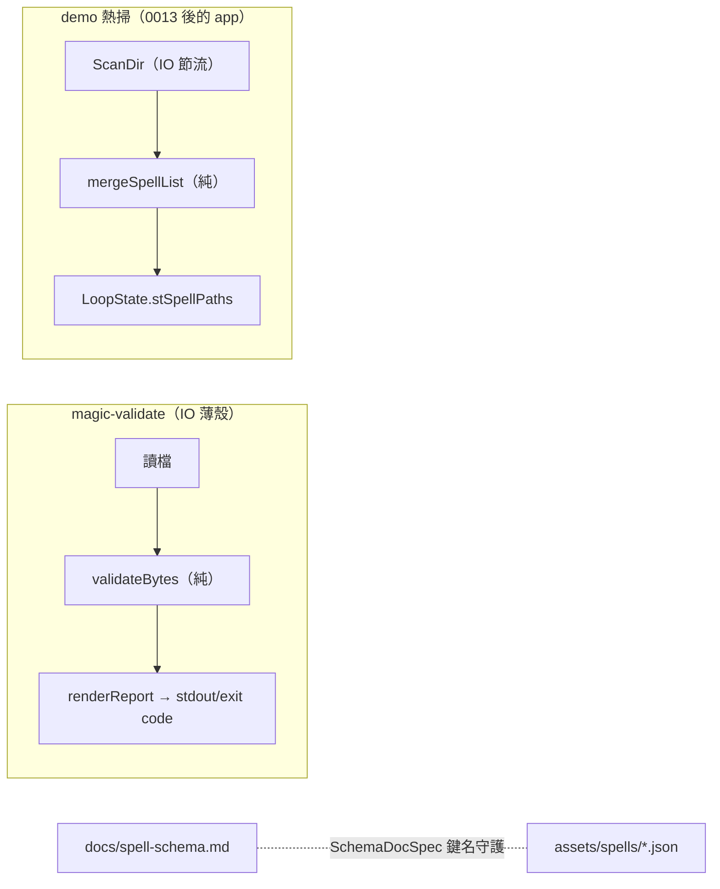

# Func-Spec 0014：作者工具（驗證 CLI、schema 說明、spell 清單熱掃描）

> 狀態：**已完成**（2026-08-15 驗收，見 §9）
> 性質：一般 —— 交付後凍結 `magic-validate` 的命令列介面與輸出格式（工具的使用者是人與腳本，格式即合約）。
> 前置依賴：**spec 0010（需已完成）**——`--stats` 消費其 `budgetPlanOf`/`maxSpellParticles` 加法匯出；其餘只消費 `Magic.Codec`/`Magic.Interface` 的凍結面。**動工門檻另含 spec 0013 驗收**：本 spec 的熱掃描觸 `app/Main.hs`／`Loop`／`Effects`／`TestInterp`，與 0013 的檔案有交集，不得與其平行（先例：0007 對 0006 的門檻寫法）。**與 spec 0012 平行**（0012 觸 core/boundary/ffi＋`Raylib3D.hs` 容量行，本 spec 觸新 `tools/`＋app 熱掃四檔＋docs——檔案零交集，§0.2 附證明）。
> 依據：ADR-0005（JSON 是輸入介面——驗證器與 schema 文件都是它的配套）；roadmap §3.5／§4.5（E 候選：現在的作者就是寫程式的人，故本 spec 排最後）；0005 §9（fsnotify／清單熱掃記帳——本 spec 以輪詢重掃落地，fsnotify 仍不引入）。
> 範圍：`magic-validate` 驗證 CLI（新 executable，逐檔 load＋compile 報告）、`docs/spell-schema.md` 作者面 schema 說明（繁中）、demo 的 spell 清單週期性重掃（新增/刪除 JSON 不必重啟）。

---

## 0. 起點：引用的凍結介面、檔案盤點

### 0.1 引用的凍結介面（全部唯讀 import，零修改）

| 凍結物 | 本 spec 的用法 |
|---|---|
| `Magic.Codec`：`loadCircle`/`renderLoadError`（0002 凍結，錯誤含行列位置） | CLI 的第一關；報告文字直接用 `renderLoadError`（與 demo HUD 同一套——工具與遊戲說同一種話） |
| `Magic.Interface`：`castSpell`/`CompileError`（0005 凍結）＋`budgetPlanOf`/`maxSpellParticles`（0010 加法，已完成） | CLI 的第二關（能編譯≠能施放——超額在此攔）；`--stats` 的預算明細來源 |
| boundary 依賴紀律（0001；`BoundarySpec` 對 exe 的行式守護） | 新 executable 沿用同紀律：`build-depends` 不含 `magic-core`、不含渲染器；`BoundarySpec` 加對 `magic-validate` stanza 的同款斷言 |
| 效果面加法慣例（0005）：`FileWatch` effect 只加 op 不改既有 | 加 `ScanDir` op（§3）；`CheckChanged`/`ReadBytes` 不動 |
| `HotReload` 的節流輪詢手法（0005：mtime、間隔節流、錯誤視為未變） | 目錄重掃沿用同款節流與容錯（掃描中檔案消失＝下輪再說） |
| headless 決定論（Acceptance 系列） | 重掃邏輯全部走 `TestInterp` 腳本化（`runFileWatchScriptMap` 擴充），不依賴真檔案系統 |

### 0.2 檔案盤點（與 0012 的零交集證明）

**新增**：`tools/Validate.hs`（`magic-validate` 主程式）、`docs/spell-schema.md`、`test/ValidateSpec.hs`、`test/SchemaDocSpec.hs`、`test/RescanSpec.hs`、`test/Acceptance14Spec.hs`。

**修改**：

| 檔案 | 變更 |
|---|---|
| `app/Main.hs` | `scanSpells` 移交 loop 週期重掃（初掃保留為初值） |
| `app/App/Effects.hs` | `FileWatch` GADT 加 `ScanDir :: FilePath -> FileWatch m [FilePath]` |
| `app/App/Loop.hs` | `LoopState` 加 `stSpellPaths`；週期重掃＋清單合併（依路徑保持當前選擇） |
| `app/App/TestInterp.hs` | `ScanDir` 的腳本化對應 |
| `app/App/HotReload.hs` | 目錄掃描的節流 IO（`checkStampIO` 同款手法） |
| `test/BoundarySpec.hs` | 加 `magic-validate` stanza 的依賴白名單斷言 |

**共用（行級聯集合併）**：`particle-magic.cabal`（新 `executable magic-validate` stanza——全新區塊行級無交集；test `other-modules` +4 行）；`SKILL.md`（索引列）；`README.md`（工具一行，若 0012 未動 README 則無交集，動則同檔異行聯集）。

**與 0012 交集**：0012 觸 `Compile.hs`/`Interface.hs`/`Scene.hs`(新)/`FFI.hs`/`FFIContractSpec.hs`/`Raylib3D.hs`。與本清單逐檔比對：**交集 = ∅**（cabal/SKILL.md 同檔異行除外）。0013 交集非空（`Main`/`Loop`/`Effects`/`TestInterp`）→ 已列動工門檻。

## 1. 目標與完成定義

**目標**：把「作者改 JSON」的回饋圈補完整：改壞了在存檔當下就知道哪一行為什麼（CLI／熱重載已有）、想查語法不必讀 Haskell 原始碼（schema 文件）、加新檔不必重啟 demo（清單重掃）。

**完成定義**：

1. `cabal run magic-validate -- assets/spells` 對現有 10 個範例全數 `OK`，exit code 0；對壞檔印 `loadCircle` 錯誤（含行列）或 `CompileError`，exit code = 失敗檔數（S1）。
2. `--stats` 對每個通過檔印：預算（總粒子數／`maxSpellParticles`）、發射器數、生命週期、相位界標、場數（S1）。
3. `docs/spell-schema.md` 覆蓋 schema v1 全部欄位；機械守護：10 個範例 JSON 中出現的每個物件鍵名都在文件中出現（S2）。
4. demo 執行中於 `assets/spells` 新增/刪除 JSON，清單在下個掃描週期（2s）內更新；當前選擇依**路徑**保持，被刪則落到相鄰項；headless 腳本可證（S3）。
5. 重掃不觸發任何既有行為回歸：無檔案變動時逐幀摘要與 0013 交付狀態逐位元相同（S4）。

## 2. 使用到的架構與技巧

- **CLI＝boundary 的第三個消費者**：`magic-validate` 與 demo、FFI 平列，只 import `Magic.Codec`/`Magic.Interface`——它的存在本身又一次驗證「庫完整、繪圖在外」（一個不畫任何東西、也不開視窗的 exe）。核心邏輯抽成純函數 `validateBytes :: FilePath -> ByteString -> Report`，IO 殼只管讀檔與印字——`ValidateSpec` 測純函數，CLI 殼薄到不值得測。
- **報告格式即合約**：每檔一行起頭 `OK <path>` 或 `FAIL <path>`，錯誤細節縮排續行——腳本可 grep、人可讀。交付後凍結（工具輸出被 CI/腳本依賴後改格式就是破壞性變更）。
- **schema 文件的機械守護**：`SchemaDocSpec` 遞迴收集 10 個範例 JSON 的全部物件鍵名（aeson 走訪，test 內十行），斷言每個鍵名字串都出現在 `docs/spell-schema.md`。文件寫漏（或未來 spec 加了新鍵忘記補文件）在 `cabal test` 就炸——文字合約守護手法第四次使用（Boundary→FFIContract→BindingContract→SchemaDoc）。反向（文件寫了不存在的鍵）由人工審閱，不機械化。
- **重掃＝`CheckChanged` 的目錄版**：`ScanDir` op 回排序後的 `*.json` 清單；IO 端節流（2s 一次 `listDirectory`，錯誤回上次清單）；純端 `mergeSpellList :: [FilePath] -> LoopState -> LoopState`——依路徑找回當前選擇、被刪則 clamp 到相鄰索引、新清單排序穩定。fsnotify 仍不引入（ADR-0005 既定延後；輪詢在 10 檔規模零成本）。
- **schema 文件內容組織**：對作者而言的心智模型（外圈/夾層/內圈/核心的槽位表）→ 每槽位可放的符文與參數表 → `phases`/`fields` 選配段 → 三個由淺入深的完整範例（引用現有 assets）→ 常見錯誤與 `magic-validate` 用法。全繁中、零 Haskell 型別名——對照表引 JSON 鍵名與值域。

## 3. ADT

```haskell
-- tools/Validate.hs（新 executable；核心純函數）
data Report = Report { repPath :: FilePath, repResult :: Either String Stats }
data Stats  = Stats  { stBudget :: Int, stCap :: Int, stEmitters :: Int
                     , stLifetime :: Seconds, stPhases :: PhasePlan, stFields :: Int }
validateBytes :: FilePath -> ByteString -> Report   -- loadCircle → castSpell（原點脈絡）
renderReport  :: Bool {-stats-} -> Report -> String -- 凍結的行格式
-- main：walk 引數（檔或目錄）→ mapM validateBytes → exit code = 失敗數

-- app/App/Effects.hs（加法）
--   ScanDir :: FilePath -> FileWatch m [FilePath]

-- app/App/Loop.hs（純）
mergeSpellList :: [FilePath] -> LoopState -> LoopState  -- 依路徑保選擇、刪除 clamp
```

（`Stats` 的相位摘要欄位型別實作時定案；`PhasePlan` 直接可 `Show`，不強求新型別。）

## 4. 資料結構與儲存方式

`stSpellPaths` 入 `LoopState`（初值＝`Main.scanSpells` 首掃；`LoopConfig.lcSpellPaths` 保留為初值來源，語意不變）。掃描節流狀態與 `WatchState` 同居（`wsEntries` 旁加目錄項）。

## 5. 資料流（pipeline）



## 6. 搭建方式（風險優先）

1. **S1 CLI**——獨立於 app，隨時可做；先交付「作者最缺的那個回饋」。
2. **S2 schema 文件＋守護**——獨立。
3. **S3 重掃**——唯一碰 app 的部分，等 0013 驗收後動工（門檻條款）。
4. **S4 端到端**。

## 7. Todo List 與 1-to-1 測試對應

| # | Todo | 測試 |
|---|---|---|
| ✅ S1 | `magic-validate` CLI（stanza＋`validateBytes`/`renderReport`＋`BoundarySpec` 白名單斷言） | `test/ValidateSpec.hs`（10 範例全 OK、壞 JSON 行列訊息、超額 `CompileError`、`--stats` 數字與 `budgetPlanOf` 一致、行格式凍結哨兵） |
| ✅ S2 | `docs/spell-schema.md` 全欄位撰寫 | `test/SchemaDocSpec.hs`（範例 JSON 遞迴鍵名 ⊆ 文件文字；範例檔名全數被引用） |
| ✅ S3 | `ScanDir` op＋IO 節流＋`mergeSpellList`＋Loop 接線 | `test/RescanSpec.hs`（headless 腳本：新增→清單長、刪當前→clamp 相鄰、選擇依路徑保持、節流語意；＋`scanDirIO` 對真目錄的「＝啟動清單」律） |
| ✅ S4 | 端到端驗收 | `test/Acceptance14Spec.hs`（CLI 對 assets 全綠見證；無變動時逐幀摘要 ≡ 0013 交付逐位元——零漣漪律） |

## 8. 非目標

1. 視覺化編輯器／即時預覽 UI（等有非工程作者；roadmap §4.5 的定位不變）。
2. fsnotify（輪詢已足；ADR-0005 既定延後）。
3. JSON Schema（draft-07 等機器格式）輸出——文件先服務人；機器 schema 等外部工具鏈需求。
4. `magic-validate` 的 watch 模式（`--watch` 循環）——組合 shell 工具即可。
5. schema 文件的英文版（工作語言慣例：文件繁中）。
6. spell 檔案的自動修復／遷移（schema v1 尚無演進需求；migrate 政策見 integration.md §9）。

## 9. 驗收紀錄

**日期**：2026-08-15。**測試**：`cabal test` → **952 examples, 0 failures**（本輪新增 44 例：ValidateSpec 18、SchemaDocSpec 3、RescanSpec 20、Acceptance14Spec 4；BoundarySpec +2）。GHC 9.14.1，新增檔案零警告。

### 9.1 CLI 對 assets 的實際輸出

`cabal run magic-validate -- --stats assets/spells` → 10 檔全 `OK`，exit code 0。樣本：

```
OK assets/spells/grand-sigil.json
  budget    840 / 4096 particles
  emitters  10 [384, 96, 64, 64, 64, 64, 64, 12, 12, 16]
  lifetime  8.100s
  phases    draw 1.200s + converge 0.600s -> casting starts at 1.800s
  fields    0
  extent    (-14.794, -14.794, -14.794) .. (14.794, 14.794, 14.794)
```

壞檔（scratch 目錄，4 壞檔＋1 不存在的路徑）→ exit code 5，訊息各自到位：

```
FAIL .../huge.json
  too many particles: this circle needs 25600, the cap is 4096 (the core centre's "power" scales the count: 256 x power)
FAIL .../rune.json
  spell JSON error: Error in $.circle.outer[0]: unknown rune tag "wobble" for the outer ring slot; valid tags here: shape, radiate, range
FAIL .../syntax.json
  spell JSON error: Unexpected "}\n}\n", expecting JSON value (line 6, column 3)
FAIL .../version.json
  unsupported spell schema version 2 (this build reads version 1)
```

### 9.2 手動 smoke：真實視窗的目錄重掃

demo 視窗 + 合成事件（memory：`raylib-window-smoke-test`），**全程零鍵盤**——重掃本身就是可觀測的：

1. 啟動 6 秒後：`spell: assets/spells/bare-sigil.json`、**`reload: idle`**。掃描每 2 秒跑一次卻一次都沒換清單、沒重新施放 → 零漣漪律在真 IO 路徑成立。
2. 執行中刪掉**當前選中**的 `bare-sigil.json` → 5 秒內 HUD 自行變成 `converge-flame.json`、`reload: ok at 85259.53s`、age 重新從 0 起算、`particles: 512`（與 `--stats` 對該檔報的 budget 一致）。
3. 把 `bare-sigil.json` 放回（排序在 `converge-flame` **之前**）→ 選擇留在 `converge-flame.json`，`reload` 時戳不變（沒有多餘的施放）。

**此 smoke 抓到一個真 bug**：初版 `scanDirIO` 以 `System.FilePath.</>` 併路徑，在 Windows 產生 `assets/spells\bare-sigil.json`，與 `Main` 的斜線清單**字串不相等** → 每次啟動第一幀就白白換清單並重新施放（HUD 顯示反斜線與 `reload: ok`）。因為兩種寫法對 OS 是同一個檔案，程式照跑，只有 HUD 看得出來。修正為與 `Main` 同款的 `dir ++ "/" ++ name`，並補上 `RescanSpec` 的「`scanDirIO` 對真目錄 ≡ 啟動清單」守護——腳本化的 headless 測試依定義看不到這一層。

### 9.3 凍結清單（下游可依賴）

1. **`magic-validate` 命令列**：`magic-validate [--stats] PATH...`；`PATH` 為檔案或目錄（目錄取其下 `*.json`，依檔名排序，不遞迴）。exit code = 失敗檔數（clamp 至 125）；用法錯誤 = 64。
2. **行格式**：stdout 每檔一筆，首行 `OK <path>` 或 `FAIL <path>`（第一個空白前即 verdict），其餘行一律以兩個空白起頭；每筆以換行結尾。`--stats` 於 `OK` 下固定六行，標籤依序 `budget`／`emitters`／`lifetime`／`phases`／`fields`／`extent`。摘要行走 stderr，stdout 純為記錄。
3. **`FileWatch` 的 `ScanDir :: FilePath -> FileWatch m [FilePath]`**（回排序後的 `*.json` 絕對／相對路徑清單，與呼叫端手上的清單同款併接）。

### 9.4 與設計書的差異（實作時定案，均記錄於程式碼註解）

1. **`--stats` 的生命週期以量測取得，非查詢**：§3 的 `Stats` 草圖假設拿得到 `spellLifetime`／`PhasePlan`／`spellFields`，但 `Magic.Interface` 的凍結面**沒有**匯出這三者；而 §0.1 明令本輪唯讀 import 該模組（`Interface.hs` 是平行進行的 0012 的檔案，SKILL.md 多協作者規則 4）。因此：
   - `lifetime`：對 `isFinished`（＝`age >= lifetime`，對年齡單調）做二分。`advanceSpell` 讓新施放的 spell 年齡恰為參數，故二分收斂到編譯器算出的那個 `Double` 本身（`ValidateSpec` 以 `converge-flame` 的精確值 5.5 釘住）。
   - `phases`／`fields`：讀 `Magic.Codec.saveCircle` 的正規編碼（已載入之 circle 的自身序列化），非原始位元組。
   - `stPhases` 因此是**作者宣告的** `draw`／`converge`（外加兩者之和），不是編譯後的四個界標。差別只在 `ppCastingEnd`；`ppEnd` 即 `lifetime` 一行已有。
   > 若日後要把界標完整印出，正確做法是 0012 併入後對 `Magic.Interface` 做一次加法匯出（`phasePlanOf`／`PhasePlan(..)`），而不是在工具端重算編譯器的算術。
2. **`tools/Validate.hs` 拆成兩檔**：`tools/Validate.hs`（純核心，測試套件以 `hs-source-dirs: tools` 直接編譯）＋`tools/Main.hs`（IO 殼，`main-is`）。同一個 stanza 不能有兩個 `Main`，而 §2 要求「測純函數、CLI 殼薄到不值得測」——拆檔正是它的落實。
3. **`mergeSpellList` 的簽名**：§3 寫 `[FilePath] -> LoopState -> LoopState`；`LoopState` 未匯出（匯出它會把 15 個欄位、含不透明的 `ActiveSpell` 一起攤開給測試）。實作為 `[FilePath] -> [FilePath] -> FilePath -> Int -> Maybe ([FilePath], Int)`——只吃它真正用到的四個值，回 `Nothing` 表示「什麼都不做」，零漣漪律因此是型別層面的事實而非約定。
4. **重掃的目錄不進 `LoopConfig`**：改由 `spellDirOf`（清單的共同目錄，`Nothing` 則不掃）導出。加欄位會逼 11 份既有測試改 `LoopConfig` 字面值，而那些檔案不在 §0.2 的修改清單內。語意上也更對：demo 的清單**就是**一份目錄列表。
5. **`runFileWatchScriptMap` 不擴充簽名**，改為 `runFileWatchScriptMap = runFileWatchScriptDirs table []`，新增 `runFileWatchScriptDirs` 帶 `ScanDir` 腳本。既有 7 份測試呼叫點零修改，且「空腳本 ⇒ `ScanDir` 回 `[]` ⇒ 清單不動」使零漣漪律對它們自動成立。
6. **`runFileWatchIO` 多一個參數**（`runFileWatchIO 0.5 2.0`）：檔案 mtime 與目錄列表兩個節流時鐘。唯一呼叫點是 `app/Main.hs`。
7. **`renderCompileError`**：`CompileError` 是核心型別、沒有文字渲染器，工具端以作者語彙寫一句（點名 `power` 與 256×power）。刻意窮舉匹配——日後新增建構子應該讓這裡編譯失敗，而不是掉回 `show`。

### 9.5 §0.2 的零交集事後核對（對 0012）

實際修改：`app/{Main.hs,App/Effects.hs,App/HotReload.hs,App/Loop.hs,App/TestInterp.hs}`、`test/BoundarySpec.hs`；新增：`tools/{Validate.hs,Main.hs}`、`docs/spell-schema.md`、`test/{ValidateSpec,SchemaDocSpec,RescanSpec,Acceptance14Spec}.hs`；共用行級聯集：`particle-magic.cabal`（新 stanza＋test `other-modules` +5 行＋test/exe `build-depends` 各 +1～2 行）、`SKILL.md`、`README.md`、`docs/roadmap.md`。

與 0012 明文清單（`Compile.hs`／`Interface.hs`／`Scene.hs`／`FFI.hs`／`FFIContractSpec.hs`／`Raylib3D.hs`）逐檔比對：**交集 = ∅**，如設計時所證。`app/App/HotReload.hs` 亦在 0012 的「明文不碰」名單內。
