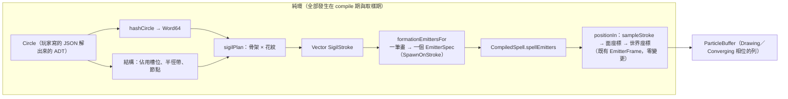

# Func-Spec 0016：符文陣（陣形幾何由魔法陣資料導出）

> 狀態：**已完成**（2026-08-15，驗收紀錄見 §9）
> 性質：一般 —— 交付後凍結 `hashCircle` 的摘要函數（見 §2 的「摘要即合約」）、`Magic.Sigil` 匯出面、`SpawnOnStroke` 的取樣律。
> 前置依賴：**spec 0015（需已完成）**——與 0015 同碰 `src/core/Magic/Compile.hs`（0015 改 fold 步驟 4 的 `Appearance`，本 spec 改步驟 5 的 `formationEmittersFor`），依 SKILL.md 規則 4 不得平行，**動工門檻＝0015 驗收**。**與 spec 0014 平行**（0014 觸 `tools/`／`app/Main.hs`／`Loop`／`Effects`／`HotReload`／`docs/spell-schema.md`／`BoundarySpec`，與本清單逐檔交集 = ∅，§0.2 附證明）。
> 依據：architecture §1.1（Circle as Data）、§1.2（特效即魔法）、§3.3（生命週期——「魔法陣本身的幾何就是繪製階段的粒子來源」）、§4.3（`hashChan` 的確定性隨機通道）、§11（破壞性變更的硬點表）；ADR-0003（槽位固定職責）、ADR-0007（核心零 IO）；spec 0006 §4.4（陣形導出的現況與其 `ShapeRune` 例外）、§9（陣形旋轉／動態陣形記帳）。摘要即合約與逐位元豁免屬架構級語意 → **本輪同步交付 ADR-0014**（先例：0007↔ADR-0010、0009↔ADR-0011、0012↔ADR-0012、0015↔ADR-0013）。
> 範圍：新核心模組 `Magic.Sigil`——`Circle` 的結構性摘要 `hashCircle`、由「結構定骨架＋摘要定花紋」導出的 `SigilPlan`、六種筆畫的閉式取樣；`SpawnPattern` 加 `SpawnOnStroke` 一個建構子把它接進既有取樣路徑。**`Magic.Codec` 零觸碰、schema 不升版、不加任何符文。**

---

## 0. 起點：引用的凍結介面、檔案盤點

### 0.1 引用的凍結介面

| 凍結物 | 本 spec 的用法 |
|---|---|
| `Circle`／`TwoOf`／`Core`／`Nodes`／`PhaseConfig` 全結構（0002／0006 凍結） | `hashCircle` 的**輸入**：對整棵 ADT 做結構 fold，含 `Expr` AST 的葉節點 |
| `Magic.Types.hashChan` 的 splitmix64 混合常數（0002；architecture §4.3） | `hashCircle` 沿用同一組常數與同一種混合形狀——專案只有一套雜湊算術，不引入第二套 |
| `V2`／`basisFromNormal`／面平面座標系（0002 §4.3） | 筆畫在**面座標**上定義；面 → 世界的映射完全走既有的 `EmitterFrame`（0010 S2），本 spec 不碰座標轉換 |
| `SpawnPattern`／`Motion`／`EmitterSpec`／`Envelope`（0002／0006 凍結） | 加**一個** `SpawnPattern` 建構子；`EmitterSpec` 的欄位與 `Motion` 的其餘欄位零變更 |
| `firstBirth env n i = envDelay + (i/n)·envLifetime`（0002 §4.2） | §2「索引序＝繪製序」的全部依據——不新增任何排程機制 |
| `formEnvFor`／`kcExprFor`／`formationAppearance`／節點座標表（0006 §4.3／§4.4） | 原樣沿用：本 spec 換的是**幾何**，不換時間包絡、收束曲線與外觀 |
| 0006 §4.4 的 `ShapeRune` 例外（外圈槽有 `ShapeRune` 時預覽玩家畫的形狀） | **保留**，寫成 `sigilPlan` 的一條顯式規則（§3） |
| `emitterBounds`／`shapeRadius` 的保守 AABB（0010 S7） | 新增 `strokeRadius` 作為 `SpawnOnStroke` 的同款保守上界；`emitterBounds` 的骨幹零變更 |
| `aliveRanges` 時間窗剔除（0010 S3） | 陣形發射器變多，這條剔除讓死窗發射器維持 `O(log n)`——本 spec 因此可以放心把筆畫拆成多個發射器 |
| 核心依賴白名單 `{base, vector, deepseq}`（0001） | `hashCircle` 的浮點取位元用 `GHC.Float.castFloatToWord32`／`castDoubleToWord64`（**base**）；`Data.Bits`（base）。**不新增依賴** |
| 0015 交付的 `Appearance.appShape`／`StyleRune`（其 §9 凍結面） | **唯讀取用**：陣形沿用 `formationAppearance` 的預設形狀；筆畫的視覺形態屬 0015 的詞彙，本 spec 不重做 |

### 0.2 檔案盤點（與 0014 的零交集證明、與 0015 的交集清單）

**新增**：`src/core/Magic/Sigil.hs`、`test/SigilHashSpec.hs`、`test/SigilStrokeSpec.hs`、`test/SigilPlanSpec.hs`、`test/SigilWiringSpec.hs`、`test/Acceptance16Spec.hs`、`assets/spells/lattice-seal.json`、`docs/adr/0014-sigil-from-circle-hash.md`。

**修改**：

| 檔案 | 變更 |
|---|---|
| `src/core/Magic/Compile.hs` | `SpawnPattern` 加 `SpawnOnStroke !SigilStroke`；`formationEmittersFor` 改由 `sigilPlan` 導出；`shapeRadius` 旁加 `SpawnOnStroke` 的界（`emitterBounds` 的 `spawnRadius`／`spreadRadius` 兩處 case）（S3／S4） |
| `src/core/Magic/Particle/Analytic.hs` | `positionIn` 的 `V2 sx sy` 與 `spreadDrift` 兩個 case 各補一支（S4） |
| `test/FormationSpec.hs` | 0006 的陣形斷言隨新幾何改寫（**本 spec 唯一動到別份 spec 既有測試的地方**，理由見 §2 末） |
| `test/PhaseSampleSpec.hs` | 同上：「陣形粒子落於環帶半徑範圍內」改為「落於 `strokeRadius` 界內」 |
| `particle-magic.cabal` | `magic-core` exposed-modules +1、test other-modules +5 |

**共用（行級聯集合併）**：`SKILL.md`（索引列）、`docs/roadmap.md`、`CHANGELOG.md`。

**明文不碰**：`src/boundary/*`（含 `Magic/Codec.hs`——**schema 不升版、不加符文**，這是「陣由資料導出」帶來的紅利）、`src/core/Magic/{Circle,Rune,Expr,Project,Types}.hs`、`src/core/Magic/Particle/{Buffer,Field}.hs`、`src/ffi/*`、`include/*`、`bindings/*`、`app/*`、`bench/*`、`examples/*`、`tools/*`（0014 的新目錄）、`docs/spell-schema.md`（0014 所有——見 §8-7）。

**與 0014 交集**：0014 觸 `tools/`（新）、`app/Main.hs`／`Loop`／`Effects`／`HotReload`、`docs/spell-schema.md`、`test/BoundarySpec.hs`、`test/{ValidateSpec,SchemaDocSpec,RescanSpec,Acceptance14Spec}.hs`（新）。與本清單逐檔比對：**交集 = ∅**（cabal／SKILL.md／CHANGELOG 同檔異行除外）。

**與 0015 交集（＝動工門檻的理由）**：`src/core/Magic/Compile.hs` 一檔（0015 動 `Appearance`／`elementAppearance`／fold 步驟 4，本 spec 動 `SpawnPattern`／`formationEmittersFor`／`shapeRadius`——同檔異函數，但依規則 4 仍不得平行）。

**待實作時盤點的下游漣漪**：0015 的 `test/BatchSplitSpec.hs`／`test/Acceptance15Spec.hs` 若對 `grand-sigil` 斷言了批次數或發射器數，陣形發射器數改變會波及（一行級）。

---

## 1. 目標與完成定義

**目標**：讓魔法陣是**這個魔法自己的**陣。

現況有兩個問題，第二個比第一個更根本：

1. 陣形只有六層同心環帶＋四個節點＋中心——「只有一個圈圈」。
2. `sampleShape`（`Analytic.hs:143`）對所有形狀都是**面積均勻亂數散佈**：環＝在圓環面積裡撒點。所以陣形不是「畫出來的線」，是霧。再多層的霧仍然是霧。

本輪把陣形改成**筆畫**——沿曲線等距前進的點——並讓筆畫的幾何參數由 `Circle` 這份資料導出。結果是：同一份 `Circle` 永遠畫出同一個符文陣，不同的 `Circle` 畫出看得出差異的陣。這是 architecture §1.1「Circle as Data」第一次變成**看得見**的東西：資料不只決定粒子怎麼飛，還決定陣長什麼樣。

**完成定義**：

1. `hashCircle :: Circle -> Word64` 是 `Circle` 全結構的摘要：決定論、對每個 ADT 葉節點敏感、`saveCircle`／`loadCircle` round-trip 後不變、生成語料庫內無碰撞（S1）。
2. `SigilPlan` 由**結構定骨架、摘要定花紋**導出（規則表見 §3）：層數與半徑帶來自佔用的槽位，對稱階以槽位數為中心由摘要在 `[3..9]` 內取值，筆畫種類與其參數來自摘要（S3）。
3. 六種筆畫 `ArcRing`／`Polygram`／`Spokes`／`Ticks`／`Rose`／`GlyphBand` 各有閉式取樣，`sampleStroke` 為 O(1)、無配置（S2）。
4. **索引序＝繪製序律**：對固定的臂，極角（或弧長參數）對 `i div sym` 嚴格單調 ⇒ 陣是被**畫出來**的，不是浮現出來的。這條律不需要任何新排程機制，它直接從 0002 的 `firstBirth` 得到（S2）。
5. **Casting 相位零影響律**：`circlePhases = Nothing` 的 8 個範例陣，`FrameOutput` 逐位元不變；有 `phases` 的兩陣，其 Casting 相位發射器逐位元不變。改變**只**發生在 Drawing／Converging 兩個相位（S4）。

   > ⚠ **修訂註記（2026-08-15，func-spec 0017／ADR-0015 D4）**：本條的後半段（「改變只發生在 Drawing／Converging」）已被撤銷——0017 讓陣形駐留到 `ppEnd`，Casting 期間陣與主效果並存。仍然成立的是**前半段與其精神**：無 `phases` 的 8 個範例完全不受影響，且施放發射器本身逐位元不變（陣只是與它並存，不與它交互）。逐位元邊界的當前定義見 ADR-0015 D4。
6. `Σ emCount`（陣形部分）恆 ≤ `sigilBudget = 1536`，且合併總預算仍受既有 `budgetCap` 檢查（S3／S4）。
7. 三個範例陣（`bare-sigil`、`grand-sigil`、新增的 `lattice-seal`）摘要兩兩相異，陣形點集可區分且各自穩定；手動 smoke 目視三個陣（S5）。
8. ADR-0014 交付：摘要即合約、逐位元豁免的精確範圍、被否決方案（S5）。

## 2. 使用到的架構與技巧

- **「索引序＝繪製序」是撿來的**：`firstBirth env n i = envDelay + (i/n)·envLifetime`——出生時間隨索引單調。現況的取樣把索引丟給 `hashChan`，所以點是隨機浮現；只要索引沿曲線單調前進，同一組時間包絡就會讓筆畫**自己被畫出來**。Drawing 這個相位的語意本來就是這個，0006 已經把時間軸鋪好了，本輪只是不再把它浪費掉。**零新機制，純粹是取樣函數的改變。**
- **對稱臂＝索引的另一個維度**：`arm = i mod sym`、`j = i div sym`。n 支臂於是**同時**被畫出來，而每支臂各自沿曲線單調前進。這比「畫完一支再畫下一支」好看得多，而且同樣是零成本——只是索引的兩個投影。
- **一筆畫一個發射器**：`SigilPlan` 的每個 `SigilStroke` 編成一個 `EmitterSpec`。這樣預算是逐筆結算的（0010 的 `ParticleBudget` 自動涵蓋）、時間窗剔除逐筆生效（0010 的 `aliveRanges`）、0015 的分批逐筆分組——**不需要在 `sampleStroke` 內做前綴和或分派**，取樣維持 O(1)。代價是發射器數從 ~11 增至 ~20，而 0010 §9.2 量到的 per-emitter 成本是每幀一次基底提升，可忽略。
- **摘要即合約**：`hashCircle` 一旦交付就凍結。玩家會以外觀辨識法術（這正是本 spec 的目的），所以改摘要函數＝**靜默改變每一個法術的長相**——與 architecture §11 的「`Expr` 的破壞性變更」同一級別的破壞。ADR-0014 記錄此裁決並要求併入 §11 的硬點表。實作上這意味著：浮點必須以**位元**（`castFloatToWord32`）而非十進位近似進入摘要，否則同一份 JSON 在不同平台可能算出不同的陣。
- **混合導出：骨架看結構、花紋看摘要**（使用者裁決）。全 hash 的作法變化最大、實作最簡單，但陣的外觀與魔法內容失去可讀的對應關係，且改一個小參數整個陣就面目全非。混合則讓「這個陣有五圈是因為它佔了五個槽」這件事看得出來，而每個法術的細節仍然獨一無二。ADR-0014 記錄兩案。
- **`GlyphBand` 的位元遮罩**：3×3 點陣上的候選線段恰好 12 條（3 列 × 2 段水平 ＋ 3 行 × 2 段垂直），一個 `Word16` 的低 12 位就是一個字。取樣時 `seg = j mod popCount mask` 選段、`j div popCount` 沿段等距前進。這是「看起來像真的魔法陣」最大的單筆貢獻——幾何圖形不管多複雜，沒有「字」就不像陣——而它的實作量只比 `Polygram` 多一點。**明確地說：這些字不表義**（§8-1）。
- **抖動不是雜訊，是呼吸**：`skJitter`（預設 0.015）以 `hashChan` 在筆畫的法向加一點位移。沒有它，線會像印刷向量圖；有它，線會呼吸。`skJitter = 0` 時取樣逐位元可重現（S2 的測試條件）。
- **為什麼一定要改 0006 的兩個測試**：`FormationSpec` 斷言「佔用槽位 ↔ 發射器清單雙射」與節點座標表、`PhaseSampleSpec` 斷言「陣形粒子落於環帶半徑範圍內」。新幾何讓前者的對應關係改變（一個槽位可能對應多筆畫）、後者的界從「環帶」變成 `strokeRadius`。這**不是**測試債，是被測語意的蓄意改變；兩個檔案在 §0.2 明列，且改寫後的斷言必須維持同等強度（雙射改為「佔用槽位 ↔ 筆畫群」的對應表、半徑界改為 `strokeRadius` 的 property）。

## 3. ADT

```haskell
-- src/core/Magic/Sigil.hs（新；交付後凍結）

-- | Circle 全結構的摘要。浮點取位元，不取十進位近似（§2 摘要即合約）。
hashCircle :: Circle -> Word64

data SigilPlan = SigilPlan
  { spSymmetry :: !Int                  -- 全陣的對稱階（3..9）
  , spStrokes  :: !(V.Vector SigilStroke)
  }

data SigilStroke = SigilStroke
  { skKind     :: !StrokeKind
  , skRadius   :: !Float   -- 面座標上的基準半徑
  , skSymmetry :: !Int     -- 這一筆的重複臂數（1 = 不重複）
  , skPhase    :: !Float   -- 起始相位（弧度）
  , skJitter   :: !Float   -- 法向抖動幅度（0 = 逐位元可重現）
  , skCount    :: !Int     -- 粒子數（預算的結算單位）
  }
  deriving (Eq, Show)

data StrokeKind
  = ArcRing   !Float       -- 弧環：sweep 比例（1 = 完整圓）
  | Polygram  !Int !Int    -- 星形多邊形 {n/k}：n 頂點、每次跳 k
  | Spokes    !Float       -- 輻條：由 skRadius−len 到 skRadius 的徑向線段
  | Ticks     !Float       -- 環上短切線刻度：長度
  | Rose      !Int         -- 玫瑰線 r = skRadius·|cos(k·θ)|
  | GlyphBand !Word16      -- 3×3 點陣 12 條候選線段的位元遮罩
  deriving (Eq, Show)

sigilPlan    :: Circle -> SigilPlan
sampleStroke :: SigilStroke -> Int -> V2    -- stroke, 索引 → 面座標
strokeRadius :: SigilStroke -> Float        -- emitterBounds 用的保守上界
sigilBudget  :: Int                          -- 1536

-- src/core/Magic/Compile.hs（加法：一個建構子）
data SpawnPattern
  = SpawnAtAnchor !Float
  | SpawnOnShape  !FaceShape
  | SpawnOnStroke !SigilStroke     -- 新
```

**取樣的骨幹**（所有 kind 共用，`sampleStroke sk i`）：

```
sym  = max 1 (skSymmetry sk)
arm  = i `mod` sym                       -- 哪一支對稱臂
j    = i `div` sym                       -- 沿這支臂的第幾點
m    = max 1 (skCount sk `div` sym)      -- 每支臂的點數
s    = fromIntegral j / fromIntegral (max 1 (m - 1))   -- 0..1 的曲線參數
base = skPhase sk + 2*pi * fromIntegral arm / fromIntegral sym
```

`s` 對 `j` 嚴格單調 ⇒ §1-4 的「索引序＝繪製序律」對每一種 kind 都是結構性成立的。各 kind 只需給出 `(base, s) -> V2`，然後加上 `skJitter · (hashChan − 0.5)` 的法向抖動。

**參數導出規則（混合；`sigilPlan` 的全部內容）**：

| 決定 | 來源 | 規則 |
|---|---|---|
| 邊界環 | **結構** | 無條件存在（沿用 0006 的判斷：「陣」永遠有輪廓，即使全空的 `Circle`），半徑 1.45–1.55 帶 |
| 層數與半徑帶 | **結構** | 沿用 0006 的分配 1.25／1.10／0.95／0.80／0.65，佔用的槽位才有層 |
| 對稱階 `spSymmetry` | **結構偏置＋摘要** | 以佔用槽位數為中心，摘要在 `[3..9]` 內取值 |
| 各層的 `StrokeKind` | **摘要** | 由該層對應的摘要位元選一種；外圈槽有 `ShapeRune` 時**改以玩家畫的形狀為該層幾何**（保留 0006 §4.4 例外） |
| `skPhase`／`sweep`／刻度數／玫瑰瓣數／`{n/k}` 的 k／`GlyphBand` 遮罩 | **摘要** | 各取摘要的一段位元 |
| 節點（上下左右）與中心 | **結構** | 沿用 0006 的座標表與粒子數 |
| `skCount` | **結構＋裁切** | 依 kind 給基準值，總量超過 `sigilBudget` 時**等比裁切**（見 §4） |

## 4. 資料結構與儲存方式

- `SigilPlan` 是 `compile` 期的**中間值**：`formationEmittersFor` 消費它產出 `EmitterSpec` 清單後即丟棄，**不進 `CompiledSpell`**。`SigilStroke` 本身（一筆的參數）隨 `SpawnOnStroke` 進入 `Motion`——它是小的不可變值（6 個欄位、全 strict、無指標追蹤），與 `FaceShape` 同性質。
- **無新的跨幀狀態**：系統唯一的跨幀狀態仍是 0007 的 `FieldState`。
- 預算裁切：`sigilPlan` 先給每筆基準 `skCount`，總和超過 `sigilBudget` 時對所有筆畫**等比縮放並向下取整**（保序、決定論），確保 §1-6 的不等式恆成立而不是靠測試碰運氣。裁切後為 0 的筆畫直接移除。
- `sigilBudget = 1536`：現況陣形上限 480，`budgetCap` 為 4096（0012 之後會更大）。1536 讓陣形有足夠密度畫出六層＋符文帶，同時給 Casting 相位留下 2560。0012 抬高上限後的重新配額列為非目標（§8-6）。

## 5. 資料流（pipeline）



## 6. 搭建方式（風險優先）

1. **S1 `hashCircle`**——所有東西的輸入，且它是本輪唯一「交付即凍結、以後不能改」的東西（§2 摘要即合約）。先做、先釘哨兵值。
2. **S2 筆畫詞彙**——視覺成敗全在這裡；六種 kind 各自獨立可測，做完就能用 headless 測試把點集印出來檢查形狀。
3. **S3 `sigilPlan`**——把 1 與 2 接起來的導出規則＋預算裁切。
4. **S4 接線**——`SpawnOnStroke` 入 `SpawnPattern`、`formationEmittersFor` 改寫、`positionIn` 兩個 case、界的補案；同步改寫 0006 的兩個測試。
5. **S5 端到端＋新範例陣＋ADR-0014**（與 S3 同步起草、S5 定稿）＋手動 smoke。

## 7. Todo List 與 1-to-1 測試對應

| # | Todo | 測試 |
|---|---|---|
| S1 ✅ | `hashCircle`（結構 fold、浮點取位元、splitmix64 混合） | `test/SigilHashSpec.hs`（決定論；`saveCircle`→`loadCircle` round-trip 後不變；QuickCheck 生成語料庫內 `c1 /= c2 ⇒ digest 相異`（無碰撞）；每個 ADT 葉節點各一條「改這裡 digest 就變」的見證（含 `Expr` 內部的 `Lit`）；`emptyCircle` 的 digest **哨兵值——凍結**） |
| S2 ✅ | 六種 `StrokeKind`＋`sampleStroke`＋`strokeRadius` | `test/SigilStrokeSpec.hs`（**索引序＝繪製序律**：固定臂上曲線參數對 `i div sym` 嚴格單調（property，全 kind）；n 支臂等分且旋轉對稱到 1e-5；`|p| ≤ strokeRadius` 恆成立（property，全 kind）；`Polygram {n/k}` 的頂點集 ≡ 正 n 邊形頂點集；`GlyphBand` 覆蓋的線段數 ≡ `popCount mask`；`skJitter = 0` 時逐位元可重現；全分量有限值） |
| S3 ✅ | `sigilPlan` 導出規則＋`sigilBudget` 等比裁切 | `test/SigilPlanSpec.hs`（決定論；佔用槽位數 ↔ 層數的對應表；`spSymmetry ∈ [3..9]`；`Σ skCount ≤ sigilBudget` 恆成立（property，含裁切邊界）；外圈 `ShapeRune` 例外保留（見證）；`emptyCircle` 仍有邊界環；三個範例陣的 plan 兩兩可區分） |
| S4 ✅ | `SpawnOnStroke` 入 `SpawnPattern`；`formationEmittersFor` 改用 plan；`positionIn` 兩 case；`emitterBounds` 補案；改寫 `FormationSpec`／`PhaseSampleSpec` | `test/SigilWiringSpec.hs`（**Casting 相位零影響律**：8 個無 `phases` 的範例陣 `FrameOutput` 逐位元不變；兩個有 `phases` 的陣其 Casting 發射器逐位元不變；陣形粒子恆落在 `emitterBounds` 內；`bufferInvariant`；`spellBudget = Σ emCount`；超額仍回 `BudgetExceeded`） |
| S5 ✅ | 端到端驗收＋`assets/spells/lattice-seal.json`＋ADR-0014 | `test/Acceptance16Spec.hs`（三陣摘要兩兩相異；陣形點集可區分且各自跨執行穩定；240 幀決定論；`isFinished` 於 `ppEnd` 翻轉不變）＋**手動 smoke**（開窗目視三個陣的 Drawing→Converging→Casting 全弧線，截圖描述入 §9） |

## 8. 非目標

1. **符文文字的語意**——`GlyphBand` 產生的是位元遮罩選出的線段，**不表義**、不是字型、不對應任何字母表。真正的符文語言（字符集、拼寫規則、字義影響魔法）是遊戲層的設計，不是本 spec 的。
2. **玩家對 sigil 的直接控制**——陣是**導出**的指紋，不是作者資料。開放直接控制會讓「陣＝魔法的外觀」這條對應關係失效，且需要 schema 升版。ADR-0014 記錄裁決。
3. **陣形旋轉／動態陣形動畫**（整個陣隨時間轉、層與層反向轉）——0006 §9 既有記帳，屬時間維度的擴充；本輪只做靜態幾何。這大概是下一輪最划算的一項：`skPhase` 已經在資料裡，加時間項即可。
4. **3D 立體陣**（多層平面沿法線堆疊、立體符文）——architecture §3.3 的「沿法線擴充立體」目前屬 Casting 相位；陣形保持單一平面。
5. **陣形的專屬顏色語彙**——沿用 0006 的 `formationAppearance`；筆畫的視覺形態（軟光點／環／火花）屬 0015 的 `StyleRune` 詞彙，本 spec 不重做。
6. **`sigilBudget` 隨 0012 抬高上限後的重新配額**——0012 把 `budgetCap` 抬到量測值之後，1536 這個數字值得重看；記帳於此，不在本輪動。
7. **`docs/spell-schema.md` 的說明段落**——該檔由 spec 0014 所有。本 spec **不加任何 JSON 鍵**，所以不觸發 0014 `SchemaDocSpec` 的鍵名守護；但「陣形長相由陣的內容決定」這件事值得在作者文件裡寫一句，列為整合輪的一行級補充。

## 9. 驗收紀錄

**日期**：2026-08-15。**測試**：`cabal test` → **1123 examples, 0 failures**（GHC 9.14.1 / cabal 3.16.1.0，Windows）。

### 9.1 五個 Todo 的測試結果

| # | 測試模組 | 結果 |
|---|---|---|
| S1 | `test/SigilHashSpec.hs` | 綠。決定論、shipped 12 個範例的 save/load round-trip 摘要不變、21 條「改這個葉節點摘要就變」見證（含 `Expr` 內部 `Lit`／`Chan`／形狀）、24 個生成陣的無碰撞 property、`emptyCircle` 哨兵 |
| S2 | `test/SigilStrokeSpec.hs` | 綠。索引律（全 kind × 對稱階 1–9 × 每支臂嚴格遞增）、臂間旋轉對稱到 1e-5、`|p| ≤ strokeRadius` property、`Polygram {n/k}` 頂點集 ≡ 正 n 邊形（含 gcd≠1 的退化）、`GlyphBand` 覆蓋線段數 ≡ `popCount`、`skJitter = 0` 逐位元可重現 |
| S3 | `test/SigilPlanSpec.hs` | 綠。決定論、佔用槽位數 ↔ 層數對應表（k 個槽 → 2 筆邊界＋k 層）、半徑帶沿用 0006、`spSymmetry ∈ [3..9]` 且以佔用數為中心 ±1、`Σ count ≤ sigilBudget` property、`ShapeRune` 例外見證、三個範例陣 plan 兩兩相異 |
| S4 | `test/SigilWiringSpec.hs` | 綠。Casting 零影響律、plan → 發射器逐筆對應、預算 Σ 與 `ParticleBudget` 對齊、`BudgetExceeded` 仍生效、陣形粒子恆落在 `emitterBounds` 內、buffer 不變式與決定論 |
| S5 | `test/Acceptance16Spec.hs` | 綠。三陣摘要兩兩相異、陣形點集可區分且跨執行穩定、240 幀決定論、`isFinished` 於 `ppEnd` 翻轉、Drawing 期粒子數隨時間成長（＝陣是被畫出來的） |

**`emptyCircle` 的 digest 哨兵值（凍結）**：`11072995449257717738`。

### 9.2 手動 smoke（開窗目視，2026-08-15）

demo 以 `aaa-` 前綴法逐一載入三個陣，Tab→2D、V→top 俯視、滾輪放大，逐幀截圖後讀 HUD 的 `age` 對照相位。三張代表性畫面：

- **`bare-sigil`**（HUD `age 0.33s`，132 粒）：一條**畫到約三分之二的開口弧**——陣正在被畫，還沒接合。同一次施放 `age 0.85s`（232 粒）時圓環已閉合，外加 4–5 個刻度短線。這正是「索引序＝繪製序」律在畫面上的樣子：0006 時期同一個陣是一團在圓環面積裡的霧，不會有「畫到一半」這個狀態。
- **`grand-sigil`**（`age 1.28s`，1163 粒）：火色多層陣——最外側點狀邊界環、其外圈刻度、一圈明亮密實的環、以及內側一個**看得出直邊的多邊形輪廓**（`Polygram`），中心附近是四個節點與中心點。
- **`lattice-seal`**（`age 1.22s`，1166 粒）：與 grand-sigil 明顯不同的另一個陣——點狀邊界環、帶輻條刻度的內環（約 8 階對稱）、環帶上一圈**直角折線紋樣**（`GlyphBand` 的點陣線段）、中央一組**花瓣狀曲線**（`Rose`）。同一陣在 `age 2.00s`（Converging）可見整個圖形正往中軸收攏。

三個陣以肉眼一望即可區分，且各自穩定——§1-7 的目視條件成立。

### 9.3 凍結清單（下游 spec 可引用）

- `hashCircle :: Circle -> Word64` **全函數**（ADR-0014 D3；已併入 architecture §11 硬點表）。含其邊界：`circleFields` **不在**摘要內（D4）。
- `Magic.Sigil` 匯出面：`hashCircle`、`SigilPlan(..)`、`SigilStroke(..)`、`StrokeKind(..)`、`sigilPlan`、`sigilBudget`、`sampleStroke`、`strokeParam`、`strokeRadius`。
- `sampleStroke` 的索引律（`arm = i mod sym`、`j = i div sym`、`s` 對 `j` 嚴格遞增）與六種 kind 的閉式定義。
- `Magic.Compile.SpawnPattern` 的 `SpawnOnStroke` 建構子。
- 逐位元豁免的邊界（ADR-0014 D5）：只涵蓋有 `phases` 的法術在 `t < castStart` 的畫面。

### 9.4 實作備註（與設計文件的偏差）

1. **`circleFields` 不進摘要**（§0.1 的「對整棵 ADT 做結構 fold」在此收窄）。設計時未察覺：把力場折進摘要會讓「掛一個重力井就靜默重畫整個陣」，直接違反 spec 0007 交付的 ADR-0010 D9（力場不改變解釋器其他產物）——實作時由 `CompileFieldSpec` 兩條既有 property 當場抓到。裁決記於 ADR-0014 D4，`SigilHashSpec` 改以「力場**不**影響摘要」的正面斷言守住。
2. **`SigilPlan` 多一個欄位 `spShapes`**（§3 的 ADT 只有 `spSymmetry`／`spStrokes`）。0006 §4.4 的 `ShapeRune` 例外必須被 plan 自己表達，否則規則會被切成「plan 一半、`Compile` 一半」。`spShapes :: V.Vector (FaceShape, Int)` 承載這些預覽，發射器順序為「筆畫群 → 形狀預覽 → 節點 → 中心」。
3. **多一個匯出 `strokeParam`**（§3 未列）。「索引序＝繪製序」律需要一個可觀測的曲線參數才測得動；它同時是骨幹的一部分，一併凍結（§9.3）。
4. **`sigilBudget` 涵蓋 plan，不涵蓋節點與中心**。§1-6 寫「`Σ emCount`（陣形部分）≤ 1536」；實作把裁切定義在 plan（筆畫＋形狀預覽）上，節點 4×12 與中心 16（沿用 0006 的結構常數，共 ≤ 64 粒）在其外，故陣形總量上界為 `sigilBudget + 64`。S3 測的是 §7 表格寫的 `Σ skCount ≤ sigilBudget`，S4 另測 `≤ sigilBudget + 64`。
5. **多一個測試輔助模組 `test/SigilGen.hs`**（§0.2 預期 test other-modules +5，實為 +6）。三份 property spec 共用同一個 `Circle` 生成器，比複製三份誠實；先例是 `ExprGen`。
6. **重錄了兩個 golden 與兩個摘要**（§0.2 未列這四處）：`test/golden/perf-0010/{bare,grand}-sigil.txt` 與 `test/FieldPlumbingSpec.hs` 的兩個 pre-0007 digest。這是 §1-5 豁免的必然代價；實測差異範圍與豁免邊界完全吻合——`bare-sigil` 差異落在幀 0–89（castStart = 1.5 s ＝幀 90），`grand-sigil` 落在幀 0–106（castStart = 1.8 s ＝幀 107），此後逐位元相同。豁免的邊界另由 `SigilWiringSpec` 的結構性斷言守住，不靠重錄後的數字自證。
7. **動到 0014 的兩個計數與 `docs/spell-schema.md`**（§0.2 明文列為不碰）。新增 `lattice-seal.json` 使 shipped 範例由 11 增至 12，`ValidateSpec`／`SchemaDocSpec` 的計數與「每個範例都被文件提及」的守護因此各需一行級更新；順帶把 §8-7 記帳的那句「陣長什麼樣由陣的內容決定」補進作者文件（不含任何新 JSON 鍵，故未觸發鍵名守護）。
8. **`Polygram` 的 `k` 正規化**：`gcd n k /= 1`（含 `k = 0`）時退回 `k = 1`，使「頂點集 ≡ 正 n 邊形頂點集」對任何 `(n, k)` 無條件成立，取樣函數保持全域可用。
