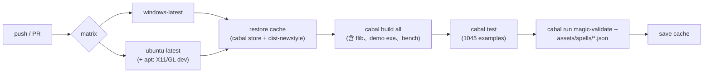

# Func-Spec 0019：工程化（CI、發布流程、跨平台實測）

> 狀態：**設計定案，待實作**
> 性質：一般 —— 交付後凍結的是**政策**而非型別：支援平台分級、版本語意、tag 格式（同輪 ADR-0016）。程式碼面只加 CI 設定與文件。
> 前置依賴：**無**。**與所有進行中的 spec 平行**：本 spec 觸 `.github/`（新目錄）、`README.md`、`docs/release.md`（新）、cabal 的 `version:`／`tested-with:` 兩行——與 0016（`src/core`）、0018（`src/ffi`＋`include`＋`bindings`）逐檔交集 = ∅（§0.2）。
> 依據：[roadmap.md](../roadmap.md) §3.5（「CI——未記帳」「release tag／版本發布流程——未記帳」「只有 win64 實測過」三條）；0014 §9（`magic-validate` 的 exit code＝失敗檔數，「資產檢查已可一行進 CI」）；[ADR-0011](../adr/0011-ffi-c-abi-boundary.md) **D8**（決定論「在每個平台上」都成立——本 spec 是這句話第一次被實際檢驗）；ADR-0005（JSON 可攜性）。政策屬架構級決定 → **本輪同步交付 ADR-0016**（先例：0007↔ADR-0010、0009↔ADR-0011、0012↔ADR-0012、0015↔ADR-0013）。
> 範圍：把「全靠本機 `cabal test`」變成「每次 push 都有機器驗證，而且驗兩個平台」。三件事：CI 工作流、發布與相容性政策（含 ADR）、**Linux 上的第一次實測**——後者同時是 ADR-0011 D8 跨平台決定論宣稱的第一個真實測試。

---

## 0. 起點

### 0.1 引用的既有事實

| 事實 | 出處 | 本 spec 的用法 |
|---|---|---|
| `cabal build all` 綠（含 demo exe、`magic-validate`、bench、foreign-library） | roadmap §1 | CI 的第一道 job |
| `cabal test` 1045 examples / 0 failures | 0015 §9 | CI 的第二道 job；**這個數字在 Linux 上是否相同，是本 spec 要回答的問題** |
| `magic-validate` 的 exit code ＝ 失敗檔數 | 0014 §9.3 凍結 | CI 的第三道 job，一行：`cabal run magic-validate -- assets/spells/*.json` |
| GHC 9.14.1 / cabal 3.16.1.0 / Windows 11 x86_64 | 全部既有 spec 的 §9 環境紀錄 | CI 的基準環境；`tested-with:` 要寫的值 |
| h-raylib 內含 raylib C 原始碼，首次建置需 C 工具鏈 | architecture §9.1、CLAUDE.md | **CI 上最大的成本與風險**（§2 的快取策略、§8-4 的退場方案） |
| 決定論「在每個平台上」逐位元成立 | ADR-0011 D8、header 檔頭 | §2 的頭號風險：這句話目前**只在 win64 上被驗證過** |
| golden 鎖定（`ExprGoldenSpec`／`PerfGoldenSpec`／240 幀範例陣 golden） | 0010／0012／0015 | 跨平台一致性的實際載體——它們紅了就代表 D8 的宣稱要修 |

### 0.2 檔案盤點（與 0018／0020 的三方零交集證明）

**新增（6）**：`.github/workflows/ci.yml`、`docs/release.md`、`docs/adr/0016-release-compatibility-policy.md`、`test/CIWorkflowSpec.hs`、`test/ReleaseMetaSpec.hs`、`test/ReleaseDocSpec.hs`。

**修改（3）**：

| 檔案 | 變更 |
|---|---|
| `particle-magic.cabal` | `version:` 行的政策化（§3.2）、新增 `tested-with:` 行、test-suite `other-modules` +3 行 |
| `README.md` | +「Building and CI」與「Releases」兩節（含支援平台分級表） |
| `CHANGELOG.md` | 補 0016／0018／0019 條目的格式規則說明（`docs/release.md` 是規則的所在地） |

**共用（行級聯集合併）**：`SKILL.md`（索引 +0019 列）、`docs/roadmap.md`。

**明文不碰**：`src/*` 全部、`app/*`、`tools/*`、`bench/*`、`include/*`、`cbits/*`、`bindings/*`、`examples/*`、`assets/*`、既有測試模組。

**三方交集**：0020 觸 `src/core/Magic/{Sigil,Particle/Analytic}.hs`＋四個 sigil 測試模組＋兩個 golden；0018 觸 `src/ffi`＋`include`＋`.def`＋`bindings`＋`examples`＋三個 FFI 測試模組。與本清單逐檔比對：**交集 = ∅**（cabal 為同檔異行）。

---

## 1. 目標與完成定義

**目標**：讓「這個 commit 是好的」這件事不再依賴某一台 Windows 機器上的某一次手動 `cabal test`，並且第一次在 win64 之外的平台上把整套跑起來。

**完成定義**（全部可驗證）：

1. `.github/workflows/ci.yml` 在 push 與 PR 上執行 **build → test → validate** 三步，平台矩陣含 `windows-latest` 與 `ubuntu-latest`（S1）。
2. `test/CIWorkflowSpec.hs` 剖析該 yml，斷言三個指令都在、矩陣涵蓋兩個 OS、且 CI 用的 GHC 版本 ≡ cabal `tested-with:` 宣告的版本——**設定檔與宣稱不得漂移**（S1）。
3. **Linux 上 `cabal build all` 與 `cabal test` 全綠**，且 examples 數與 win64 相同（S2，手動 smoke ＋ 之後由 CI 持續守護）。若不綠，§8-1 的裁決路徑生效。
4. `docs/release.md` 定義：tag 格式、版本號語意、CHANGELOG 規則、發布前檢查清單、支援平台分級（S3／S4）。
5. `test/ReleaseMetaSpec.hs` 斷言：cabal `version:` 在 CHANGELOG 中有對應段落、`tested-with:` 非空、支援平台清單 ≡ CI 矩陣、所有 `build-depends` 帶 PVP 上界（`^>=`）（S3）。
6. **ADR-0016** 記錄政策決定與被否決的方案（S4）。
7. `PM_ABI_VERSION` 與套件版本的關係在 ADR 與 `docs/release.md` 中寫死：**兩者獨立遞增**，套件版本的 major bump 不自動代表 ABI 世代 bump（S4）。

## 2. 使用到的架構與技巧

- **文字合約守護第五、六次使用**：`BoundarySpec` 讀 cabal、`FFIContractSpec` 讀 header／`.def`／`.c`、`BindingContractSpec` 讀 `.cs`、`SchemaDocSpec` 讀 `.md`——本輪讀 `.yml` 與 cabal metadata。同一個手法：**設定檔是合約，合約要有測試**。CI 設定漂移（例如有人把 `magic-validate` 那步註解掉）在 `cabal test` 就炸，而不是等到某個資產壞掉才發現。
- **CI 的三步排序＝成本遞增**：`build all`（最貴，含 h-raylib 的 C 編譯）→ `test`（1045 examples）→ `validate`（毫秒）。但**失敗機率遞減**，所以順序是「先付最貴的、也最可能壞的」——這是對的，因為 build 壞了後兩步無意義。
- **快取是可行性的關鍵**：h-raylib 每次從頭編 raylib 的 C 原始碼會讓每次 CI 十幾分鐘起跳。以 `~/.cabal/store`（或 `~/.local/state/cabal`）＋`dist-newstyle` 為 key，key 取 `cabal.project` ＋ `.cabal` 的雜湊＋OS＋GHC 版本。冷快取慢、熱快取快，這是可接受的形狀。
- **demo exe 只 build 不 run**：raylib 要開視窗，CI 沒有。這不是缺口——`app/*` 的邏輯半場早已由 `EffectsSpec`／`TestInterp` 的 headless 解譯器覆蓋（0005 起的既定設計），CI 需要證明的只是「它編得起來」。
- **`magic-validate` 是 0014 為此刻鋪的路**：一個開不了視窗也畫不了東西的 boundary 消費者，exit code ＝ 失敗檔數。資產退化（有人手改 JSON 改壞）從此在 CI 被抓。
- **Linux 的系統相依**：h-raylib 在 Linux 需要 X11／GL 的 dev 套件（`libx11-dev libxrandr-dev libxinerama-dev libxcursor-dev libxi-dev libgl1-mesa-dev`）。這些只是**編譯期**需要——CI 不執行任何開視窗的東西。
- **Windows 的 `.def`、Linux 的無 `.def`**：foreign-library 的 `mod-def-file` 在 `if os(windows)` 之內，所以 Linux job 走的是**另一條連結路徑**（`.so`，靠 GHC 預設匯出）。這正是跨平台 job 的價值之一：0009 以來從沒人驗過那一半。`FFIContractSpec` 對 `.def` 的文字檢查與平台無關，照跑。

### 2.1 頭號風險：跨平台逐位元決定論

ADR-0011 D8 與 `include/particle_magic.h` 的檔頭都寫著決定論「**on every platform**」成立。這句話目前**只在 win64 上被驗證過**，而本專案有大量逐位元 golden（`ExprGoldenSpec`、範例陣 240 幀 golden、`Acceptance9/11` 的等價律）。

具體的危險點：解析取樣的熱路徑用 `sin`／`cos`／`sqrt`／`pow`。IEEE-754 保證 `sqrt` 正確捨入，**但不保證 `sin`／`cos`／`pow`**——不同 libm（msvcrt／mingw 的 vs glibc 的）在最後一個 ulp 上可以合法地不同。若真的不同，Linux job 會在 golden 測試上紅，而那**不是 CI 設定的 bug，是 D8 那句話太強**。

三條裁決路徑（S2 實測後擇一，寫進 ADR-0016）：

| 若 | 則 |
|---|---|
| 全綠 | D8 的宣稱從「宣稱」升級為「兩平台實測」。ADR-0016 記錄實測範圍與其界線（兩個平台不等於所有平台） |
| 只有 golden 紅、差異在最後 1–2 ulp | **D8 需要修訂**：決定論的範圍限縮為「同一平台上、同一組浮點函式庫」；golden 改為跨平台跑 ULP 容差版、win64 上維持逐位元。這是誠實的收窄，不是退讓——記進 ADR-0016 並回頭修 ADR-0011 D8 與 header 檔頭那句話 |
| 差異大於 ulp 級（結構性不同） | 停下來查根因，不是調容差。這代表某處有未定義行為或平台相依的假設 |

**這一條是本 spec 真正的產出。** CI 設定本身是幾十行 yaml；「我們宣稱的決定論到底有多真」才是它換來的東西。

## 3. 政策（ADR-0016 的內容摘要）

### 3.1 支援平台分級

| 級別 | 意義 | 本輪的成員 |
|---|---|---|
| **Tier 1** | CI 每次 push 驗證 build＋test＋validate；回歸視為缺陷 | `windows-latest` (x86_64)、`ubuntu-latest` (x86_64) |
| **Tier 2** | 預期可用但無 CI；壞了修，但不擋發布 | macOS、其他 Linux 發行版 |
| **未支援** | 沒有人試過 | ARM、WASM、行動平台 |

分級**必須**與 CI 矩陣一致，由 `ReleaseMetaSpec` 機械守護（README 的表 ≡ yml 的 matrix）。

### 3.2 版本與相容性

- **套件版本**（cabal `version:`）遵循 PVP。`magic-core`／`magic-boundary` 是 `visibility: public` 的公開 sublibrary，外部專案會 `build-depends` 它們——所以凍結介面的破壞性變更 ⇒ major bump。
- **`PM_ABI_VERSION` 與套件版本獨立遞增**。理由：header 是 add-only（ADR-0011 D7），加宣告不動 ABI 世代；而 Haskell 面的破壞性變更完全可能不碰 C 面（反之亦然）。把兩者綁在一起會逼出假的 bump。**世代只在 header 出現非加法變更時才 +1**，那也正是 add-only 規則被打破的時刻。
- **所有 `build-depends` 帶 `^>=` 上界**（現況已如此，本輪把它變成有測試的規則）。
- **`tested-with:` 宣告實測過的 GHC**，且必須 ≡ CI 用的版本。

### 3.3 發布流程（`docs/release.md`）

1. `CHANGELOG.md` 補本版段落（一份 func-spec 一行，現有格式）。
2. cabal `version:` bump（依 §3.2 的規則決定哪一位）。
3. CI 兩平台全綠。
4. `git tag v<version>`、push tag。
5. tag 格式 `v0.1.0.0`（四段，與 cabal 版本一字相同）。

**明文不做**：上傳 Hackage、自動發布（§8-3）。tag 是目前唯一的發布動作——它讓 `source-repository-package` 的使用者有東西可以釘。

## 4. 資料流（pipeline）

CI 全程無 IO 以外的新語意——它只是把開發者本機的三個指令搬到機器上跑。

## 5. 搭建方式（風險優先）

1. **S2 先做**（順序上例外，因為它是唯一可能推翻設計的一步）：在 Linux 上手動把 `cabal build all` ＋ `cabal test` 跑完，看 §2.1 的三條路走哪一條。這一步的結果決定 ADR-0016 要不要修訂 ADR-0011 D8。
2. **S1 CI 工作流＋守護測試**——把 S2 手動做過的事變成每次 push 都做。
3. **S3 版本 metadata＋守護測試**——`tested-with:`、PVP 上界、CHANGELOG 對應。
4. **S4 `docs/release.md` ＋ ADR-0016 ＋ README 兩節**——政策落文，含 S2 的實測結論。

## 6. Todo List 與 1-to-1 測試對應

| # | Todo | 測試 |
|---|---|---|
| S1 | `.github/workflows/ci.yml`：push／PR 觸發、`{windows-latest, ubuntu-latest}` 矩陣、Linux 的 apt 系統相依、cabal store＋dist-newstyle 快取、build → test → validate 三步 | `test/CIWorkflowSpec.hs`（剖析 yml：三個指令字串都在、矩陣含兩個 OS、CI 的 GHC 版本 ≡ cabal `tested-with:`、`magic-validate` 那步存在且吃 `assets/spells`） |
| S2 | Linux（ubuntu-latest）上 `cabal build all` ＋ `cabal test` ＋ `magic-validate` 實測；依 §2.1 三條路擇一並回填 §9 | **手動 smoke**（第一次由人在 Linux 上跑；此後由 S1 的 CI 持續守護）。回填內容：examples 數、與 win64 的差異、golden 是否逐位元相同、若不同則 ulp 級距 |
| S3 | cabal `tested-with:` 行、`version:` 政策化、PVP 上界檢查、CHANGELOG 對應段落 | `test/ReleaseMetaSpec.hs`（`version:` 在 CHANGELOG 有對應段落標題、`tested-with:` 非空且格式合法且 ≡ CI 用的 GHC、**每個 `build-depends` 條目帶 `^>=` 上界**（全 stanza 掃描，這是 §3.2 政策的機械化）） |
| S4 | `docs/release.md`（tag 格式、版本語意、發布檢查清單、平台分級表）＋`docs/adr/0016-release-compatibility-policy.md`＋README 兩節 | `test/ReleaseDocSpec.hs`（**三向一致**：`docs/release.md` 的平台分級表 ≡ README 的平台表 ≡ CI 矩陣的 OS 清單（雙向集合相等）；tag 格式規則存在且**依該規則由 cabal `version:` 導出的 tag 字串**出現在 release.md 的範例中（規則與現況不得漂移）；ADR-0016 存在且其 frontmatter `status` 為 `accepted`；release.md 的檢查清單涵蓋 CI 三步指令的哨兵字串） |

## 7. 非目標

1. **修訂 ADR-0011 D8 的決定**——S2 的實測結果**可能**要求修訂（§2.1 第二條路）。若要求發生，那是 ADR-0016 的內容與對 ADR-0011 的一次明文修訂，而不是本 spec 靜默帶過。若 S2 全綠則不動。
2. **macOS CI**——Tier 2。GitHub 的 macOS runner 貴且 h-raylib 在其上的建置未驗過；等有實際需求。
3. **Hackage 發布／自動 release**——tag 是本輪唯一的發布動作。上 Hackage 需要穩定的 API 承諾，而本專案仍是 POC（roadmap §6）。
4. **h-raylib 建置失敗的退場方案**（例如 CI 上跳過 demo exe 只建 lib＋flib）——若 S2 顯示 Linux 上 h-raylib 建不起來，才需要它；先不預先設計。屆時的形狀是 `cabal build all` 換成明列的 target 清單，並在 README 誠實標明 Linux 為「lib＋flib Tier 1、demo Tier 2」。
5. **效能回歸的 CI 化**（bench 進 CI 並比較基線）——CI runner 的效能噪音太大，數字不可比。bench 維持本機執行（0010 §9.2 的作法）。
6. **ARM／WASM／行動平台**——未支援級，本輪不碰。
7. **簽章、SBOM、供應鏈檢查**——POC 階段的過度工程。

## 8. 驗收紀錄

（實作時回填：日期、環境、S2 的 Linux 實測結果與 §2.1 三條路的裁決、CI 首次全綠的 run 連結、examples 數的雙平台對照、與計畫的差異。）
