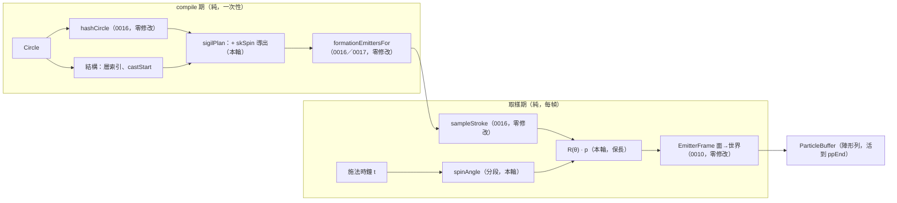

# Func-Spec 0020：陣形的時間維度（自轉、反向層、蓄力加速）

> 狀態：**設計定案，待實作**
> 性質：一般 —— 交付後凍結 `SigilSpin` 的分段角度函數與自轉導出規則。**同輪交付 ADR-0020**（逐位元邊界第三次收窄，取代 ADR-0015 D4）。
> 前置依賴：**spec 0017（需已完成）**——本 spec 修改 `src/core/Magic/Sigil.hs` 與 `Particle/Analytic.hs` 的 `SpawnOnStroke` case，並依賴 0017 交付後的陣形時間軸（陣活到 `ppEnd`、無收束曲線）。0016／0017 皆為 `Sigil.hs`／`Compile.hs` 的前手，依 SKILL.md 規則 4 **動工門檻＝0017 驗收**。**與 spec 0018／0019 平行**（0018 觸 `src/ffi`＋`include`＋`bindings`，0019 觸 `.github`＋README＋cabal metadata——逐檔交集 = ∅，§0.2）。**與 spec 0025 平行**（其只碰 `Compile.hs`／`Circle.hs`／`Codec.hs`／`Interface.hs`／`src/ffi`，本 spec 明文不碰 `Compile.hs`，見 §2.2）。
> 依據：spec 0006 §9（「陣形旋轉／動態陣形動畫」的原始記帳）、spec 0016 §8-3、**spec 0017 §8-2 與 [ADR-0015](../adr/0015-sigil-persists-through-cast.md) 的後果末列**（「陣形旋轉／動態陣形變得更值得做——一個只存在 1.5 秒的陣沒什麼好轉的，**一個存在整場的陣有**」——本 spec 是那句話的兌現）；[ADR-0014](../adr/0014-sigil-from-circle-hash.md)（摘要即合約）、**ADR-0015 D1／D2／D3／D4**（駐留、無收束、陣不吃力場、逐位元邊界——四條全部是本 spec 的前提）；ADR-0007（核心零 IO、引用透明）；architecture §3.3（生命週期）、§4.3（分層時間軸）。
> 範圍：讓活滿整場的陣**動起來**。三件事：整陣繞面心自轉、層與層反向轉、蓄力段角加速後維持恆速。**`Magic.Compile.hs` 零觸碰、`Magic.Codec` 零觸碰、schema 不升版、不加任何符文、不加任何 JSON 鍵。**

---

## 0. 起點：0017 之後的系統狀態

### 0.0 為什麼本 spec 必須排在 0017 之後（而不只是檔案衝突）

本 spec 的設計初稿寫於 0017 之前，當時的三個支柱有兩個已經被 ADR-0015 撤掉：

| 初稿的支柱 | 0017 之後 | 本輪的處置 |
|---|---|---|
| 「隨**收束**加速」——陣塌縮時轉快 | ADR-0015 **D2 取消陣形收束**，`kcExprFor` 已刪除且明文不得復活。Converging 的語意由「收攏」改為「**蓄力**」 | 改為「**蓄力段**加速」。語意更好：陣原地蓄力時轉速攀升，施放後維持——這正是 D2 給 Converging 的新語意 |
| 「**Casting 相位零影響律**」（改變只發生在 Drawing／Converging） | ADR-0015 **D4 明文撤銷 spec 0016 §1-5**，因為其前提（陣在 `castStart` 死盡）已不成立。陣現在活到 `ppEnd` | **撤銷**。改立兩條仍然成立且更有價值的律（§1-4） |
| 陣只活 1.5 秒 | 陣活滿整場（可達 6–9 秒） | **角度函數必須分段**，否則二次項在整場尺度上讓角速度無界（§2.3） |

第三列是本 spec 因 0017 而**變好**的地方：一個只存在 1.5 秒的陣轉不了多少，一個存在整場的陣才值得設計轉速曲線。ADR-0015 的後果末列已經預言了這件事。

### 0.1 引用的凍結介面（0016 §9.3 ＋ 0017 §9.5 交付後）

| 凍結物 | 本 spec 的用法 |
|---|---|
| `hashCircle :: Circle -> Word64`（0016 S1 凍結，含 `emptyCircle` 哨兵值與「排除 `circleFields`」的邊界） | **零修改**。本 spec 只從同一份摘要多讀一段位元 |
| `SigilPlan`／`SigilStroke`／`StrokeKind`／`sigilPlan`／`sampleStroke`／`strokeRadius`／`sigilBudget`（0016 凍結） | `SigilStroke` **加一個欄位** `skSpin`；`StrokeKind` 六個建構子與 `sampleStroke` 的閉式定義**零變更**（§2.1 的分離原則） |
| 0016 的三條律：索引序＝繪製序、n 臂等分旋轉對稱、`\|p\| ≤ strokeRadius` | **全部保持**，由等距同構結構性推得（§2.2）——不是重測一次 |
| `SpawnPattern` 的 `SpawnOnStroke !SigilStroke`（0016 凍結） | **建構子零變更**（新欄位住在 `SigilStroke` 內部）——`Compile.hs` 不必碰的原因 |
| **`formEnvFor :: Seconds -> Seconds -> Envelope` 的兩參數形狀，與「陣形最後一批粒子死於 `ppEnd`」的時間軸律**（0017 §9.5 凍結） | **零修改**。本 spec 不動生存窗；但它是「陣值得轉」與「角速度必須有界」兩件事的前提 |
| **陣形發射器 `motConverge = Nothing` 恆真；`kcExprFor` 已刪除**（0017 §9.5 凍結） | 本 spec **不復活收束**。角向運動與徑向運動分離，而徑向現在恆為零——比 0017 之前更單純 |
| **`emPhase = Drawing` 為力場判準，陣不吃力場**（ADR-0015 D3） | 自轉與力場層**完全正交**：陣自己轉，場吹不動它。§1-5 的律因此是 D3 的直接延伸 |
| `particlePosition :: CastContext -> Time -> EmitterSpec -> Int -> Double -> V3`（0007／0010 凍結簽名） | 自轉角的唯一輸入是其中的 `Time`（施法時鐘）。簽名零變更 |
| 分層時間軸（0004 §4.7 凍結）：行為層 t＝粒子年齡、調變層 t＝施法秒數 | 自轉屬**調變層語意**（整體變換），故吃施法秒數。§2.1 說明為何吃粒子年齡是錯的 |
| `aliveRanges` 時間窗剔除（0010 S3）、`emitterBounds`（0010 S7） | **皆零修改**——旋轉保長（§2.2 律 3），生存窗不動 |
| 核心依賴白名單 `{base, vector, deepseq}` | 不新增依賴（只用 `sin`／`cos`） |

### 0.2 檔案盤點（與 0018／0019／0025 的四方零交集證明）

**修改（4）**：

| 檔案 | 變更 |
|---|---|
| `src/core/Magic/Sigil.hs` | +`SigilSpin`、+`spinAngle`（分段）、+`SigilStroke.skSpin`、`sigilPlan` 的自轉導出（S1／S2） |
| `src/core/Magic/Particle/Analytic.hs` | `positionIn` 的 `SpawnOnStroke` 一個 case：`sampleStroke` 的結果先過 `rotate` |
| `test/SigilStrokeSpec.hs` | 0016 的三條律加上「旋轉後仍成立」（**加法，既有斷言零修改**） |
| `test/golden/perf-0010/{bare,grand}-sigil.txt`＋`test/FieldPlumbingSpec.hs` 的兩個摘要 | **第三度重錄**（0016、0017、本輪）。ADR-0015 已明文預告這筆代價；ADR-0020 記錄新邊界 |

**新增（4）**：`test/SigilSpinSpec.hs`、`test/SigilMotionSpec.hs`、`test/SigilMotionWiringSpec.hs`、`test/Acceptance20Spec.hs`、`docs/adr/0020-sigil-spin-bitexact-boundary.md`。

**共用（行級聯集合併）**：`particle-magic.cabal`（test other-modules +4）、`SKILL.md`、`docs/roadmap.md`、`CHANGELOG.md`。

**明文不碰**：`src/core/Magic/Compile.hs`（**§2.2 的證明**——這是與 0025 能平行的關鍵）、`src/core/Magic/{Circle,Rune,Expr,Project,Types}.hs`、`src/core/Magic/Particle/{Buffer,Field}.hs`、`src/boundary/*` 全部、`src/ffi/*`、`include/*`、`bindings/*`、`app/*`、`tools/*`、`docs/spell-schema.md`、以及 0017 動過的 `test/{FormationSpec,PhaseSampleSpec,SigilWiringSpec}.hs`。

**四方交集**：0018 觸 `src/ffi`＋`include`＋`.def`＋`bindings`＋`examples`；0019 觸 `.github/`＋README＋`docs/release.md`＋cabal metadata；0025 觸 `Compile.hs`／`Circle.hs`／`Codec.hs`／`Interface.hs`／新 `Magic/Space.hs`／`src/ffi`。與本清單逐檔比對：**交集 = ∅**。

---

## 1. 目標與完成定義

**目標**：0016 讓陣有了自己的長相，0017 讓它活到法術結束，本輪讓它**運轉**。

一個靜止的符文陣看起來像貼圖；一個緩慢自轉、內外層反向、蓄力時轉速攀升的陣看起來像**正在運作的機關**。而 0017 之後這件事的價值倍增——陣在整個施放過程中都在畫面上，觀眾有足夠的時間看見它在動。

成本依然異常地低：`skPhase` 已在 0016 的資料裡，施法時鐘已在取樣器的參數列裡，缺的只是把兩者乘起來。

**完成定義**：

1. `SigilSpin` 與 `spinAngle :: SigilSpin -> Double -> Float` 交付；角度是施法秒數的**分段閉式函數**（蓄力段二次、之後線性），C¹ 連續、全函數、必有限、**角速度有界**（S1）。
2. **等距同構律**：旋轉是面平面上繞原點的保長變換 ⇒ 0016 的三條律逐條保持——索引序＝繪製序、n 臂等分旋轉對稱、`|p| ≤ strokeRadius`。**第三條讓 `emitterBounds` 與 0010 的剔除零變更**（S1／S3）。
3. 自轉參數由**結構定號、摘要定值**導出（§3.2）：層索引決定旋向正負（相鄰層反向），摘要決定速率與蓄力加速度；**蓄力界標由編譯期的 `castStart` 烤進資料**（S2）。
4. **兩條零影響律**（取代 0016 §1-5 那條已被 ADR-0015 D4 撤銷的）：
   - **主效果零影響律**：施放發射器走 `SpawnAtAnchor`／`SpawnOnShape`，**永不**走 `SpawnOnStroke` ⇒ 施放粒子的輸出**逐位元不變**，於全部相位、全部時刻。
   - **無 `phases` 零影響律**：無 `phases` 的法術沒有陣形發射器 ⇒ `FrameOutput` 完全不受影響、golden 零重錄。
5. **陣不吃力場律仍成立**（ADR-0015 D3 的延伸）：帶場魔法在自轉開啟後，陣形列的場位移仍恆為零（S3）。
6. **逐位元邊界收窄為 `t = 0`**：自轉自 `t > 0` 起改變陣形粒子位置。這是陣形時間軸第三次變更，由 **ADR-0020** 明文取代 ADR-0015 D4 的邊界敘述（S3／S4）。
7. 決定論：同一 `(Circle, Seed, dt 序列)` 240 幀逐位元可重現；`spinAngle` 不引入任何跨幀狀態（S4）。
8. 手動 smoke：目視自轉、相鄰層反向、蓄力段加速後維持恆速（S4）。

## 2. 使用到的架構與技巧

### 2.1 時間項乘在取樣之後，不換取樣方式

`sampleStroke` 的六種閉式定義**一個字都不改**。自轉發生在它**之後**——面座標出來後套一個 2×2 旋轉。0016 的視覺詞彙與本輪的時間詞彙因此完全正交：日後加第七種筆畫不必想自轉，調自轉不必動筆畫。

**自轉必須吃施法秒數，不能吃粒子年齡。** 這是唯一容易搞錯的地方：若旋轉角取自粒子年齡，同一時刻不同年齡的粒子會被轉到不同角度——陣會被**抹成螺旋**而非**整體旋轉**。剛體旋轉的定義就是「同一時刻所有點同角」，而那個角只能是全域時鐘的函數。0004 §4.7 的分層時間框架早已把這件事分好類：整體變換屬調變層，調變層吃施法秒數。

這一點在 0017 之後更關鍵：陣以 `formLife` 為週期**循環重生**（0017 §8-1 稱之為「呼吸」），所以任何時刻畫面上的陣形粒子年齡都不同。用年齡驅動旋轉會讓陣每個週期抖一次。

### 2.2 等距同構論證（0016 三條律 ＋ `Compile.hs` 零觸碰）

令 `R(θ)` 為面平面上繞原點的旋轉，取樣為 `p'(i, t) = R(spinAngle sk t) · sampleStroke sk i`。

| 0016 的律 | 保持的理由 |
|---|---|
| 索引序＝繪製序 | 固定 `t` 時 `R` 對所有 `i` 是同一個常數變換 ⇒ 單調性被整體搬移，不受影響 |
| n 臂等分、旋轉對稱到 1e-5 | `R` 與臂旋轉 `2π·arm/sym` 可交換（同一個群）⇒ 對稱性逐字保持 |
| `\|p\| ≤ strokeRadius` | `R` 保長 ⇒ `\|p'\| = \|p\|`。**`strokeRadius`、`emitterBounds`、0010 的視錐與時間窗剔除全部零變更** |

第三列也是 `Compile.hs` 零觸碰的根據。`Compile.hs` 在 0016／0017 之後有三處與 sigil 相關：`SpawnOnStroke` 建構子（新欄位住在 `SigilStroke` 內部，元數不變）、`formationEmittersFor`（消費 `spStrokes`，不讀個別欄位）、`emitterBounds` 的兩個 `SpawnOnStroke` case（用 `strokeRadius`，而它不變）。三處皆不需修改。

**若當初把自轉設計成繞筆畫自身中心**（節點原地打轉而非繞行），保長律就會破、`emitterBounds` 就得跟著改、`Compile.hs` 就進了修改清單、與 0025 的平行也就沒了。繞面心是對的選擇，理由不只是好看。

### 2.3 分段角度函數：蓄力加速，之後恆速

0017 之前陣只活到 `castStart`（約 1.5 s），一個常數角加速度在那段時間裡很安全。**0017 之後陣活到 `ppEnd`**（範例陣為 6.9 s／8.1 s），若沿用純二次式：

```
ω(t) = rate + accel·t   →   ω(8.1) = 0.45 + 0.35×8.1 ≈ 3.3 rad/s（每 1.9 秒一圈）
```

陣會在法術尾聲轉成一個模糊的碟子。**角加速度必須有終點**，而那個終點在語意上早就存在——ADR-0015 D2 把 Converging 定義為**蓄力**：

```
spinAngle sp t
  | t <= r    = rate·t + ½·accel·t²                          -- 蓄力段：轉速攀升
  | otherwise = rate·r + ½·accel·r² + (rate + accel·r)·(t−r) -- 施放後：維持恆速
  where r = ssRampEnd sp   -- ＝ castStart，編譯期烤進資料
```

C¹ 連續（角速度在 `t = r` 連續），全函數，**角速度上界 = `rate + accel·castStart`**，與法術總長無關。

**取樣器仍然不需要知道相位**——`ssRampEnd` 是 `sigilPlan` 在編譯期算好塞進 `SigilStroke` 的**一個數字**。這與 0006 把階段機制編譯進包絡、0017 把 `ppEnd` 烤進 `envDuration` 是同一個手法：**相位界標以資料形式跨過純／取樣的邊界，而不是以查詢形式。**

視覺故事也對上了：畫陣（Drawing）時陣緩緩轉起來，蓄力（Converging）時轉速攀升，施放（Casting）後維持高速直到法術結束。

### 2.4 `ssPhase` 併進既有的 `skPhase`，不新增欄位

初稿的 `SigilSpin` 有三欄（rate／accel／phase）。但 0016 的 `SigilStroke` **已經有** `skPhase`（起始相位，由摘要導出）——再加一個起始相位是兩個欄位表達同一件事。

併進去有一個具體的好處：`spinAngle sp 0 = 0`，於是 **`t = 0` 的那一幀逐位元不變**。這是本輪逐位元邊界的全部內容（§1-6）——誠實地說它幾乎是空的，但它讓「本輪只動時間、不動幾何」這句話有一個可測的見證：**靜態的陣沒有被改變，只有時間讓它轉。**

### 2.5 逐位元邊界第三次收窄：需要 ADR

陣形時間軸至此被動過三次：0016（幾何換成筆畫）、0017（生存窗延長＋取消收束）、本輪（自轉）。ADR-0015 的負面記帳明文寫著：

> 「兩個 golden 與兩個摘要在 0016 之後**再度**重錄。逐位元邊界已由本 ADR 明文釘死，未來任何再動陣形時間軸的變更都要重付這筆。」

本輪就是那個「未來」。因此 **ADR-0020** 必須交付，內容有三：

1. 新邊界 `t = 0`，**取代 ADR-0015 D4** 的 `t < min(phDraw, castStart − formLife)`（ADR 不改寫歷史，由後續決策取代——與 ADR-0015 取代 ADR-0014 D5 的作法相同）。
2. 明文區分**兩種零影響律**：陣形粒子（會變）與施放粒子（逐位元不變）。後者是真正該保護的東西，而它至今從未被破壞過——0016、0017、本輪三輪都成立。
3. 記錄「陣形 golden 的逐位元價值正在遞減」這個事實，並裁決其後續處置（建議：陣形 golden 改為**結構性斷言**——粒子數、半徑界、對稱性——而非逐位元；逐位元保護集中在施放粒子與無 `phases` 的法術上，那才是宿主真正依賴的東西）。第 3 點是本輪最有價值的一句話，因為它終止了「每輪重錄、每輪聲稱有保護」的循環。

## 3. ADT 與導出規則

### 3.1 新型別（`src/core/Magic/Sigil.hs`，交付後凍結）

```haskell
-- | 一筆畫的角運動。全部相對面平面原點（§2.2 保長律的前提）。
data SigilSpin = SigilSpin
  { ssRate    :: !Float   -- ^ 基礎角速度（rad/s）。負值 = 反向
  , ssAccel   :: !Float   -- ^ 蓄力段角加速度（rad/s²），符號同 ssRate
  , ssRampEnd :: !Float   -- ^ 蓄力終點（秒）＝ castStart，編譯期烤入
  }
  deriving (Eq, Show)

-- | 施法秒數 → 旋轉角。分段：蓄力段二次、之後線性（§2.3）。
--   C¹ 連續；全函數；spinAngle sp 0 == 0（§2.4）。
spinAngle :: SigilSpin -> Double -> Float

-- | 靜止：三欄皆 0。spinAngle staticSpin ≡ 0。
staticSpin :: SigilSpin

data SigilStroke = SigilStroke
  { skKind     :: !StrokeKind
  , skRadius   :: !Float
  , skSymmetry :: !Int
  , skPhase    :: !Float   -- ^ 0016：起始相位（本輪的相位全部併入此欄，§2.4）
  , skJitter   :: !Float
  , skCount    :: !Int
  , skSpin     :: !SigilSpin   -- 新（0020）
  }
```

### 3.2 導出規則（骨架看結構、花紋看摘要——0016 §2 的同一條原則）

| 決定 | 來源 | 規則 |
|---|---|---|
| **旋向**（`ssRate` 正負） | **結構** | 層索引奇偶：相鄰層反向。讓「內外層反轉」看得出原因，而非隨機 |
| **速率** `\|ssRate\|` | **摘要** | 映到 `[0.05, 0.45] rad/s`（14–125 秒一圈；慢到不暈、快到看得出來） |
| **蓄力加速度** `ssAccel` | **摘要** | 映到 `[0, 0.30] rad/s²`，符號同 `ssRate`。上界使角速度上界 = `0.45 + 0.30·castStart`（範例陣 `castStart ≤ 2.4 s` ⇒ ω ≤ 1.17 rad/s ≈ 5.4 秒一圈，安全） |
| **`ssRampEnd`** | **結構** | ＝ `castStart`（`sigilPlan` 已有此值；無 `phases` 時陣形發射器不存在，本欄無意義） |
| **節點與中心** | **結構** | 節點群整體繞面心公轉（沿其所屬層旋向）；中心筆畫 `ssRate = 0`——**陣心不動**，視覺定錨點 |
| **邊界環** | **結構** | 最外層，旋向為正、速率取範圍下緣——外框慢慢轉，內部快 |

摘要位段與 0016 已用掉的位段**不重疊**；實作時在 `Sigil.hs` 以一張註解表記錄完整的 `Word64` 位元分配，避免第四輪再撞。

### 3.3 取樣端（`Analytic.hs` 唯一改動）

```haskell
SpawnOnStroke sk ->
  let V2 x y = sampleStroke sk idx
      th     = spinAngle (skSpin sk) tCast      -- tCast = 施法時鐘，非粒子年齡
      c = cos th ; s = sin th
  in  V2 (x * c - y * s) (x * s + y * c)        -- 之後照舊交給既有 EmitterFrame
```

## 4. 資料結構與儲存方式

- `SigilSpin` 是三個 `Float` 的 strict record，隨 `SigilStroke` 進入 `Motion`——與 `FaceShape` 同性質的小不可變值。`CompiledSpell` 仍完全可序列化。
- **無新的跨幀狀態**：`spinAngle` 是 `t` 的純函數。快轉／倒帶／重播照舊成立。
- 預算：自轉不改變任何 `skCount`；`sigilBudget = 1536` 與 0016 的等比裁切邏輯零變更；0017 的「`emCount` 一個沒動」在本輪同樣成立。

## 5. 資料流



## 6. 搭建方式（風險優先）

1. **S1 `SigilSpin`＋分段 `spinAngle`＋等距同構律**——保長律是「其餘一切零觸碰」的前提，先證成測試。
2. **S2 導出規則＋位元分配表**——與 0016 的位段不重疊必須先釘死。
3. **S3 取樣端接線＋兩條零影響律＋陣不吃力場律**。
4. **S4 端到端＋ADR-0020＋golden 重錄＋手動 smoke**。

## 7. Todo List 與 1-to-1 測試對應

| # | Todo | 測試 |
|---|---|---|
| S1 | `SigilSpin`／分段 `spinAngle`／`staticSpin`／`SigilStroke.skSpin` | `test/SigilSpinSpec.hs`（`spinAngle sp 0 == 0`（§2.4）；C¹ 連續：`t = ssRampEnd` 處角度與角速度皆連續（數值極限，property）；**角速度上界** `\|ω(t)\| ≤ \|rate\| + \|accel\|·rampEnd` 對任意 `t`（property——0017 之後的關鍵防護）；全函數且有限（含極端 `t`）；`staticSpin` 恆 0；**等距同構三律**：0016 的索引單調律、n 臂等分律、`\|R·p\| = \|p\| ≤ strokeRadius`（property，全六種 kind × 隨機 `t`）；`ssRate` 反號 ⇒ 角度反號） |
| S2 | `sigilPlan` 的自轉導出（旋向由層索引、速率／加速度由摘要、`ssRampEnd = castStart`）＋位元分配註解表 | `test/SigilMotionSpec.hs`（決定論；相鄰層旋向相反（見證表）；中心筆畫 `ssRate == 0`；`\|ssRate\| ∈ [0.05,0.45]`、`ssAccel ∈ [0,0.30]` 且與 `ssRate` 同號（property）；`ssRampEnd ≡ castStart`（見證）；**本輪位段與 0016 位段不相交**——以 `hashCircle` 單位元翻轉見證：翻 0016 位段只變幾何、翻本輪位段只變自轉） |
| S3 | `positionIn` 的 `SpawnOnStroke` case 套旋轉 | `test/SigilMotionWiringSpec.hs`（**主效果零影響律**：全部範例陣的**施放**發射器輸出於全相位、全時刻逐位元不變（施放永不走 `SpawnOnStroke` 的見證）；**無 `phases` 零影響律**：8 個無 `phases` 範例陣 `FrameOutput` 240 幀逐位元不變、golden 零重錄；**陣不吃力場律**（ADR-0015 D3 延伸）：強力場下陣形列的場位移恆為零，同時施放列確實被扭曲；陣形粒子恆落在 `emitterBounds` 內（`emitterBounds` 未修改的見證）） |
| S4 | 端到端＋ADR-0020＋兩個 golden 與 `FieldPlumbingSpec` 兩摘要重錄＋手動 smoke | `test/Acceptance20Spec.hs`（240 幀決定論逐位元；同一 `t` 兩次取樣相同；**陣形點集隨 `t` 確實改變**（自轉真的發生，property 而非目視）；相鄰層角位移方向相反（端到端見證）；**蓄力段角速度嚴格遞增、`castStart` 之後恆定**（以連續三個時刻的角位移差見證）；`isFinished` 於 `ppEnd` 翻轉不變）＋**手動 smoke**：開窗目視三個範例陣的自轉、相鄰層反向、蓄力加速後維持，截圖描述入 §9 |

## 8. 非目標

1. **玩家對自轉的直接控制**（JSON 的 `spin` 鍵）——沿用 0016 §8-2 的裁決：陣是**導出**的指紋，不是作者資料。**記帳**：真要做，形狀是陣層級的 opt-in 鍵（比照 `phases`／`fields`／0025 的 `anchors`），且必須「調變既有導出值」而非「覆寫」。
2. **章動／進動／非等速自轉**（角速度本身是 `Expr`）——與 0007 §9 的「Expr 驅動的時變場參數」是同一類需求（第四種時間掛載點），應一起做。
3. **復活收束**——ADR-0015 D2 明文「要恢復收束需先修訂 ADR-0015」。本輪不碰徑向運動。
4. **3D 立體陣**（多層平面沿法線堆疊、各層不同傾角各自旋轉）——0016 §8-4 的記帳延續；本輪仍是單一平面內的旋轉。
5. **筆畫自身的形變動畫**（半徑呼吸、`sweep` 開合、`GlyphBand` 遮罩隨時間切換）——那是改 `sampleStroke` 的閉式定義，會破壞 §2.1 的正交性。
6. **陣的獨立時間軸**（`phases.linger`）——0017 §8-3 的記帳，需新 JSON 鍵。
7. **靜止不重畫的陣**——0017 §8-1 的記帳。與本輪無關但常被一起提起：自轉讓「循環重畫」的視覺代價**變小**（轉動掩蓋了重生的接縫），可在 §9 回填目視觀察。
8. **陣形 golden 改為結構性斷言**——ADR-0020 會**裁決**這件事，但實際改寫留給下一輪（本輪仍照舊重錄，以免把 ADR 的裁決與它的執行混在同一個 PR）。

## 9. 驗收紀錄

（實作時回填：日期、`cabal test` 結果、位元分配表最終內容、golden 第三度重錄的首個差異幀、蓄力段角速度曲線的實測、三個範例陣的自轉手動 smoke 描述、與計畫的差異。）
