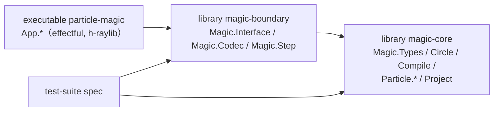
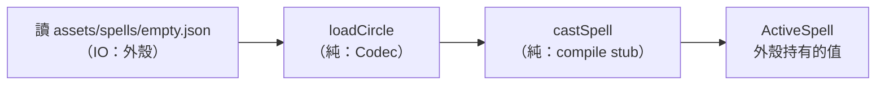
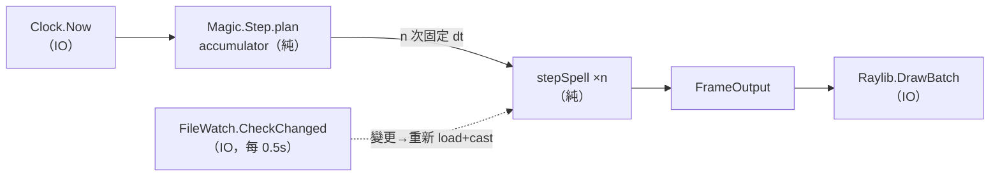

# Func-Spec 0001：框架搭建（Walking Skeleton）

> 狀態：已完成（2026-08-12，驗收紀錄見 §10）
> 性質：**重大基建功能** —— 本 spec 建立套件邊界、`Magic.Interface` 對外合約、`ParticleBuffer` 與固定時步等永久介面，是**所有後續 func-spec 的共同地基**。本 spec 完成驗收前，任何依賴它的 spec 不得動工；完成後其「永久型別」（§4 未標 ⚠ 者）即凍結，變更需先修訂 ADR/架構書。
> 前置依賴：無
> 依據：[architecture.md](../architecture.md) §2、§3；ADR-0004、0007
> 範圍：建構整個系統的**外圍輪廓**——套件邊界、IO 邊界、核心邊界、端到端資料流。不實作真正的魔法陣語意（DSL、解釋器、力場留給後續 spec）。

---

## 1. 目標與完成定義

搭一副**可行走的骨架（walking skeleton）**：一條最細但完整貫通的管線——

```
assets/spells/empty.json → loadCircle → castSpell（stub 編譯）
  → 每幀 stepSpell（stub 素放取樣）→ RenderBatch → raylib 3D 畫出粒子噴泉
```

完成定義：

1. `cabal build all` 與 `cabal test` 通過；
2. `cabal run` 開出 raylib 3D 視窗，看到一個由空魔法陣「素放」產生的粒子噴泉；
3. 修改 `empty.json` 存檔後，魔法自動重新施法（熱重載通路打通）;
4. **架構邊界由 cabal 套件結構強制**（§3），且有測試守護。

本 spec 同時是**風險驗證**：h-raylib 能否在 GHC 9.14.1 + Windows 編譯執行（架構書 §9 列為最高風險），必須在第 0 步就知道答案。

---

## 2. 使用到的架構與技巧

| 項目 | 選擇 | 說明 |
|---|---|---|
| 邊界強制 | **cabal 多套件（sublibrary）依賴清單** | 「核心零 IO」不靠紀律，靠 `magic-core` 的 build-depends 裡根本沒有 IO 生態套件；執行檔**不依賴** `magic-core`，只依賴 `magic-boundary`——外殼物理上 import 不到核心內部模組 |
| 主迴圈 | **固定時步 + accumulator** | 模擬固定 60Hz，渲染幀率自由；步數規劃是純函數（§5.3），可測 |
| 效果系統 | **effectful dynamic dispatch** | `Clock`／`FileWatch`／`Raylib` 三個具名效果，各有 IO 直譯器與測試直譯器（虛擬時鐘、headless renderer） |
| raylib 配對呼叫 | **higher-order effect（bracket 模式）** | `WithFrame :: m a -> Raylib m a` 封裝 begin/endDrawing，型別上不可能忘記配對 |
| 熱重載 | **輪詢 mtime**（非 fsnotify） | 骨架期用 `getModificationTime` 每 0.5s 輪詢：零額外相依、跨平台無坑。fsnotify 留待之後需要時替換，`FileWatch` 效果介面不變 |
| 骨架期渲染 | **逐粒子 `drawCubeV`（小方塊）** | 先求貫通不求快；instanced rendering 是後續效能 spec（見 §9 非目標）。粒子數骨架期壓在 256，逐 call 畫得動 |
| 測試 | **hspec + hspec-discover + QuickCheck** | 每個 Todo 對應一個測試模組（§8），純函數以 property 測試為主 |

---

## 3. 套件結構（邊界的物理形式）

```
particle-magic.cabal          -- 單一 .cabal，三個 stanza ＋ 測試
├── library magic-core        -- 純核心。build-depends 白名單：
│     hs-source-dirs: src/core        base, vector, deepseq
├── library magic-boundary    -- 邊界層。依賴 magic-core ＋
│     hs-source-dirs: src/boundary    aeson, bytestring, text
├── executable particle-magic -- 外殼。依賴 magic-boundary（不含 magic-core！）
│     hs-source-dirs: app             ＋ effectful, h-raylib, directory
└── test-suite spec           -- 測試。依賴 core＋boundary（不依賴外殼的 IO 部分，
      hs-source-dirs: test             但 App.Loop 的純函數抽到 boundary 可測，見 §5.3）
```

**依賴方向（cabal 強制，箭頭 = build-depends）：**



規則：

- `magic-core` 的 build-depends **白名單**：`base`、`vector`、`deepseq`。出現任何其他套件即違規（測試 T1 守護）。
- 執行檔看不到 `magic-core` 的模組——`Magic.Interface` re-export 外殼需要的一切型別（`RenderBatch`、`ParticleBuffer` 唯讀視圖）。這就是架構書 §5.3「對外唯一入口」的落地。
- 骨架期先用單一 `.cabal` 檔的 named sublibraries；若未來要獨立發布核心再拆 multi-package。

### 模組樹（骨架期全貌）

```
src/core/    Magic/Types.hs             -- V3, Time, DeltaTime, Seconds, Seed（基礎詞彙）
             Magic/Circle.hs            -- 骨架期：Circle 佔位（全空槽位可表示即可）
             Magic/Compile.hs           -- compile stub：任何 Circle → 素放 CompiledSpell
             Magic/Particle/Buffer.hs   -- SoA ParticleBuffer ＋ 不變量
             Magic/Particle/Analytic.hs -- sample stub：素放噴泉（時間純函數）
             Magic/Project.hs           -- 骨架期：恆等投影
src/boundary/Magic/Interface.hs         -- loadCircle / castSpell / stepSpell / isFinished
             Magic/Codec.hs             -- JSON v1 最小子集（version ＋ 全空 circle）
             Magic/Step.hs              -- 固定時步 accumulator（純函數，放邊界層供外殼與測試共用）
app/         Main.hs                    -- runEff 組裝直譯器、進主迴圈
             App/Effects.hs             -- Clock / FileWatch / Raylib 效果定義＋IO 直譯器
             App/TestInterp.hs          -- 虛擬時鐘、headless renderer（給 T7 用，隨 app 編譯確保不腐化）
             App/Loop.hs                -- 主迴圈（消費 Magic.Step 的純規劃）
             App/HotReload.hs           -- mtime 輪詢 → 重新 load＋cast
             App/Render/Raylib3D.hs     -- RenderBatch → drawCubeV 逐粒子
test/        Spec.hs（hspec-discover）＋ 各 *Spec.hs（§8 一一對應）
```

---

## 4. ADT（骨架期實際定義的型別）

骨架期型別分兩類：**永久型別**（今後不變，第一天就定對）與 **stub 型別**（佔位，後續 spec 擴充；標 ⚠）。

### 4.1 `Magic.Types`（永久）

```haskell
data V3 = V3 !Float !Float !Float          -- 抽象 3D 空間（ADR-0008）
newtype Time      = Time Double             -- 施法起算秒數
newtype DeltaTime = DeltaTime Double
newtype Seed      = Seed Word64
-- V3 提供 Num 風格運算與 dot/cross/normalize；全部 INLINE
```

### 4.2 `Magic.Circle`（⚠ stub）

```haskell
-- 骨架期只需要「全空魔法陣可以被表示與序列化」
data Circle = Circle { }        -- 後續 spec 0002+ 填入 TwoOf/槽位結構
emptyCircle :: Circle
```

### 4.3 `Magic.Compile`（⚠ stub 行為、永久介面）

```haskell
data CompiledSpell = CompiledSpell     -- 介面永久；欄位骨架期最小化
  { spellLifetime :: Seconds
  , spellBudget   :: Int               -- 粒子預算（骨架期定值 256）
  }
data CompileError = ...                -- 骨架期：不會失敗，但 Either 介面先定好
compile :: Circle -> Either CompileError CompiledSpell
-- stub 語意：任何 Circle → 素放（噴泉），呼應「空陣即素放」（architecture.md §3.3）
```

### 4.4 `Magic.Particle.Buffer`（永久）

```haskell
data ParticleBuffer = ParticleBuffer
  { pbPosX, pbPosY, pbPosZ :: !(U.Vector Float)
  , pbSize, pbLife         :: !(U.Vector Float)
  , pbColor                :: !(U.Vector Word32)
  , pbCount                :: !Int
  }
-- 不變量（測試 T3 守護）：六個 vector 長度一律 == pbCount
emptyBuffer :: ParticleBuffer
```

### 4.5 `Magic.Particle.Analytic`（⚠ stub 行為、永久簽名）

```haskell
-- 架構書 §4.6 的簽名，第一天就是最終形狀
sample :: CompiledSpell -> CastContext -> Time -> ParticleBuffer
-- stub 語意（素放噴泉）：
--   第 i 粒於 spawn_i = i * lifetime/budget 出生，壽命 2s，循環重生
--   位置 = casterPos + facing * speed * age + hash 通道橫向偏移
--   顏色 = 白，尺寸 = 0.05，life 欄位 = age/2s
-- 隨機性即用最終機制：hashChan :: Seed -> Int -> Int -> Float（粒子索引×通道 → 0..1）
```

### 4.6 `Magic.Interface`（永久——這就是對外合約）

```haskell
data CastContext = CastContext { casterPos, casterFacing :: V3, seed :: Seed }
data CastRequest = CastRequest { circleOf :: Circle, ctxOf :: CastContext }
newtype FrameInput  = FrameInput { frameDt :: DeltaTime }
data    FrameOutput = FrameOutput { batches :: [RenderBatch] }
data    RenderBatch = RenderBatch
  { rbParticles :: ParticleBuffer, rbBlend :: BlendMode, rbShape :: BillboardShape }

data ActiveSpell   -- 對外殼不透明（不 export 建構子）：內含 CompiledSpell + Ctx + 已推進時間

loadCircle :: ByteString -> Either LoadError Circle          -- 位於 Magic.Codec
castSpell  :: CastRequest -> Either CompileError ActiveSpell
stepSpell  :: FrameInput -> ActiveSpell -> (ActiveSpell, FrameOutput)
isFinished :: ActiveSpell -> Bool
```

`ActiveSpell` 骨架期唯一狀態是「已推進時間」（無力場層），`stepSpell` = 時間累加 + `sample`——**純狀態轉移**，外殼拿到的是值，不是引用。

### 4.7 `App.Effects`（永久介面）

```haskell
data Clock :: Effect where
  Now :: Clock m Double                          -- 單調時鐘（秒）

data FileWatch :: Effect where
  CheckChanged :: FilePath -> FileWatch m Bool   -- 自上次呼叫後 mtime 是否變更

data Raylib :: Effect where
  WithWindow :: Int -> Int -> String -> m a -> Raylib m a   -- bracket：init/close
  WithFrame  :: m a -> Raylib m a                           -- bracket：begin/end
  DrawBatch  :: Camera -> RenderBatch -> Raylib m ()
  ShouldClose :: Raylib m Bool
-- 直譯器：runClockIO / runClockVirtual、runFileWatchIO / runFileWatchScript、
--         runRaylibIO / runRaylibHeadless（記錄繪製呼叫供斷言）
```

---

## 5. 資料流（pipeline）

### 5.1 啟動流



### 5.2 每幀流（骨架期完整版）



IO 只出現在圖的最左（時鐘、檔案）與最右（繪製）——與架構書 §3.2 的分界完全同構，骨架期就把這個形狀釘死。

### 5.3 固定時步規劃（純函數，`Magic.Step`）

```haskell
data StepPlan = StepPlan { stepsToRun :: !Int, accAfter :: !Double }
plan :: Double        -- 固定時步（1/60）
     -> Int           -- 每幀步數上限（8，防 spiral of death）
     -> Double        -- 本幀實際流逝
     -> Double        -- accumulator 現值
     -> StepPlan
```

關鍵性質（測試 T6 的 property）：**同樣的總時間不論怎麼切成幀，模擬步總數相同**（clamp 未觸發時），這是確定性重播的地基。

---

## 6. 資料結構與儲存方式

| 資料 | 結構 | 存放 | 生命週期 |
|---|---|---|---|
| 魔法陣定義 | JSON v1（骨架期 schema：`{"version":1,"name":…,"circle":{}}`） | `assets/spells/*.json`（磁碟） | 使用者編輯；熱重載讀取 |
| `Circle` / `CompiledSpell` | 不可變 ADT | 記憶體（外殼持有的值） | 載入→重載即整個替換 |
| `ActiveSpell` | 不可變值（`stepSpell` 回傳新值） | 外殼主迴圈的迴圈變數 | 施法→`isFinished` |
| `ParticleBuffer` | SoA、`Data.Vector.Unboxed` | 每幀由 `sample` 產生 | 單幀（骨架期先容忍每幀新配置——256 粒無感；緩衝重用屬效能 spec） |
| accumulator / 上次 mtime | `Double` / `UTCTime` | 迴圈變數 / `IORef`（僅外殼） | 行程 |

骨架期**沒有**其他持久化：無存檔、無快取、無 log 檔。

---

## 7. 搭建方式（實作順序，風險優先）

| 步驟 | 內容 | 為什麼在這個位置 |
|---|---|---|
| S0 | `cabal init`＋最小 h-raylib「開窗畫一顆方塊」 | **最高風險最先爆**：h-raylib × GHC 9.14.1 × Windows 若編不過，一切後續設計都要重估（備案：降 GHC 版號，記入 ADR 修訂） |
| S1 | 三套件結構＋依賴白名單（§3），S0 的窗改掛到 executable | 邊界物理化必須在寫第一個模組之前，否則永遠補不回來 |
| S2 | `Magic.Types`（V3 等） | 所有人的詞彙 |
| S3 | `Magic.Particle.Buffer`（SoA＋不變量） | 資料結構先於使用它的函數 |
| S4 | `Magic.Codec` 最小 JSON＋`Magic.Circle` stub | 讓「輸入格式從第一天就是合約」（ADR-0005）成立 |
| S5 | `Magic.Compile` stub＋`Magic.Particle.Analytic` 素放＋`Magic.Interface` 四函數 | 核心管線貫通（此步完成後不開視窗即可純函數跑完整魔法生命週期） |
| S6 | `Magic.Step` 固定時步 | 純規劃先寫先測，外殼只是消費者 |
| S7 | `App.Effects` 三效果＋雙直譯器 | 讓 S8 的迴圈第一天就能 headless 測 |
| S8 | `App.Loop`＋`App.HotReload`＋`App.Render.Raylib3D`，`Main.hs` 組裝 | 端到端；壓軸的都是薄膠水 |
| S9 | Walking skeleton 驗收（§1 完成定義 1–4）＋ `cabal test` 全綠 | — |

每步的紀律：**完成一個 Sx ＝ 對應測試 Tx 綠**（下表 1-to-1），不積欠。

---

## 8. Todo List 與 1-to-1 測試對應

| ✅ | Todo | 測試（`test/` 下） | 測試內容（完成即斷言） |
|---|---|---|---|
| ✅ | **S0** h-raylib 開窗驗證 | —（手動 smoke） | 視窗開啟、畫一方塊、Esc 關閉。唯一無自動測試的步驟，結果記錄於本文件 §10 |
| ✅ | **S1** 三套件邊界 | `BoundarySpec.hs` | 剖析 `particle-magic.cabal`：`magic-core` 的 build-depends ⊆ {base, vector, deepseq}；executable 的 build-depends 不含 `magic-core` |
| ✅ | **S2** `Magic.Types` | `TypesSpec.hs` | V3 運算 property：加法交換/結合、`normalize` 後長度 ≈1（零向量除外）、dot/cross 正交性質 |
| ✅ | **S3** `ParticleBuffer` | `BufferSpec.hs` | 不變量 property：任意合法建構下六個欄位長度 == `pbCount`；`emptyBuffer` 的 count == 0 |
| ✅ | **S4** Codec 最小 JSON | `CodecSpec.hs` | roundtrip：`decode . encode == id`（骨架 schema）；`version ≠ 1` 拒絕且錯誤訊息含版號；壞 JSON 錯誤含位置；`empty.json` 樣本檔可載入 |
| ✅ | **S5** 核心管線 stub | `PipelineSpec.hs` | 空陣 → `castSpell` 成功；`stepSpell` 推進：粒子數 ≤ budget、buffer 不變量恆真；同 `(Seed, t)` 兩次取樣 bit-for-bit 相等（確定性）；推進超過 lifetime 後 `isFinished == True` |
| ✅ | **S6** 固定時步 | `StepSpec.hs` | property：任意切幀方式下總步數 == `floor(total/dt)`（clamp 未觸發）；clamp 觸發時 `stepsToRun ≤ maxSteps`；accumulator 恆 `0 ≤ acc < dt`（無 clamp 時） |
| ✅ | **S7** 效果與直譯器 | `EffectsSpec.hs` | 用 `runClockVirtual`＋`runRaylibHeadless` 跑主迴圈 N 虛擬秒：模擬步數 == N×60；headless renderer 收到的 DrawBatch 次數 == 渲染幀數 |
| ✅ | **S8** 熱重載決策 | `HotReloadSpec.hs` | 純決策函數：mtime 序列 → 重載時點；`runFileWatchScript` 注入「第 k 幀檔案變更」→ 斷言第 k 幀後 spell 被重新 cast（施法時間歸零） |
| ✅ | **S9** 端到端驗收 | `AcceptanceSpec.hs` ＋ 手動 | 自動：headless 全管線（JSON bytes → N 幀 → FrameOutput 非空 → finished）。手動：開窗見噴泉、改 JSON 見重載 |

規則：**一個 Todo 打勾的前提是對應測試存在且綠**。S0/S9 的手動部分在 §10 留驗收紀錄。

---

## 9. 非目標（本 spec 明確不做）

- 真正的魔法陣結構（`TwoOf`/槽位/符文）與解釋器 —— spec 0002+
- `Expr` AST 與數學式剖析 —— spec 0003（暫定）
- 力場層、生命週期四階段（Drawing/Converging…）—— 後續 spec
- Instanced rendering、緩衝重用、粒子預算 —— 效能 spec
- 2D 投影後端

骨架期的 stub 全部標 ⚠（§4），且 stub 的**介面**即最終介面——後續 spec 只替換實作與擴充欄位，不改簽名。

## 10. 驗收紀錄（實作時回填）

| 項目 | 日期 | 結果 |
|---|---|---|
| S0：h-raylib × GHC 9.14.1 × Windows 編譯 | 2026-08-12 | ✅ 通過。h-raylib 5.6.0.0 需 `cabal.project` 放寬 `allow-newer: h-raylib:template-haskell, h-raylib:base`（GHC 9.14.1 附 template-haskell 2.24 超出其上界 <2.24），放寬後原始碼相容、編譯執行皆正常。視窗開啟、3D 方塊＋網格顯示、180 幀後自動關閉（exit 0）。注意：`Vector3` 在 h-raylib 5.6 是 pattern synonym（底層為 `linear` 的 `V3 Float`），需以 `pattern Vector3` 匯入 |
| S9：walking skeleton 目視驗收 | 2026-08-12 | ✅ `cabal run`：1280×720 視窗開啟（GLFW/OpenGL 3.3），60fps 跑 401 幀；執行中修改 `empty.json`（name 欄位）→ 統計輸出 `casts=2` 證實熱重載自動重新施法；視窗優雅關閉後印出 `frames=401 simSteps=399 casts=2`。headless 驗收（`AcceptanceSpec`）：真實檔案 bytes → 620 幀 → 噴泉粒子於穩態滿編 256、恆在預算內 → 過壽命後 `isFinished` |
| `cabal test` 全綠 | 2026-08-12 | ✅ 55 examples, 0 failures（T1–T9 全數對應） |
| 凍結的介面清單（重大基建交付必填：列出實際凍結的永久型別與函數簽名，供下游 spec 引用） | 2026-08-12 | 見下方「凍結介面清單」 |

### 凍結介面清單（2026-08-12 交付）

**`magic-core`**（build-depends 白名單 base/vector/deepseq，測試 T1 守護）：

- `Magic.Types`：`V3(..)`（Num 實例、`vscale`/`dot`/`cross`/`norm`/`normalize`）、`Time`、`DeltaTime`、`Seconds`、`Seed`、`CastContext(..)`、`hashChan :: Seed -> Int -> Int -> Float`（最終隨機機制）
- `Magic.Particle.Buffer`：`ParticleBuffer` SoA 六欄位＋`pbCount` 不變量、`emptyBuffer`、`bufferInvariant`
- `Magic.Particle.Analytic`：`sample :: CompiledSpell -> CastContext -> Time -> ParticleBuffer`（⚠ 行為為素放 stub，簽名永久）
- `Magic.Compile`：`compile :: Circle -> Either CompileError CompiledSpell`（⚠ `CompiledSpell` 欄位骨架期最小，後續擴充；`Either` 介面永久）
- `Magic.Circle`：`Circle` / `emptyCircle`（⚠ stub，spec 0002+ 填入槽位結構）

**`magic-boundary`**：

- `Magic.Interface`（對外唯一入口）：`CastRequest(..)`、`FrameInput(..)`、`FrameOutput(..)`、`RenderBatch(..)`、`BlendMode`、`BillboardShape`、不透明 `ActiveSpell`、四函數 `loadCircle`（位於 Codec）/`castSpell`/`stepSpell`/`isFinished`，另加唯讀觀察者 `spellAge :: ActiveSpell -> Time`（spec 未列，交付時新增，供宿主與熱重載測試使用）
- `Magic.Codec`：`loadCircle :: ByteString(strict) -> Either LoadError Circle`、`saveCircle`、`LoadError(JsonError | UnsupportedVersion)`、JSON v1 schema（`version`/`name`/`circle`）
- `Magic.Step`：`StepPlan(..)`、`plan :: Double -> Int -> Double -> Double -> StepPlan`（含 1e-9 幀 epsilon，見下）

**`App.*` 效果介面**：

- `Clock`（`Now`）、`FileWatch`（`CheckChanged`、**`ReadBytes`**）、`Raylib`（`WithWindow`/`WithFrame`/`DrawBatch`/`ShouldClose`，higher-order bracket）、`Camera`（自有型別）
- 直譯器：`runClockIO`/`runClockVirtual`、`runFileWatchIO`（mtime 輪詢 0.5s 節流）/`runFileWatchScript`、`runRaylibIO`（位於 `App.Render.Raylib3D`）/`runRaylibHeadless`

**實作期修訂（相對 §4 的偏差，均已測試守護）**：

1. `FileWatch` 增加 `ReadBytes`：重載必須重新讀檔，檔案存取全數歸效果所有，維持迴圈零 IO。
2. `Camera` 為自有型別而非 raylib 型別：效果定義（`App.Effects`）零 h-raylib 依賴，測試套件因此完全 headless。
3. `Raylib` 的 IO 直譯器移至 `App.Render.Raylib3D`（spec 原列於 `App.Effects`），理由同上。
4. `Magic.Step.plan` 加入 1e-9 幀 epsilon：T7 發現時鐘時間戳差分帶 ±ulp 噪音會每 ~2 秒丟一步；epsilon 遠小於 T6 dyadic 網格的最小間隙，位元級精確性質不受影響（`StepSpec` 有回歸測試）。
5. `Vector3` 在 h-raylib 5.6 為 pattern synonym（底層 `linear` 的 `V3 Float`），需 `pattern Vector3` 匯入。
