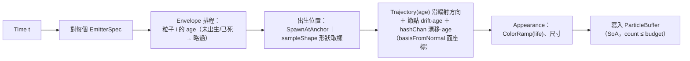

# Func-Spec 0002：魔法陣結構與解釋器（Circle Structure & Interpreter）

> 狀態：已完成（2026-08-12，驗收紀錄見 §10）
> 性質：**重大基建功能** —— 本 spec 定義真實的 `Circle` 結構 ADT、符文型別、`CompiledSpell` 內部結構（`EmitterSpec`／`Motion`／`Appearance`）與 JSON 完整槽位 schema，是 Expr 符文接線 spec（0004）、生命週期 spec、力場 spec 的共同地基。本 spec 完成驗收前，依賴它的 spec 不得動工；完成後 §4 未標 ⚠ 的永久型別即凍結（可擴充 sum 的擴充合約見 §2）。
> 前置依賴：spec 0001（**已完成**，2026-08-12 驗收）—— 0001 為重大基建，其驗收紀錄中的「凍結介面清單」與五條實作期修訂是本 spec 的起點（§0 已據實對齊）。
> 依據：[architecture.md](../architecture.md) §3.1、§4.1–§4.4、§5.1、§6；ADR-0002、0003、0005
> 範圍：把魔法陣從空殼變成真語意——真實 `Circle` 結構、**參數層**符文子集、由內而外解釋器、真實解析取樣、完整槽位 JSON schema。**不含 Expr 數學式子系統**（Expr 語言本身是 spec 0003、與本 spec 平行進行；四種 Expr 符文的接線留給 spec 0004，見 §9）。

---

## 0. 起點：spec 0001 完成後的系統狀態

0001 已於 2026-08-12 驗收（其 §10 含凍結介面清單與五條實作期修訂）。系統實際狀態：

### 0.1 可運行物（walking skeleton）

- `cabal build all`／`cabal test` 通過（55 examples 全綠，九個測試模組）；`cabal run` 開啟 raylib 3D 視窗（1280×720，60fps）。
- `assets/spells/empty.json`（全空魔法陣）→ `loadCircle` → `castSpell`（stub 編譯）→ 每幀 `stepSpell`（stub 素放取樣）→ `RenderBatch` → 逐粒子 `drawCubeV` 畫出**素放噴泉**（256 粒、白色小方塊、循環重生）。
- 模擬固定 60Hz（accumulator 時步，含 1e-9 幀 epsilon），渲染幀率自由；修改 JSON 存檔後 0.5s 內熱重載（重新施法，狀態歸零）。
- 環境事實：h-raylib 5.6.0.0 × GHC 9.14.1 × Windows 可編譯執行，需 `cabal.project` 的 `allow-newer: h-raylib:template-haskell, h-raylib:base`；`Vector3` 為 pattern synonym。本輪不觸碰外殼，僅需知道環境已驗證可用。

### 0.2 已凍結的永久介面（0001 驗收紀錄的凍結清單；本 spec 不得更動簽名）

| 介面 | 內容 |
|---|---|
| `Magic.Types` | `V3(..)`（Num 實例、`vscale`/`dot`/`cross`/`norm`/`normalize`）、`Time`、`DeltaTime`、`Seconds`、`Seed`、**`CastContext(..)`**（在核心，非 Interface）、**`hashChan :: Seed -> Int -> Int -> Float`**（最終隨機機制） |
| `Magic.Particle.Buffer` | SoA `ParticleBuffer`（六欄位）＋「長度==pbCount」不變量、`emptyBuffer`、`bufferInvariant` |
| `Magic.Interface` | `CastRequest(..)`／`FrameInput(..)`／`FrameOutput(..)`／`RenderBatch(..)`／`BlendMode`／`BillboardShape`；`castSpell`／`stepSpell`／`isFinished`＋唯讀觀察者 `spellAge :: ActiveSpell -> Time`；`ActiveSpell` 對外不透明；re-export 核心型別 |
| `Magic.Codec` | `loadCircle :: ByteString -> Either LoadError Circle`、`saveCircle`、`renderLoadError`、`LoadError (JsonError \| UnsupportedVersion)`；JSON v1 含 `version` 欄位的合約；語法錯誤附位置（aeson 路徑＋`addPosition` 行列定位） |
| `Magic.Compile` | `compile :: Circle -> Either CompileError CompiledSpell` 的 `Either` 介面（`CompiledSpell` 欄位、`CompileError` 建構子明示為骨架期最小、後續擴充） |
| `Magic.Particle.Analytic` | `sample :: CompiledSpell -> CastContext -> Time -> ParticleBuffer` 簽名 |
| `Magic.Step` | `StepPlan(..)`、`plan`（固定時步規劃純函數，含 1e-9 幀 epsilon） |
| `App.Effects` | `Clock`（`Now`）／`FileWatch`（`CheckChanged`、`ReadBytes`）／`Raylib`（bracket 四操作）三效果與雙直譯器（IO／測試）；`Camera` 為自有型別（效果層零 h-raylib 依賴）；`runRaylibIO` 位於 `App.Render.Raylib3D` |
| 套件邊界 | cabal 三 stanza；`magic-core` build-depends 白名單 {base, vector, deepseq}；executable 不依賴 `magic-core`（`BoundarySpec` 守護） |

### 0.3 ⚠ stub 佔位（本 spec 要替換的實作；介面即最終介面）

| stub | 0001 實作的樣子 | 本 spec 之後 |
|---|---|---|
| `Circle {}` | 空結構，只能表示全空陣 | 真實槽位結構（§4.1） |
| `compile` | 任何 Circle → `CompiledSpell {spellLifetime = 10s, spellBudget = 256}`；另 export 骨架常數 `particleLifetime = 2.0`（未列入凍結清單） | 由內而外 fold（§4.5、§5.1）；`particleLifetime` 併入 `Envelope`，該 export 移除 |
| `sample` | 寫死的素放噴泉：第 i 粒於 `i·2s/256` 出生、壽命 2s 循環重生；位置 = `casterPos + facing·4.0·age + 橫向漂移·age`（漂移由 `hashChan` 通道 0/1 導出，散佈 1.6）；白色 `0xFFFFFFFF`、尺寸 0.05、life = age/2s | 由 `EmitterSpec` 驅動的通用取樣（§5.2），素放參數表見 §4.5 |
| `CompileError` | `newtype CompileError = CompileError String` 佔位（骨架編譯不會失敗，無人建構） | 真實 sum（§4.4）；佔位建構子未凍結，直接取代 |
| Codec schema | `"circle":{}` 空物件 | 完整槽位 schema（§4.7），**向後相容** |

### 0.4 本輪完全不動的

`Magic.Project`（恆等投影）、`Magic.Step`、`Magic.Particle.Buffer`、`Magic.Interface` 全部簽名、`App.*` 外殼全部（主迴圈／熱重載／渲染／效果）。`magic-core` 的依賴白名單**零增加**——本輪所有新程式碼只需 base＋vector。

---

## 1. 目標與完成定義

讓「Circle as Data」第一次成真：玩家在 JSON 裡填槽位，解釋器由內而外把資料編譯成發射器，畫面出現**可辨識差異**的魔法。

```
ring-fire.json → loadCircle → castSpell（真實 fold）
  → 每幀 stepSpell（EmitterSpec 驅動取樣）→ 火屬性、環形出生、螺旋軌跡的粒子魔法
```

完成定義：

1. 至少 3 份新範例魔法陣（`ring-fire.json`、`square-burst.json`、`spiral-spark.json`，§8 S8）在視窗中**視覺可辨識差異**（形狀、顏色、軌跡各異）；
2. **空陣仍為素放**：`emptyCircle` 走同一條 fold 通路（核心空缺 → Neutral 預設本質），無特例分支（architecture.md §3.3），且素放行為與 0001 語意等價——同樣的噴泉常數（§4.5 對照表），僅尾端消散為刻意差異；0001 既有測試不得變紅；
3. `empty.json` **不需修改**仍可載入——schema 向後相容：缺鍵＝`null`＝空槽；
4. 確定性保持：同 `(Circle, CastContext, t)` 兩次取樣 bit-for-bit 相等；
5. `cabal build all` 與 `cabal test` 全綠（0001 全部測試＋本 spec 新測試）。

---

## 2. 使用到的架構與技巧

| 項目 | 選擇 | 說明 |
|---|---|---|
| 解釋器形狀 | **由內而外 fold** | `Core → SpellSeed → 內圈 → BehaviorProto → 夾層 → ModulatedProto → 外圈 → Vector EmitterSpec`（architecture.md §6 步驟 1–4；步驟 5「陣形幾何發射器」屬生命週期 spec） |
| 槽位合法性 | **型別強制職責**（ADR-0003） | 外圈槽位型別就是 `Maybe OuterRune`——「行為符文放外圈」無法被表示，解釋器零防禦性檢查 |
| 同層兩槽組合語意 | **逐層套用、同類別後者覆蓋** | `TwoOf` 由內側層（`ringA`）到外側層（`ringB`）依序套用；同類設定（如兩個 TrajectoryRune）外側覆蓋內側，不同類互不干擾。規則簡單、確定、可測 |
| 編譯結果表示 | **`Motion`／`Appearance` 是資料非函數** | `CompiledSpell` 可序列化、可做編譯期粒子預算分析（architecture.md §4.4） |
| 形狀取樣 | **獨立純函數 `sampleShape :: FaceShape -> Int -> Int -> V2`** | （形狀×粒子索引×通道擾動→面上一點）architecture.md §10 的既定擴充點；property 測試肥沃 |
| 屬性→外觀 | **`Element` 查表** | 屬性只在 fold 步驟 1 轉成 `Appearance`，影響面封閉（architecture.md §10） |
| 隨機性 | **沿用 0001 `hashChan`**（位於 `Magic.Types`） | 每粒子漂移速度、相位錯開全走 seed 雜湊通道，零狀態、確定性不破 |
| JSON 表示 | **tagged encoding（`"rune"` 欄位辨識建構子）＋缺鍵=null=空槽** | `"circle":{}` 依然合法 → 0001 的 `empty.json` 向後相容，不需 schema 版本升級 |
| 可擴充 sum 合約 | **凍結語意、開放建構子** | 符文 sum type 本輪凍結「既有建構子的語意與 JSON tag」，但明文宣告為擴充點：後續 spec 以「加建構子＋解釋器加 case＋Codec 加 tag」擴充（architecture.md §10），**不視為破壞凍結**；GHC exhaustiveness check 列出所有需補位置 |

---

## 3. 模組變更總覽（相對 0001 的 delta）

```
src/core/    Magic/Types.hs             -- 擴充：加 V2、basisFromNormal（既有定義不動；
                                        --   basisFromNormal 抽取自 0001 Analytic 的內嵌基底）
             Magic/Circle.hs            -- 重寫：真實槽位結構（本輪後凍結）
             Magic/Rune.hs              -- 新增：符文 ADT（可擴充 sum）
             Magic/Compile.hs           -- 真實化：由內而外 fold；CompiledSpell 加欄位；
                                        --   CompileError 換真實建構子；移除 particleLifetime export
             Magic/Particle/Analytic.hs -- 真實化：EmitterSpec 驅動取樣（簽名不變）
             Magic/Particle/Buffer.hs   -- 不動
             Magic/Project.hs           -- 不動
src/boundary/Magic/Codec.hs             -- 擴充：完整槽位 schema（向後相容）
             Magic/Interface.hs         -- 不動（re-export 清單可能加 Rune 型別供測試）
             Magic/Step.hs              -- 不動
app/         （全部不動）
assets/      spells/ring-fire.json、square-burst.json、spiral-spark.json  -- 新增
test/        新增 8 個 *Spec.hs（§8），0001 既有測試不動且必須保持綠
```

依賴方向、cabal 三套件邊界與白名單與 0001 完全相同——`BoundarySpec`（0001 T1）繼續守護。

---

## 4. ADT

分三類：**永久（凍結）**、**可擴充 sum（語意凍結、建構子開放）**、**解釋器內部（非永久，可自由演進）**。

### 4.1 `Magic.Circle`（永久——取代 0001 的 ⚠ stub）

照 architecture.md §4.1 原樣落地：

```haskell
-- 固定兩層的環；約定：ringA = 內側層、ringB = 外側層（fold 先 A 後 B）
data TwoOf a = TwoOf { ringA :: a, ringB :: a }

data Circle = Circle
  { outerRings :: TwoOf (Maybe OuterRune)   -- 外圈 2 層：展現
  , interLayer :: Maybe BridgeRune          -- 夾層 1 層：調變
  , innerRings :: TwoOf (Maybe InnerRune)   -- 內圈 2 層：行為
  , core       :: Core                      -- 核心：本質
  }

data Core = Core
  { coreCenter :: Maybe EssenceRune         -- 最中心
  , coreNodes  :: Nodes (Maybe NodeRune)    -- 上下左右節點
  }

data Nodes a = Nodes { north :: a, south :: a, east :: a, west :: a }

emptyCircle :: Circle                       -- 全槽 Nothing（介面沿用 0001）
```

環層數結構（外2/夾1/內2/核心）是 architecture.md §11 明列的硬合約，本輪凍結。

### 4.2 `Magic.Rune`（新模組；可擴充 sum）

本輪只納入**參數層**符文（ADR-0002 第 2 層）；酬載為 `Expr` 的符文（`RangeRune`／`ConvergeRune`／`AmplifyRune`／`FormulaRune`）留給 spec 0004 以加建構子方式擴充（`Expr` 語言本身由 spec 0003 提供）。

```haskell
-- 外圈：展現
data OuterRune
  = ShapeRune   FaceShape          -- 初始面形狀（出生位置來源）
  | RadiateRune RadiationMode      -- 軌跡參考方向
  -- ⚠ 0004 擴充：RangeRune Expr

data FaceShape
  = HollowSquare !Double           -- 口字型（邊長；九宮格中心空）
  | Rect !V2                       -- 長形/矩形（寬×高）
  | Ring !Double !Double           -- 圓環（內半徑、外半徑）
  | Diamond !Double                -- 菱形（對角半徑）

data RadiationMode
  = AlongNormal                    -- 沿初始面法線前進
  | RadialOutward                  -- 由面中心向外放射（出生點在中心時退化為法線方向）

-- 夾層：調變
data BridgeRune
  = PhaseRune !Seconds             -- 時序位移：整體包絡延後
  -- ⚠ 0004 擴充：ConvergeRune Expr | AmplifyRune Expr

-- 內圈：行為
data InnerRune
  = TrajectoryRune Trajectory      -- 內建軌跡
  | TimingRune     Envelope        -- 生成/持續時間包絡
  -- ⚠ 0004 擴充：FormulaRune ExprV3

data Trajectory
  = Forward !Double                -- 直進：速度（單位/秒），方向由 RadiationMode 決定
  | Spiral  !Double !Double !Double -- 螺旋：前進速度、半徑、角頻率（Hz）
  | Orbit   !Double !Double        -- 環繞：半徑、角頻率（原地繞行進軸）

-- 核心：本質
data EssenceRune = EssenceRune
  { essElement :: !Element         -- 屬性 → 顏色曲線/混合模式（查表）
  , essPower   :: !Double          -- 強度 → 粒子數縮放
  }

data Element = Neutral | Fire | Water | Lightning   -- 可擴充 sum；素放 = Neutral

data NodeRune = DirBias !Double    -- 沿該節點方向（面座標）的常數漂移速度偏置
```

### 4.3 `Magic.Types` 擴充（既有定義零變更）

```haskell
data V2 = V2 !Float !Float                    -- 初始面（2D）座標
basisFromNormal :: V3 -> (V3, V3)             -- 法線 → 面平面正交基底（確定性選取）
```

`basisFromNormal` 抽取自 0001 `Magic.Particle.Analytic` 的內嵌基底選取，**必須沿用其規則**（參考軸：法線 x 分量 `|fx| < 0.9` 時取 X 軸、否則取 Y 軸，再兩次 cross）——素放等價（§4.5）依賴同一基底得到同樣的漂移方向。

### 4.4 `Magic.Compile` 產物型別（永久）

`CompiledSpell` 依 0001 的凍結紀律**只加欄位、不改既有**：

```haskell
data CompiledSpell = CompiledSpell
  { spellLifetime :: !Seconds                 -- 沿用 0001
  , spellBudget   :: !Int                     -- 沿用 0001；本輪起 = Σ emCount（編譯期算出）
  , spellEmitters :: !(Vector EmitterSpec)    -- 本輪新增
  }                                           -- ⚠ 後續 spec 擴充：spellPhases、fields

data EmitterSpec = EmitterSpec
  { emAnchor     :: !Anchor
  , emCount      :: !Int
  , emSpawn      :: !Envelope
  , emMotion     :: !Motion
  , emAppearance :: !Appearance
  }                                           -- ⚠ 生命週期 spec 擴充：phase 欄位

data Anchor = Anchor
  { anchorOffset :: !V3     -- 發動點，施法者座標系（casterFacing 為前方）解算
  , anchorNormal :: !V3     -- 初始面法線（骨架期 = casterFacing）
  }

data Envelope = Envelope
  { envDelay    :: !Seconds  -- 施法後延遲多久開始生成
  , envDuration :: !Seconds  -- 生成窗口長度；粒子在窗口內循環重生
  , envLifetime :: !Seconds  -- 單一粒子壽命
  }
-- 出生排程（沿用 0001 素放機制的一般化）：
--   第 i 粒首次出生於 envDelay + (i/count)·envLifetime，
--   之後每 envLifetime 循環重生，直到窗口 envDelay+envDuration 結束

data Motion = Motion
  { motSpawn     :: !SpawnPattern    -- 出生位置模式
  , motTraject   :: !Trajectory      -- 軌跡（相對出生點，age 的函數）
  , motRadiation :: !RadiationMode   -- 軌跡前進方向的參考
  , motDrift     :: !V3              -- 節點偏置導出的常數漂移速度（面座標系）
  }

data SpawnPattern
  = SpawnAtAnchor !Float             -- 素放：全部由發動點出生；參數 = 每粒子橫向漂移速度散佈
                                     --   （hashChan 通道 0/1 導出，0001 噴泉語意的一般化；素放 = 1.6）
  | SpawnOnShape !FaceShape          -- 沿初始面形狀取樣出生（無漂移散佈）

data Appearance = Appearance
  { appColor :: !ColorRamp           -- 粒子生命週期 0..1 → RGBA（線性插值）
  , appSize  :: !Float
  , appBlend :: !BlendMode
  }
data ColorRamp = ColorRamp { rampStart :: !Word32, rampEnd :: !Word32 }
```

`CompileError` 獲得第一個真實建構子（可擴充 sum）。0001 實作以 `newtype CompileError = CompileError String` 佔位（骨架編譯不會失敗，無人建構）且其凍結清單只凍 `Either` 介面——本輪直接以真實 sum 取代佔位建構子：

```haskell
data CompileError = BudgetExceeded !Int !Int   -- 要求量、上限
budgetCap :: Int                               -- 本輪常數 4096（逐粒子渲染仍畫得動；效能 spec 再議）
```

### 4.5 解釋器中間表示（⚠ 內部型別，非永久——後續 spec 可自由演進）

```haskell
data SpellSeed      -- 步驟 1 產物：Appearance、粒子數基量（power 縮放）、drift、預設壽命
data BehaviorProto  -- 步驟 2 產物：Seed ＋ 軌跡 ＋ 包絡（各有 Neutral 預設值）
data ModulatedProto -- 步驟 3 產物：包絡經 PhaseRune 位移後的 BehaviorProto
-- compile = 步驟1 core → 步驟2 innerRings(A→B) → 步驟3 interLayer → 步驟4 outerRings(A→B)
```

**素放預設值**（核心空缺時，architecture.md §6 步驟 1「素魔力」；常數取自 0001 已交付的 stub 實作）：

| 項目 | 值 | 0001 來源 |
|---|---|---|
| `Element` / `essPower` | `Neutral` / `1.0` | —（0001 無屬性概念；Neutral 查表須給出白色 `0xFFFFFFFF`、0001 的預設 BlendMode） |
| 粒子數基量 | 256 | `spellBudget = 256` |
| `Envelope` | `{delay 0, duration 8s, lifetime 2s}` | `particleLifetime = 2.0`；`spellLifetime = 10s = delay + duration + lifetime` |
| `Trajectory` | `Forward 4.0` | `fountainSpeed = 4.0` |
| `SpawnPattern` | `SpawnAtAnchor 1.6` | `fountainSpread = 1.6`（hashChan 通道 0/1 橫向漂移） |
| `RadiationMode` | `AlongNormal` | 位置沿 `casterFacing` |
| 尺寸 | 0.05 | `pbSize` 常數 |

**尾端行為的刻意差異**：0001 stub 的噴泉在整個壽命內無限循環重生，於 `t = 10s` 由 `isFinished` 硬切斷；本輪的包絡語意在生成窗口（`delay+duration = 8s`）結束後停止重生，最後一批粒子於 `10s` 自然死盡——消散更平滑，且 `spellLifetime` 公式化。0001 的回歸測試不受影響：其滿編斷言（`AcceptanceSpec` 的 `particleCounts !! 200 == 256`）落在 `t ≈ 3.3s`，`PipelineSpec` 只斷言預算上界與非空，皆在窗口內。

本輪 fold **恆產出 1 個發射器**（`spellEmitters` 長度 1）；`Vector` 介面為生命週期 spec（陣形幾何發射器）與未來輻射展開預留。`spellBudget = emCount`（= power×基量，超過 `budgetCap` 即 `BudgetExceeded`）；`spellLifetime = envDelay + envDuration + envLifetime`（最後一批粒子死亡時刻）。

### 4.6 語意速查（符文 → 發射器欄位）

| 符文 | 落點 | 語意 |
|---|---|---|
| `EssenceRune`（核心中心） | `emAppearance`、`emCount` | 屬性查表得顏色/混合；`emCount = round(essPower × 256)` clamp 到 `[1, budgetCap]` |
| `NodeRune`（四節點） | `motDrift` | `Σ 方向ᵢ × biasᵢ`（north=面上方、east=面右方…），常數漂移速度 |
| `TrajectoryRune`（內圈） | `motTraject` | 覆蓋預設 Forward |
| `TimingRune`（內圈） | `emSpawn` | 覆蓋預設包絡 |
| `PhaseRune`（夾層） | `emSpawn.envDelay` | `envDelay += shift`（調變內圈時序後才交給外圈） |
| `ShapeRune`（外圈） | `motSpawn` | `SpawnOnShape shape`：出生點改為形狀取樣 |
| `RadiateRune`（外圈） | `motRadiation` | 覆蓋預設 AlongNormal |

### 4.7 `Magic.Codec`——JSON v1 完整槽位 schema（合約）

`version` 維持 1（**純擴充**：0001 能解的文件本輪全部照舊能解）。完整範例：

```json
{
  "version": 1,
  "name": "ring-fire",
  "circle": {
    "outer": [
      { "rune": "shape", "shape": { "kind": "ring", "rInner": 1.0, "rOuter": 1.5 } },
      { "rune": "radiate", "mode": "along-normal" }
    ],
    "bridge": { "rune": "phase", "shift": 0.5 },
    "inner": [
      { "rune": "trajectory", "kind": "spiral", "speed": 6.0, "radius": 0.4, "freq": 2.0 },
      { "rune": "timing", "delay": 0.0, "duration": 4.0, "lifetime": 2.0 }
    ],
    "core": {
      "center": { "element": "fire", "power": 1.5 },
      "nodes": { "north": { "rune": "dir-bias", "strength": 0.4 },
                 "south": null, "east": null, "west": null }
    }
  }
}
```

規則：

- **缺鍵＝`null`＝空槽**。`"circle": {}` 合法且解為 `emptyCircle`——0001 的 `empty.json` 不需修改。
- `outer`／`inner` 為長度 0–2 的陣列，**索引 0 = 內側層（ringA）、索引 1 = 外側層（ringB）**；缺項補空槽；長度 >2 為載入錯誤。
- 符文以 `"rune"` tag 辨識。本輪合法 tag：外圈 `shape`｜`radiate`、夾層 `phase`、內圈 `trajectory`｜`timing`、節點 `dir-bias`。**未知 tag（含 0004 的 `formula`、`converge` 等）＝載入錯誤**，錯誤訊息附 JSON 位置與該槽位的合法 tag 清單。所有本輪新增的錯誤（未知 tag、槽位錯置、非法參數）一律走 0001 已凍結的 `LoadError` 機制：以 aeson `Parser` 失敗回報為 `JsonError`（自帶 `$.circle.inner[0]` 式位置路徑），**不新增 `LoadError` 建構子**。
- 形狀 `kind`：`hollow-square`(size)｜`rect`(w,h)｜`ring`(rInner,rOuter)｜`diamond`(size)；軌跡 `kind`：`forward`(speed)｜`spiral`(speed,radius,freq)｜`orbit`(radius,freq)；`mode`：`along-normal`｜`radial-outward`；`element`：`neutral`｜`fire`｜`water`｜`lightning`。
- 幾何參數必須為正數（`rInner < rOuter`）、`power > 0`、包絡三欄 ≥ 0 且 `lifetime > 0`——違者載入錯誤（在 Codec 層擋，核心不做防禦檢查）。

---

## 5. 資料流（pipeline）

### 5.1 編譯流（載入/熱重載時，一次性、全純）


### 5.2 每幀流（`sample` 真實化；`stepSpell` 外圍結構不變）



IO 分界與 0001 完全相同：本 spec 的所有新程式碼都在純核心／純邊界層內，不新增任何效果。

---

## 6. 資料結構與儲存方式

| 資料 | 結構 | 存放 | 生命週期 |
|---|---|---|---|
| 魔法陣定義 | JSON v1 完整槽位 schema（§4.7） | `assets/spells/*.json` | 使用者編輯；熱重載讀取 |
| `Circle`／`CompiledSpell` | 不可變 ADT（後者含 `Vector EmitterSpec`） | 記憶體（外殼持有的值） | 載入→重載即整個替換 |
| Element→(ColorRamp, BlendMode) 對照 | 純常數查表（top-level CAF） | `Magic.Compile` | 編譯期常數 |
| `ParticleBuffer` | SoA（沿用 0001） | 每幀由 `sample` 產生 | 單幀（≤4096 粒仍容忍每幀新配置；緩衝重用屬效能 spec） |
| 中間表示（`SpellSeed` 等） | 暫態 ADT | `compile` 呼叫棧內 | 單次編譯 |

---

## 7. 搭建方式（實作順序，風險優先）

| 步驟 | 內容 | 為什麼在這個位置 |
|---|---|---|
| S1 | `Magic.Rune`＋`Magic.Circle` 真實 ADT（含 `Magic.Types` 加 `V2`／`basisFromNormal`），`emptyCircle` 遷移 | 詞彙先行：全輪的型別骨幹；0001 測試在此步後必須仍綠（`emptyCircle` 介面不變） |
| S2 | Codec 完整槽位 schema（tagged、null=空槽、參數驗證、向後相容） | **schema 是對外合約，設計錯誤最貴**（ADR-0005）；向後相容性最早暴露 |
| S3 | `sampleShape` 形狀取樣器（四種 FaceShape） | 獨立純函數、零依賴，property 測試最肥沃；晚寫會拖住 S6/S7 |
| S4 | `Envelope` 排程與 `Trajectory` 求值（`sample` 的素材函數） | 資料結構與其求值先於使用它們的 fold 與取樣 |
| S5 | compile fold 步驟 1–2（核心→內圈；素放預設本質、覆蓋規則） | **語意風險最高的設計（中間表示與預設值）先落地**；此步後空陣已可編譯出正確的素放發射器 |
| S6 | compile fold 步驟 3–4（夾層→外圈；預算計算與 `BudgetExceeded`） | 完成解釋器；依賴 S3 的形狀語彙 |
| S7 | `sample` 真實化（整合 S3–S6；素放等價驗證） | 整合點：EmitterSpec 驅動的通用取樣取代寫死噴泉；0001 `PipelineSpec` 必須仍綠 |
| S8 | 3 份範例魔法陣 assets＋端到端驗收（headless＋手動目視） | 壓軸：全部就緒後的合成驗收 |

每步紀律同 0001：**完成一個 Sx ＝ 對應測試 Tx 綠**，不積欠。

---

## 8. Todo List 與 1-to-1 測試對應

| ✅ | Todo | 測試（`test/` 下） | 測試內容（完成即斷言） |
|---|---|---|---|
| ✅ | **S1** 結構 ADT | `CircleSpec.hs` | `emptyCircle` 全槽 `Nothing`；`TwoOf`／`Nodes` 建構與存取；`V2` 運算；`basisFromNormal` property：回傳基底與法線兩兩正交、皆為單位長（任意非零法線） |
| ✅ | **S2** Codec 完整 schema | `CircleCodecSpec.hs` | 任意 `Circle` roundtrip property（`decode . encode == id`，需 Arbitrary instance）；`"circle":{}` 與 0001 `empty.json` 位元組原樣可載入且解為 `emptyCircle`；未知 rune tag／槽位錯置 tag／非法參數（負半徑、`rInner ≥ rOuter`、`power ≤ 0`）→ 錯誤且訊息含位置；`outer` 長度 3 → 錯誤 |
| ✅ | **S3** 形狀取樣器 | `ShapeSpec.hs` | property（任意索引/通道）：`Ring` 取樣點半徑 ∈ [rInner, rOuter]；`Diamond` 取樣點 `|x|+|y| ≤ size`；`HollowSquare` 取樣點在邊帶上（中心空腔無點）；`Rect` 在界內；同輸入確定性 |
| ✅ | **S4** 包絡與軌跡求值 | `EnvelopeSpec.hs` | 排程邊界：`t < envDelay` 無粒子存活、窗口結束後最後一批於 `spellLifetime` 死盡；粒子 i 首生時刻公式；`Forward`：位移 == 方向×speed×age；`Spiral` 半徑恆定＝radius；`Orbit` 不沿法線前進 |
| ✅ | **S5** fold 核心→內圈 | `CompileCoreSpec.hs` | 空核心 → Neutral 預設（素放參數表 §4.5 逐欄位相等）；每個 `Element` 查表得預期 `Appearance`；`emCount == round(power×256)` 且 clamp；四節點 bias → `motDrift` 向量和；內圈同類覆蓋規則（兩個 TrajectoryRune → 外側層勝出） |
| ✅ | **S6** fold 夾層→外圈 | `CompileFoldSpec.hs` | `PhaseRune s` → `envDelay` 恰增加 s（其餘欄位不變）；`ShapeRune` → `SpawnOnShape`；`RadiateRune` → `motRadiation` 覆蓋；`spellBudget == emCount`；`power` 過大 → `Left (BudgetExceeded …)`；`spellLifetime == delay+duration+lifetime` |
| ✅ | **S7** 取樣真實化 | `SampleSpec.hs` | 同 `(Seed, t)` 兩次取樣 bit-for-bit 相等；buffer 不變量恆真、count ≤ budget；包絡窗口外零粒子；**空陣素放等價**：`compile emptyCircle` 的取樣符合 §4.5 常數表（窗口內滿編 256、速度 4.0、散佈 1.6、白色、尺寸 0.05），且 0001 `PipelineSpec`／`AcceptanceSpec` 不變綠；`SpawnOnShape Ring` 的粒子出生位置投影回面座標後落在環帶內 |
| ✅ | **S8** 端到端驗收 | `Acceptance2Spec.hs` ＋ 手動 smoke | 自動：三份範例 asset 各 headless 跑 N 幀（JSON bytes → FrameOutput 非空 → finished）；三者輸出可區分（粒子位置分佈／顏色欄位兩兩不同）。手動：開窗依序載入三份範例目視差異、改 JSON 熱重載生效，結果記錄於 §10 |

規則同 0001：**一個 Todo 打勾的前提是對應測試存在且綠**。0001 既有的十個測試模組是本輪的回歸防線，全程必須保持綠。

---

## 9. 非目標（本 spec 明確不做）

- **`Expr` AST、求值器、文字剖析** —— spec 0003（Expr 語言本身；不依賴本 spec，與本 spec 平行進行）。**四種 Expr 符文**（`RangeRune`／`ConvergeRune`／`AmplifyRune`／`FormulaRune`）的接線 —— spec 0004（前置依賴：本 spec 與 0003 皆已完成），以「sum type 加建構子＋fold 加 case＋Codec 加 tag」擴充，本輪的可擴充 sum 合約（§2）已為此鋪路
- **生命週期四階段**（Drawing/Converging/Casting/Dissipating）、`PhasePlan`、陣形幾何發射器（fold 步驟 5）、`EmitterSpec.phase` 欄位 —— 生命週期 spec
- 力場層（`ForceField`／`FieldState`）
- `CompiledSpell` 的 `Semigroup`（多陣合併）
- 效能（instanced rendering、緩衝重用、發射器剔除）；`budgetCap` 4096 是骨架渲染的護欄，不是效能設計
- 2D 投影後端；schema version 2 與 `migrate`

## 10. 驗收紀錄（實作時回填）

| 項目 | 日期 | 結果 |
|---|---|---|
| S8：三份範例魔法陣目視可辨識差異 | 2026-08-12 | ✅ 開窗逐一載入（截圖驗證）：素放＝白色噴泉；ring-fire＝橙紅火粒、環形出生、螺旋上升；square-burst＝黃白→紫雷粒、口字形出生、radial-outward 水平爆散；spiral-spark＝水藍粒、菱形出生、貼面環繞＋北向漂移。四者一眼可辨 |
| S8：熱重載目視驗收 | 2026-08-12 | ✅ 程式執行中依序以三份範例內容覆寫 `empty.json`，每次 0.5s 內重新施法生效；結束後 `empty.json` 位元組原樣復原 |
| 0001 既有測試回歸全綠（含 `AcceptanceSpec` 素放滿編斷言） | 2026-08-12 | ✅ 0001 全部測試模組未動且全綠；`AcceptanceSpec` 的 `particleCounts !! 200 == 256` 斷言照舊通過 |
| `cabal test` 全綠 | 2026-08-12 | ✅ 115 examples, 0 failures（0001 既有＋本輪 8 個新測試模組）；`cabal build all` 乾淨（僅 0001 遺留的兩個 app 層 warning） |
| 凍結的介面清單（重大基建交付必填：列出實際凍結的永久型別、可擴充 sum 的既有建構子語意、JSON schema tag 集，供下游 spec 引用） | 2026-08-12 | ✅ 見下方清單 |

### 凍結的介面清單（本 spec 交付新增；0001 清單全數仍有效）

**永久型別（簽名凍結，只可加欄位／加建構子）**

| 介面 | 內容 |
|---|---|
| `Magic.Types` 追加 | `V2(..)`（Num 實例；面座標 x＝面右、y＝面上）、`basisFromNormal :: V3 -> (V3, V3)`（0001 噴泉基底規則原樣抽取：法線 x 分量絕對值 < 0.9 取 X 軸、否則取 Y 軸，再兩次 cross；素放等價依賴此規則） |
| `Magic.Circle` | `Circle(..)`、`TwoOf(..)`（ringA＝內側層、ringB＝外側層）、`Core(..)`、`Nodes(..)`（north/south/east/west）、`emptyCircle`；環層數結構 外2／夾1／內2／核心 為硬合約 |
| `Magic.Compile` | `CompiledSpell` 加 `spellEmitters :: Vector EmitterSpec`（本輪恆長度 1）；`EmitterSpec(..)`、`Anchor(..)`（施法者座標系，+Z＝casterFacing；骨架期 offset＝0、normal＝+Z）、`Envelope(..)`、`Motion(..)`、`SpawnPattern(..)`、`Appearance(..)`、`ColorRamp(..)`（0xRRGGBBAA 端點線性插值）、`BlendMode(..)`（定義自 `Magic.Interface` 移入核心，Interface 照舊 re-export——對外簽名不變）、`budgetCap = 4096`、`spellBlend`；`compile` 的 `Either` 介面沿用；`particleLifetime` export 已依規格移除 |
| `Magic.Particle.Analytic` | `sample` 簽名不變；新增永久擴充點 `sampleShape :: FaceShape -> Int -> Int -> V2`（內部固定 shape seed，消耗通道 c..c+2；出生點是「畫出的面」的性質、不隨 cast seed 變），與排程／軌跡求值 `firstBirth`、`particleAge`、`trajectoryOffset` |

**可擴充 sum（既有建構子語意與 JSON tag 凍結；加建構子＝合法擴充）**

- `OuterRune = ShapeRune FaceShape | RadiateRune RadiationMode`
- `FaceShape = HollowSquare size | Rect V2 | Ring rInner rOuter | Diamond size`
- `RadiationMode = AlongNormal | RadialOutward`（RadialOutward 出生點在中心時退化為法線方向）
- `BridgeRune = PhaseRune Seconds`（語意：`envDelay += shift`）
- `InnerRune = TrajectoryRune Trajectory | TimingRune Envelope`
- `Trajectory = Forward speed | Spiral speed radius freq | Orbit radius freq`
- `Element = Neutral | Fire | Water | Lightning`（查表在 `elementAppearance`，影響面封閉）
- `NodeRune = DirBias strength`（面座標常數漂移速度偏置；north＝+y、east＝+x）
- `CompileError = BudgetExceeded requested cap`

**JSON v1 tag 集（未知 tag＝載入錯誤，錯誤含位置與該槽位合法 tag 清單）**

- 符文 `rune`：外圈 `shape`｜`radiate`；夾層 `phase`；內圈 `trajectory`｜`timing`；節點 `dir-bias`
- 形狀 `kind`：`hollow-square`(size)｜`rect`(w,h)｜`ring`(rInner,rOuter)｜`diamond`(size)
- 軌跡 `kind`：`forward`(speed)｜`spiral`(speed,radius,freq)｜`orbit`(radius,freq)
- `mode`：`along-normal`｜`radial-outward`；`element`：`neutral`｜`fire`｜`water`｜`lightning`
- 規則：缺鍵＝null＝空槽；`outer`／`inner` 為 0–2 長度陣列（索引 0＝ringA）；參數驗證在 Codec 層（幾何 > 0、`rInner < rOuter`、`power > 0`、包絡 ≥ 0 且 `lifetime > 0`、`shift ≥ 0`、螺旋／環繞 `radius > 0`）

**實作期修訂（與 §4 呈現的差異，均不影響對外合約）**

1. `Envelope` 的定義位置在 `Magic.Rune`（它是 `TimingRune` 的酬載，放 `Magic.Compile` 會造成 Rune↔Compile 模組循環），由 `Magic.Compile` re-export——下游一律 `import Magic.Compile (Envelope(..))` 即可，與 §4.4 的呈現一致。
2. `BlendMode` 定義自 `Magic.Interface` 移入 `Magic.Compile`（`Appearance` 需要它，核心不能 import 邊界層），`Magic.Interface` 照舊 re-export；外殼與 0001 測試零修改。
3. 新增核心輔助 `spellBlend :: CompiledSpell -> BlendMode` 供 `stepSpell` 決定 batch 混合模式（magic-boundary 依賴清單不含 vector，不能自行走訪 `spellEmitters`）。
4. `sampleShape` 位於 `Magic.Particle.Analytic`（§2 的獨立純函數）；隨機性用內部固定 seed 而非 cast seed——同一魔法陣的出生圖樣固定，per-cast 變化走 cast seed 的漂移／相位通道。
5. `Spiral`／`Orbit` 的每粒子角度相位由 cast seed 通道 2 錯開（§2「相位錯開全走 seed 雜湊通道」的落地）；cast seed 通道 0/1 仍為素放橫向漂移（0001 語意）。
