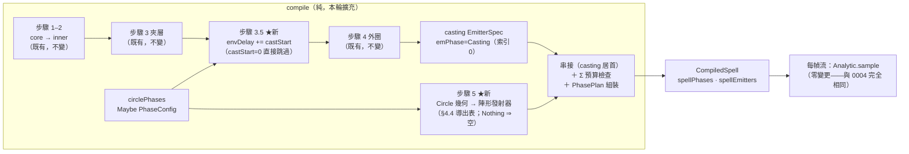

# Func-Spec 0006：生命週期四階段與陣形發射器（Lifecycle Phases & Formation Emitters）

> 狀態：已完成（2026-08-13，驗收紀錄見 §10）
> 性質：一般 —— `Phase`/`PhasePlan` 交付後成為凍結詞彙，供未來力場 spec（`FieldState` 的階段感知）與多陣合成 spec 引用，但本 spec 不是它們的動工門檻。
> 前置依賴：spec 0002／0003／0004（皆**已完成**）。**與 spec 0005 平行**：0005（設計定案，待實作）鎖定 `src/boundary/Magic/Interface.hs`、`app/*` 全部、`bench/*` 與 cabal 的 executable/benchmark stanza——本 spec 檔案清單與之**零交集**（§0.2 附盤點證明），兩 spec 可同時認領實作。
> 依據：[architecture.md](../arch/architecture.md) §3.3（四階段生命週期、「魔法陣本身的幾何就是繪製階段的粒子來源」、空陣 skip 規則）、§4.4（`spellPhases`/`phase` 草圖）、§6 步驟 5（`Circle 幾何 → Vector EmitterSpec`）、§10（「新生命週期階段」擴充點）；ADR-0003（陣形幾何依槽位固定職責導出）；0002 §4.4（`spellEmitters` 的 `Vector` 明文為本 spec 預留）
> 範圍：回答 Init.md 的核心提問「如何先生成魔法陣（粒子），再收束發出粒子魔法」。魔法獲得完整的四階段弧線：**Drawing（繪陣）→ Converging（收束）→ Casting（發動）→ Dissipating（消散）**，陣形粒子由 `Circle` 的幾何直接導出。**取樣器 `Analytic.hs` 一行不改**——全部階段機制編譯成既有取樣詞彙（§2 核心洞察）。

---

## 0. 起點：引用的凍結介面、檔案盤點

### 0.1 引用的凍結介面（0002 §10／0004 §4.7 合約）

| 凍結物 | 本 spec 的用法 |
|---|---|
| `Circle(..)` 永久型別（0002：「只可加欄位」） | 加 `circlePhases :: !(Maybe PhaseConfig)` 欄位（合法加法）；`emptyCircle` 補 `Nothing` |
| `CompiledSpell(..)`（0001 欄位不動、0002 加 `spellEmitters`，「只可加欄位」） | 加 `spellPhases :: !PhasePlan` 欄位——architecture §4.4 草圖的兌現 |
| `EmitterSpec(..)`（0002 §4.4 明文「⚠ 生命週期 spec 擴充：phase 欄位」） | 加 `emPhase :: !Phase` 欄位（純中繼資料，取樣器不讀，§4.2） |
| `spellEmitters :: Vector EmitterSpec`（`Compile.hs` 模組頭註明文「`Vector` 介面為生命週期 spec 的陣形幾何發射器預留」） | 首次長度 > 1。**索引 0 恆為 casting 發射器**——`spellBlend` 讀第一個發射器的既定行為（`Compile.hs`）逐位元不變 |
| `Envelope` 排程語意（`firstBirth`/`particleAge`，0002 凍結：粒子 i 首生於 `delay + (i/count)·lifetime`，循環重生至窗口 `delay + duration` 關閉） | 陣形包絡以公式構造（§4.3 推導鏈），排程語意零變更 |
| `motConverge` 語意（0004 §4.7 凍結：frameEnv，t＝施法秒數；kc=0 全側向塌縮至軸、kc=1 不動） | 編譯器**合成**收束 Expr 的掛載點——陣形收束的全部機制 |
| `Anchor.anchorOffset`（0002 凍結：施法者座標系，骨架期恆 0；取樣端 `Analytic.hs` 已解算 `anchorW = casterPos + toWorld offset`） | 節點發射器首次填非零值（面座標 ±0.35，§4.4）——機械路徑既存，僅編譯器開始使用 |
| `sampleShape :: FaceShape -> …`（0002 永久擴充點，四形狀幾何 property 已測） | 陣形環帶（`Ring`）與槽位形狀預覽的取樣，零新幾何碼 |
| `compile :: Circle -> Either CompileError CompiledSpell`、`sample :: CompiledSpell -> CastContext -> Time -> ParticleBuffer` | 簽名皆不變 |
| `budgetCap = 4096`、`BudgetExceeded`（0002） | 總預算檢查改為 Σ 全部發射器（§4.4），錯誤型別不變 |
| JSON schema v1 全部既有 tag（0002/0004 凍結） | 零新 rune tag。新增 circle 層級選配 `"phases"` 鍵（缺鍵＝`null`＝`Nothing`，§4.5）——v1 純擴充 |
| `elementAppearance`（0002：本質影響外觀的唯一封閉面） | 陣形外觀由它導出（起色＋端點 alpha 清零），不新增元素表 |

### 0.2 檔案盤點（SKILL.md 規則 4——與 0005 平行的零交集證明）

**修改**：`src/core/Magic/Circle.hs`（加欄位＋`PhaseConfig`）、`src/core/Magic/Compile.hs`（本 spec 全部新機制的落點）、`src/boundary/Magic/Codec.hs`（`"phases"` 表面）、`particle-magic.cabal`（僅 test-suite `other-modules` 加行）、`SKILL.md`（索引行）。
**新增**：`assets/spells/grand-sigil.json`、`assets/spells/bare-sigil.json`、測試 7 檔（§8）。
**明文不碰**：`Magic/Rune.hs`（**零新符文**——phases 不是符文，是陣的屬性，見 §2）、`Magic/Particle/Analytic.hs`（**取樣器零變更**——本 spec 最強的風險控制）、`Magic/Particle/Buffer.hs`、`Magic/Expr*`、`Magic/Types.hs`、`Magic/Step.hs`、`Magic/Interface.hs`、`app/*`、`bench/*`。

0005 §0.3 清單（`Interface.hs`、`app/Main.hs`、`app/App/*`、`bench/Bench.hs`、cabal exe/benchmark stanza）：**一個都不碰** ✔。0005 也不碰本清單任何模組檔 ✔（0004 已完成，其鎖定已解除）。

**共用檔協調備註**（沿用 0005 §0.3 的規則）：`particle-magic.cabal` 的 `test-suite spec` `other-modules` 兩 spec 都純加行——合併規則為兩組行的**聯集**，後合併者負責；`SKILL.md` 索引表逐行聯集。皆為機械操作，零語意風險。

**既有測試的機械適配**（`Circle` 加欄位觸及完整 record 建構處；斷言語意一字不得變）：

- `test/SampleSpec.hs`、`test/CompileExprSpec.hs`、`test/CircleSpec.hs` 中以完整 record 語法建構 `Circle` 之處補 `circlePhases = Nothing`（以 `emptyCircle {…}` record update 寫的建構自動存活）。
- `test/CircleCodecSpec.hs` 的 `genCircle` 產生器：本輪維持恆產 `circlePhases = Nothing`——phases 的 roundtrip property 覆蓋放在新的 `PhaseCodecSpec`（§8 S2），把舊檔觸碰面壓到最小。
- 被適配的測試檔清單列入 §10 驗收紀錄；`Magic.Project`、0001 殼層測試、0003 Expr 測試零觸碰。

**新範例的拾取機制**：0005 的 `Main.hs` 啟動時掃描 `assets/spells/*.json` 組成切換清單——兩份新範例在 0005 落地後**自動**出現在 ←/→ 循環中，本 spec 零外殼變更。若實作時 0005 尚未合併，手動驗收走 0001 的熱重載路徑（覆寫 `empty.json` 內容）——兩條路都不需要動 `app/*`。

---

## 1. 目標與完成定義

```
grand-sigil.json → loadCircle → castSpell
  t ∈ [0, draw)              Drawing：陣形粒子沿魔法陣幾何（邊界環、槽位環帶、節點、中心）浮現駐留
  t ∈ [draw, draw+converge)  Converging：陣形粒子側向塌縮向中軸，恰於 castStart 死盡於軸上
  t ≥ castStart              Casting：主效果發射器啟動（既有 casting 語意整體延後 castStart 秒）
  生成窗關閉後                Dissipating：最後一批粒子自然死盡（既有包絡尾端的命名，零新機制）
```

完成定義（可驗證條件）：

1. **四階段弧線**：兩份新範例經 headless 取樣可斷言各階段時窗的粒子集非空且可區分（位置分佈／數量特徵）；`isFinished` 於 `ppEnd` 翻轉。
2. **相容性法則**（本 spec 的第一公民，S3/S6 測試釘死）：

   > 任何 `circlePhases = Nothing` 的 `Circle`（等價地：任何不含 `"phases"` 鍵的 v1 JSON），其 `compile` 產物滿足 `spellEmitters` 長度 1、`spellPhases` 退化（`ppDrawEnd = ppConvergeEnd = 0`），且對所有 `(ctx, t)`，`sample` 輸出與 0004 時代**逐位元相等**。

   實作保證：`castStart = 0` 時 casting 路徑**直接分支跳過位移**（不做 `delay + 0` 這類算術改寫）、不產生任何陣形發射器。證明手段＝0002/0004 全部既有測試（`SampleSpec`/`CompileFoldSpec`/`Acceptance2Spec`/`Acceptance4Spec` 已把行為釘成數值）持續全綠＋新 `BackCompatSpec` 對 7 份真實 assets 斷言結構事實。
3. **空陣 skip 規則以資料實現**：architecture §3.3「全空 Circle 跳過 Drawing/Converging」＝退化 `PhasePlan`（界標 0），`phaseAt` 對 t≥0 直接落在 Casting/Dissipating——**不是特例分支**，是 `Maybe PhaseConfig` 的 `Nothing` 自然結果。
4. **確定性保持**：同 `(Circle, CastContext, Time)` 逐位元同輸出；陣形粒子的隨機性只來自既有 `hashChan`。
5. `cabal build all && cabal test` 全綠（既有 suite 僅允許 §0.2 的機械適配）；開窗手動 smoke 目視四階段（結果回填 §10）。

---

## 2. 使用到的架構與技巧

**核心洞察（整份 spec 的支點）**：四階段生命週期的全部機制都能**編譯成既有取樣詞彙**，因此取樣器 `Analytic.hs` 一行不改，`sample` 的凍結語意自動延續到新階段。風險據此集中在 `Compile.hs` 的公式正確性與 `Codec.hs` 的相容性——搭建順序（§7）以此排定。

| 生命週期機制 | 編譯成的既有詞彙 | 說明 |
|---|---|---|
| Casting 整體延後 | `envDelay += castStart` | `PhaseRune` 既有的包絡位移語意（`applyBridge`）；兩者**加法合成**（§4.3 法則 L2） |
| Converging 收束 | 編譯器合成 `motConverge` Expr | 0004 的收束幾何（kc→0 側向塌縮至軸）語意精確吻合「陣形粒子向核心收束」；frameEnv 的 t＝施法秒數正好是絕對時間軸，`clamp((castStart−t)/converge, 0, 1)` 直接可寫 |
| 陣形出生位置 | 既有 `SpawnOnShape`（`Ring` 薄環帶）＋`SpawnAtAnchor 0`（定點） | `sampleShape` 是 0002 的永久擴充點，零新幾何碼 |
| 節點定位 | per-emitter `Anchor.anchorOffset` | 取樣端解算既存（0002 交付）、編譯器首次填非零值；零新 `SpawnPattern` 建構子 |
| 陣形死亡時刻 | 包絡公式 `formEnv`（§4.3 推導鏈） | 由凍結的排程語意推導：最後一批恰於 `castStart` 死盡——收束把死點拉到軸上，與 casting 出生點重合，階段交界連續無跳變 |
| 陣形淡出 | 陣形 `ColorRamp` 端點 alpha 歸 0 | 逐粒子 life ramp 天然淡出，無 popping；循環重生呈儀式感的脈動 |
| Dissipating | 既有包絡尾端的**命名** | `phaseAt` 對「生成窗已關、最後一批未死盡」的時段給名字，零新機制 |

其餘設計選擇：

| 項目 | 選擇 | 理由 |
|---|---|---|
| 階段表示 | **時間分類，非狀態機**：`PhasePlan` 四個絕對界標＋`phaseAt` 純分類函數 | architecture §3.3「階段切換由時間驅動…整個生命週期仍是 t 的純函數」；退化計畫＝舊行為，skip 規則零分支 |
| phases 進出 JSON | **opt-in**：circle 物件內選配 `"phases"` 鍵（**使用者裁決 2026-08-13**） | 自動導出（有陣即繪陣）會讓既有 6 份非空陣範例突然長出陣形，相容性法則破毀；opt-in 下繪陣是玩家主動宣告的儀式。version 維持 1 純擴充 |
| phases 不是符文 | `PhaseConfig` 掛在 `Circle` 頂層，定義於 `Magic.Circle` | ADR-0003 的槽位承載「魔法語意」（本質/行為/調變/展現）；繪陣時長是**陣的展開方式**，不屬於任何一環的職責——放槽位反而破壞固定職責語意 |
| Dissipating 無參數 | 不設 `"dissipate"` 欄位（**使用者裁決 2026-08-13**） | 逐粒子 ramp 已處理淡出；可調整體消散拖尾需新外觀機制，範圍膨脹，列 §9 |
| 邊界環恆繪 | phases 存在即畫陣外輪廓環，槽位全空也畫（**使用者裁決 2026-08-13**） | 「陣」本身總有個形；空陣＋phases 也看得到儀式感（`bare-sigil.json` 即此判例） |
| 測試策略 | property 為主（phaseAt 全函數性、包絡推導鏈、收束單調性、相容性法則）＋7 份真實 assets 的回歸判例 | 沿用 0002「幾何 property」與 0004「機械證明」手法 |

---

## 3. 模組變更總覽

```
src/core/Magic/Circle.hs     + PhaseConfig（新型別）；Circle + circlePhases 欄位
src/core/Magic/Compile.hs    + Phase / PhasePlan / phaseAt（新凍結詞彙）
                             + EmitterSpec.emPhase、CompiledSpell.spellPhases 欄位
                             + fold 步驟 3.5（casting 包絡位移）與步驟 5（陣形發射器導出）
                             + 總預算 Σ 檢查
src/boundary/Magic/Codec.hs  + "phases" 鍵的解碼/驗證/編碼
（其餘模組零變更；Analytic/Rune/Expr/Types/Buffer/Step/Interface/app 全部不碰）
```

---

## 4. ADT

### 4.1 `Magic.Circle` 的加法（永久型別）

```haskell
-- | Lifecycle staging of the drawn circle (architecture §3.3). Not a rune:
-- it is a property of the circle as a whole, not of any slot's meaning.
data PhaseConfig = PhaseConfig
  { phDraw :: !Seconds
  -- ^ Drawing-phase length; Codec validates > 0.
  , phConverge :: !Seconds
  -- ^ Converging-phase length; Codec validates >= 0 (0 = instant snap).
  }
  deriving (Eq, Show)

data Circle = Circle
  { … 既有四欄位不變 …
  , circlePhases :: !(Maybe PhaseConfig)
  -- ^ Nothing = instant cast (the compatibility law; emptyCircle uses it).
  }
```

### 4.2 `Magic.Compile` 的加法（交付後凍結）

```haskell
-- | The four lifecycle stages (architecture §3.3). Extensible sum.
data Phase = Drawing | Converging | Casting | Dissipating
  deriving (Eq, Show, Enum, Bounded)

-- | Absolute time landmarks (seconds since cast).
-- Invariant: 0 <= ppDrawEnd <= ppConvergeEnd <= ppCastingEnd <= ppEnd.
data PhasePlan = PhasePlan
  { ppDrawEnd     :: !Seconds  -- ^ = phDraw           (degenerate: 0)
  , ppConvergeEnd :: !Seconds  -- ^ = castStart        (degenerate: 0)
  , ppCastingEnd  :: !Seconds  -- ^ = castStart + envDelay + envDuration（casting 生成窗關閉）
  , ppEnd         :: !Seconds  -- ^ = spellLifetime（不變量：兩者相等，S3 property 釘死）
  }
  deriving (Eq, Show)

-- | Total classification function; t < 0 classifies as t = 0.
phaseAt :: PhasePlan -> Time -> Phase

data EmitterSpec  = EmitterSpec  { … 既有 … , emPhase :: !Phase }
data CompiledSpell = CompiledSpell { … 既有 … , spellPhases :: !PhasePlan }
```

`emPhase` 是**純中繼資料**：標記發射器所屬階段（陣形＝`Drawing`、主效果＝`Casting`），取樣器不讀它——時間分類一律走 `phaseAt`。`Converging`/`Dissipating` 不作為發射器標籤（無專屬發射器，它們是時段的名字）。

### 4.3 階段時間軸語意（本文件的心臟）

```
castStart = phDraw + phConverge                    -- circlePhases = Nothing 時 castStart = 0

casting 發射器（fold 步驟 3.5）：
  emSpawn = 既有 fold 結果的 envelope，envDelay += castStart
  castStart = 0 時：程式路徑直接跳過位移（相容性法則的實作保證）

spellLifetime = castStart + (delay + duration + lifetime)
  = max 所有發射器的死盡時刻（陣形終點 castStart ≤ casting 終點，故 max 即 casting 終點）

陣形包絡（castStart > 0 時；phDraw > 0 保證 castStart > 0）：
  formLife = min 0.6 (castStart / 2)
  formEnv  = Envelope { envDelay = 0, envDuration = castStart − formLife, envLifetime = formLife }

陣形收束（phConverge > 0 時）：
  kcExpr = clamp((castStart − t) / phConverge, 0, 1)
         = Fun3 FClamp (Bin Div (Bin Sub (Lit castStart) (Var VarT)) (Lit phConverge)) (Lit 0) (Lit 1)
  phConverge = 0 ⇒ motConverge = Nothing（不合成，避免除零路徑）
```

> ⚠ **修訂註記（2026-08-15，func-spec 0017／ADR-0015）**：下方推導鏈的**第 2 步與第 3 步已被撤銷**。陣形不再於 `castStart` 死盡，而是駐留到 `ppEnd`（`envDuration = ppEnd − formLife`）；`kcExpr` 不再合成，陣形 `motConverge` 恆為 `Nothing`，陣待在它被畫出來的位置而不塌縮。第 1 步（全部索引都會出生）與第 4 步（`formLife` 封頂 0.6s 帶來的脈動）**仍然成立且原封不動**——`envDelay` 與 `envLifetime` 的算式一字未改，所以畫陣的節奏就是本節寫的這個。另註：本節原本的 `envDuration` 在 `phConverge < formLife` 時會早於 `phDraw` 關閉生成窗（`bare-sigil` 即為此例：0.9s < 1.0s），使陣在畫完前就開始消散——這個未被察覺的行為一併由 0017 修掉。

**陣形包絡推導鏈**（實作者請複核；由 0002 凍結的排程語意逐步推出）：

1. 首生錯開跨度＝`envLifetime`＝`formLife`；`formLife ≤ castStart − formLife`（因 `formLife ≤ castStart/2`）＝`envDuration`，故**全部索引都會出生**（錯開跨度不超過生成窗）。
2. 最後一批出生時刻 < `envDuration`，其死亡 ≤ `envDuration + formLife = castStart`——**陣形粒子恰於 `castStart` 全數死盡**，Casting 起點與陣形殘影零重疊。
3. 收束曲線在 `t ≤ phDraw` 時 `kc = 1`（Drawing 期間陣形原地駐留）、`t = castStart` 時 `kc = 0`（側向全塌縮至軸）——死點被拉到軸上，與 casting 發射器的出生點（anchor 軸）重合，**階段交界位置連續**。
4. `formLife` 封頂 0.6s：長 `phDraw` 下粒子仍以短生命循環重生（脈動閃爍的儀式感），且 ramp 淡出週期短、無長尾殘影。

**語意法則**（S3/S5 測試釘死）：

- **L1（位移純平移）**：casting 發射器除 `envDelay` 外逐欄位不變；有 phases 時 `envDelay` 恰增 `castStart`。
- **L2（PhaseRune 加法合成）**：`PhaseRune shift` 與 phases 並存時 `envDelay = shift + castStart`（兩個位移相加，順序無關）。
- **L3（調變層時間框不變）**：casting 的 `converge`/`amplify` Expr 仍以 frameEnv（t＝施法秒數）求值——**含繪陣前奏**。這與 `PhaseRune` 的既有語意一致（0004 凍結：位移包絡不位移調變時間軸），本 spec 明文為法則而非巧合。
- **L4（行為層時間框不變）**：casting 粒子的 `Formula` 軌跡仍以粒子年齡求值，年齡從該粒子出生起算——位移包絡自動使年齡歸零點後移，公式語意不變。

### 4.4 陣形幾何導出表（fold 步驟 5；常數全部釘死）

面座標系（0002 凍結）：x＝face right、y＝face up、z＝沿法線。所有陣形發射器 anchor 法線同 casting（+Z）。

| 幾何元素 | 產生條件 | SpawnPattern / Anchor | count |
|---|---|---|---|
| 邊界環（陣外輪廓） | phases 存在即**恆有** | `SpawnOnShape (Ring 1.45 1.55)`，anchor 原點 | 96 |
| 外圈 B 槽 | 槽被佔用 | 名目半徑 1.30 的薄環帶 `Ring 1.25 1.35`；**例外：`ShapeRune s` 槽改為 `SpawnOnShape s`**（預覽玩家畫的初始面） | 64 |
| 外圈 A 槽 | 同上 | 名目半徑 1.15，`Ring 1.10 1.20`（同上例外） | 64 |
| 夾層槽 | 槽被佔用 | 名目半徑 1.00，`Ring 0.95 1.05` | 64 |
| 內圈 B 槽 | 槽被佔用 | 名目半徑 0.85，`Ring 0.80 0.90`（`ShapeRune` 例外不適用——內圈無 ShapeRune） | 64 |
| 內圈 A 槽 | 同上 | 名目半徑 0.70，`Ring 0.65 0.75` | 64 |
| 四節點 | 該節點被佔用 | `SpawnAtAnchor 0`，`anchorOffset`＝北 `V3 0 0.35 0`／南 `V3 0 (−0.35) 0`／東 `V3 0.35 0 0`／西 `V3 (−0.35) 0 0` | 各 12 |
| 核心中心 | `coreCenter` 被佔用 | `SpawnAtAnchor 0`，anchor 原點 | 16 |

共同欄位：`motTraject = Forward 0`（靜置駐留）、`motRadiation = AlongNormal`、`motDrift = V3 0 0 0`、`motRange = Nothing`、~~`motConverge = Just kcExpr`（`phConverge = 0` 時 `Nothing`）~~ → **`motConverge = Nothing` 恆真**（func-spec 0017／ADR-0015 D2）、`emSpawn = formEnv`、`emPhase = Drawing`。

> ⚠ **修訂註記（2026-08-15）**：本表的**幾何欄位**（`SpawnPattern` 那一欄）已由 func-spec 0016 整體取代——陣形幾何改由 `Magic.Sigil.sigilPlan` 從魔法陣自身導出，不再是固定的同心環帶；四節點與中心的座標表與粒子數則原樣沿用。`emPhase = Drawing` 保留，它同時是力場層的判準（ADR-0010 D6），使駐留中的陣不被力場吹歪。外觀：`elementAppearance` 該元素的 `rampStart` 為起色、終色＝同 RGB 而 **alpha 清零**、`appSize = 0.03`、`appBlend` 同元素（整發 spell 單一 blend，`spellBlend` 語意不變）、`appAmplify = Nothing`。

註：定點發射器（節點/中心）的粒子恆在自身 anchor 軸上，收束對它們是恆等變換——Converging 的視覺主體是環帶的塌縮，定點光斑駐留至 `castStart` 死盡（ramp 淡出），此為預期行為、明文於此。

**預算**：`spellBudget = Σ emCount`（casting＋全部陣形）；總量 > `budgetCap` ⇒ `BudgetExceeded 總量 4096`（既有錯誤型別）。陣形滿編＝96＋5×64＋4×12＋16＝480，故帶 phases 的陣 casting 粒子上限實際為 4096−480＝3616（`essPower` 上限從 16.0 降至約 14.1）——**此可觀察差異僅影響帶 phases 的陣**，無 phases 者不變。

### 4.5 JSON schema（v1 純擴充）

```json
{
  "version": 1,
  "name": "grand-sigil",
  "circle": {
    "phases": { "draw": 1.2, "converge": 0.6 },
    "outer": [ … ], "bridge": …, "inner": [ … ], "core": { … }
  }
}
```

規則：`"phases"` 缺鍵或 `null` ⇒ `Nothing`（既有 7 份 assets 全部走此路）；`draw` 必填且 > 0、`converge` 必填且 ≥ 0（Codec 層驗證，沿用 `positive`/`nonNegative` 手法，錯誤含 JSON 位置；核心零防禦檢查）；`saveCircle` 對 `Nothing` 輸出 `"phases": null`（與既有空槽編碼規則一致）；roundtrip property 延伸涵蓋（`PhaseCodecSpec`）。

---

## 5. 資料流（pipeline）



純/IO 分界不變：本 spec 全部變更都在純核心與純邊界層內。

---

## 6. 資料結構與儲存方式

| 資料 | 位置 | 生命週期 |
|---|---|---|
| `PhaseConfig` | `Circle` 欄位（玩家資料） | 隨 JSON 載入/儲存 |
| `PhasePlan`、合成的 `kcExpr`、`formEnv` | `CompiledSpell` 內（編譯期常量） | 編譯時算定，施法期間唯讀——`Motion`/`Appearance` 是資料的既定原則（architecture §4.4）自動延續：含陣形的 spell 仍可序列化、可預算分析 |
| 陣形粒子 | 不存在獨立儲存——與 casting 粒子同走 `sample` 的逐幀重算 | 無跨幀狀態，可重播性不變 |

---

## 7. 搭建方式（風險優先）

| 步驟 | 內容 | 排序理由 |
|---|---|---|
| S1 | `Phase`/`PhasePlan`/`phaseAt`/`PhaseConfig`＋`Circle` 加欄位＋既有測試機械適配 | 詞彙先行；`Circle` 加欄位的適配面最早暴露、最早收斂 |
| S2 | Codec `"phases"` 面（解碼/驗證/編碼/roundtrip） | schema 是對外合約，錯誤最貴；7 份 assets 的載入相容性最早驗證 |
| S3 | fold 步驟 3.5（casting 位移）＋`PhasePlan` 組裝＋lifetime 聚合＋`emPhase`/`spellPhases` 欄位接線 | **相容性法則的實作核心**，全 spec 風險最高點；L1–L4 法則在此釘死 |
| S4 | fold 步驟 5（陣形導出：幾何表、`formEnv`、`kcExpr` 合成、節點 anchor、Σ 預算） | 依賴 S1/S3 的時間軸；純新增碼 |
| S5 | 端到端階段取樣行為（經未改動的取樣器） | 整合驗證：合成資料在凍結取樣語意下的實際行為 |
| S6 | 回歸防線：7 份真實 assets 的結構事實斷言 | 相容性法則的獨立見證（不依賴本輪任何新碼的正確性） |
| S7 | 兩份新範例＋驗收（headless 四階段＋手動 smoke） | 壓軸合成 |

## 8. Todo List 與 1-to-1 測試對應

| ✅ | Todo | 測試模組 | 斷言內容 |
|---|---|---|---|
| ☑ | S1 階段詞彙與 Circle 欄位 | `test/PhasePlanSpec.hs` | `phaseAt` property：全函數（含 t<0）、界標單調不變量、各半開區間分類正確、退化計畫 t≥0 即 Casting（skip 規則）；`emptyCircle` 的 `circlePhases = Nothing`；（meta）機械適配後既有 suite 全綠 |
| ☑ | S2 Codec `"phases"` 面 | `test/PhaseCodecSpec.hs` | 缺鍵/null → `Nothing`；`draw ≤ 0`、`converge < 0`、缺欄位 → 錯誤含 JSON 位置；含 phases 的 `Circle` roundtrip property；`saveCircle` 對 `Nothing` 輸出 null |
| ☑ | S3 casting 位移與 PhasePlan | `test/CompileLifecycleSpec.hs` | 相容性法則結構半（`Nothing` ⇒ 1 發射器＋退化 PhasePlan＋逐欄位等於 0004 公式值）；L1 位移純平移、L2 PhaseRune 加法合成（property）；`spellLifetime == ppEnd` 不變量 property；`emPhase` 標記正確 |
| ☑ | S4 陣形導出 | `test/FormationSpec.hs` | 佔用槽位 ↔ 發射器清單雙射＋邊界環恆有；`formEnv` 公式（推導鏈步驟 1–2 的數值驗證：全索引出生、終點恰 = castStart）；`kcExpr` 在 t=0/phDraw/castStart 求值 = 1/1/0；`phConverge=0` ⇒ `motConverge = Nothing`；節點 anchorOffset 座標表；陣形 ramp 端 alpha=0；`spellBudget = Σ`、超額 → `BudgetExceeded`；索引 0 = casting（`spellBlend` 不變） |
| ☑ | S5 階段取樣行為 | `test/PhaseSampleSpec.hs` | property（經零變更的 `sample`）：Drawing 期陣形粒子存在且落於各自幾何界內（環帶半徑範圍/節點定點）；Converging 期環帶粒子側向距離對 t 單調遞減趨 0；`t ≥ castStart` 陣形粒子零存活；casting 粒子首現不早於 `castStart + delay`；逐位元確定性；`bufferInvariant` 恆成立、count ≤ spellBudget |
| ☑ | S6 回歸防線 | `test/BackCompatSpec.hs` | 7 份真實 assets：載入成功、`circlePhases = Nothing`、compile → 1 發射器＋退化 PhasePlan＋`spellLifetime` 等於 0004 公式值、取樣序列非空時刻集不變；（meta）0002/0004 既有 suite 零紅 |
| ☑ | S7 範例與驗收 | `test/Acceptance6Spec.hs`＋手動 smoke | `grand-sigil`（滿配：phases＋shape＋fire＋節點）與 `bare-sigil`（僅 phases＋空槽：邊界環＋素放）headless 全弧線：四階段各時窗粒子集非空且兩範例可區分；`isFinished` 於 `ppEnd` 翻轉；手動開窗目視四階段（結果回填 §10） |

## 9. 非目標（明確不做）

- **陣形旋轉／動態陣形動畫**：取樣器看不到「出生位置」這個中間量（位置＝anchor＋spawn 偏移＋軌跡的疊加式），旋轉需要新的軌跡機制或取樣器擴充——違反本 spec「取樣器零變更」的風險控制。有視覺需求時另立 spec。
- **`CompiledSpell` 的 `Semigroup`（多陣疊加）**：(1) 零消費者——`castSpell` 收單一 `Circle`，`Interface.hs` 被 0005 鎖定，合併結果無處可用；(2) 兩張 `castStart` 不同的陣其 `PhasePlan` 合併律未明（界標取 max 會產生語意錯誤的分類）；(3) `<>` 無法表達合併後預算超額的 `Either`。留給未來「多陣合成 spec」一併設計（使用者裁決 2026-08-13）；architecture §6 對照表該列已加「未落地」註記。
- **`Anchor` 的玩家面 JSON 控制**：本輪 compile 首次填非零 `anchorOffset`（節點發射器），機械路徑已被證實可用；玩家面表面設計（`"anchor"` 鍵或新符文）與生命週期正交，留小型後續 spec（使用者裁決 2026-08-13）。
- **可調 Dissipating／全域消散拖尾**：需新的全域 alpha 淡出機制（取樣器或編譯器新碼）；逐粒子 ramp 已無 popping（使用者裁決 2026-08-13）。
- **玩家 `ConvergeRune` 驅動陣形收束**：0004 凍結其語意為 casting 發射器專屬（t＝施法秒數的調變曲線）；陣形收束用編譯器合成 ramp，兩者不混——architecture §3.3「收束曲線來自夾層 BridgeRune」的敘述已加修訂註記（玩家夾層收束作用於主效果，陣形收束由 phases 導出）。
- **發射率／動態粒子數模型**：`count` 仍為「同時在池的槽位數」；多階段預算的結構化治理（`ParticleBudget` 型別）留給效能 spec 連同 `budgetCap` 一起設計（0004 §9 既定）。
- 力場層、多 spell 並行、2D 後端、效能（緩衝重用／10k–100k）：各自既定的獨立 spec。

## 10. 驗收紀錄

| 項目 | 結果 |
|---|---|
| S1–S7 完成日期與測試綠燈紀錄 | 2026-08-13 全數完成。`cabal build all` 綠（core / boundary / executable 含 h-raylib / test-suite 皆通過，零新警告）；`cabal test` **381 examples, 0 failures**（0006 前為 309，本輪淨增 72 例）。 |
| 手動 smoke：開窗目視 grand-sigil / bare-sigil 四階段 | **待使用者目視確認**（本輪於 headless 環境實作，無法開窗）。替代證據：headless 逐時刻相位剖面（下表）已證實四階段弧線的數量特徵符合 §1／§4.3 推導。 |
| 相容性法則確認：既有 7 assets 逐位元取樣不變（BackCompatSpec＋既有 suite） | ✔ `BackCompatSpec` 對 7 份 assets 各 3 項斷言全綠（載入＋`circlePhases = Nothing`、1 發射器＋退化 `PhasePlan`＋`spellLifetime` 等於 0004 公式值、取樣窗口首尾空／中段非空）。0002/0004 把行為釘成數值的既有 suite（`SampleSpec`／`CompileFoldSpec`／`Acceptance2Spec`／`Acceptance4Spec`／`SampleExprSpec`）**零紅、零斷言修改**。 |
| 被機械適配的既有測試檔清單與 diff 摘要 | 4 檔，全為補欄位、**斷言語意一字未動**：`test/SampleSpec.hs`（`busyCircle` 補 `circlePhases = Nothing`）、`test/CompileExprSpec.hs`（同）、`test/RuneCodecSpec.hs`（`ExprCircle` 產生器同）、`test/CircleCodecSpec.hs`（§4.7 完整範例的 record 補欄位＋`genCircle` 加 `<*> pure Nothing`，依 §0.2 維持恆產 `Nothing`）。`test/CircleSpec.hs` 實際以 `emptyCircle {…}` 建構，自動存活、未觸碰。 |
| cabal / SKILL.md 與 0005 的聯集合併確認 | ✔ `particle-magic.cabal` 僅於 `test-suite spec` 的 `other-modules` 純加 7 行（`PhasePlanSpec`/`PhaseCodecSpec`/`CompileLifecycleSpec`/`FormationSpec`/`PhaseSampleSpec`/`BackCompatSpec`/`Acceptance6Spec`），0005 的 exe/benchmark stanza 未動；`SKILL.md` 僅改 0006 索引行狀態欄。兩者皆為逐行聯集，無衝突。 |
| 凍結清單：`Phase`/`PhasePlan`/`phaseAt`/`PhaseConfig`/`emPhase`/`spellPhases`/`"phases"` schema——交付即凍結，供力場 spec／多陣合成 spec 引用 | ✔ 已凍結，簽名如下：`data Phase = Drawing \| Converging \| Casting \| Dissipating`（可擴充和）；`PhasePlan{ppDrawEnd, ppConvergeEnd, ppCastingEnd, ppEnd :: !Seconds}`，不變量 `0 ≤ ppDrawEnd ≤ ppConvergeEnd ≤ ppCastingEnd ≤ ppEnd` 且 `ppEnd == spellLifetime`；`phaseAt :: PhasePlan -> Time -> Phase`（全函數，`t < 0` 等同 `t = 0`）；`PhaseConfig{phDraw, phConverge :: !Seconds}` 定義於 `Magic.Circle`；`Circle.circlePhases :: !(Maybe PhaseConfig)`；`EmitterSpec.emPhase :: !Phase`（純中繼資料，取樣器不讀）；`CompiledSpell.spellPhases :: !PhasePlan`；JSON `"phases": {"draw": Double > 0, "converge": Double ≥ 0}`（缺鍵／`null` ⇒ `Nothing`，v1 純擴充）。**`spellEmitters` 索引 0 恆為 casting 發射器**亦一併凍結（`spellBlend` 依賴）。 |

### Headless 相位剖面（手動 smoke 的替代證據，seed 42、facing +Y）

`grand-sigil`（draw 1.2 / converge 0.6 / `PhaseRune` 再 +0.3；`PhasePlan{1.2, 1.8, 6.1, 8.1}`，budget 840 ＝ casting 384 ＋ 陣形 456）：

```
t=0.0  Drawing     n=9      t=1.79 Converging n=6     ← 陣形恰在 castStart 前死盡
t=0.6  Drawing     n=456    t=1.8  Casting    n=0     ← 交界零殘影；casting 尚在 +0.3 位移中
t=0.9  Drawing     n=456    t=4.0  Casting    n=365
t=1.2  Converging  n=447    t=6.5  Dissipating n=307
t=1.5  Converging  n=219    t=8.1  Dissipating n=0    ← isFinished 於 ppEnd 翻轉
```

`bare-sigil`（僅 phases＋全空槽；`PhasePlan{1.0, 1.5, 9.5, 11.5}`，budget 352 ＝ 素放 256 ＋ 邊界環 96）：邊界環於 Drawing 期滿編 96（t=0.6／0.9），Converging 期塌縮至 48（t=1.2），`t = 1.5`（castStart）陣形歸零、素放接手 n=1 起算。**兩範例的發射器組成與數量特徵明顯可區分**（`Acceptance6Spec` 以此斷言）。

實作備註：`ppCastingEnd`/`ppEnd` 由**已含 castStart 的** `envDelay` 直接推得（`delay + duration [+ lifetime]`），不再二次加 `castStart`——步驟 3.5 已把前奏烘進 `envDelay`，退化情形（`castStart = 0`）自然還原成 0004 公式。
