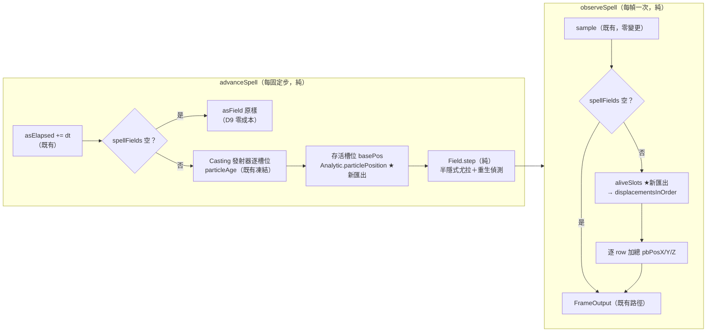

# Func-Spec 0007：力場層（Force-Field Layer）

> 狀態：已完成（2026-08-14 交付，驗收紀錄見 §10）
> 性質：一般 —— `ForceField`／`FieldState`／`Field.step` 交付後成為凍結詞彙，供未來效能 spec（`FieldState` SoA 化）與多陣合成 spec 引用，但本 spec 不是它們的動工門檻。
> 前置依賴：**spec 0006（需已完成）**。本 spec 修改 `Circle.hs`／`Compile.hs`／`Codec.hs`——恰為 0006 §0.2 修改清單的全集，SKILL.md 規則 4 禁止平行修改同一模組檔，故 **0006 完成驗收前不得動工**；且本 spec 直接引用 0006 交付後凍結的 `Phase`/`emPhase` 詞彙（ADR-0010 D6）。設計以 0006 §10 承諾凍結的介面為準，現在定案；動工等門檻解除。
> 依據：[ADR-0001](../adr/adr-0001-hybrid-particle-model.md)（混合模型的力場半邊）、[ADR-0010](../adr/adr-0010-force-field-composition.md)（本輪新立：組合點語意 D1–D9，本文件處處引用）、[architecture.md](../architecture.md) §3.2（每幀流的 FieldStep 分支）、§4.6（`step` 簽名草圖）、§7（僅場對粒子）、§8.3（熱重載政策）、§11（固定時步公理）
> 範圍：ADR-0001 混合模型的另一半落地——系統第一個跨幀狀態。帶 `circleFields` 的魔法陣，粒子渲染位置＝解析位置＋確定性場位移（重力／點吸引子／渦流）；零場的陣逐位元不變。**`app/*` 零觸碰**——每步積分天然發生在 0005 交付的 `advanceSpell ×n` 迴圈內。

---

## 0. 起點：引用的凍結介面、檔案盤點

### 0.1 引用的凍結介面

| 凍結物 | 本 spec 的用法 |
|---|---|
| `Circle(..)`（0002：「只可加欄位」；0006 已加 `circlePhases` 先例） | 加 `circleFields :: ![ForceField]` 欄位；`emptyCircle` 補 `[]` |
| `CompiledSpell(..)`（「只可加欄位」） | 加 `spellFields :: ![ForceField]`——`compile` 內純直通（`= circleFields circle`），**不進 fold 任何步驟** |
| `EmitterSpec.emPhase :: Phase`／`Phase(..)`（0006 交付後凍結） | 力場只作用於 `emPhase == Casting` 的發射器（ADR-0010 D6） |
| `Envelope` 排程／`particleAge`（0002 凍結：回傳 `Maybe Double`，循環重生） | 存活判定與世代（重生）偵測的**唯一真相來源**（ADR-0010 D3） |
| `sample :: CompiledSpell -> CastContext -> Time -> ParticleBuffer`（凍結簽名） | 零變更；`observeSpell` 在其輸出上疊加位移 |
| `castSpell`/`stepSpell`/`isFinished`/`spellAge`＋`advanceSpell`/`observeSpell`（0001/0005 凍結）與分解定律 `stepSpell fi s ≡ let s' = advanceSpell fi s in (s', observeSpell s')` | **簽名一律零變更**。`ActiveSpell`（不透明）加內部欄位 `asField`；`advanceSpell` 內部多做場積分、`observeSpell` 內部多做疊加；分解定律結構性延續（S7 重驗） |
| `ParticleBuffer` 六欄 SoA（ADR-0006） | 疊加輸出仍是同一型別，只逐 row 加總 `pbPosX/Y/Z`；`bufferInvariant` 不變 |
| `Magic.Step.plan`／`App.Loop` 的 `advanceSpell ×n、observeSpell ×1`（0005 交付） | **殼層零變更**——「每固定步積分、每幀觀測」的載體既已存在 |
| `Magic.Types` 的 `V3` 算術／`basisFromNormal`／`hashChan`（0001 凍結） | `fieldAccel` 純數學地基；力場不引入新隨機性 |
| `budgetCap`／`BudgetExceeded`（0002） | 力場不新增粒子，預算零觸碰 |
| JSON schema v1（0002/0004/0006 tag 集） | 零新 rune tag；circle 層級新增選配 `"fields"` 陣列（缺鍵＝`[]`）——v1 純擴充 |

### 0.2 檔案盤點（與 0006 的交集明文宣告）

**修改**：`src/core/Magic/Rune.hs`（+`ForceField` 型別——與 `Envelope`/`Trajectory` 同居，参數詞彙所在地）、`src/core/Magic/Circle.hs`（+`circleFields`）、`src/core/Magic/Compile.hs`（+`spellFields` 直通）、`src/core/Magic/Particle/Analytic.hs`（**加法式重構**，見 §2）、`src/boundary/Magic/Codec.hs`（+`"fields"` 面）、`src/boundary/Magic/Interface.hs`（`ActiveSpell` 加不透明欄位；**export 清單零變更**——`ForceField` 經 `Circle` 進出，`FieldState` 完全不對外）、`particle-magic.cabal`（`magic-core` `exposed-modules` 加 `Magic.Particle.Field`；test-suite `other-modules` 加行）、`SKILL.md`（索引）。
**新增**：`src/core/Magic/Particle/Field.hs`、`assets/spells/gravity-well.json`、測試 9 檔（§8）。
**明文不碰**：`Magic/Particle/Buffer.hs`、`Magic/Expr*`、`Magic/Types.hs`、`Magic/Step.hs`、**`app/*` 全部**、`bench/*`。

**與 0006 的交集**：`Circle.hs`／`Compile.hs`／`Codec.hs` 三檔重疊（0006 §0.2 的修改清單），另 `Rune.hs`/`Analytic.hs`/`Interface.hs` 亦屬核心敏感面——**因此本 spec 的動工門檻＝0006 驗收完成**（規則 4 的合規形式：先後而非平行）。cabal 與 SKILL.md 沿用聯集合併規則。

**既有測試的機械適配**：`Circle` 加欄位觸及完整 record 建構處（0006 實作後以其交付現況為準盤點；`emptyCircle {…}` record update 寫法自動存活）。`genCircle` 產生器本輪維持 `circleFields = []`，fields 的 roundtrip 覆蓋放新的 `FieldCodecSpec`。斷言語意一字不得變；適配清單回填 §10。

---

## 1. 目標與完成定義

```
gravity-well.json → loadCircle → castSpell
  粒子自陣心射出後被 Gravity 下拉、被 PointAttractor 彎折——
  渲染位置 = 解析位置 + 場位移（半隱式尤拉逐步積分）
  同一 circle 但 "fields": [] 的對照組 = 0007 之前的行為，逐位元不變
```

完成定義（可驗證條件）：

1. **場生效**：帶 `circleFields` 的 spell，粒子位置隨 dt 序列被場連續偏折；三種場（Gravity/PointAttractor/Vortex）各自的幾何性質可被 property 斷言（§8 S2）。
2. **零場相容律**（ADR-0010 D9，S6 釘死）：`circleFields = []`（＝任何不含 `"fields"` 鍵的 v1 JSON，含既有全部 assets）時 `advanceSpell`/`observeSpell` 與 0007 之前**逐位元相等**，且結構性跳過場計算（分支，非算後恆等）。
3. **不 teleport**（ADR-0010 D3，S8 釘死）：任何粒子在（重）出生的那一步，渲染位置＝解析位置（`disp = 0`）。
4. **決定論/重播**（ADR-0010 D7）：同 `(Circle, CastContext, dt 序列)` 兩次執行逐位元同輸出；重施法/熱重載後 `asField` 歸零（D8）。
5. **分解定律延續**：帶場範例上 `stepSpell ≡ advance; observe` property 照舊成立（S7）。
6. `cabal build all && cabal test` 全綠（既有 suite 僅允許 §0.2 的機械適配）；手動 smoke 目視有場 vs 無場可分辨（回填 §10）。

---

## 2. 使用到的架構與技巧

| 項目 | 選擇 | 理由 |
|---|---|---|
| 組合點 | 相加式位移覆蓋：`renderedPos = analyticPos + disp`（ADR-0010 D1） | 解析層凍結語意零變更；場是疊加在其上的獨立層，兩層各自可測 |
| 積分器 | 半隱式尤拉，每槽位 `(vel, disp)`（使用者裁決 2026-08-13） | 遊戲物理標準折衷：穩定、O(1)/粒/步、重力有拋物線手感；能量長時漂移列已知限制 |
| 身分模型 | `FieldState` 鍵＝穩定 `(emitterIndex, particleIndex)`（ADR-0010 D2） | buffer row 每幀變動不可為鍵；`(emitter, i)` 是編譯期常量空間 |
| 重生偵測 | 年齡單調性破壞（`age < lastAge`）＋死亡歸零（ADR-0010 D3） | 不碰 `Envelope`/排程凍結語意；重生瞬間 `disp = 0` 構造性成立 |
| row 對齊 | **Analytic 加法式重構**：抽出 `particlePosition`（單粒子位置公式）與 `aliveSlots`（存活槽位列舉，即 buffer row 順序），`sample` 內部改用之、輸出逐位元不變 | 單一事實來源：場積分要餵 basePos、疊加要對齊 row，兩者都不得複製 `sample` 的公式/列舉邏輯（防漂移）——本 spec 最高風險點，故 S1 最先做 |
| 模組邊界 | `Field.hs` 只依賴 `Magic.Types`（不依賴 Compile/Analytic）；`Interface` 負責餵 `(age, basePos)` | 維持 architecture §2 模組圖的依賴方向；`Field` 可孤立測試 |
| 每步 vs 每幀 | 積分在 `advanceSpell`（每固定步）、疊加在 `observeSpell`（每幀一次） | 0005 的 advance×n/observe×1 結構天然吻合固定時步公理；`plan` 的 maxSteps clamp 天然是成本上限 |
| 相位過濾 | 只積分/疊加 `emPhase == Casting` 的發射器（ADR-0010 D6，使用者裁決） | 陣形幾何可讀性＋成本；無 phases 時自動 no-op |
| JSON 面 | circle 層級選配 `"fields"` 陣列，缺鍵＝`[]` | 沿 0006 `"phases"` 先例；v1 純擴充、相容律自然成立 |
| 測試策略 | property 為主（加速度幾何性質、拋物線收斂、歸零律、相容律、重播律）＋對照組判例 | 沿用 0002 幾何 property／0006 相容性法則手法 |

---

## 3. 模組變更總覽

```
src/core/Magic/Rune.hs               + ForceField（新 extensible sum；參數詞彙與 Envelope/Trajectory 同居）
src/core/Magic/Circle.hs             + circleFields 欄位
src/core/Magic/Compile.hs            + spellFields 直通欄位（不進 fold）
src/core/Magic/Particle/Field.hs     ★新模組：fieldAccel / SlotState / stepSlot / FieldState / step / displacementsInOrder
src/core/Magic/Particle/Analytic.hs  加法式重構：+particlePosition / +aliveSlots；sample 輸出逐位元不變
src/boundary/Magic/Codec.hs          + "fields" 解碼/驗證/編碼
src/boundary/Magic/Interface.hs      ActiveSpell + asField（不透明）；advanceSpell/observeSpell 內部擴充，簽名/export 零變更
（Buffer/Expr/Types/Step/app/bench 零變更）
```

---

## 4. ADT

### 4.1 `Magic.Rune` 加法（永久型別）

```haskell
-- | Force fields acting on casting-phase particles (ADR-0010). World-space,
-- static parameters (v1); field-to-particle only (architecture §7).
data ForceField
  = -- | Constant world-space acceleration (units/s²).
    Gravity !V3
  | -- | Center, strength (>0 attracts, <0 repels; magnitude at distance 1),
    -- softening (>0; accel = strength · normalize(c−p) / (dist² + soft²)).
    PointAttractor !V3 !Float !Float
  | -- | Center, axis (normalized internally), tangential strength,
    -- radial falloff (>=0; 0 = no falloff with off-axis distance).
    Vortex !V3 !V3 !Float !Float
  deriving (Eq, Show)
```

### 4.2 `Magic.Circle`／`Magic.Compile` 加法

```haskell
data Circle        = Circle        { …既有（含 circlePhases）… , circleFields :: ![ForceField] }
data CompiledSpell = CompiledSpell { …既有（含 spellPhases）…  , spellFields  :: ![ForceField] }
-- compile: spellFields = circleFields circle（直通；場不參與 fold 的任何層職責）
```

### 4.3 `Magic.Particle.Field`（新核心模組；交付後凍結）

```haskell
data SlotState = SlotState { ssVel :: !V3, ssDisp :: !V3 } deriving (Eq, Show)

quiescent :: SlotState                      -- 全零

fieldAccel :: [ForceField] -> V3 -> V3      -- Σ 各場在世界座標 pos 的加速度

-- 一個穩定槽位、一個固定步（ADR-0010 D1/D3 的機械化）：
--   輸入 Nothing（本步死亡/未出生）        -> Nothing（歸零靜止態）
--   輸入 Just (age, basePos)：
--     age < lastAge 或先前 Nothing         -> 新世代：從 quiescent 重新積分
--     否則                                 -> 半隱式尤拉延續：
--        accel = fieldAccel fields (basePos + ssDisp)
--        vel'  = ssVel + accel·dt ; disp' = ssDisp + vel'·dt
stepSlot :: [ForceField] -> DeltaTime
         -> Maybe (Double, V3)              -- 本步 (age, basePos)
         -> Maybe (Double, SlotState)       -- 先前 (lastAge, state)
         -> Maybe (Double, SlotState)

-- 外層 = emitter 順序（同 spellEmitters）；內層長度 = 該 emitter 的 emCount
newtype FieldState = FieldState (V.Vector (V.Vector (Maybe (Double, SlotState))))
  deriving (Eq, Show)

emptyFieldState :: [Int] -> FieldState      -- 各 emitter 的 emCount → 全靜止態

step :: [ForceField] -> DeltaTime
     -> V.Vector (V.Vector (Maybe (Double, V3)))   -- 呼叫端餵好的 (age, basePos)
     -> FieldState -> FieldState

-- 依 aliveSlots 的 (emitter, index) 順序回傳對齊的位移（死槽回零向量防禦）
displacementsInOrder :: FieldState -> [(Int, Int)] -> [V3]
```

`Field.hs` 只 import `Magic.Types`——不認識 `CompiledSpell`/`Envelope`；age/basePos 由呼叫端（`Interface`）以既有凍結函數算好餵入。

### 4.4 `Magic.Particle.Analytic` 加法式重構（行為零變更）

```haskell
-- 抽出 sample 內部既有公式（唯一事實來源；sample 內部改用之）：
particlePosition :: CastContext -> Time -> EmitterSpec -> Int -> Double{-age-} -> V3
-- 抽出 sample 內部既有的存活列舉（emitter 由外而內、index 遞增 = buffer row 順序）：
aliveSlots :: CompiledSpell -> Time -> [(Int, Int)]
```

**證明義務（S1）**：重構後 `sample` 對任意輸入逐位元不變（既有 `SampleSpec`/`SampleExprSpec`/全部 Acceptance 為證人，另加一致性 property）。

### 4.5 `Magic.Interface` 內部接線（簽名/export 零變更）

```haskell
data ActiveSpell = ActiveSpell { asSpell, asCtx, asElapsed（既有）, asField :: !FieldState }

-- castSpell：asField = emptyFieldState（各 emitter 的 emCount）——D8 歸零起點
-- advanceSpell（每固定步）：
--   elapsed' 推進（既有）
--   spellFields 為空 ⇒ asField 原樣帶過（D9 結構性跳過，零計算）
--   否則：對 emPhase == Casting 的發射器逐槽位算 (particleAge, particlePosition) → Field.step
-- observeSpell（每幀一次）：
--   buffer = sample …（既有，零變更）
--   spellFields 為空 ⇒ 直接回傳（D9）
--   否則：aliveSlots → displacementsInOrder → 逐 row 加總 pbPosX/Y/Z（Casting 以外的槽位位移恆零）
-- 分解定律：advanceSpell 只動 (asElapsed, asField)、observeSpell 只讀不寫 ⇒ 結構性延續（S7 重驗）
```

### 4.6 JSON schema（v1 純擴充）

```json
{
  "version": 1,
  "circle": {
    "fields": [
      { "kind": "gravity",   "accel": [0, -3.0, 0] },
      { "kind": "attractor", "center": [0, 0, 4], "strength": 6.0, "softening": 0.5 },
      { "kind": "vortex",    "center": [0, 0, 0], "axis": [0, 0, 1], "strength": 2.0, "falloff": 0.3 }
    ],
    "phases": …, "outer": …, "bridge": …, "inner": …, "core": …
  }
}
```

規則：缺鍵或 `null` ⇒ `[]`（既有全部 assets 走此路）；驗證（Codec 層，錯誤含 JSON 位置）：`softening > 0`、`falloff ≥ 0`、`axis` 非零向量（正規化在核心建構時做）；`saveCircle` 對 `[]` 輸出 `"fields": []`；roundtrip property 延伸涵蓋。

### 4.7 凍結範圍

交付即凍結：`ForceField` 三建構子語意與 JSON tag（`gravity`/`attractor`/`vortex`）、`FieldState`/`step`/`stepSlot` 語意（D1–D3 定律）、`particlePosition`/`aliveSlots` 的「與 sample 一致」契約、零場相容律（D9）。`SlotState` 內部表示（boxed Vector）**不在**凍結範圍——效能 spec 可 SoA 化，只要 D 定律不變。

---

## 5. 資料流（pipeline）



純/IO 分界不變：全部在純核心＋純邊界層；`App.Loop`（IO 外殼）不知道力場存在。

---

## 6. 資料結構與儲存方式

| 資料 | 位置 | 生命週期 |
|---|---|---|
| `[ForceField]` | `Circle`→`CompiledSpell` 欄位（編譯期常量） | 隨 JSON 載入；「CompiledSpell 是資料」原則延續 |
| `FieldState` | `ActiveSpell.asField`（不透明，不對外） | `castSpell` 歸零建構；隨 spell 存活；重施法/熱重載歸零（D8）；系統唯一跨幀狀態 |
| 每槽位 `(lastAge, SlotState)` | boxed `Vector (Vector (Maybe …))` | v1 沿 Analytic 現行 boxed 風格；SoA 化留效能 spec（§9），非 ADR-0006 管轄的輸出緩衝 |

效能界標：帶場成本＝O(存活 Casting 粒子) × 每固定步；`plan` 的 maxSteps clamp 是天然上限。0005 基線（4096 粒 observeSpell ≈0.66ms）為對照，帶場基準留待效能 spec 量測。

---

## 7. 搭建方式（風險優先）

| 步驟 | 內容 | 排序理由 |
|---|---|---|
| S1 | Analytic 加法式重構：`particlePosition`/`aliveSlots` 抽出、`sample` 改用、**逐位元不變證明** | 對行為被測試釘死的最敏感模組動刀，最先做最早收斂；後續全部依賴其單一事實來源 |
| S2 | `ForceField` ADT＋`fieldAccel` | 全新純數學，零依賴，公式先驗證 |
| S3 | `SlotState`/`stepSlot`/`FieldState`/`step` | 純狀態機孤立驗證（積分/重生/歸零律），再接真實資料 |
| S4 | `Circle.circleFields`＋`Compile` 直通＋既有測試機械適配 | 機械加欄位 |
| S5 | Codec `"fields"` 面 | 對外合約錯誤最貴；相容性（缺鍵=[]）最早驗證 |
| S6 | Interface 接線（asField/積分/過濾/快速路徑/疊加） | **組合點真正發生處**，全 spec 整合風險最高 |
| S7 | 分解定律/重播律/重載歸零重驗（帶場） | 凍結定律的再證明 |
| S8 | 重生不 teleport＋row 對齊端到端 | 經真實 sample＋step 管線，非孤立單元 |
| S9 | `gravity-well.json`＋驗收 | 壓軸合成 |

## 8. Todo List 與 1-to-1 測試對應

| ✅ | Todo | 測試模組 | 斷言內容 |
|---|---|---|---|
| ☑ | S1 Analytic 重構 | `test/AnalyticRefactorSpec.hs` | property：`particlePosition`/`aliveSlots` 與 `sample` 的逐粒子位置/row 順序一致（一致性律）；（meta）既有 Sample/Acceptance suite 全綠 |
| ☑ | S2 場加速度 | `test/FieldAccelSpec.hs` | property：Gravity 處處常數；Attractor 方向恆指向/背離 center、量值隨距離遞減、softening 有界；Vortex 加速度 ⟂ 軸與徑向、falloff=0 時與離軸距離無關；多場＝逐場之和 |
| ☑ | S3 積分狀態機 | `test/FieldStepSpec.hs` | 零場 ⇒ disp 恆 0；常數重力下軌跡逼近解析拋物線（dt→0 收斂 property）；`Nothing` 輸入 ⇒ `Nothing`；age 倒退 ⇒ 抹去歷史從靜止重積分（歸零律） |
| ☑ | S4 欄位直通 | `test/CompileFieldSpec.hs` | `circleFields=[]` ⇒ `CompiledSpell` 除 `spellFields` 外逐欄位同 0006 公式值；非空直通不失真；`emptyCircle` 的 `circleFields=[]` |
| ☑ | S5 Codec 面 | `test/FieldCodecSpec.hs` | 缺鍵/null → `[]`；三 kind roundtrip property；`softening≤0`/`falloff<0`/零 `axis` → 錯誤含 JSON 位置；`saveCircle` 輸出 `[]` |
| ☑ | S6 接線與相容律 | `test/FieldPlumbingSpec.hs` | **D9 相容律**：既有全部 assets 逐 dt 序列 advance/observe 與 0007 前逐位元相等；`castSpell` 後 `asField` 全靜止；`emPhase /= Casting` 槽位恆零（0006 fixture）；帶場時位移實際非零 |
| ☑ | S7 定律重驗 | `test/FieldStepObserveSpec.hs` | 帶場範例：分解定律 property；同輸入兩次執行逐位元同（重播律 D7）；重施法後歸零（D8） |
| ☑ | S8 重生/對齊 | `test/FieldRebirthSpec.hs` | property：短 lifetime＋強場，粒子（重）出生步 `renderedPos == analyticPos`（不 teleport）；疊加後 buffer 長度不變、逐 row 位移與 `aliveSlots`＋`FieldState` 獨立重算一致 |
| ☑ | S9 範例與驗收 | `test/Acceptance7Spec.hs`＋手動 smoke | `gravity-well.json` vs 同陣 `fields=[]` 對照組 headless 可分辨（如 y 分量隨 t 單調下沉）；`isFinished`/生命週期不受場影響；手動開窗目視（回填 §10） |

## 9. 非目標（明確不做）

- **粒子對粒子互動、空間分割、場剔除**：architecture §7 既定非目標；場剔除留效能 spec（連同 Expr 靜態範圍分析）。
- **Expr 驅動的時變場參數**：v1 靜態參數（ADR-0010 D5）；時變場需定義 Expr 的求值時間框（第四種掛載點），另立 spec。
- **施法者座標系相對的場**：世界座標 v1；相對座標系與 `Anchor` 玩家面 JSON 同屬「表面設計」後續 spec。
- **場作用於 Drawing/Converging 相位**：使用者裁決（ADR-0010 D6）。
- **`FieldState` 熱重載遷移／morphing**：D8 既定歸零；遷移規則留未來。
- **`ForceField` 的多陣合併律**：留多陣合成 spec（與 0006 §9 Semigroup 同款留白）。
- **`FieldState` SoA 化／帶場 bench**：留效能 spec（§4.7 已宣告內部表示不凍結）。

## 10. 驗收紀錄（實作時回填）

| 項目 | 結果 |
|---|---|
| S1–S9 完成日期與測試綠燈紀錄 | 2026-08-14 全數完成。`cabal build all` 綠（含 h-raylib exe 與 bench）、`cabal test` **583 examples, 0 failures**（動工前基線 381 → 新增 202）。九個 Todo 各自對應的測試模組全綠：`AnalyticRefactorSpec`(S1)／`FieldAccelSpec`(S2)／`FieldStepSpec`(S3)／`CompileFieldSpec`(S4)／`FieldCodecSpec`(S5)／`FieldPlumbingSpec`(S6)／`FieldStepObserveSpec`(S7)／`FieldRebirthSpec`(S8)／`Acceptance7Spec`(S9) |
| S1 逐位元不變證明（既有 suite＋一致性 property） | 兩路證明。(a) **既有 suite 證人**：重構後 `SampleSpec`/`SampleExprSpec`/`PhaseSampleSpec`/`BackCompatSpec`＋全部 Acceptance 一字未改即綠。(b) **一致性 property**（`AnalyticRefactorSpec`）：對 9 個 assets ＋一個 RadialOutward＋phases 的合成陣、兩組 `CastContext`，在隨機時間與 60 Hz 固定幀時間上斷言 `aliveSlots` 逐項對齊 buffer row，且 `particlePosition` 重算的位置與 `sample` 輸出**逐位元相等**（`==`，非容差）。(c) 另有 (b) 之外的獨立證人：§10 下一列的 frame digest 在重構前後不變 |
| D9 相容律確認（全部既有 assets） | **逐位元**確認。動工前（0006 交付狀態）先擷取 9 個 shipped assets 的 frame digest——固定 `CastContext`、80 步 × dt=0.1 的 `advanceSpell`/`observeSpell` 走查，對每幀的 `pbCount` 與六欄全部 Float/Word32 位模式做 FNV 式雜湊。9 個常數寫死在 `FieldPlumbingSpec.preFieldDigests`，交付後重跑完全相同（一個 ULP 的位移即會打破）。同一列另證：`Acceptance7Spec` 直接斷言 `fields=[]` 的對照組 120 幀 `pbPosX/Y/Z` 與純 `sample` 輸出相等 |
| 手動 smoke：gravity-well 有場 vs 對照組 | **headless 部分已綠**（`Acceptance7Spec`）：與同陣 `fields=[]` 對照組同粒子數逐幀可比，平均 y 在 0.5/1/1.5/2 秒檢查點單調下沉（末點 < −0.5），`isFinished`/`spellLifetime` 不受場影響。**開窗目視待使用者確認**（本輪在無顯示的代理環境執行，未啟動視窗）：`cabal run particle-magic`，用方向鍵切到 `gravity-well.json`——粒子自環形陣面射出後應被下拉並繞 z 軸帶旋；與相鄰的 `grand-sigil.json`（無場）對照即可分辨 |
| 被機械適配的既有測試檔清單 | 5 檔，**斷言語意一字未變**，僅在完整 record 建構處補 `circleFields = []`：`test/CircleCodecSpec.hs`（`genCircle` 產生器＋一個 fixture）、`test/CompileExprSpec.hs`、`test/FormationSpec.hs`、`test/RuneCodecSpec.hs`、`test/SampleSpec.hs`。使用 `emptyCircle {…}` record update 的寫法（`CompileLifecycleSpec`/`PhaseCodecSpec`/`PhaseSampleSpec` 等）自動存活，零改動 |
| cabal / SKILL.md 聯集合併確認 | cabal：`magic-core` `exposed-modules` ＋`Magic.Particle.Field`；test-suite `other-modules` ＋9 個新模組；`magic-boundary` `build-depends` ＋`vector ^>=0.13`（`Magic.Interface` 需組裝場輸入向量並疊加 SoA 位移——**已在 `BoundarySpec` 既有白名單內**，邊界測試無需放寬，附註寫在 cabal 該欄位上方）。SKILL.md：索引第 0007 列狀態改「已完成」。與 0006 的檔案交集依規則 4 以「先後而非平行」化解，0006 已於 `bdf0ff2` 合併入 main |
| architecture.md §3.2/§4.6/§7 的 Field 轉正（虛線→實線、簽名草圖更新）——實作輪隨交付一併修訂 | 已修訂：§2 模組圖 `Field` 去掉「（未來）」、`Interface --> Field` 與 `Field --> Rune` 轉實線；§3.2 每幀資料流改畫為實際交付形狀（`advanceSpell ×n` 內積分／`observeSpell ×1` 內疊加／零場分支）；§4.4 `CompiledSpell` 補 `spellFields`；§4.6 簽名草圖換成交付簽名（`step` 不再吃 `ParticleBuffer`，改吃各槽位 `(age, basePos)`；補 `particlePosition`/`aliveSlots`/`fieldAccel`/`displacementsInOrder`/`SlotState`）；§5.1 JSON 範例補 `phases`/`fields` 與選配規則；§7 補力場層成本模型；§8 第 3 點的熱重載政策由「預告」改記為已落實 |
| 凍結清單：`ForceField`（三 tag）/`FieldState`/`step` 語意（D1–D3）/`particlePosition`/`aliveSlots` 契約/D9 相容律 | 交付即凍結：(1) `Magic.Rune.ForceField` 三建構子語意與 JSON tag `gravity`/`attractor`/`vortex`（含參數順序與 §4.1 公式）；(2) `Magic.Particle.Field` 的 `fieldAccel`/`SlotState`/`quiescent`/`stepSlot`/`FieldState`/`emptyFieldState`/`step`/`displacementsInOrder` 語意，即 D1（半隱式尤拉、於 `basePos + disp` 取樣場）／D2（鍵＝穩定槽位）／D3（死亡歸零、age 倒退＝新世代、**(重)出生步 `disp = 0` 精確成立**）；(3) `Magic.Particle.Analytic.particlePosition`/`aliveSlots` 的「與 `sample` 逐位元一致」契約；(4) `Circle.circleFields`／`CompiledSpell.spellFields` 欄位與直通語意；(5) D9 零場相容律。**不凍結**：`FieldState` 的內部容器（現為 boxed `Vector`，效能 spec 可 SoA 化，只要 D1–D3 不變） |

**實作期的一處語意收斂（供後續 spec 引用）**：§4.3 的 `stepSlot` 虛擬碼寫「新世代 → 從 quiescent 重新積分」，字面上可讀成「出生當步就跑一次尤拉」，但那會讓出生瞬間 `disp = accel·dt² ≠ 0`，與 ADR-0010 D3 明文保證的「重生瞬間 `disp = 0`」矛盾。交付採 D3 的字面保證：**偵測到新世代的那一步回傳 `quiescent`（靜止且零位移），積分自下一步開始**——因此 `renderedPos == analyticPos` 在出生步是精確等式（`FieldRebirthSpec` 以 `==` 斷言，非容差），代價僅是首步 O(dt) 的落後，對 dt→0 的收斂階數無影響（`FieldStepSpec` 的一階收斂率測試涵蓋）。
