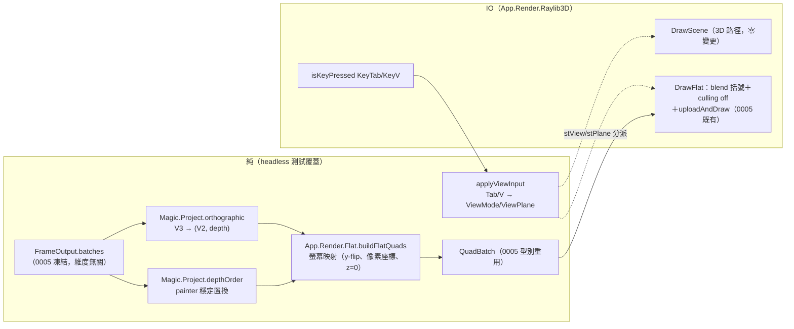

# Func-Spec 0008：2D 正交後端（Ortho2D Backend）

> 狀態：已交付（實作完成、驗收紀錄見 §10）
> 性質：一般 —— `ViewPlane`／`orthographic`／`depthOrder` 交付後成為凍結詞彙（`Magic.Project` 的投影面），供未來 2D 宿主與效能 spec 引用。
> 前置依賴：**無**（spec 0001／0002／0005 皆已完成）。**與 spec 0007、0009 三方平行**：0007（設計定案，待實作）鎖定 `src/core/Magic/{Rune,Circle,Compile}.hs`、`Magic/Particle/Analytic.hs`、`src/boundary/Magic/{Codec,Interface}.hs` 與新檔 `Magic/Particle/Field.hs`；0009（FFI 外殼）觸碰的 src 全為新目錄（`src/ffi/`、`cbits/`、`include/`、`examples/`）——本 spec 檔案清單與兩者**皆零交集**（§0.2 附盤點證明；共用檔僅 cabal/SKILL.md 的不同行，union merge），三 spec 可同時認領實作。
> 依據：[ADR-0008](../adr/adr-0008-dimension-agnostic-3d-first.md)（核心在抽象 3D、投影是外殼層職責、「2D＝正交投影：丟一軸＋深度排序策略」）；[architecture.md](../architecture.md) §1.5（維度無關）、§2（`App.Render.Ortho2D` 虛線預留位、`Magic.Project` 投影抽象）、§8.6（「2D 後端實際落地時的投影語意……可能要在 `Magic.Project` 加深度排序/壓平策略」——本 spec 兌現此掛帳）、§10（「新投影（2D）」擴充點）。
> 範圍：兌現 ADR-0008 的另一半，把「2D、3D 遊戲都能納入」從型別層保證變成**可執行的實證**：`Magic.Project` 從 identity stub 長出真正的正交投影＋painter 深度排序，demo 內按鍵即時切換 3D 透視／2D 側視／2D 俯視——同一份 `FrameOutput`，零核心變更。
>
> 四項設計裁決（使用者，2026-08-14）：**真 2D 繪製路徑**（`Magic.Project` 投影成平面座標＋深度、以螢幕座標繪製——模擬真正 2D 遊戲宿主的消費方式，非 Camera3D orthographic 技巧）；**同執行檔按鍵切換**（Tab 切 3D/2D、V 切投影面）；**側視（丟 Z）預設＋俯視（丟 Y）可切換**（俯視正面驗證 §8.6 的深度重疊可讀性風險）；**2D 路徑內建 painter's sort**（3D 路徑的排序債另屬效能 spec，本輪不碰）。

---

## 0. 起點：引用的凍結介面、檔案盤點

### 0.1 引用的凍結介面

| 凍結物 | 本 spec 的用法 |
|---|---|
| `project :: V3 -> V3`（0001 stub，SKILL.md「stub 的介面即最終介面」） | **一字不改**——`project = id` 就是 3D 情形（透視由 raylib 負責）。本 spec 的新 API 是同模組的**加法匯出**，凍結律以 S1 property 見證 |
| `FrameOutput { batches :: [RenderBatch] }`、`RenderBatch { rbParticles, rbBlend, rbShape }`、`ParticleBuffer`（SoA 六欄）（0005 凍結；0007 也不改其語意） | **唯讀消費**。2D 後端拿到的輸入與 3D 後端完全相同——這正是 ADR-0008「輸出不含維度假設」的實證面 |
| `QuadBatch { qbPositions :: S.Vector Float, qbColors :: S.Vector Word8, qbCount }` 與長度不變量 `qbCount*4*3`／`qbCount*4*4`（0005） | 2D staging 的輸出型別**重用**，使 IO 端 `uploadAndDraw` 一字不改地消費 |
| `Raylib` 效果的既有 op（`WithWindow`/`WithFrame`/`DrawBatch`/`DrawScene`/`DrawHud`/`PollInput`/`ShouldClose`）（0005；`DrawScene` 取代 `DrawBatch` 時即立下「舊 op 不改、新 op 加法」慣例） | `DrawScene` 簽名零變更；新增 `DrawFlat` op（加法，沿用同一慣例） |
| `DemoInput`／`noInput`（0005；所有測試以 record update 建構） | 加欄位 `diToggleBackend`/`diTogglePlane`（合法加法；`noInput` 補 `False`，既有測試零修改） |
| `LoopConfig(..)`／`app/Main.hs`（0005） | **零變更**——初始 `View3D`/`SideXY` 硬編碼於 `runLoop`，所有既有 `LoopConfig` 字面值照常編譯 |
| `advanceSpell`/`observeSpell` 分解（0005 凍結） | 完全不碰。視圖切換是**觀測端**的事：模擬狀態（`stSpell`/`stAcc`/施法齡）與視圖狀態正交，S4 以「toggle 不觸發 re-cast、逐幀摘要與 3D 跑法相等」的解耦律見證 |
| `V2`（`Magic.Types`，0001 詞彙） | `orthographic` 的平面座標回傳型別，首次獲得實際消費者 |
| magic-core 依賴白名單 {base, vector, deepseq}（0001，BoundarySpec 強制） | `Magic.Project` 的新實作全部落在白名單內（排序用 base 的 `Data.List.sortOn`） |

### 0.2 檔案盤點（與 0007 的零交集證明）

**修改（7 檔＋cabal＋SKILL.md）**：

| 檔案 | 變更 | 與 0007 交集？ |
|---|---|---|
| `src/core/Magic/Project.hs` | 加法：`ViewPlane`/`orthographic`/`depthOrder`（§4.1） | **否**——0007 §0.2 未列此檔 |
| `app/App/Effects.hs` | 加法：`ViewMode`/`FlatView`、`DrawFlat` op、`DemoInput`/`HudView` 增欄（§4.3） | **否**——0007 宣告 `app/*` 零觸碰 |
| `app/App/TestInterp.hs` | `DrawFlat` 分支＋`HeadlessLog` 加 `hlFlats` 欄（§4.3） | 否（同上） |
| `app/App/Loop.hs` | `LoopState` 加 `stView`/`stPlane`、`applyViewInput`、繪製分派（§4.4） | 否（同上） |
| `app/App/Hud.hs` | `formatHud` 加 view 行＋鍵位圖例（§4.4） | 否（同上） |
| `app/App/Render/Raylib3D.hs` | `DrawFlat` IO 分支＋`KeyTab`/`KeyV` 輪詢（§4.5） | 否（同上） |
| `test/HudSpec.hs` | 兩處位置建構補 `hvView` 欄（機械修補） | 否 |
| `particle-magic.cabal` | magic-boundary `exposed-modules` +1 行、executable `other-modules` +1 行、test-suite `other-modules` +5 行 | **同檔異行**：0007 只動 magic-core stanza 的 `exposed-modules` 與它自己的 9 個測試模組行——逐行 union merge，零語意衝突；先合者先進，後者 rebase 純行插入 |
| `SKILL.md` | 索引 +0008 列 | 同檔異行，union |

**新增（2 原始碼＋5 測試）**：`src/boundary/Magic/Projection.hs`（§4.2 再匯出模組）、`app/App/Render/Flat.hs`（§4.3 純 staging）、`test/ProjectSpec.hs`、`test/FlatQuadSpec.hs`、`test/FlatEffectsSpec.hs`、`test/ViewToggleSpec.hs`、`test/Acceptance8Spec.hs`。

**不碰**：0007 全部檔案（`Rune.hs`/`Circle.hs`/`Compile.hs`/`Analytic.hs`/`Codec.hs`/`Interface.hs`/`Field.hs` 及其 9 個測試模組）；另 `app/Main.hs`、`app/App/Render/Quads.hs`、`app/App/HotReload.hs`、`Magic/Particle/Buffer.hs`（僅 import，不修改）、`Magic/Types.hs`、`Magic/Step.hs`、`Magic/Expr*`、`bench/*`、既有 assets。

**交集 = ∅**，SKILL.md 規則 4 以零交集形式合規，0007 與 0008 可同時實作。

## 1. 目標與完成定義

**目標**：讓同一份 `FrameOutput` 能以真 2D 路徑呈現——投影數學與深度排序策略進 `Magic.Project`（核心、純、可測），螢幕映射與繪製進外殼層；demo 內 Tab/V 即時切換 3D 透視／2D 側視／2D 俯視。

**完成定義**（全部可驗證）：

1. `orthographic` 對兩個投影面是**逐分量精確**的座標選取（SideXY：`(x, y)`＋depth `-z`；TopXZ：`(x, z)`＋depth `-y`），無浮點算術誤差空間；`project = id` 凍結律不變（S1）。
2. `depthOrder` 回傳 `[0..pbCount-1]` 的**穩定置換**：依 depth 由遠到近，等深保 buffer 序（S1）。
3. `buildFlatQuads` 產出的 `QuadBatch` 滿足 0005 長度不變量、所有 z 分量＝0、quad 中心＝螢幕映射公式（含 y-flip）、發射順序遵循 `depthOrder`（S2）。
4. Headless 迴圈按 Tab 後繪製走 `DrawFlat`、再按切回；V 切換投影面且跨後端持久；**視圖切換不影響模擬**——不觸發 re-cast、逐幀 (blend, count) 摘要與純 3D 跑法逐幀相等（S3/S4）。
5. 預設（無 toggle 輸入）跑法與 0005 行為**逐位元相同**，`hlFlats == []`（S3/S6 回歸哨兵）。
6. 端到端：2D headless 摘要逐幀等於 `observeSpell` 參考序列——「同一份輸出、換投影即換維度」成為斷言（S6）；開窗手動 smoke 確認三種視圖的視覺正確性（S5）。

## 2. 使用到的架構與技巧

- **投影策略入核心、螢幕映射留外殼**（architecture §8.6 的指定切法）：`Magic.Project` 只做座標選取與排序置換——與像素、視窗、raylib 無關，白名單內純函數，property 全覆蓋；`App.Render.Flat` 才知道 origin/ppu/y-flip。
- **index permutation over SoA**：`depthOrder` 回傳索引置換而非重排後的 tuple list——buffer 原封不動、置換性質（是置換／單調／穩定）可直接斷言、外殼層迭代置換發 quad 即可，沒有 boxed 中間結構跨界。實作用 base 的 `Data.List.sortOn`（穩定），4096 上限下夠用；高效排序明文記給效能 spec。
- **boundary 再匯出模組**：executable 依 BoundarySpec 只能依賴 magic-boundary，而 `Interface.hs`/`Codec.hs` 被 0007 鎖定 → 新增 `Magic.Projection` 單行再匯出 `Magic.Project`。**異名**（非同名 re-export）是刻意的：test-suite 同時依賴兩套件，同名模組會逼出 `PackageImports`；異名同時讓 BoundarySpec 的行式 cabal 剖析器零修改。被否決：cabal `reexported-modules`（同名歧義問題不變）。
- **純 staging／IO 薄殼分割**（0005 `Quads.hs` 先例的鏡射）：`App.Render.Flat` 純函數產 `QuadBatch`，headless 全測；IO 端重用 `uploadAndDraw`。
- **2D 繪製重用動態 mesh**：raylib 的 2D 預設狀態即螢幕像素 ortho MVP＋深度測試關——`c'drawMesh` 畫 z=0 像素座標頂點即正確，且 draw 順序＝painter 順序。y-flip 使 CCW 變 CW → 以 `rlDisableBackfaceCulling`/`rlEnableBackfaceCulling` 括號一勞永逸。維持 Raylib3D 每幀 O(1) safe-FFI 呼叫預算（每 batch：2 次緩衝更新＋1 poke＋1 draw）。**備援路徑預先定案**：若 mesh 路徑在 2D 下有平台異常（本 spec 最大外部風險），S5 改用 per-particle `drawRectangleRec`（h-raylib 5.6 已確認存在）並記錄於 §10——POC 可接受，違反 FFI 預算之處記給效能 spec；備援不需要重新設計，因為純 staging 層不變。
- **效果面加法慣例**（0005 立下）：舊 op 簽名不動，新能力＝新 op（`DrawFlat`）；record 增欄全部走「`noInput` record update」與「accessor 讀取」的既有紋理，漣漪面已逐一盤點（§4.3）。

## 3. 模組變更總覽

```
src/core/Magic/Project.hs        [改] +ViewPlane/orthographic/depthOrder（project=id 不動）
src/boundary/Magic/Projection.hs [新] 單行再匯出 Magic.Project（過 boundary 的唯一通道）
app/App/Render/Flat.hs           [新] buildFlatQuads：投影+排序+螢幕映射 → QuadBatch（純）
app/App/Effects.hs               [改] +ViewMode/FlatView、+DrawFlat op、DemoInput/HudView 增欄
app/App/TestInterp.hs            [改] DrawFlat 分支、HeadlessLog +hlFlats
app/App/Loop.hs                  [改] stView/stPlane、applyViewInput、繪製分派、flatViewFor 常數
app/App/Hud.hs                   [改] formatHud +view 行、鍵位圖例
app/App/Render/Raylib3D.hs       [改] DrawFlat IO 分支（culling 括號+uploadAndDraw）、KeyTab/KeyV
```

## 4. ADT

### 4.1 `Magic.Project`（核心；交付後凍結）

```haskell
module Magic.Project
  ( project        -- 0001 凍結 stub：project :: V3 -> V3 = id（3D 情形），一字不改
  , ViewPlane (..) -- 永久型別
  , orthographic   -- 永久
  , depthOrder     -- 永久
  ) where

-- | 正交攝影機沿哪一軸觀看。
data ViewPlane
  = SideXY   -- ^ 觀者在 +Z 望向 -Z：平面 = (x, y)，丟 Z。預設（法術向上發射的側視）。
  | TopXZ    -- ^ 觀者在 +Y 俯視：平面 = (x, z)，丟 Y。
  deriving (Eq, Show)

-- | 平面座標＋深度。慣例：depth 越大越遠（SideXY：depth = -z；TopXZ：depth = -y）。
-- 逐分量精確選取，零算術（取負號除外）——與來源座標逐位元一致。
orthographic :: ViewPlane -> V3 -> (V2, Float)

-- | Painter 置換：indices [0..pbCount-1] 依 depth 由遠到近（遞減）排序，
-- 穩定（等深保 buffer 順序，繪製具決定論）。空 buffer → 空向量。
depthOrder :: ViewPlane -> ParticleBuffer -> U.Vector Int
```

依賴：`Magic.Types (V3, V2)`＋`Magic.Particle.Buffer (ParticleBuffer)`（import，非修改；先例：`QuadBatchSpec` 早已直接 import Buffer）＋`Data.List (sortOn)`。全在白名單內。

### 4.2 `Magic.Projection`（新 boundary 模組；交付後凍結）

```haskell
-- | Boundary re-export of the core projection surface (ADR-0008).
-- The executable depends on magic-boundary only (BoundarySpec), so this
-- module is the shell's sole doorway to Magic.Project.
module Magic.Projection (module Magic.Project) where
import Magic.Project
```

### 4.3 效果面加法（`App.Effects`／`App.TestInterp`／`App.Render.Flat`）

```haskell
-- App.Effects（渲染器無關詞彙，與 Camera 並列）
data ViewMode = View3D | View2D !ViewPlane          deriving (Eq, Show)
data FlatView = FlatView
  { fvPlane         :: !ViewPlane
  , fvScreenSize    :: !(Int, Int)
  , fvOrigin        :: !(Float, Float)   -- ^ 世界原點的螢幕像素位置
  , fvPixelsPerUnit :: !Float
  } deriving (Eq, Show)

-- DemoInput 增欄（noInput 補 False；既有測試全 record update，零修改）
diToggleBackend :: !Bool   -- Tab
diTogglePlane   :: !Bool   -- V

-- HudView 增欄（test/HudSpec.hs 兩處位置建構機械補欄）
hvView :: !ViewMode

-- 新 op（DrawScene 零變更；加法慣例）
DrawFlat :: FlatView -> [RenderBatch] -> Raylib m ()
drawFlat :: (Raylib :> es) => FlatView -> [RenderBatch] -> Eff es ()

-- App.TestInterp：HeadlessLog 增欄（只在 TestInterp 內建構，外部全 accessor，零漣漪）
hlFlats :: ![(ViewPlane, BlendMode, Int)]   -- DrawFlat 摘要；亦計入 hlDrawCalls
-- 無 toggle 的既有腳本 ⇒ hlFlats == []：免費的回歸哨兵

-- App.Render.Flat（純 staging；輸出重用 0005 QuadBatch）
buildFlatQuads :: FlatView -> ParticleBuffer -> QuadBatch
-- 依 depthOrder 遠到近迭代：orthographic 得 (V2 px py, _)；
-- 螢幕映射 sx = ox + px*ppu、sy = oy - py*ppu（y-flip：世界上=螢幕上）；
-- 每粒發軸對齊 quad（半邊長 pbSize*ppu/2、z=0、像素座標）；
-- Word32→RGBA 拆解自帶 4 行（不動 Quads.hs 的私有函數）；頂點繞序同 Quads
```

### 4.4 迴圈與 HUD（`App.Loop`／`App.Hud`）

```haskell
-- LoopState 增欄（LoopConfig／Main.hs 零變更；初始值硬編碼於 runLoop）
stView  :: !ViewMode    -- 初始 View3D
stPlane :: !ViewPlane   -- 初始 SideXY；跨後端持久（3D 下按 V 也生效，下次進 2D 用）

-- 純函數（S4 測試面）
applyViewInput :: DemoInput -> (ViewMode, ViewPlane) -> (ViewMode, ViewPlane)
-- 先套 backend toggle 再套 plane toggle；同幀雙鍵語意有定義（先切後端、再切面）

-- 繪製分派（drawHud 照舊；模擬路徑 advanceSpell×n / observeSpell×1 一字不改）
View3D    -> drawScene (lcCamera cfg) (batches out)
View2D p  -> drawFlat (flatViewFor (lcWindowSize cfg) p) (batches out)

-- 常數集中一處（可調）：ppu = 60 px/unit；
-- SideXY origin = (w/2, h*0.8)（施法者近底部，向上留 ~9.6 世界單位頭頂空間@720p）；
-- TopXZ  origin = (w/2, h/2)（陣形置中）

-- App.Hud：formatHud 加一行 view: 3D / 2D side (X/Y) / 2D top (X/Z)；
-- 鍵位圖例補 [Tab] 2D/3D [V] plane
```

### 4.5 `App.Render.Raylib3D` IO 分支

```haskell
PollInput 增：isKeyPressed KeyTab → diToggleBackend；isKeyPressed KeyV → diTogglePlane
DrawFlat fv batches ->
  -- 不進 beginMode3D（raylib 2D 預設＝螢幕 ortho MVP、深度測試關）
  -- 每 batch：beginBlendMode 括號 + rlDisableBackfaceCulling/rlEnable... 括號
  --           + uploadAndDraw gpu (buildFlatQuads fv (rbParticles b))   -- 0005 函數一字不改
  -- （選配）drawLineV 畫 2 條軸十字供方位參考
```

### 4.6 凍結範圍

本 spec 交付後凍結：`ViewPlane` 建構子集合與 depth 慣例、`orthographic`／`depthOrder` 簽名與語意、`Magic.Projection` 再匯出通道、`project = id` 照舊。**不凍結**（外殼層可調）：`FlatView` 常數（ppu/origin）、鍵位、HUD 文案、`hlFlats` 摘要形狀。

## 5. 資料流（pipeline）



Boundary 鏈：core `Magic.Project` → boundary `Magic.Projection`（再匯出）→ 外殼。模擬狀態流（`advanceSpell`/`observeSpell`）與視圖狀態流完全正交——切視圖只換 `FrameOutput` 之後的消費者。

## 6. 資料結構與儲存方式

| 資料 | 結構 | 生命週期 |
|---|---|---|
| `depthOrder` 置換 | `U.Vector Int`（unboxed） | 每次 `buildFlatQuads` 內部即產即用，不跨幀 |
| 排序中間態 | `sortOn` 的 boxed list（≤4096） | 幀內暫態；POC 可接受，記效能 spec 帳 |
| `QuadBatch` | 0005 storable 向量（重用） | 幀內暫態，IO 端上傳後丟棄 |
| `stView`/`stPlane` | `LoopState` strict 欄位 | 迴圈存活期；重載/換陣/re-cast 皆不重置（視圖是觀測端狀態） |
| `hlFlats` | headless log list | 測試跑完收集 |

## 7. 搭建方式（風險優先）

風險排序：**R1** `c'drawMesh` 在 2D 預設狀態下的 GPU 行為（外部風險，headless 測不到 → 備援預先定案、S5 儘早手動驗證）；**R2** 投影/排序數學正確性（純函數，最先殺）；**R3** record 增欄漣漪（已盤點皆機械，S3 內收束）。

S1 →（S2 → S3 → S4 可依序推進）→ S5（落地即手動驗 R1）→ S6 收口。

## 8. Todo List 與 1-to-1 測試對應

| # | Todo | 測試模組 | 測試內容 |
|---|---|---|---|
| S1 | ☑ `Magic.Project` 加 `ViewPlane`/`orthographic`/`depthOrder`；新增 `Magic.Projection` 再匯出；cabal magic-boundary +1 行 | `test/ProjectSpec.hs` | **import `Magic.Projection`**（一石二鳥證再匯出鏈可用）。property：兩平面逐位元分量選取（SideXY=(x,y,−z)、TopXZ=(x,z,−y)）；`project = id` 凍結律；`depthOrder` 是 [0..n−1] 置換、置換後 depth 單調不增、等深穩定（保 buffer 序）、空 buffer → 空 |
| S2 | ☑ `App.Render.Flat.buildFlatQuads` 純 staging | `test/FlatQuadSpec.hs` | 長度不變量（n·12／n·16）；所有 z 分量＝0；quad 中心＝螢幕映射公式（含 y-flip：+y 粒子的 sy < origin y）；邊長＝size·ppu；發射順序遵循 `depthOrder`（craft 異色 buffer 以顏色流見證）；ppu 縮放線性 |
| S3 | ☑ 效果面擴充：`DrawFlat` op、`ViewMode`/`FlatView`、`DemoInput`/`HudView`/`HeadlessLog` 增欄、TestInterp 分支、HudSpec 機械補欄 | `test/FlatEffectsSpec.hs` | headless：`DrawFlat` 進 `hlFlats` 且計入 `hlDrawCalls`；`noInput` 新欄皆 `False`；無 toggle 腳本 `hlFlats == []`（回歸哨兵）；既有 SceneEffectsSpec/SpellSwitchSpec 照舊全綠 |
| S4 | ☑ Loop 視圖狀態機＋HUD：`stView`/`stPlane`、`applyViewInput`、分派、`formatHud` view 行 | `test/ViewToggleSpec.hs` | 腳本按 Tab → 繪製改走 `hlFlats`、再按切回；V 於 2D 切 SideXY↔TopXZ；**plane 持久律**（3D 下先 V 再 Tab 進 top）；**模擬與視圖解耦律**：toggle 不觸發 re-cast、逐幀 (blend,count) 摘要與純 3D 跑法逐幀相等、`hvSpellAge` 連續；HUD view 行與狀態一致 |
| S5 | ☑ Raylib3D `DrawFlat` IO 分支（mesh 2D 繪製、culling 括號）＋`KeyTab`/`KeyV` | **手動 smoke**（§10 回填） | 開窗：Tab/V 即時切換；側視噴泉向上、俯視陣形展開；alpha 範例無 draw-order 接縫（painter 生效）、additive 正常累加；若 mesh 路徑異常 → 啟用備援 `drawRectangleRec` 並記錄於 §10 |
| S6 | ☑ 端到端驗收 | `test/Acceptance8Spec.hs` | ring-fire headless 於 2D side 跑 120 幀：`hlFlats` 摘要逐幀＝`observeSpell` 參考序列（ADR-0008「同輸出換投影」成為斷言）；中途 Tab 兩次來回，幀數守恆 `length hlScenes + length hlFlats == frames`；預設無輸入跑法與 0005 行為逐位元同 |

## 9. 非目標（明確不做）

1. **3D 路徑的深度排序**——0005 §9 已記帳給效能 spec，本輪 `drawSceneIO` 3D 分支零變更。
2. **跨 batch 深度交錯**——batch 依 `FrameOutput` 順序繪製，painter 僅在 batch 內（目前每法術單 batch，無實際損失）。
3. **2D 相機平移/縮放、視窗 resize 適配**——ppu/origin 為 Loop 內常數。
4. **透視投影數學進 `Magic.Project`**——`project = id` 即 3D 情形，透視屬 raylib。
5. **`rbShape` 差異化渲染**——2D 與 3D 現狀一致，只畫方形 quad。
6. **高效排序**（vector-algorithms／就地排序／增量排序）——效能 spec。
7. **獨立 2D 執行檔或宿主打包展示**——同執行檔 Tab 切換即本輪的「模擬 2D 宿主」；真正外部宿主故事已由 `visibility: public`＋README 承擔。
8. **俯視可讀性的視覺設計解**（壓平比例、輪廓強調等）——本輪只**暴露**§8.6 的深度重疊問題（俯視可切換即實驗台），設計解留給後續視覺 spec。

## 10. 驗收紀錄

環境：Windows 11、GHC 9.14.1、cabal-install 3.16.1.0、h-raylib 5.6.0.0（分支 `feat/ortho2d-backend-0008`，基底 `768b8f5`）。

| 項目 | 日期 | 結果 |
|---|---|---|
| S1–S4、S6 測試綠 | 2026-08-14 | `cabal test` **429 examples, 0 failures**（本輪前基線 381 → 新增 48 例：`ProjectSpec` 9、`FlatQuadSpec` 11、`FlatEffectsSpec` 7、`ViewToggleSpec` 17、`Acceptance8Spec` 4）。S6 的核心斷言成立：整段 2D 跑法的 `hlFlats` 摘要**逐幀等於** `observeSpell` 參考序列，且與純 3D 跑法的 `hlScenes` 逐幀相同——「同一份輸出、換投影即換維度」不再是型別層宣稱 |
| S5 開窗手動 smoke | 2026-08-14 | **通過，走 mesh 主線路徑，§2 的 `drawRectangleRec` 備援一次都沒用上**。三視圖以真實 exe（1280×720、ring-fire）逐一取窗截圖確認：**2D 側視**噴泉自原點十字向上噴發、y-flip 方向正確、additive 火色由根部亮黃漸層到頂端暗橘；**2D 俯視**陣形展開成環、圍繞畫面中心；**3D** 透視＋地格線一如既往。切換以實際按鍵注入（`SendInput`，需視窗持有焦點）驗證：`Tab` 3D↔2D 來回、`V` 側視→俯視即時生效，HUD `view:` 行同步。無 draw-order 接縫、無背面剔除造成的破洞（culling 括號生效），穩定 60 fps。R1 外部風險就此關閉 |
| 既有測試全綠（含 BoundarySpec） | 2026-08-14 | 0001–0006 既有測試零觸碰、全綠；`BoundarySpec` 通過（`Magic.Projection` 在 magic-boundary，殼層仍未依賴 magic-core）。`cabal build all` 通過（含 exe 與 bench stanza）。回歸哨兵成立：無 toggle 的跑法 `hlFlats == []`，`hlScenes` 長度＝幀數。0007 尚未併入，故不在本輪回歸範圍 |
| 凍結介面清單確認（§4.6） | 2026-08-14 | 確認凍結：`ViewPlane` 建構子集合與 depth 慣例（SideXY depth = −z、TopXZ depth = −y，「越大越遠」）、`orthographic`／`depthOrder` 簽名與語意（逐分量精確、穩定置換）、`Magic.Projection` 再匯出通道、`project = id` 原樣未動。未凍結項（`FlatView` 常數 ppu=60／origin、鍵位、HUD 文案、`hlFlats` 形狀）維持殼層可調 |
| architecture.md 落地註記 | 2026-08-14 | §2 模組圖：`App.Render.Ortho2D`（虛線預留）改為實線的 `App.Render.Flat`，`Magic.Projection` 入邊界層、`Magic.Project` 節點補上新 API；§8.6 追記「已由 spec 0008 落地」並明確保留未做的那一半（俯視可讀性的視覺設計解）；§10 擴充點表「新投影（2D）」補實證註記 |

實作補記（非偏差，皆在 spec 授權範圍內）：

- **`Magic.Project` 額外再匯出 `V2 (..)`**（§4.1 的匯出清單未列）。必要性：`orthographic` 回傳 `V2`，而殼層依 BoundarySpec 只能依賴 magic-boundary，無從 import `Magic.Types` 取得建構子。此為 0001 既有型別的加法再匯出，不新增任何詞彙。
- **`App.Render.Flat` 另匯出 `screenOf`**（螢幕映射函數）：讓 `FlatQuadSpec` 直接對映射公式斷言，而不是在測試裡複製一份公式——複製品會與實作一起錯。
- **test-suite `other-modules` 加 6 行而非 §0.2 估的 5 行**：5 個測試模組之外，`App.Render.Flat` 本身也必須列入（測試套件把 `app/` 一起編）。exe 與 magic-boundary 的加行數與盤點一致。
- **§4.5 的「選配」軸十字採用**（`drawFlatAxes`，`Raylib.Core.Shapes.drawLine` 兩條線）：2D 視圖沒有 3D 的地格線，缺了它施法者位置只能用猜的。每幀 2 次額外 FFI 呼叫，與 O(1)/幀的預算相容。
- **`hlFlats` 摘要帶投影面**（`(ViewPlane, BlendMode, Int)`，§4.3 即如此規定）：`ViewToggleSpec` 的 plane 持久律靠它見證。
- **`depthOrder` 以 `sortOn (Down . depth)` 實作**：`sortOn` 穩定，`Down` 只反轉不相等鍵的比較，故「遞減＋等深保 buffer 序」由 base 的穩定性直接給出，無需自訂比較。boxed 中間 list 的成本照 §6 記給效能 spec。
- **測試面的浮點容差**：`FlatQuadSpec` 的邊長斷言用「螢幕量級」相對容差（同 0005 `QuadBatchSpec` 的 `floatTolerance` 思路）。原因是頂點＝螢幕座標±半邊長，小粒子（size≈0.016）在 640 px 量級座標下相減會抵消掉大部分有效位數——這是 Float 的性質，不是幾何的錯。
- **h-raylib 的 `KeyV` = 86、`KeyTab` = 258**（GLFW 鍵碼），與 `KeyLeft`/`KeyRight`/`KeyR` 同源；自動化注入按鍵時必須讓視窗持有焦點，否則按鍵靜默丟失（smoke 過程中確認，非產品問題）。
