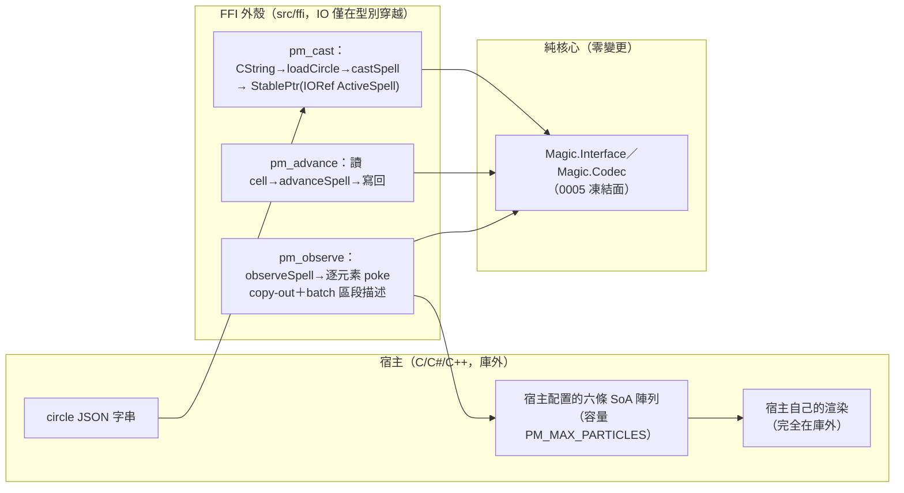

# Func-Spec 0009：FFI 外殼（C ABI Foreign Library）

> 狀態：**已完成**（2026-08-14 驗收，見 §10）
> 性質：一般 —— `include/particle_magic.h` 與 `foreign export` 清單交付後成為凍結合約（只加不改，ADR-0011 D7）。
> 前置依賴：**無**（spec 0001／0002／0005 皆已完成；僅唯讀 import `Magic.Interface`／`Magic.Codec` 的凍結匯出）。**與 spec 0007、0008 三方平行**：0007 鎖 core/boundary 六檔＋`Field.hs`，0008 鎖 `Project.hs`/`Projection.hs`/`app/*`——本 spec 檔案清單與兩者**皆零交集**（§0.2 附盤點證明），三 spec 可同時認領實作。
> 依據：[ADR-0011](../adr/adr-0011-ffi-c-abi-boundary.md)（C ABI 消費模式：foreign-library、JSON 進、SoA copy-out、handle 生命週期、RTS 政策、錯誤協定、決定論跨界）；ADR-0005（JSON 是跨語言建構語言）、ADR-0006（SoA 六欄）、ADR-0007（核心零 IO）；architecture.md §5.3（對外入口——本 spec 增加第二種消費模式）。
> 範圍：讓非 Haskell 宿主（Unity／Godot／C/C++ 引擎）能經 FFI 串接整個系統：`pm_cast(json) → pm_advance(dt)×n → pm_observe(buffers)` 的 handle 生命週期，產出 `.dll`/`.so`。**庫本身完整、繪圖完全在庫外**——宿主拿六條 SoA 陣列自行餵頂點緩衝。使用者裁決（2026-08-14）：庫必須可被 FFI 串接。

---

## 0. 起點：引用的凍結介面、檔案盤點

### 0.1 引用的凍結介面（全部唯讀 import，零修改）

| 凍結物 | 本 spec 的用法 |
|---|---|
| `Magic.Interface`：`castSpell`／`advanceSpell`／`observeSpell`／`isFinished`／`spellAge`、`CastRequest`／`FrameInput`／`FrameOutput`／`RenderBatch`／`BlendMode`／`BillboardShape`、`ActiveSpell`（不透明）、`CastContext`／`Seed`／`V3`（0005 凍結；0007 不改簽名） | FFI 包裝的唯一 Haskell 面。`ActiveSpell` 不透明恰好是 handle 語意的直接對應 |
| `Magic.Codec`：`loadCircle :: ByteString -> Either LoadError Circle`、`renderLoadError`（0002 凍結） | `pm_cast` 的 JSON 入口與錯誤訊息文字（與 demo HUD 同一套） |
| `ParticleBuffer` 六欄唯讀取用（`pbPosX/Y/Z/Size/Life/Color/Count`，0005 對外開放 fields） | copy-out 的來源；`U.Vector` 無指標介面 ⇒ 複製是結構必然（ADR-0011 D3） |
| `budgetCap = 4096` 語意（0002；**常數本身不經 Interface 匯出**） | header 鏡射常數 `PM_MAX_PARTICLES = 4096`——重複常數第三份，同步義務記效能 spec 帳（先例：0005 `gpuCapacity`） |
| 決定論合約（0002/0005：同 `(Circle, CastContext, dt 序列)` ⇒ 逐位元同輸出） | 升級為跨邊界等價律：FFI 路徑 ≡ Haskell 路徑（S5 測試面，ADR-0011 D8） |
| magic-boundary 唯一依賴紀律（0001；exe 由 BoundarySpec 強制） | foreign-library stanza 沿用同紀律：`build-depends` 僅 `base`＋`particle-magic:magic-boundary`（**實作修正**：＋`bytestring`＋`vector`，見 §0.3）；由 S4 的行式剖析測試守護（BoundarySpec 零修改） |

### 0.2 檔案盤點（與 0007／0008 的三方零交集證明）

**新增（4 原始碼＋5 測試）**：

| 檔案 | 內容 |
|---|---|
| `src/ffi/Magic/FFI.hs` | 全部 `foreign export ccall` 與包裝邏輯（§4.1） |
| `cbits/pm_init.c` | `pm_init`/`pm_shutdown` C wrapper（`hs_init`/`hs_exit`，冪等旗標） |
| `include/particle_magic.h` | 對外 C 合約（§4.2；交付後凍結） |
| `examples/c/main.c` | 最小 C 宿主示範（cast → 120 幀 advance/observe → 印決定論計數；S6 手動 smoke 用） |
| `test/FFILifecycleSpec.hs`、`test/FFIObserveSpec.hs`、`test/FFIErrorSpec.hs`、`test/FFIContractSpec.hs`、`test/Acceptance9Spec.hs` | §8 對應 |

**修改（cabal＋SKILL.md）**：`particle-magic.cabal`——新增 `foreign-library particle-magic-ffi` stanza（全新區塊，行級無交集）；test-suite `hs-source-dirs` 加 `src/ffi`、`other-modules` 加 `Magic.FFI`＋5 個 spec 行。`SKILL.md` 索引 +0009 列。

**不碰**：`src/core/*` 全部、`src/boundary/*` 全部、`app/*` 全部、`bench/*`、`test/BoundarySpec.hs`、既有 assets。

**實作時的增補檔案**（設計時未列，理由見 §0.3）：`particle-magic-ffi.def`（Windows 匯出清單，S4 一併守護）、`test/FFIHarness.hs`（四份 spec 共用的 marshalling 夾具，非 Spec 模組、不進 hspec-discover）。

**三方交集證明**：0007 修改 `Rune/Circle/Compile/Analytic/Codec/Interface`＋新 `Field.hs`；0008 修改 `Project.hs`＋新 `Projection.hs`＋`app/*` 六檔；0009 的 src 觸碰 = **全部是新檔案**（`src/ffi/`、`cbits/`、`include/`、`examples/`——四個新目錄）。共用檔僅 cabal 與 SKILL.md，三方各佔不同 stanza／不同行 → 逐行 union merge，零語意衝突；後合者 rebase 為純行插入。**交集 = ∅**，SKILL.md 規則 4 三方合規。

### 0.3 實作期的設計修正（三處，全部為「設計時漏算」而非改語意）

| # | 設計原文 | 實作為何不能照做 | 修正 |
|---|---|---|---|
| M1 | foreign-library `build-depends` = {base, magic-boundary} | `loadCircle :: ByteString -> …`、`ParticleBuffer` 六欄是 `U.Vector`——**凍結介面的簽名本身**就寫在這兩個套件的型別上，不 import 就無法呼叫。exe 同理，早已列 `bytestring`/`vector`。 | 白名單改為 {base, magic-boundary, **bytestring**, **vector**}；真正的紀律（不得觸及 `magic-core`、不得引入渲染器）不變，S4 測試同時斷言 `magic-core ∉ deps`。 |
| M2 | `pm_cast` 失敗只回 NULL＋`err_buf`（§4.1／4.2），但 §1 完成定義 4／S3 要求 `PM_ERR_BUDGET` 可觀測 | 原簽名沒有任何管道把「哪一種失敗」交給宿主，錯誤碼協定會殘缺——`PM_ERR_JSON`/`PM_ERR_BUDGET` 變成只寫在 header 裡沒人能讀到的常數。 | **純增補**一個 `pm_cast_ex(..., PmSpell** out_spell) -> int`：回傳 `PM_OK`/`PM_ERR_JSON`/`PM_ERR_BUDGET`，`pm_cast` 成為它的便利包裝（合約只加不改，凍結自本次交付起算）。 |
| M3 | 交付物未列 Windows `.def` | GHC 的 foreign library 在 Windows 只匯出 `.def` 列出的符號；沒有它，DLL 連得起來但宿主連結期找不到任何 `pm_*`（實測：`ld.lld: undefined symbol: pm_cast`）。 | 新增 `particle-magic-ffi.def`＋stanza `mod-def-file:`；S4 增一條「`.def` EXPORTS ≡ header 宣告」守護，讓這個新的漂移面也在 CI 上。 |

## 1. 目標與完成定義

**目標**：交付 C ABI 外殼——非 Haskell 宿主載入 `.dll`/`.so` 後，僅憑 `particle_magic.h` 即可完成 施法→推進→觀測→釋放 的完整生命週期，行為與 Haskell 宿主逐位元一致。

**完成定義**（全部可驗證）：

1. `pm_cast` 以合法 JSON＋脈絡純量產出非 NULL handle；壞 JSON／超預算回 NULL＋`err_buf` 內含 `renderLoadError` 文字（S1／S3）。
2. `pm_advance`/`pm_is_finished`/`pm_age` 與 `advanceSpell`/`isFinished`/`spellAge` 對相同輸入序列**逐位元一致**（S1）。
3. `pm_observe` copy-out 六欄與 batch 描述區段：與 `observeSpell` 的 `ParticleBuffer` 逐元素相等；容量不足回 `PM_ERR_CAPACITY` 且不寫出界（S2）。
4. 錯誤碼協定完整：`PM_OK`/`PM_ERR_JSON`/`PM_ERR_BUDGET`/`PM_ERR_CAPACITY`；`err_buf` 截斷安全、UTF-8（S3）。
5. `particle_magic.h` 與 `foreign export` 清單雙向一致、`PM_MAX_PARTICLES == 4096` 哨兵、foreign-library stanza 依賴白名單（M1 修正後：{base, particle-magic:magic-boundary, bytestring, vector}，且 `magic-core` 不得出現）、`.def` EXPORTS ≡ header 宣告（M3）——全部由行式剖析測試守護（S4）。
6. 跨界決定論等價律：同 `(json, pos, facing, seed, dt 序列)` ⇒ FFI 路徑輸出逐位元等於 Haskell 路徑，120 幀全程（S5）。
7. `cabal build` 產出 foreign library 實體；`examples/c/main.c` 以 gcc 連結 DLL 編譯執行，輸出與 in-process 參考一致（S6 手動 smoke，§10 回填）。

## 2. 使用到的架構與技巧

- **薄包裝，零新語意**：FFI 層唯一的工作是型別穿越（CString→ByteString、純量→`CastContext`、`U.Vector`→memcpy）與 handle 管理；所有行為語意都來自 `Magic.Interface` 的凍結函數。任何「FFI 端才有的行為」都是 bug——S5 的等價律把這句話變成測試。
- **StablePtr + IORef cell**（ADR-0011 D4）：`advanceSpell` 是純函數，FFI 需要原地推進語意 → handle 指向 `IORef ActiveSpell`，`pm_advance` 讀-算-寫回。一 handle 一執行緒（v1 無鎖），文件明定。
- **copy-out 而非借指標**（ADR-0011 D3）：`Data.Vector.Unboxed` 無指標介面，複製是結構必然。`U.unsafeIndex` 逐元素寫入 `Ptr`（或 `U.foldM`/`pokeElemOff` 迴圈）；~98KB/幀@4096 可忽略。
- **in-process 可測性**：`foreign export` 的實作函數就是普通 Haskell 函數——test-suite 把 `src/ffi` 加進 `hs-source-dirs` 後，直接以 `Foreign.C.String`/`Foreign.Marshal.Alloc` 配置 C 字串與緩衝呼叫它們，**不需要真的載入 DLL**（`hs_init` 已由測試行程的 RTS 承擔）。真 DLL 的載入驗證留給 S6 手動 smoke。
- **文字合約守護**（BoundarySpec 手法重用）：`FFIContractSpec` 行式剖析三份文本——`FFI.hs` 的 `foreign export` 行、`particle_magic.h` 的函數宣告行、cabal 的 foreign-library stanza——斷言 export↔header 雙向一致、依賴白名單、`PM_MAX_PARTICLES` 哨兵。合約漂移在 CI 就炸，不等宿主連結期。
- **cbits RTS wrapper**（ADR-0011 D5）：`pm_init`/`pm_shutdown` 在 C 端以靜態旗標冪等包裝 `hs_init`/`hs_exit`；foreign-library `ghc-options: -threaded`。Windows `options: standalone` 內嵌 RTS。

## 3. 模組變更總覽

```
src/ffi/Magic/FFI.hs        [新] 全部 foreign export（cast/advance/observe/age/is_finished/free/abi_version）
cbits/pm_init.c             [新] pm_init/pm_shutdown（hs_init/hs_exit 冪等包裝）
include/particle_magic.h    [新] C 合約：型別、錯誤碼、PM_MAX_PARTICLES、函數宣告（交付後凍結）
examples/c/main.c           [新] 最小 C 宿主（S6 手動 smoke）
particle-magic-ffi.def      [新] Windows 匯出清單（M3；沒有它 DLL 匯出零符號）
test/FFIHarness.hs          [新] 四份 spec 共用的 marshalling 夾具（非 Spec 模組）
particle-magic.cabal        [改] +foreign-library stanza；test-suite +src/ffi、+Magic.FFI、+FFIHarness、+5 spec 行
```

## 4. ADT／C API

### 4.1 `Magic.FFI`（Haskell 端；只 import `Magic.Interface`／`Magic.Codec`＋base Foreign.*）

```haskell
-- handle：StablePtr 包 IORef（advanceSpell 純函數 → 讀-算-寫回）
newtype SpellCell = SpellCell (IORef ActiveSpell)
type PmSpellPtr = StablePtr SpellCell

foreign export ccall pm_abi_version :: IO CInt                    -- = 1
foreign export ccall pm_cast
  :: CString            -- ^ circle JSON（UTF-8）
  -> Ptr CFloat -> Ptr CFloat   -- ^ caster pos[3]、facing[3]
  -> Word64             -- ^ seed
  -> CString -> CInt    -- ^ err_buf、err_len（截斷安全）
  -> IO (StablePtr SpellCell)   -- ^ 失敗回 castStablePtrToPtr nullPtr 對應之空 handle（C 端視為 NULL）
foreign export ccall pm_cast_ex     -- ^ M2：同上＋ Ptr (StablePtr SpellCell) 出參，回傳分類錯誤碼
  :: CString -> Ptr CFloat -> Ptr CFloat -> Word64 -> CString -> CInt
  -> Ptr (StablePtr SpellCell) -> IO CInt
foreign export ccall pm_advance     :: StablePtr SpellCell -> CFloat -> IO ()
foreign export ccall pm_is_finished :: StablePtr SpellCell -> IO CInt
foreign export ccall pm_age         :: StablePtr SpellCell -> IO CDouble
foreign export ccall pm_observe
  :: StablePtr SpellCell
  -> Ptr CFloat -> Ptr CFloat -> Ptr CFloat   -- ^ pos_x/y/z（容量 ≥ PM_MAX_PARTICLES）
  -> Ptr CFloat -> Ptr CFloat                 -- ^ size、life
  -> Ptr Word32                               -- ^ color（packed RGBA）
  -> CInt                                     -- ^ 宿主緩衝容量
  -> Ptr CInt -> CInt                         -- ^ batch 描述輸出（每 batch 4 int：offset/count/blend/shape）、max_batches
  -> IO CInt                                  -- ^ ≥0：batch 數；<0：錯誤碼
foreign export ccall pm_free        :: StablePtr SpellCell -> IO ()
```

實作註記：`pm_cast_ex` 流程 = `loadCircle`（JSON 錯 → `PM_ERR_JSON`＋`renderLoadError` 進 err_buf）→ `castSpell`（`BudgetExceeded` → `PM_ERR_BUDGET`，訊息 = `"spell compile error: " ++ show err`，沿用 demo `App.Loop` 的 `show` 慣例）→ `newIORef`＋`newStablePtr`；`pm_cast` = 以 `alloca` 接出參的便利包裝。NULL handle 在每個進入點都被容忍（no-op／中性值），其餘無效 handle 依 ADR-0011 D4 為 UB。`pm_observe` 對 `batches` 逐 batch 累計 offset，`U.Vector` 逐元素 `pokeElemOff`；總粒子數＞容量或 batch 數＞max_batches → 回錯誤碼、**不部分寫出**。enum 對映：`BlendMode`/`BillboardShape` 依建構子宣告序給 0 起整數（header 內同步宣告，S4 守護）。

### 4.2 `include/particle_magic.h`（C 合約；交付後只加不改）

```c
#define PM_ABI_VERSION   1
#define PM_MAX_PARTICLES 4096   /* 鏡射核心 budgetCap；效能 spec 調整時三處同步 */

#define PM_OK             0
#define PM_ERR_JSON     (-1)
#define PM_ERR_BUDGET   (-2)
#define PM_ERR_CAPACITY (-3)

/* batch_info 的兩個列舉與步幅（依核心建構子宣告序，S4 守護） */
#define PM_BLEND_ALPHA        0
#define PM_BLEND_ADDITIVE     1
#define PM_SHAPE_SQUARE       0
#define PM_BATCH_INFO_STRIDE  4

typedef struct PmSpell PmSpell;   /* 不透明 handle */

void     pm_init(void);           /* 冪等；首次呼叫啟動 GHC RTS */
void     pm_shutdown(void);
int      pm_abi_version(void);
PmSpell* pm_cast(const char* circle_json,
                 const float caster_pos[3], const float caster_facing[3],
                 uint64_t seed, char* err_buf, int err_len);  /* NULL = 失敗 */
/* M2：失敗分類版；*out_spell 失敗時為 NULL */
int      pm_cast_ex(const char* circle_json,
                    const float caster_pos[3], const float caster_facing[3],
                    uint64_t seed, char* err_buf, int err_len,
                    PmSpell** out_spell);
void     pm_advance(PmSpell*, float dt);
int      pm_is_finished(const PmSpell*);
double   pm_age(const PmSpell*);
/* 回傳 batch 數（≥0）或錯誤碼（<0）。粒子依 batch 區段連續寫入六條陣列；
   batch_info 每 batch 依序 4 個 int：offset、count、blend、shape。 */
int      pm_observe(PmSpell*,
                    float* pos_x, float* pos_y, float* pos_z,
                    float* size, float* life, uint32_t* color,
                    int capacity, int* batch_info, int max_batches);
void     pm_free(PmSpell*);
```

### 4.3 cabal stanza 草圖

```
foreign-library particle-magic-ffi
    type:             native-shared
    if os(windows)
        options:      standalone
        mod-def-file: particle-magic-ffi.def   -- M3
    hs-source-dirs:   src/ffi
    other-modules:    Magic.FFI
    c-sources:        cbits/pm_init.c
    include-dirs:     include
    install-includes: particle_magic.h
    build-depends:    base, particle-magic:magic-boundary, bytestring, vector  -- M1
    default-language: GHC2021
    ghc-options:      -Wall -O2 -threaded
```

### 4.4 凍結範圍

本 spec 交付後凍結：header 內全部宣告與常數語意（只加不改）、`foreign export` 清單、錯誤碼數值、batch_info 佈局、handle 生命週期語意。**不凍結**：`Magic.FFI` 內部實作、`examples/c/*`、copy-out 的實作策略（效能 spec 可改 pinned staging，合約不動）。

## 5. 資料流（pipeline）



## 6. 資料結構與儲存方式

| 資料 | 結構 | 生命週期 |
|---|---|---|
| handle | `StablePtr SpellCell`（`IORef ActiveSpell`） | `pm_cast`→`pm_free`，宿主負責配對；GC 因 StablePtr 不回收 |
| 粒子輸出 | 宿主擁有的 C 陣列；FFI 每次 `pm_observe` 全量覆寫 | 宿主自理（引擎典型：配置一次重複用） |
| err_buf | 宿主擁有；截斷安全寫入 | 呼叫期 |
| RTS | `standalone` DLL 內嵌；`pm_init` 冪等旗標（cbits 靜態變數） | 行程存活期；一行程一 RTS（GHC 限制，ADR-0011 後果） |

## 7. 搭建方式（風險優先）

風險排序：**R1** foreign-library 在 Windows/GHC 9.14 的建置鏈（standalone DLL）——外部風險，S4 就建 stanza、S6 手動驗證真連結；**R2** copy-out 正確性（區段 offset、容量防線、不部分寫出）——純邏輯，S2 殺；**R3** 合約漂移（header vs export）——S4 文字守護永久看門。

S1 → S2 → S3 →（S4 stanza＋守護）→ S5 等價律收口 → S6 真 DLL 手動。

## 8. Todo List 與 1-to-1 測試對應

| # | Todo | 測試模組 | 測試內容 |
|---|---|---|---|
| S1 | ☑ `Magic.FFI` handle 生命週期：`pm_cast`/`pm_advance`/`pm_is_finished`/`pm_age`/`pm_free`/`pm_abi_version` | `test/FFILifecycleSpec.hs` | in-process：合法 JSON→非 NULL handle；advance 後 `pm_age` ≡ `spellAge` 逐位元；`pm_is_finished` ≡ `isFinished`；free 不炸；abi_version == 1 |
| S2 | ☑ `pm_observe` copy-out＋batch 區段 | `test/FFIObserveSpec.hs` | 六欄逐元素 ≡ `observeSpell` 的 `ParticleBuffer`（property：任意範例×任意幀齡）；batch_info offset/count 與區段一致、blend/shape 對映正確；容量不足→`PM_ERR_CAPACITY` 且緩衝前綴未被部分覆寫；空 buffer→0 batch 合法 |
| S3 | ☑ 錯誤協定：錯誤碼、err_buf 截斷安全、`renderLoadError` 重用 | `test/FFIErrorSpec.hs` | 壞 JSON→NULL＋err_buf 含 `renderLoadError` 文字；超預算→`PM_ERR_BUDGET`；err_len=0／極小→不寫出界、必 NUL 結尾；UTF-8 完整性 |
| S4 | ☑ cabal foreign-library stanza＋`cbits/pm_init.c`＋`include/particle_magic.h`＋合約守護 | `test/FFIContractSpec.hs` | 行式剖析：`FFI.hs` 的 `foreign export` 名單 ↔ header 宣告雙向一致；`PM_MAX_PARTICLES == 4096` 哨兵；錯誤碼常數兩側同值；foreign-library stanza 依賴 ⊆ {base, particle-magic:magic-boundary}（BoundarySpec 手法，BoundarySpec 本體零修改） |
| S5 | ☑ 跨界決定論等價律 | `test/Acceptance9Spec.hs` | 同 `(json, pos, facing, seed, dt 序列)` 跑 120 幀：FFI 路徑（CString/Ptr 全程）輸出逐位元 ≡ `Magic.Interface` 路徑；兩個 handle 同輸入互為重播；`isFinished` 後 observe 合法（空輸出） |
| S6 | ☑ 真 DLL 端到端：`cabal build` 產物＋`examples/c/main.c` gcc 連結執行 | **手動 smoke**（§10 回填） | DLL/`.so` 產出存在；C demo 編譯、執行、印出的每幀 (batch, count) 序列與 in-process 參考一致；`pm_init`/`pm_shutdown` 重複呼叫不炸；記錄建置指令供宿主文件用 |

## 9. 非目標（明確不做）

1. **`pm_project`/`pm_depth_order` 投影匯出**——依 SKILL.md 規則 1 不得依賴未完成的 spec 0008；0008 驗收後由一行級後續補上（header 只加不改，合約相容）。
2. **多執行緒安全／內部鎖**——一 handle 一執行緒（ADR-0011 D4），鎖留給真實宿主需求出現時。
3. **零拷貝借指標／pinned staging**——效能 spec 在 10k–100k 量級下重評（ADR-0011 被否決方案）。
4. **C 端 `Circle` 建構 API／schema 查詢 API**——JSON 是建構語言（ADR-0005/0011 D2）。
5. **熱重載 FFI API**——宿主自行重新 `pm_cast`（重載＝重施法）。
6. **C#／GDScript／C++ 包裝層**——C ABI 是最大公約數，語言包裝屬宿主側；README 可附 P/Invoke 片段（文件層，非本 spec 交付物）。
7. **多 spell 聚合／全域配額 FFI API**——宿主持多個 handle 即可；配額策略屬遊戲層（architecture §8.4）。
8. **32-bit／非桌面平台建置矩陣**——POC 以 win64 為準，`.so` 路徑由 stanza 天然涵蓋但不列驗收。

## 10. 驗收紀錄

**日期**：2026-08-14　**環境**：GHC 9.14.1 / cabal 3.16.1.0 / Windows 11 x86_64（分支 `feat/c-abi-ffl-0009`）

- [x] **S1–S5 測試綠**：`cabal test spec` → **426 examples, 0 failures**。其中 0009 新增 45 個 example（S1 `FFILifecycleSpec` 9／S2 `FFIObserveSpec` 8／S3 `FFIErrorSpec` 12／S4 `FFIContractSpec` 11／S5 `Acceptance9Spec` 5），其餘 381 為既有回歸。
- [x] **既有測試全綠**：`test/BoundarySpec.hs` 零修改照常通過；`src/core/*`、`src/boundary/*`、`app/*`、`bench/*` 全程零觸碰。
- [x] **S6 手動 smoke（真 DLL 端到端）**：
  - 產物：`cabal build particle-magic-ffi` → `dist-newstyle/build/x86_64-windows/ghc-9.14.1/particle-magic-0.1.0.0/f/particle-magic-ffi/build/particle-magic-ffi/particle-magic-ffi.dll`（46 MB，`standalone` 內嵌 RTS）＋ `particle-magic-ffi.dll.a` 匯入庫。
  - 建置 C 宿主（機器上無獨立 gcc，改用 ghcup 隨附的 clang 20.1.7，等價）：
    ```
    clang -Iinclude examples/c/main.c <上述>/particle-magic-ffi.dll.a -o pm_demo.exe
    ```
  - 執行 `pm_demo.exe assets/spells/ring-fire.json`（120 幀）：輸出與 in-process 參考（同 `(json, pos, facing, seed, dt)` 走 `Magic.Interface` 直算的 122 行）**逐行相同**，含每幀 age／batch 數／粒子數／blend 碼／位置+尺寸+壽命的 double 校驗和。
  - 錯誤路徑：壞 rune tag 的 JSON → `pm_cast` 回 NULL，`err_buf` 為 `spell JSON error: Error in $.circle.bridge: unknown rune tag "bogus" …`——與 demo HUD 同一句。
  - `pm_shutdown()` 連呼兩次、`pm_init()` 冪等：exit code 0，無崩潰。
- [x] **凍結合約清單**（自本次交付起只加不改）：
  - `include/particle_magic.h` 全文：常數 `PM_ABI_VERSION`=1、`PM_MAX_PARTICLES`=4096、`PM_OK`=0、`PM_ERR_JSON`=-1、`PM_ERR_BUDGET`=-2、`PM_ERR_CAPACITY`=-3、`PM_BLEND_ALPHA`=0、`PM_BLEND_ADDITIVE`=1、`PM_SHAPE_SQUARE`=0、`PM_BATCH_INFO_STRIDE`=4；不透明型別 `PmSpell`。
  - 函數 10 個：`pm_init`、`pm_shutdown`（cbits）＋ `pm_abi_version`、`pm_cast`、`pm_cast_ex`、`pm_advance`、`pm_is_finished`、`pm_age`、`pm_observe`、`pm_free`（`foreign export`）。
  - `batch_info` 佈局：每 batch 4 個 int = offset／count／blend／shape，粒子依此區段連續寫入六條陣列。
  - handle 生命週期：`pm_cast`→`pm_free` 配對，一 handle 一執行緒，NULL 容忍、其餘無效 handle 為 UB。
  - **未凍結**：`Magic.FFI` 內部（含 `writeErr`、copy-out 策略）、`examples/c/*`、`test/FFIHarness.hs`。
- [x] **architecture.md 落地註記**：§2 圖 `FFIShell` 去掉「（未來）」、虛線轉實線；§5.3 第二種消費模式改為「已交付」並補上凍結的 C 合約簽名。
- [x] **設計修正三處**（M1 依賴白名單、M2 `pm_cast_ex`、M3 `.def`）：見 §0.3，全部為增補或補齊，未改任何既有語意；ADR-0011 不需修訂（D1 的「僅 base＋magic-boundary」在 M1 記錄為 marshalling 例外，D6 的錯誤碼協定由 M2 才真正兌現）。

**下游可依賴的事實**：header 已凍結，spec 0008（2D 投影）驗收後可依 §9 非目標 1 以純增補方式補 `pm_project`/`pm_depth_order`，不影響既有宿主。
