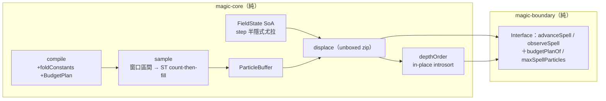

# Func-Spec 0010：效能與粒子預算治理

> 狀態：**已完成**（2026-08-15 驗收，見 §9）
> 性質：一般 —— 交付後凍結 `ParticleBudget` 型別與 `Magic.Interface` 的加法匯出（spec 0012 動工門檻＝本 spec 驗收，先例：0006→0007）。
> 前置依賴：**無**（動工前提「spec 0005 的 bench 基線」已於 0005 §10 交付：4096 粒 `buildQuads` ≈71µs、每幀純 CPU ≈0.73ms）。**與 spec 0011、0013 三方平行**：本 spec 鎖 core／`Interface.hs`／bench，0011 鎖 `src/ffi`＋`include`＋新目錄，0013 鎖 `app/*`——檔案零交集（§0.2 附證明），三 spec 可同時認領實作。
> 依據：architecture §7（效能設計整章——本 spec 是它的落地輪）、§8.2（Expr 加速階梯，只做第一階）；ADR-0006（SoA＋unboxed）、ADR-0007（核心零 IO——`ST` 內部可變、對外仍純）；[roadmap.md](../roadmap.md) §3.1（被 0002/0004/0005/0006/0007/0008 六份 spec §9 指名的欠款總表）。
> 範圍：把核心熱路徑從「處處 boxed list 往返」改成「端到端 unboxed」，量測 10k–100k 吞吐。**本輪不改 `budgetCap` 的值**（維持 4096）：`test/FFIContractSpec.hs` 把 `PM_MAX_PARTICLES == pmMaxParticles == budgetCap == 4096` 釘成三方相等，改值必觸 0011 的檔案、平行即破功——上限值的實際提升由 spec 0012 S1 落地（新值依本 spec 的量測選定，契約鬆綁由 0011 交付）。

---

## 0. 起點：引用的凍結介面、檔案盤點

### 0.1 引用的凍結介面（簽名零變更；內部實作可換）

| 凍結物 | 本 spec 的義務 |
|---|---|
| `Magic.Interface` 全匯出面（0005 凍結；0007/0008 未動簽名） | 只做**加法**匯出（`ParticleBudget`、`budgetPlanOf`、`maxSpellParticles`、`emitterBounds`）；既有簽名一個都不改 |
| `sample :: CompiledSpell -> CastContext -> Time -> ParticleBuffer`（0002） | 簽名不變，內部重寫（S2） |
| `ParticleBuffer` 六欄 fields＋`bufferInvariant`＋`fromParticles`（0005 對外開放 fields） | 型別與 fields 不變；`fromParticles` 保留且語意不變（相容入口），熱路徑改走新的內部 count-then-fill |
| `depthOrder :: ViewPlane -> ParticleBuffer -> U.Vector Int` 的**穩定 painter 律**（0008 凍結：遠到近、等深保 buffer 序） | 簽名與輸出**逐位元**不變，實作換成 in-place unboxed 排序（S5） |
| `FieldState` 表徵（0007 §4.7 **明文不凍結**）；`step`／`stepSlot`／`fieldAccel` 語意（半隱式尤拉、rebirth 偵測、零場跳過） | 表徵可換（SoA 化正是本 spec 工作）；語意逐位元保持（S4） |
| `compile :: Circle -> Either CompileError CompiledSpell`（0002）；`CompiledSpell` 記錄**可加欄位**（先例：0006 加 `spellPhases`、0007 加 `spellFields`） | 加 `spellBudgetPlan` 欄位；既有欄位（含 `spellBudget :: !Int`）保留不動 |
| 決定論合約（0002/0005：同輸入 ⇒ 逐位元同輸出）＋ 0009 的跨界等價律 | 本 spec 的**中心律**：全部 10 個範例 spell 的輸出逐位元不變（S1 golden 先行鎖定） |
| `budgetCap = 4096` 與 `FFIContractSpec` 的三方相等釘選（0009） | **值不動、檔案不碰**；本 spec 全文不得出現對 `PM_MAX_PARTICLES`／`pmMaxParticles`／`budgetCap` 值的修改 |

### 0.2 檔案盤點（與 0011／0013 的三方零交集證明）

**修改（7 原始碼＋bench）**：

| 檔案 | 變更 |
|---|---|
| `src/core/Magic/Particle/Buffer.hs` | 內部新增 count-then-fill 建構（`ST` mutable 六欄）；`fromParticles` 改為薄包裝，匯出面不變 |
| `src/core/Magic/Particle/Analytic.hs` | `sample` 熱路徑重寫（S2）＋發射器時間窗剔除（S3）＋per-emitter 基底提升 |
| `src/core/Magic/Particle/Field.hs` | `FieldState` SoA 化（S4）；`step`/`stepSlot`/`fieldAccel` 匯出簽名視 SoA 表徵調整（0007 明文允許），語意逐位元保持 |
| `src/core/Magic/Compile.hs` | `ParticleBudget` 型別＋`CompiledSpell` 加欄位 `spellBudgetPlan`＋`emitterBounds`（S6/S7） |
| `src/core/Magic/Project.hs` | `depthOrder` 換 in-place unboxed 排序（S5） |
| `src/core/Magic/Expr.hs` | `foldConstants`＋SPECIALIZE/INLINE 註記（S6） |
| `src/boundary/Magic/Interface.hs` | 加法匯出：`ParticleBudget(..)`、`budgetPlanOf`、`maxSpellParticles`、`emitterBounds` 轉匯出（S7）；內部 `fieldInputs`/`displaceBuffer` 的 list 往返消除（S4） |
| `bench/Bench.hs` | 新 bench 組：`advanceSpell`（帶場/零場）、`depthOrder`、10k/100k 合成吞吐（S8） |

**新增（8 測試）**：`test/PerfGoldenSpec.hs`、`SampleFillSpec.hs`、`CullSpec.hs`、`FieldSoASpec.hs`、`DepthSortSpec.hs`、`ExprFoldSpec.hs`、`BudgetPlanSpec.hs`、`Acceptance10Spec.hs`（§7 對應）＋golden 資料檔 `test/golden/perf-0010/*.txt`（S1 產出）。

**共用（行級聯集合併，同 0007/0008/0009 慣例）**：`particle-magic.cabal`（test-suite `other-modules` +8 行——0011 加 FFI 測試行、0013 加 app 測試行，同檔異行）；`SKILL.md`（索引 +0010 列）。

**明文不碰**：`app/*` 全部（cap 值不變 ⇒ `gpuCapacity` 不動）、`src/ffi/*`、`include/*`、`cbits/*`、`examples/*`、`bindings/*`（0011 的新目錄）、`test/FFIContractSpec.hs`、`src/boundary/{Codec,Projection,Step,Expr/Parse}.hs`。

**三方交集**：0011 觸 `src/ffi/Magic/FFI.hs`＋`include/particle_magic.h`＋`particle-magic-ffi.def`＋`test/FFIContractSpec.hs`＋新 `src/boundary/Magic/Columns.hs`＋新目錄；0013 觸 `app/*`＋新 app 模組。與本 spec 清單逐檔比對：**交集 = ∅**（cabal/SKILL.md 同檔異行除外）。

## 1. 目標與完成定義

**目標**：核心熱路徑（取樣、場積分、排序、Expr 求值）端到端 unboxed 化，結構化粒子預算落地，量測並記錄 10k–100k 吞吐——同時**不改變任何一個位元的輸出**。

**完成定義**（全部可驗證）：

1. 全部 10 個範例 spell（`assets/spells/*.json`）在 240 幀內每幀的六欄輸出，與重構前 golden **逐位元相同**（S1 鎖定、S9 端到端複驗）。
2. `sample` 不再產生 boxed 中介 list：count-then-fill 單趟建構，與舊路徑逐位元等價（S2）。
3. 發射器時間窗剔除：剔除路徑與全掃描逐位元等價（property，任意 Envelope×任意年齡）；死窗發射器零逐粒成本（S3）。
4. `FieldState` SoA 表徵：`step` 語意（rebirth、quiescent、零場恆等）與 0007 的參考語意逐位元等價（S4）。
5. `depthOrder` 新實作 ≡ 舊 `sortOn` 參考實作（property：任意 buffer 逐位元同置換），且為 in-place unboxed（S5）。
6. `eval (foldConstants e) env ≡ eval e env`（ExprGen property）；`ExprGoldenSpec` 既有 golden 不變（S6）。
7. `ParticleBudget` 不變量：`budgetTotal == U.sum budgetPerEmitter`、向量長度 == 發射器數、`spellBudget == budgetTotal`；`Magic.Interface` 加法匯出可用（S7）。
8. bench 新組跑出數字並回填 §9：`advanceSpell`（零場 vs 帶場）、`depthOrder`@4096、合成 10k／50k／100k `sample+observe` 吞吐（S8，量測性質、手動回填）。

## 2. 使用到的架構與技巧

- **Golden 先行（S1 最先做）**：任何重構動工前，先把現行輸出鎖成 golden 檔（10 spell × 取樣幀 × 六欄的逐位元摘要）。之後每一步重構都在這張網上進行——「逐位元相容」從口號變成每次 `cabal test` 都會撞到的牆。摘要格式：每幀 `pbCount`＋六欄的 FNV-1a 雜湊（純函數、test 內實作，避免引依賴）。
- **count-then-fill（`ST` 內部、對外仍純）**：現況 `sample` = `concatMap` boxed 4-tuple list → `fromParticles` 七趟遍歷。改為：第一趟算每發射器存活數（S3 的窗口分析直接給出），`runST` 配置六條 exact-size mutable 欄，第二趟按**與現行完全相同的發射器序×索引序**逐槽寫入，`unsafeFreeze` 出場。浮點運算的順序與個數一字不動——這是逐位元律成立的前提。**明確不做跨幀緩衝重用**：`observeSpell` 回傳的 `ParticleBuffer` 是宿主可長期持有的純值，跨幀重寫同一塊緩衝會讓上一幀的值被偷改（違反 ADR-0007 的引用透明）。architecture §7「緩衝重用」在純介面下的正解就是「每幀恰好六次 exact-size 配置、零中介」，真正的跨幀 mutable 重用需要不同的 API 合約，記帳 §8。
- **時間窗剔除（解析模型的紅利）**：`firstBirth` 對索引單調 ⇒ 每發射器在年齡 `t` 的存活索引是**連續區間**，可由 Envelope 閉式解出 `[lo, hi)`，不必逐索引問 `particleAge`。窗口為空 ⇒ 整發射器跳過。`aliveSlots` 與取樣共用同一份窗口計算（現況兩邊各掃一遍）。等價律：區間解 ≡ 全掃描（property）。
- **`FieldState` SoA**：`V.Vector (V.Vector (Maybe (Double, SlotState)))` → 攤平 unboxed 欄（見 §3）。`Maybe` 以 birth 欄的 NaN 哨兵或分離 mask 欄表達（實作擇一，測試只看語意）。`fieldInputs` 的巢狀 boxed 重建與 `displaceBuffer` 的三趟 list 往返一併消除：位移直接以三條 unboxed 欄與 buffer zip。
- **排序但保穩定**：`depthOrder` 的凍結律要求穩定。做法：對 `(depth, index)` 成對 unboxed 向量做 in-place introsort，比較器 =（depth 降冪，同深 index 升冪）——tie-break 使比較成全序，**任何**正確排序演算法的輸出都唯一且等於穩定排序，穩定性不再依賴演算法本身。手寫 introsort（quicksort＋深度超限轉 heapsort＋小段 insertion），不引入 `vector-algorithms`——核心依賴白名單 {base, vector, deepseq}（0001 紀律）一字不動。
- **Expr 第一階加速**：`foldConstants :: Expr -> Expr` 在 `compile` 時對無變數子樹預求值（用**同一個** `eval`，故逐位元一致）；熱路徑求值函數加 `INLINE`/`SPECIALIZE`。AST 與剖析器零變更（architecture §8.2：只換求值器側，介面不動）。bytecode 留待下一階，記帳 §8。
- **`emitterBounds` 保守包絡**：對 Expr 做區間算術求值（`evalInterval`，閉式 AST 逐建構子），t ∈ [0, lifetime]、索引域已知 ⇒ 每發射器保守 AABB。**視錐剔除本體屬宿主**（核心無相機概念，renderer-agnostic 不破）；核心只交包絡。包含律：任意取樣位置 ∈ 包絡（property）。

## 3. ADT

```haskell
-- Magic.Compile（新，永久型別；交付後凍結）
data ParticleBudget = ParticleBudget
  { budgetPerEmitter :: !(U.Vector Int)   -- 與 spellEmitters 索引對齊
  , budgetTotal      :: !Int              -- 不變量：== U.sum budgetPerEmitter
  } deriving (Eq, Show)

-- CompiledSpell：加欄位（既有欄位全數保留，含 spellBudget :: !Int）
--   spellBudgetPlan :: !ParticleBudget    -- 不變量：spellBudget == budgetTotal spellBudgetPlan

emitterBounds :: CastContext -> Seconds -> EmitterSpec -> (V3, V3)  -- 保守 AABB（min, max）

-- Magic.Expr（新）
foldConstants :: Expr -> Expr             -- 律：eval . foldConstants ≡ eval（逐位元）

-- Magic.Particle.Field（表徵重寫；0007 §4.7 明文不凍結）
data FieldState = FieldState
  { fsOffsets :: !(U.Vector Int)     -- 每發射器槽位起點（前綴和；末元素 = 總槽數）
  , fsBirth   :: !(U.Vector Double)  -- 攤平；未生槽以哨兵表達（實作擇一：NaN 或分離 mask）
  , fsVelX, fsVelY, fsVelZ    :: !(U.Vector Float)
  , fsDispX, fsDispY, fsDispZ :: !(U.Vector Float)
  }
-- step / stepSlot / fieldAccel / emptyFieldState / displacementsInOrder：
-- 語意逐位元同 0007；簽名視 SoA 表徵調整（displacementsInOrder 改回 unboxed 三欄）

-- Magic.Interface（加法匯出，交付後凍結）
--   ParticleBudget(..)、budgetPlanOf :: ActiveSpell -> ParticleBudget
--   maxSpellParticles :: Int          -- = budgetCap（首次經公開面匯出；0012 將把
--                                     --   pm_max_particles 改接到這裡，值本輪仍為 4096）
--   emitterBounds（轉匯出）
```

## 4. 資料結構與儲存方式

| 資料 | 現況 | 本輪之後 |
|---|---|---|
| 取樣中介 | boxed `[(V3,Float,Float,Word32)]`＋7 趟 `fromParticles` | 無中介：`ST` 六欄 exact-size 單趟寫入 |
| 存活判定 | 逐索引 `particleAge`（取樣、`aliveSlots` 各掃一遍） | 每發射器閉式 `[lo,hi)` 區間，算一次共用 |
| `FieldState` | 巢狀 boxed `V.Vector (V.Vector (Maybe (Double, SlotState)))` | 攤平 unboxed 欄＋前綴和索引（§3） |
| 場輸入/位移 | `fieldInputs` 每步重建巢狀 boxed；`displaceBuffer` 3 趟 list 往返 | unboxed 三欄直接 zip |
| 排序 | `sortOn` boxed pair list | in-place unboxed introsort（tie-break 全序） |
| 預算 | 裸 `spellBudget :: Int` | `ParticleBudget`（per-emitter＋total），舊欄位保留 |

## 5. 資料流（pipeline）



IO 邊界不變：本 spec 全程在純環內，`ST` 只出現在 `runST` 封閉區域。

## 6. 搭建方式（順序即風險排序）

1. **S1 golden 鎖定**——一切之前：10 spell × 240 幀摘要落檔。沒有這張網，後面每一步的「逐位元」都無法宣稱。
2. **S2 count-then-fill**——最大的結構改動，最早暴露逐位元風險（浮點順序）。
3. **S3 時間窗剔除**——依賴 S2 的新結構（窗口即 fill 的邊界）。
4. **S4 FieldState SoA**——第二大改動；與 S2/S3 正交，golden 含帶場範例（`gravity-well`）可即時驗證。
5. **S5 depthOrder**——獨立，隨時可插入。
6. **S6 Expr foldConstants＋SPECIALIZE**——獨立；golden 直接守護。
7. **S7 ParticleBudget＋Interface 匯出**——純加法，風險最低，放後面避免擋住熱路徑工作。
8. **S8 bench 擴充與量測**——全部綠了才量，數字才有意義。
9. **S9 端到端驗收**。

## 7. Todo List 與 1-to-1 測試對應

| # | Todo | 測試 |
|---|---|---|
| S1 | golden 鎖定：10 範例 × 240 幀六欄摘要落 `test/golden/perf-0010/`，重構前產出並 commit | `test/PerfGoldenSpec.hs`（讀 golden 逐幀比對；此後每步重構的回歸網） |
| S2 | `sample` count-then-fill 重寫（`ST` 六欄、零 boxed 中介；`fromParticles` 降為相容薄包裝） | `test/SampleFillSpec.hs`（新舊路徑逐位元等價 property、`bufferInvariant`、空 spell／滿 4096 邊界） |
| S3 | 發射器時間窗剔除＋`aliveSlots` 共用窗口 | `test/CullSpec.hs`（區間解 ≡ 全掃描 property：任意 Envelope×年齡；死窗零產出；`aliveSlots` 等價） |
| S4 | `FieldState` SoA＋`fieldInputs`/`displaceBuffer` unboxed 化 | `test/FieldSoASpec.hs`（對 0007 語意逐位元：rebirth、quiescent、零場恆等、`gravity-well` 幀序列） |
| S5 | `depthOrder` in-place introsort（tie-break 全序） | `test/DepthSortSpec.hs`（≡ `sortOn` 參考實作 property、置換有效性、穩定律、空/等深/滿載） |
| S6 | `foldConstants`＋SPECIALIZE；`compile` 接入 | `test/ExprFoldSpec.hs`（`eval . foldConstants ≡ eval` ExprGen property、摺疊冪等、節點數不增） |
| S7 | `ParticleBudget`＋`CompiledSpell.spellBudgetPlan`＋`emitterBounds`＋Interface 加法匯出 | `test/BudgetPlanSpec.hs`（不變量三條、`spellBudget == budgetTotal`、包含律：取樣位置 ∈ `emitterBounds`、匯出可見性） |
| S8 | bench 新組＋10k/50k/100k 合成吞吐量測（直接建構 `CompiledSpell` 繞過 compile cap 檢查——`sample` 本身不查 cap） | **手動量測**（`cabal bench`；數字回填 §9；含帶場/零場 `advanceSpell` 與 `depthOrder`） |
| S9 | 端到端驗收 | `test/Acceptance10Spec.hs`（10 範例 cast→240 幀 advance/observe ≡ golden；100k 合成 spell 取樣不變量成立；`maxSpellParticles == 4096` 哨兵——0012 改值時此行隨 S1 一併更新） |

## 8. 非目標

1. **改 `budgetCap`／`PM_MAX_PARTICLES`／`pmMaxParticles` 的值**——spec 0012 S1（契約鬆綁由 0011 交付；新值依本 spec §9 量測選定）。
2. 跨幀 mutable 緩衝重用（需要不同的 API 合約——租借式緩衝或 arena；等 10k–100k 量測證明每幀配置真的是瓶頸再議）。
3. 視錐剔除本體（宿主責任；核心只交 `emitterBounds`）。
4. Expr bytecode／共同子式消去（architecture §8.2 第二、三階）。
5. 多陣合成與全域配額（spec 0012）；`gpuCapacity`／demo 分塊繪製（spec 0012 S1 隨 cap 一併處理）。
6. 多執行緒取樣（`-threaded` 平行 sample）——先把單執行緒的常數因子吃完。
7. GPU compute／粒子間碰撞／空間分割（architecture §7 明文不做）。

## 9. 驗收紀錄

> 驗收日：2026-08-15。環境：GHC 9.14.1／cabal 3.16.1.0／Windows 11 x86_64，全套件 `-O2`。
> `cabal build all` 綠（含 exe、bench、foreign-library）；`cabal test` **793 examples, 0 failures**（動工前 676 → 本輪 +117）。

### 9.1 Todo 逐項

| # | 結果 | 測試 |
|---|---|---|
| S1 | ✅ golden 於重構前產出並 commit：10 範例 × 240 幀 × (`pbCount`＋六欄 FNV-1a) = `test/golden/perf-0010/*.txt`（每檔 240 行） | `PerfGoldenSpec`（11 examples） |
| S2 | ✅ `sample` count-then-fill；`fromParticles` 降為薄包裝 | `SampleFillSpec`（18 examples） |
| S3 | ✅ `aliveRanges` 時間窗剔除，`sample`／`aliveSlots`／`fieldInputs` 共用同一份窗口 | `CullSpec`（12 examples） |
| S4 | ✅ `FieldState` SoA；`fieldInputs`／`displaceBuffer` unboxed 化 | `FieldSoASpec`（8 examples） |
| S5 | ✅ `depthOrder` in-place introsort（tie-break 全序） | `DepthSortSpec`（10 examples） |
| S6 | ✅ `foldConstants`＋`INLINE`/`INLINABLE`；`compile` 接入 | `ExprFoldSpec`（12 examples） |
| S7 | ✅ `ParticleBudget`＋`spellBudgetPlan`＋`emitterBounds`＋`Magic.Interface` 加法匯出 | `BudgetPlanSpec`（26 examples） |
| S8 | ✅ bench 新組跑出數字（§9.2） | 手動量測 |
| S9 | ✅ 端到端驗收 | `Acceptance10Spec`（20 examples） |

**中心律成立**：全部 10 個範例 spell 的 240 幀輸出與重構前 golden **逐位元相同**，由 `PerfGoldenSpec`（直接比對）與 `Acceptance10Spec`（同一條公開路徑再跑一次，並逐幀檢查 `bufferInvariant`、有限值、`depthOrder` 為合法置換）雙重守護。既有 793 個測試全綠——`FieldPlumbingSpec` 的 pre-0007 幀摘要、`Acceptance9Spec` 的跨 C ABI 等價律、`ExprGoldenSpec`、`BackCompatSpec` 都沒有動一個位元。

### 9.2 S8 量測表

`cabal bench`，全套 `-O2`。括號內為 0005 §10 基線（同機、同 fixture）。

| 項目 | 本輪 | 0005 基線 | 倍率 |
|---|---|---|---|
| `observeSpell` @1024 粒（age 30 幀） | **48.7 µs** | 137 µs | **2.8×** |
| `observeSpell` @2049 粒（age 60 幀） | **98.8 µs** | 305 µs | **3.1×** |
| `observeSpell` @4096 粒（age 120／240／480 幀） | **196／195／196 µs** | 677／665／660 µs | **3.4×** |
| `buildQuads` @4096（`app/*`，本輪零觸碰） | 73.2 µs | 71.3 µs | 1.0× |
| **每幀純 CPU @4096**（取樣＋quad） | **≈ 0.27 ms** | ≈ 0.73 ms | **2.7×** |

新增組（無基線可比者，另附本輪自帶的參照實作）：

| 項目 | 本輪 | 參照 |
|---|---|---|
| `advanceSpell` ×60 步，零場（ring-fire） | **66.8 ns**（全 60 步合計） | ADR-0010 D9 快路徑幾乎免費：~1.1 ns/步 |
| `advanceSpell` ×60 步，帶場（gravity-well，2 場、384 槽） | **885 µs** | ≈ 38 ns/槽·步——主成本是 `fieldInputs` 每步重算一次解析位置，不是積分本身 |
| `depthOrder` @4096 SideXY | **144 µs** | 舊 `sortOn` 路徑 **1.47 ms** → **10.2×** |
| `depthOrder` @4096 TopXZ | **34.0 µs** | 舊 `sortOn` 路徑 144 µs → **4.2×** |
| `sample` 合成 10 000 粒（全數存活） | **647 µs** | 65 ns/粒 |
| `sample` 合成 50 000 粒 | **3.12 ms** | 62 ns/粒 |
| `sample` 合成 100 000 粒 | **6.54 ms** | 65 ns/粒 |

兩個平面的 `depthOrder` 差 4×，是資料分布造成的（舊實作有同樣的比例），不是 introsort 的病態案例。

**對 10k–100k 目標的解讀（供 0012 選定新 cap 用）**：取樣成本對粒子數線性，常數因子 **65 ns/粒**（重構前約 161 ns/粒）。60 fps 的 16.7 ms 預算下：

- **10 000 粒**：0.65 ms 取樣（3.9% 預算）——寬裕。
- **50 000 粒**：3.1 ms（19%）——單陣可行，但已經吃掉五分之一。
- **100 000 粒**：6.5 ms（39%）——單執行緒可跑，但沒有留給遊戲邏輯與多陣的餘裕。

剩下的常數因子集中在解析模型本身（`sampleShape` 的 `sin`/`cos`／`sqrt`、`hashChan`、`rampColor` 的 `round`），不是資料結構——再往下要靠 §8 非目標 4（Expr bytecode）與 6（多執行緒取樣），本輪明文不做。**建議 0012 的新 cap 取 32 768–65 536**：前者留 88% 預算給宿主，後者仍在 25% 以內，兩者都遠離 100k 這個「能跑但沒餘裕」的邊界。

### 9.3 凍結介面清單（供下游 spec 引用；0012 動工門檻＝本列表）

`Magic.Compile`：

```haskell
data ParticleBudget = ParticleBudget
  { budgetPerEmitter :: !(U.Vector Int)   -- 與 spellEmitters 索引對齊
  , budgetTotal      :: !Int              -- == U.sum budgetPerEmitter
  } deriving (Eq, Show)

-- CompiledSpell 新欄位（既有欄位全數保留）
spellBudgetPlan :: !ParticleBudget        -- 不變量：spellBudget == budgetTotal spellBudgetPlan

emitterBounds :: CastContext -> Seconds -> EmitterSpec -> (V3, V3)
```

`Magic.Expr`：`foldConstants :: Expr -> Expr`（律：`evalExpr . foldConstants ≡ evalExpr`，逐位元）。

`Magic.Interface` 加法匯出（既有簽名一個都沒改）：

```haskell
ParticleBudget (..)
budgetPlanOf      :: ActiveSpell -> ParticleBudget
maxSpellParticles :: Int                    -- == budgetCap，本輪仍為 4096
EmitterSpec                                 -- 抽象型別（無建構子）
emittersOf        :: ActiveSpell -> [EmitterSpec]
emitterBounds     :: CastContext -> Seconds -> EmitterSpec -> (V3, V3)
```

`Magic.Particle.Buffer` 加法匯出：`WriteRow`、`buildBuffer :: Int -> (forall s. WriteRow s -> ST s ()) -> ParticleBuffer`。
`Magic.Particle.Analytic` 加法匯出：`aliveRanges`、`aliveSlotIndices`、`emitterOffsets`。
`Magic.Particle.Field`（0007 §4.7 明文不凍結，本輪換表徵、**仍不凍結**）：`FieldState(..)` SoA 欄位、`FieldInputs(..)`、`slotAt`、`fieldInputsOf`、`stepColumns`、`displacementColumns`；`step`／`displacementsInOrder`／`stepSlot`／`SlotState`／`quiescent` 的 0007 簽名**原樣保留**為相容入口。

### 9.4 與設計書的偏差（逐條說明）

1. **§2「存活索引是連續區間」不完全成立——實際上至多兩段**。`firstBirth` 對索引單調沒錯，但重生週期數 `floor((t − birth₀)/lifetime)` 在一個發射器的索引跨度內會**恰好跨一次**邊界（跨度 < 一個 lifetime ⇒ 至多兩個值），於是「窗口關閉後」的時段存活集合是「前綴 ∪ 後綴」兩段。實作 `aliveRanges` 回傳升冪不相交的 `[(lo, hi)]`，`CullSpec` 以 property 釘住「至多兩段」與「≡ 全掃描」。**取樣列序不受影響**（兩段仍是索引升冪）。
2. **窗口邊界用二分搜尋求，不用閉式解**。設計書寫「由 Envelope 閉式解出」；改用**對 `firstBirth`／`particleAge` 本身**做 `O(log n)` 二分搜尋。理由是逐位元律：閉式解會引入第二套浮點算式，邊界上差一個 ULP 就是差一顆粒子；二分搜尋走的是同一個述詞，等價性是構造上的，而不是需要證明的。效能目標（死窗發射器零逐粒成本、剔除成本 `O(log n)`）一樣達成。
3. **`emitterBounds` 的轉匯出需要兩個額外的加法匯出才可用**。設計書 §3 只列 `emitterBounds`，但它吃 `EmitterSpec`，而 `Magic.Interface` 不匯出 `CompiledSpell`——宿主拿不到參數。補上抽象型別 `EmitterSpec`（無建構子）與 `emittersOf`，共 6 個加法匯出而非 4 個。
4. **`test/FieldStepSpec.hs` 動了一個 `it`（不在 §0.2 檔案盤點內）**。該案例直接解構 `FieldState` 的巢狀 `V.Vector` 表徵；SoA 化後改為斷言同一件事（每粒一槽、全部為空）的 SoA 版本。同檔其他 15 個案例、以及 `FieldRebirthSpec` 全檔一字未動——因為 0007 的 `step`／`displacementsInOrder` 簽名被保留為相容入口。
5. **`benchmark bench` stanza 加 `particle-magic:magic-core` 依賴**。10k–100k 的 fixture 必須直接建構 `CompiledSpell`（§7 S8 已預期），而 boundary 不匯出其建構子。bench stanza 本就在 `BoundarySpec` 白名單之外（0005 §5 明文），`magic-core`／`magic-boundary`／executable 三個受管轄 stanza 的依賴一字未變。
6. **`buildBuffer` 的六欄以零初始化配置（`MU.replicate`）而非 `MU.new`**。設計書未指定。取零初始化的理由：本輪的中心律是決定論，而 `unsafeFreeze` 一塊未初始化記憶體會讓「呼叫者算錯 count」這種錯誤表現為**非決定性輸出**而不是可見的空白粒子。memset 的成本相對於逐粒取樣可忽略（100k 量到的仍是 65 ns/粒）。
7. **`depthOrder` 的 NaN 深度是新定義的行為**。舊 `sortOn (Down . snd)` 在 NaN 下的順序由 mergesort 的合併順序決定（`compare` 對 NaN 不是全序），沒有任何文件或測試描述過。新實作在建鍵時把 NaN 摺成 `-Infinity`（一次，不是每次比較），使比較成為真正的全序、分割迴圈不可能走出界。有限深度與 ±Infinity 下與舊實作**逐位元同置換**（`DepthSortSpec` property，含已排序／反序／全等／鋸齒四種對抗輸入）。`-0.0` 刻意不正規化，維持與 `0.0` 比較相等、由索引 tie-break——與舊實作一致。
8. **§2 的「per-emitter 基底提升」比預期值錢，且順手多做了兩處同性質的提升**。`particlePosition` 原本每顆粒子重算 4 次 `normalize`＋2 次 `basisFromNormal`；提升到每發射器每幀一次（`EmitterFrame`）後，`observeSpell@4096` 從 471 µs 掉到 195 µs——**這一步就是本輪一半以上的加速**。附帶兩處：(a) `AlongNormal` 的 `(au, aw)` 就是 `basisFromNormal faceNormal`，與框架已有的 `(u, w)` 是同一個函數的同一個輸入，直接複用（相等而非近似，省兩次 `cross`）；(b) `rampColor` 的四個位移由 `foldr` over list 改為展開（同樣四項、同樣 `.|.`，省掉每粒一個 list 配置）。三者皆為逐位元恆等，由 golden 守護。
9. **除 SKILL.md 索引外另動了三份文件**（§0.2 只列了 `SKILL.md`）。`docs/roadmap.md` 是 SKILL.md 明定「每次 func-spec 驗收後更新」的文件；`docs/integration.md` 是 SKILL.md 明定「`Magic.Interface` 變動時同步更新」的文件（本輪加了 6 個匯出，新增 §3.1）；`docs/architecture.md` §7 的現況註記與「緩衝重用」列在本輪之後會與實作矛盾，故就地標註狀態並記下改判理由（**不引入新決策**——改判的論證寫在本節第 10 條與 ADR-0007 既有的引用透明要求裡）。三份都是**加行/改列**，與 0011（會改 integration.md 的 C ABI 章節）走同檔異行的聯集合併，慣例同 cabal。
10. **`observeSpell` 的每幀六次 exact-size 配置維持不變**（§2 明文不做跨幀緩衝重用）。量測支持這個判斷：100k 粒 6.54 ms 中，配置與零填只佔可忽略的一部分，主成本是逐粒的 `sin`/`cos`/`sqrt`。§8 非目標 2 的記帳照舊有效，但目前沒有數據支持它值得做。

### 9.5 golden 的產生與再生

`test/golden/perf-0010/*.txt` 由 `PerfGoldenSpec` 自身在檔案不存在時寫出，並把該案例報成 `pending`（不會靜默通過）。本輪的產生程序：**在動任何一行核心碼之前**跑一次 `cabal test`，10 檔落地並 commit；此後每一次 `cabal test` 都是比對。0012 提升 cap 時若 golden 需要重新產生（範例 spell 的輸出理應不變，故預期**不需要**），刪檔重跑即可，但那等同宣告「輸出變了」，必須在該輪的驗收紀錄裡說明為什麼。
