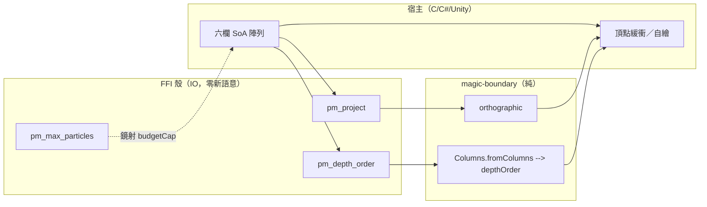

# Func-Spec 0011：宿主整合面（投影上 C ABI＋參考綁定）

> 狀態：**已完成**（2026-08-14，驗收紀錄見 §9）
> 性質：一般 —— 新增的 C 匯出與 header 宣告交付即凍結（只加不改，ADR-0011 D7 延續）；`Magic.Columns` 交付後凍結。
> 前置依賴：**無**（0008 交付 `Magic.Projection`、0009 交付 C ABI 外殼，皆已完成；本 spec 全部是它們之上的加法）。**與 spec 0010、0013 三方平行**：本 spec 鎖 `src/ffi`＋`include`＋`.def`＋`test/FFIContractSpec.hs`＋新目錄，0010 鎖 core／`Interface.hs`／bench，0013 鎖 `app/*`——檔案零交集（§0.2 附證明）。
> 依據：[ADR-0011](../adr/adr-0011-ffi-c-abi-boundary.md)（C ABI 消費模式全部決策沿用）；ADR-0008（2D＝正交投影——本 spec 把它送到非 Haskell 宿主手上）；[roadmap.md](../roadmap.md) §4.2–§4.4（`pm_max_particles` 管道、0009 §9-1 已解鎖的投影匯出、兩個文件缺口）；[integration.md](../integration.md)（本 spec 把其中的程式碼片段變成真的會編譯的檔案）。
> 範圍：三個純增補 C 匯出（`pm_max_particles`／`pm_project`／`pm_depth_order`）、契約測試的 4096 釘選改寫為查詢鏡射律（為 0012 的上限提升解鎖）、header 兩處純註解增補（顏色位元組序、座標手性）、C# 參考綁定與 Unity 最小範例。

---

## 0. 起點：引用的凍結介面、檔案盤點

### 0.1 引用的凍結介面（全部唯讀 import 或 add-only 擴充）

| 凍結物 | 本 spec 的用法 |
|---|---|
| `include/particle_magic.h` 全文＋10 個 C 進入點（0009 §10 凍結，add-only） | 只加：3 函數宣告、2 plane 常數、1 錯誤碼、2 段註解。**既有宣告與常數值一字不改**（含 `PM_MAX_PARTICLES 4096`——它降級為「第 1 代編譯時的值」，永遠釘 4096） |
| `Magic.Projection`：`ViewPlane(..)`／`orthographic :: ViewPlane -> V3 -> (V2, Float)`／`depthOrder :: ViewPlane -> ParticleBuffer -> U.Vector Int`（0008 凍結） | `pm_project`＝`orthographic` 逐點映射；`pm_depth_order`＝`depthOrder` 原樣呼叫——FFI 零新語意（0009 §2 紀律延續）。**0010 會換 `depthOrder` 內部實作但輸出逐位元不變**，本 spec 只依賴其凍結簽名與 painter 律，與 0010 無時序耦合 |
| `Magic.Particle.Buffer`（core）：`ParticleBuffer(..)` 完整匯出（含建構子） | **不直接 import**（foreign-library 白名單無 magic-core）；經新 boundary 模組 `Magic.Columns` 的受控建構面取用（§0.3） |
| `Magic.Interface`：`V3(..)`（0005 凍結） | `pm_project` 逐點組 `V3` |
| foreign-library 依賴白名單 {base, magic-boundary, bytestring, vector}（0009 M1；`FFIContractSpec` 守護） | 不變（`Magic.Columns` 屬 magic-boundary） |
| `FFIContractSpec` 的五文本守護（0009 S4） | 本 spec **修改**它：凍結清單 8→11、新常數、4096 釘選改寫（§1 完成定義 3）——契約測試本身不是凍結介面，是凍結介面的守衛，隨合約加法同步是它的本職 |
| `StablePtr`＋`IORef` handle、copy-out、錯誤協定（ADR-0011 D3/D4） | 新匯出沿用；`pm_project`/`pm_depth_order` 無 handle（純陣列進出），錯誤協定見 §3 |

### 0.2 檔案盤點（與 0010／0013 的三方零交集證明）

**修改（4）**：

| 檔案 | 變更 |
|---|---|
| `src/ffi/Magic/FFI.hs` | +3 `foreign export`（`pm_max_particles`/`pm_project`/`pm_depth_order`）＋plane/錯誤碼常數 |
| `include/particle_magic.h` | +3 宣告、+`PM_PLANE_SIDE_XY 0`/`PM_PLANE_TOP_XZ 1`、+`PM_ERR_ARGS (-4)`、+2 段註解（§4.4） |
| `particle-magic-ffi.def` | EXPORTS +3 行 |
| `test/FFIContractSpec.hs` | 凍結清單 8→11；新常數斷言；**4096 釘選改寫**（§2） |

**新增**：`src/boundary/Magic/Columns.hs`（§0.3）、`bindings/csharp/ParticleMagic.cs`、`examples/unity/README.md`＋`examples/unity/SpellRenderer.cs`、`test/ColumnsSpec.hs`、`test/FFIProjectSpec.hs`、`test/BindingContractSpec.hs`、`test/Acceptance11Spec.hs`。

**共用（行級聯集合併）**：`particle-magic.cabal`（magic-boundary `exposed-modules` +`Magic.Columns` 一行；test-suite `other-modules` +4 行——與 0010/0013 同檔異行）；`SKILL.md`（索引 +0011 列）。

**明文不碰**：`src/core/*` 全部、`src/boundary/{Codec,Interface,Projection,Step,Expr/Parse}.hs`（既有五模組零觸碰——新增檔案不算修改）、`app/*` 全部、`bench/*`、`cbits/pm_init.c`、既有 assets。

**三方交集**：0010 觸 core 六檔＋`Interface.hs`＋`bench/Bench.hs`；0013 觸 `app/*`。與本清單逐檔比對：**交集 = ∅**。

### 0.3 一個設計發現：`pm_depth_order` 需要新的 boundary 建構面

`depthOrder` 吃 `ParticleBuffer`，但 boundary 的凍結匯出**刻意**只開 fields 不開建構子（0005 的唯讀消費紀律），而 foreign-library 不得 import magic-core——FFI 拿到宿主的裸陣列後**無法**組出 `ParticleBuffer`。在 FFI 端重造排序 = 違反「零新語意」紀律，被否決。

解：新增 boundary 模組 **`Magic.Columns`**——受控的「六欄 → buffer」建構面，長度驗證後才交出 buffer（`bufferInvariant` 依建構即真）。這是新檔案＋cabal 一行，與 0010（只碰 `Interface.hs`）零交集不破。`Magic.Interface` 的「fields 不開建構子」紀律不動——`Columns` 是給「已經持有裸欄」的消費者（FFI、未來的宿主工具）的窄門，兩個匯出面各守各的不變量。

## 1. 目標與完成定義

**目標**：把 2D 投影能力送到非 Haskell 宿主手上、鋪好上限查詢管道、補上兩個只存在於原始碼裡的合約事實、交付 C#／Unity 參考材料。

**完成定義**（全部可驗證）：

1. `pm_max_particles()` 回傳 4096，且 `FFIContractSpec` 斷言其與 `Magic.Compile.budgetCap` 相等（**查詢鏡射律**——0012 改核心上限時此律自動要求 FFI 跟上，header 一字不必動）（S1）。
2. `pm_project` 對任意輸入 ≡ `orthographic` 逐點結果，逐位元（含 y-flip 無、depth 取負等 0008 語意原樣）；`pm_depth_order` ≡ `depthOrder`，逐元素（S3／S4）。
3. `FFIContractSpec` 更新後全綠：header↔export↔`.def` 三向一致（11 函數）、`PM_PLANE_*`／`PM_ERR_ARGS` 與 Haskell 常數一致、`PM_MAX_PARTICLES == 4096`（永釘，註解標明第 1 代值）＋查詢鏡射律、依賴白名單不變（S1）。
4. header 含兩段新註解：`color` 欄的 `0xRRGGBBAA` 位元組序、右手座標系（X 右、Y 上、+Z 朝觀者；Unity/Unreal 須翻 Z）——由 `FFIContractSpec` 以文字哨兵守護存在性（S5）。
5. `bindings/csharp/ParticleMagic.cs` 的 `DllImport` 清單與 header 函數雙向一致（`BindingContractSpec` 文字守護）（S6）。
6. `examples/unity/` 可依 README 在 Unity 專案中手動驗證（手動 smoke，§9 回填）（S7）。
7. 跨界等價律擴充：同六欄輸入下 FFI 投影路徑 ≡ Haskell 投影路徑，120 幀全程（S8）。

## 2. 使用到的架構與技巧

- **零新語意紀律（0009 §2 延續）**：三個新匯出全部是凍結 boundary 函數的型別穿越。`pm_project` = `map (orthographic plane)`；`pm_depth_order` = `fromColumns` → `depthOrder` → copy-out。S8 等價律把這句話變成測試。
- **無 handle 的純陣列函數**：投影不需要 spell 狀態——簽名收裸陣列＋長度，宿主可以拿**任何**來源的位置欄來投（不限 `pm_observe` 的輸出）。NULL／負長度／未知 plane → `PM_ERR_ARGS`（新錯誤碼，加法），**錯誤路徑零寫出**（0009 pm_observe 的 all-or-nothing 慣例）。
- **查詢鏡射律取代常數釘選**：`FFIContractSpec` 現況斷言 `PM_MAX_PARTICLES == pmMaxParticles == budgetCap == 4096` 三方相等——這把核心上限焊死在凍結 header 上。改寫為兩條獨立律：(a) `PM_MAX_PARTICLES == 4096` 永遠成立（第 1 代值，向後相容的緩衝下限）；(b) `pm_max_particles()` ≡ `budgetCap`（鏡射律）。0012 提升上限時只需改 (b) 兩側的實值，header 與既有宿主零受擾——這正是 roadmap §4.2「乾淨解」的落地。
- **`Magic.Columns` 窄門**：`fromColumns` 驗證六欄等長才建構（`Either ColumnError ParticleBuffer`），`pm_depth_order` 只用位置三欄時以零欄補齊其餘（`depthOrder` 只讀位置與 count，補零不影響輸出——S4 附此律測試）。
- **文字合約守護外推到 C#**：`BindingContractSpec` 行式剖析 `ParticleMagic.cs` 的 `[DllImport]`+`static extern` 行，斷言函數名集合 ≡ header 宣告集合。同一手法第三次使用（BoundarySpec → FFIContractSpec → BindingContractSpec），綁定漂移在 `cabal test` 就炸。
- **Unity 範例＝手動 smoke**：與 `examples/c/main.c` 同定位——不進 CI、README 寫明步驟與預期畫面，§9 回填實測結果。內容即 integration.md §5 的 `SpellRenderer` 成品化（含 Z 翻轉、`RuntimeInitializeOnLoadMethod` 一次性 `pm_init`、絕不呼叫 `pm_shutdown` 的警告）。

## 3. ADT／C API

```c
/* 追加宣告（header add-only；值/佈局永久凍結） */
#define PM_PLANE_SIDE_XY 0   /* 側視：丟 Z，depth = -z */
#define PM_PLANE_TOP_XZ  1   /* 俯視：丟 Y，depth = -y */
#define PM_ERR_ARGS (-4)     /* NULL 指標、負長度或未知 plane */

int pm_max_particles(void);  /* 核心當前粒子上限；今天 == PM_MAX_PARTICLES(4096)，
                                之後核心提升時本查詢跟著變、header 不再動。
                                新宿主一律以本查詢配置緩衝。 */

int pm_project(int plane,
               const float* pos_x, const float* pos_y, const float* pos_z,
               int count,
               float* out_x, float* out_y, float* out_depth);
/* 逐點正交投影（0008 語意）。回 PM_OK 或 PM_ERR_ARGS；錯誤時零寫出。 */

int pm_depth_order(int plane,
                   const float* pos_x, const float* pos_y, const float* pos_z,
                   int count, int* out_indices);
/* painter 置換：遠到近、等深保輸入序（與 Haskell depthOrder 逐元素同）。 */
```

```haskell
-- src/boundary/Magic/Columns.hs（新；交付後凍結）
module Magic.Columns (ParticleBuffer, ColumnError (..), fromColumns) where
data ColumnError = LengthMismatch ![Int] deriving (Eq, Show)
fromColumns :: U.Vector Float -> U.Vector Float -> U.Vector Float  -- pos x/y/z
            -> U.Vector Float -> U.Vector Float -> U.Vector Word32 -- size/life/color
            -> Either ColumnError ParticleBuffer

-- src/ffi/Magic/FFI.hs（加法）
foreign export ccall pm_max_particles :: IO CInt        -- v1 = pmMaxParticles（4096）
foreign export ccall pm_project
  :: CInt -> Ptr CFloat -> Ptr CFloat -> Ptr CFloat -> CInt
  -> Ptr CFloat -> Ptr CFloat -> Ptr CFloat -> IO CInt
foreign export ccall pm_depth_order
  :: CInt -> Ptr CFloat -> Ptr CFloat -> Ptr CFloat -> CInt -> Ptr CInt -> IO CInt
-- 常數：pmPlaneSideXY = 0; pmPlaneTopXZ = 1; pmErrArgs = -4
-- plane 解碼：0 -> SideXY; 1 -> TopXZ; 其他 -> PM_ERR_ARGS
```

### 3.1 header 註解增補（純註解，仍 add-only）

1. `uint32_t* color` 欄旁：`/* Packed 0xRRGGBBAA: R in the highest byte, A in the lowest. */`＋C 拆包示例。
2. 檔頭 Usage 區後：座標系段——右手系、X 右、Y 上、+Z 朝觀者；左手系宿主（Unity/Unreal）須翻 Z，否則 `vortex` 場旋向靜默反轉。
   兩段各含一個固定哨兵詞（`0xRRGGBBAA`、`right-handed`），`FFIContractSpec` 斷言存在。

## 5. 資料流（pipeline）



## 6. 搭建方式（風險優先）

1. **S1 `pm_max_particles`＋契約改寫＋header 註解**——最小的匯出、最重要的鬆綁（0012 的解鎖條件）；兩段註解與哨兵同步落地。
2. **S2 `Magic.Columns`**——`pm_depth_order` 的前置。
3. **S3 `pm_project`＋`pm_depth_order`**——主體（同一組投影匯出，一個測試模組雙 describe）。
4. **S4 C# 綁定＋守護**、**S5 Unity 範例**——依賴前三步的最終 header。
5. **S6 端到端等價律**。

## 7. Todo List 與 1-to-1 測試對應

| # | Todo | 測試 |
|---|---|---|
| ✅ S1 | `pm_max_particles` 匯出（header／`.def`／FFI.hs）＋`FFIContractSpec` 改寫（凍結清單 8→9、`PM_MAX_PARTICLES` 永釘 4096、查詢鏡射律 `pm_max_particles ≡ budgetCap`）＋header 兩段註解與哨兵 | `test/FFIContractSpec.hs`（更新後全綠即驗收：三向一致、鏡射律、兩個註解哨兵） |
| ✅ S2 | `Magic.Columns.fromColumns`＋cabal 一行 | `test/ColumnsSpec.hs`（等長成功／不等長列出全部長度、`bufferInvariant` 依建構即真、與 `fromParticles` 往返等價） |
| ✅ S3 | `pm_project`＋`pm_depth_order`（含 `PM_PLANE_*`／`PM_ERR_ARGS`；凍結清單 →11） | `test/FFIProjectSpec.hs`（`pm_project` ≡ `orthographic` 逐點逐位元 property；`pm_depth_order` ≡ `depthOrder` 逐元素 property＋補零欄不影響律；NULL/負長/壞 plane → `PM_ERR_ARGS` 零寫出） |
| ✅ S4 | `bindings/csharp/ParticleMagic.cs`（DllImport 全函數＋常數＋`Unpack` 顏色助手＋Z 翻轉助手） | `test/BindingContractSpec.hs`（`.cs` DllImport 名集合 ≡ header 宣告集合、常數值一致） |
| ✅ S5 | `examples/unity/`（`SpellRenderer.cs`＋README：DLL 放置、RTS 警告、Z 翻轉、固定時步；另交付 `PmSmoke.cs`） | **手動 smoke**：Unity 6000.5.7f1 batchmode 實測 **27 PASS / 0 FAIL**（§9.3） |
| ✅ S6 | 端到端驗收 | `test/Acceptance11Spec.hs`（golden spell 120 幀：`pm_observe` 六欄 → `pm_project`/`pm_depth_order` ≡ Haskell `observeSpell`→`orthographic`/`depthOrder`，逐位元） |

## 8. 非目標

1. 上限值的實際提升（spec 0012 S1；本 spec 只鋪查詢管道）。
2. 多 spell 聚合 FFI API（依賴 0012 的場景層；記帳 roadmap §3.3）。
3. GDScript／C++ 包裝層（C# 綁定是第一個參考實作；其餘等真實宿主需求）。
4. 多執行緒安全／內部鎖（0009 §9-2 立場不變）。
5. 熱重載 FFI API（政策已定：重載＝重施法，宿主自行 `pm_cast`）。
6. Unity 範例的 CI 化（手動 smoke 定位；Unity 專案不進 repo 建置）。
7. `pm_project` 的透視投影／自訂投影矩陣（核心只有正交語意；3D 深度排序屬宿主——見 integration.md §7）。

## 9. 驗收紀錄

**日期**：2026-08-14　**環境**：GHC 9.14.1 / cabal 3.16.1.0 / Windows 11 x86_64

### 9.1 自動測試

- `cabal test`：**706 examples, 0 failures**（0009 交付時為 676；本輪 +30 = 新增 27＋`FFIContractSpec` 淨增 3）。
- `cabal build spec`／`cabal build flib:particle-magic-ffi`：零警告（`-Wall`）。既有 `FFIHarness.hs` 的 `Word64` 冗餘 import 警告為 0009 遺留，未觸碰。
- 本輪測試模組：`ColumnsSpec`(7)、`FFIProjectSpec`(13)、`BindingContractSpec`(4)、`Acceptance11Spec`(3)。
- 逐位元等價律（S6）涵蓋 9 個範例陣 × 2 個投影平面 × 120 幀，`pm_observe → pm_project/pm_depth_order` 與 `observeSpell → orthographic/depthOrder` 全等。

### 9.2 真實 DLL smoke（S3／S5 的 C 側）

`cabal build flib:particle-magic-ffi` 產出的 `.dll` 匯出表確認含三個新符號（`objdump -p`：`pm_depth_order`／`pm_max_particles`／`pm_project`）。以 ghcup 附帶的 clang `-Wall -Iinclude` 編譯一支只引用 `particle_magic.h` 的 C 宿主、連結該 DLL 執行，輸出：

```
abi=1 max=4096 (PM_MAX_PARTICLES=4096)
pm_project side rc=0: (1.0,10.0,d=5.0) (2.0,20.0,d=-5.0) (3.0,30.0,d=-0.0)
pm_project top  rc=0: (1.0,-5.0,d=-10.0) (2.0,5.0,d=-20.0) (3.0,0.0,d=-30.0)
pm_depth_order rc=0: 0 2 1 (expect 0 2 1)
bad plane rc=-4 (expect -4)
negative count rc=-4 (expect -4)
```

即：header 是合法且零警告的 C、三個新進入點在真實 ABI 上語意正確、`PM_ERR_ARGS` 路徑如約。（`d=-0.0` 是 `negate 0` 的正號位，與 Haskell 端逐位元相同。）

### 9.3 S5 Unity 實測（**已完成**）

環境：Unity **6000.5.7f1**（Unity CLI `unity run`，batchmode `-nographics`）。專案為臨時建立（不進 repo），內容物僅三個交付檔＋建置出的 DLL：

```
Assets/Scripts/ParticleMagic.cs      <- bindings/csharp/（原檔，未修改）
Assets/Scripts/SpellRenderer.cs      <- examples/unity/（原檔，未修改）
Assets/Editor/PmSmoke.cs             <- examples/unity/（本輪新增，見下）
Assets/Plugins/x86_64/particle-magic-ffi.dll
```

指令與結果：

```
unity run <專案> --non-interactive -- -executeMethod PmSmoke.Run -pmSpellDir <repo>/assets/spells
→ 27 PASS, 0 FAIL, exit 0
```

實測涵蓋 `cabal test` 與 §9.2 的 C smoke 都測不到的一段：**Unity 自己的 P/Invoke marshaller**、DLL 從 `Assets/Plugins/x86_64` 載入（不需要任何 `.meta` 設定）、以及 `SpellRenderer` 的 Mesh 路徑。逐項：

- `pm_abi_version()==1`、`pm_max_particles()==4096`；
- ring-fire 推進 1.0s → 97 顆粒子，位置全部有限、`life ∈ [0,1]`、alpha 非零（顏色位元組序若相反，最後一項會當場失敗）；
- `pm_project` 兩個平面**逐位元**等於 `(x,y,−z)`／`(x,z,−y)`（97/97）；
- `pm_depth_order` 是 `[0,97)` 的置換且深度非遞增；
- 壞 plane（42）與負長度 → `PM_ERR_ARGS`，且輸出陣列的哨兵一格未動；
- `pm_free` 後在同一 process 再 `pm_cast` 成功（沒有人偷叫 `pm_shutdown`）；
- `SpellRenderer`：Awake 依 `pm_max_particles()` 配置、Cast 取得 handle、10 次 pump 後 mesh 有 **388 頂點 = 97 × 4**、全部有限、bounds 的 z 已翻轉（`Center z=1.50`，對應庫的 z ∈ [−3,0]）、`OnDestroy` 釋放 handle；
- alpha 批次的 quad 發射順序**等於 `pm_depth_order` 回的置換**（`empty` 129 quads、`gravity-well` 193 quads）。

**新增交付物 `examples/unity/PmSmoke.cs`**：把上述檢查變成一行可重跑的指令（README §7）。定位仍是手動 smoke——不進 CI、不進 `cabal test`——但任何有 Unity CLI 的人可以一鍵複驗，而且驗的是**宿主真的會複製的那兩個檔案**，不是它們的改寫版。

實測中發現、值得記下的兩件事（都不是缺陷）：

1. **`SpellRenderer.Draw` 沒有 `Camera.main` 就整段跳過**（billboard 需要相機軸）。批次測試第一版忘了建相機，得到 0 頂點——這是元件的合理 early-out，但也是 Unity 宿主最容易踩到「什麼都沒畫」的原因，README 未特別提，元件註解已說明。
2. **現行 9 個範例陣的 alpha 批次，buffer 順序本來就是由遠而近**（發射器沿法線擠出 ⇒ index 與深度單調相關），所以「開關排序看起來一樣」是資料性質而非排序失效。因此驗收斷言改成「發射順序 ≡ `pm_depth_order` 的置換」，不依賴資料是否亂序。README §7 已註明這件事，免得下一個人誤判。

未涵蓋（需要人眼／Editor 互動，README §8 列為 checklist）：視覺美術判斷、**停止播放後再次 Play**（批次模式每次都是新 process，驗不到 §4 那個 RTS 坑真正的發作情境）、Profiler 的 GC Alloc。

### 9.4 凍結清單（下游 spec 可直接引用）

**C 進入點 11 個**（`foreign export` 清單，`.def` 與 header 三向一致）：
`pm_abi_version`、`pm_cast`、`pm_cast_ex`、`pm_advance`、`pm_is_finished`、`pm_age`、`pm_observe`、`pm_free`、**`pm_max_particles`**、**`pm_project`**、**`pm_depth_order`**（＋`cbits` 的 `pm_init`／`pm_shutdown`，header 共 13 宣告）。

新常數（值永久凍結）：`PM_PLANE_SIDE_XY 0`、`PM_PLANE_TOP_XZ 1`、`PM_ERR_ARGS (-4)`。

`Magic.Columns` 匯出面：`ParticleBuffer`（抽象）、`ColumnError (..)`、`fromColumns :: 6 欄 -> Either ColumnError ParticleBuffer`。

**兩條律，0012 直接繼承**：
1. `PM_MAX_PARTICLES == 4096` 永釘（header 凍結，第 1 代編譯時值）。
2. 查詢鏡射律 `pm_max_particles() ≡ pmMaxParticles ≡ budgetCap`——0012 提升上限時，改 `budgetCap` 與 `src/ffi/Magic/FFI.hs` 的 `pmMaxParticles` 兩處即可，**header 一字不動**，既有宿主不受擾。

### 9.5 與計畫的差異

1. `FFIContractSpec` 增列三個 header 解析器到匯出清單（`headerFunctions`／`headerDefines`／`readUtf8`），供 `BindingContractSpec` 共用，避免第三份複製的解析器。契約斷言本身未受影響。
2. `particle-magic.cabal` 的 `extra-source-files` 多一行 `bindings/csharp/ParticleMagic.cs`（與 header、`examples/c/main.c` 同理由：非 Haskell 消費者要拿得到）。仍是同檔異行的聯集合併，與 0010／0013 無交集。
3. C# 常數守護採「行內註解宣告自己對應哪個巨集」的寫法，而非在測試裡維護對照表——因此新增 header `#define` 而忘了補綁定會被雙向集合相等當場抓到。
4. §0.2 的檔案盤點只列程式檔，實際另更新三份文件（SKILL.md 規則要求）：[integration.md](../integration.md)（對外介面變動必須同步；新增 §2.5 緩衝配置、§4.5 C 宿主投影，§5 的 C# 片段改為指向真檔案）、[roadmap.md](../roadmap.md)（驗收後盤點）、CHANGELOG。三份都與 0010／0013 同檔異行，仍是聯集合併。
