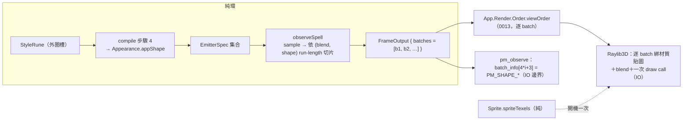

# Func-Spec 0015：視覺表現力・核心半場（展現詞彙與多批次輸出）

> 狀態：**已完成**（2026-08-15，驗收紀錄見 §9）
> 性質：一般 —— 交付後凍結 `BillboardShape` 的建構子宣告序（＝ C wire code）、`StyleRune` 的 JSON 形狀、批次分割律。
> 前置依賴：**spec 0012（需已完成）**——本 spec 與 0012 同碰 `Compile.hs`／`Interface.hs`／`FFI.hs`／`FFIContractSpec.hs`／`Raylib3D.hs` 五個檔案（§0.2 逐檔列出），依 SKILL.md 規則 4 不得平行，**動工門檻＝0012 驗收**。**與 spec 0014 平行**（0014 觸 `tools/`／`app/Main.hs`／`Loop`／`Effects`／`HotReload`／`docs/spell-schema.md`／`BoundarySpec`，與本清單逐檔交集 = ∅，§0.2 附證明）。
> 依據：architecture §1.2（特效即魔法——粒子形態就是魔法的語意）、§5.2（輸出格式含 `BillboardShape`）、§10「新符文／新渲染後端」兩列；ADR-0003（展現＝外圈職責）、ADR-0009（動態 quad mesh，不自訂 shader）、ADR-0011 D7（header add-only）；[roadmap.md](../roadmap.md) §3.4、§6-3；spec 0008 §9-5（`rbShape` 差異化）、spec 0013 §8-1（明文把「動核心的那半」留給本輪）。**本輪同步交付 ADR-0013**（先例：0007↔ADR-0010、0009↔ADR-0011、0012↔ADR-0012）。
> 範圍：`observeSpell` 由單一 batch 改為依 `(blend, shape)` 分批；`BillboardShape` 由 boundary 搬入核心並從 1 個建構子擴為 4 個（皆無參數）；新增外圈 `StyleRune` 與其 JSON tag；FFI／header／C# 綁定純增補 wire code；shell 以**程序生成**的貼圖差異化繪製（零外部資產）。

---

## 0. 起點：引用的凍結介面、檔案盤點

### 0.1 引用的凍結介面

| 凍結物 | 本 spec 的用法 |
|---|---|
| `FrameOutput { batches :: [RenderBatch] }`、`RenderBatch(..)`（0001／0005 凍結） | **簽名零變更**。本 spec 只是第一次讓 `batches` 真的是複數——型別早就是清單，architecture §5.2 也一直這樣寫 |
| `Magic.Interface` 匯出面（0005 凍結＋0010／0012 加法） | `BillboardShape(..)` 仍由此匯出，只是定義處搬進核心並改 re-export；**宿主可見面一字不變**（先例：architecture §4.7 的 `CastContext` 型別落點註記） |
| `PM_BATCH_INFO_STRIDE 4`、`batch_info` 四欄語意（0009 §4.4 凍結） | **零觸碰**。shape 永遠只佔一個 int ⇒ 新增 shape ＝ 新增 `PM_SHAPE_*` 常數＝純增補（ADR-0011 D7）。這條凍結是 §2「無參數列舉」裁決的唯一理由 |
| `PM_SHAPE_SQUARE 0`（0009 交付） | 值永久釘選；新碼由 1 起遞增 |
| `BindingContractSpec` 的雙向常數鏡射律（0011 S4） | **不必新寫測試**：既有斷言「每個 header `#define` 都有同名同值的 C# `public const int`，且反向亦然」會強制 `bindings/csharp/ParticleMagic.cs` 跟上 |
| `emitterOffsets` / `aliveRanges` / `sample` 的逐發射器列佈局（0010 S2/S3） | 分批的依據：buffer 的 row 依發射器順序串接，因此「相鄰發射器 run-length 分組」＝ buffer 的連續切片，零重排 |
| `spellEmitters` index 0 ＝ casting 發射器的**建構慣例**（0006；0012 §2 已再查證一次） | 本 spec 不新增任何索引讀取假設：分組鍵一律取自 `emAppearance`，不看索引 |
| `Appearance`／`elementAppearance` 的封閉影響面（0002；architecture §10「新屬性元素」列） | `appShape` 是 `Appearance` 的第 5 欄；`elementAppearance` 全部給 `BillboardSquare`（§2 的 opt-in 律） |
| ADR-0009：動態 quad mesh、每 batch 一次 mesh 更新＋一次 draw call、不自訂 shader | S4 不改這條：貼圖走 raylib **預設** shader 的 diffuse map，draw call 預算不變 |
| 0013 交付的 `App.Render.Order.viewOrder`、`App.Camera`、`App.Render.Flat`（其 §9.3 穩定面） | **唯讀取用**。`viewOrder` 本來就是逐 batch 呼叫，分批後自動對每一批各自排序——0013 的基建在本輪第一次真的有複數 batch 可餵 |

### 0.2 檔案盤點（與 0014 的零交集證明、與 0012 的交集清單）

**修改**：

| 檔案 | 變更 |
|---|---|
| `src/core/Magic/Rune.hs` | `BillboardShape` 型別遷入＋擴為 4 個建構子（derive `Enum`/`Bounded`）；`OuterRune` 加 `StyleRune`（S2） |
| `src/core/Magic/Compile.hs` | `Appearance` 加 `appShape`；`elementAppearance`／`formationAppearance` 補欄；fold 步驟 4 加 `StyleRune` case；轉匯出 `BillboardShape`（S2） |
| `src/boundary/Magic/Codec.hs` | `parseOuterRune`／`encodeOuterRune` 加 `"style"` tag＋shape 名稱表（S2） |
| `src/boundary/Magic/Interface.hs` | `BillboardShape` 由本地定義改為 re-export；`observeSpell` 改多批次（S1／S2） |
| `src/ffi/Magic/FFI.hs` | `shapeCode` 改為 `fromIntegral . fromEnum`（宣告序即 wire code）（S3） |
| `include/particle_magic.h` | `PM_SHAPE_*` +3（**純增補**；`PM_BATCH_INFO_STRIDE` 零觸碰）（S3） |
| `bindings/csharp/ParticleMagic.cs` | 對應 `public const int` +3（由 `BindingContractSpec` 強制）（S3） |
| `app/App/Render/Quads.hs` | 新增純函數 `quadTexcoords`（比照既有 `quadIndices`：capacity 的純函數，開機上傳一次）；`QuadBatch` 型別**零變更**（S4） |
| `app/App/Render/Raylib3D.hs` | `emptyQuadMesh` 的 texcoord 欄由全零改為 uv 圖樣；初始化時每個 shape 載入一張程序生成貼圖；`drawSceneIO`／`drawFlatIO` 逐 batch 綁對應材質（S4） |
| `test/FFIContractSpec.hs` | 加 shape wire-code 鏡射律（S3） |

**新增**：`app/App/Render/Sprite.hs`、`test/BatchSplitSpec.hs`、`test/ShapeVocabSpec.hs`、`test/SpriteSpec.hs`、`test/Acceptance15Spec.hs`、`assets/spells/soft-bloom.json`、`docs/adr/adr-0013-billboard-vocabulary.md`。

**共用（行級聯集合併）**：`particle-magic.cabal`（exe other-modules +1、test other-modules +4）；`SKILL.md`（索引列）；`CHANGELOG.md`／`docs/roadmap.md`／`docs/integration.md`（索引與盤點列）。

**明文不碰**：`app/App/{Loop,Effects,Hud,TestInterp,HotReload}.hs`、`app/Main.hs`、`app/App/Render/{Flat,Order}.hs`（0013 §9.3 穩定面；貼圖座標走開機一次的 mesh 屬性，2D 路徑因此零改動——見 §2）、`src/core/Magic/Particle/*`、`src/core/Magic/{Circle,Expr,Project,Types}.hs`、`src/boundary/Magic/{Projection,Step,Columns,Expr/Parse}.hs`、`src/boundary/Magic/Scene.hs`（0012 交付後屬穩定面）、`tools/*`（0014）、`docs/spell-schema.md`（0014 所有——見 §8-7 的合併順序條款）、`bench/Bench.hs`、`examples/*`、`test/{FormationSpec,BoundarySpec,BindingContractSpec}.hs`。

**與 0014 交集**：0014 觸 `tools/`（新）、`app/Main.hs`／`Loop`／`Effects`／`HotReload`、`docs/spell-schema.md`、`test/BoundarySpec.hs`、`test/{ValidateSpec,SchemaDocSpec,RescanSpec,Acceptance14Spec}.hs`（新）。與本清單逐檔比對：**交集 = ∅**（cabal／SKILL.md／CHANGELOG 同檔異行除外）。

**與 0012 交集（＝動工門檻的理由）**：`src/core/Magic/Compile.hs`、`src/boundary/Magic/Interface.hs`、`src/ffi/Magic/FFI.hs`、`app/App/Render/Raylib3D.hs`、`test/FFIContractSpec.hs` 五檔。交集非空 ⇒ 依 SKILL.md 規則 4 不平行，本 spec 排在 0012 之後。

---

## 1. 目標與完成定義

**目標**：讓「展現」這一層真的有詞彙。目前不論火、水、雷、不論陣形或主效果，每一顆粒子都是同一種不透明方塊——architecture §1.2 說「看到的粒子形態**就是**魔法的語意」，而現在粒子形態這個維度的值域大小是 1。本輪把它變成一個玩家可寫進魔法陣、一路穿過核心／邊界／C ABI／渲染後端的真詞彙。

**完成定義**：

1. `observeSpell` 依**相鄰發射器**的 `(appBlend, appShape)` run-length 分批，輸出 `[RenderBatch]`；**分割律**：`concat (map rbParticles batches)` 與分批前的單一 buffer 逐位元相同（六欄、逐列、含順序）。批次順序＝發射器順序（決定論）（S1）。
2. `BillboardShape = BillboardSquare | BillboardSoftDot | BillboardRing | BillboardSpark`，全部**無參數**，定義於 `Magic.Rune`、經 `Magic.Compile`／`Magic.Interface` re-export；`Magic.Interface` 的匯出清單文本不變（仍是 `BillboardShape (..)`）（S2）。
3. 外圈符文 `StyleRune BillboardShape`，JSON 形狀 `{"rune": "style", "billboard": "soft-dot"}`（鍵名用 `billboard` 而非 `shape`——`"shape"` 已被 `ShapeRune` 的初始面形狀佔用）；round-trip 成立；未知名稱回帶行列位置的載入錯誤（S2）。
4. **opt-in 逐位元律**：`elementAppearance` 的四個元素一律 `BillboardSquare`，`formationAppearance` 亦然 ⇒ **現有 10 個範例陣的 `FrameOutput` 完全逐位元不變**（六欄、批次數＝1、`rbBlend`、`rbShape` 全同）。形狀只能由 `StyleRune` 開啟——與 0006 `"phases"`、0007 `"fields"` 同一條慣例（S1＋S2 聯合驗收）。
5. C ABI：`PM_SHAPE_SOFT_DOT`／`PM_SHAPE_RING`／`PM_SHAPE_SPARK` = 1／2／3；`shapeCode ≡ fromEnum`；`PM_SHAPE_SQUARE` 仍為 0；`PM_BATCH_INFO_STRIDE` 與所有既有宣告零改動；C# 綁定同步（S3）。
6. demo 逐 batch 以對應貼圖繪製；`BillboardSquare` 綁 raylib 預設材質的 1×1 白貼圖 ⇒ **現況畫面不變**；`assets/spells/soft-bloom.json` 在 demo 中肉眼可見為軟光點而非方塊（S4，手動 smoke）。
7. ADR-0013 交付：無參數列舉的永久裁決、型別落點遷移規則、被否決方案（S5）。

## 2. 使用到的架構與技巧

- **分批＝對發射器做 run-length 分組，不做 group-by**：buffer 的列依發射器順序串接（0010 的 `sample` 逐發射器填欄），所以只要**不重排**，每個批次就是一段連續切片，分割律是結構性成立而非靠測試碰運氣。相同鍵的**不相鄰**發射器刻意**不合併**——合併就要重排列，會破壞逐位元相容與 0007 的 `aliveSlots` 對齊直覺。代價是批次數可能多於相異鍵數；發射器數是個位數，draw call 仍與粒子數無關（ADR-0009 的預算不變）。
- **切片走 `Data.Vector.Unboxed.slice`（零拷貝）**：六欄各切一段，`pbCount` 取該段長度。分批不配置新記憶體，S1 對 0010 的每幀六次 exact-size 配置成本零影響。
- **`BillboardShape` 永遠是無參數列舉**：`PM_BATCH_INFO_STRIDE 4` 是 0009 凍結的 header 常數，shape 只有一個 int 的空間。帶參數的 shape（拉伸倍率、旋轉角）需要改 stride ＝ 破壞性變更，或走「旁路查詢」（0011 的 `pm_max_particles` 模式，另開 `pm_batch_shape_params`）。v1 裁決：**保持列舉**，參數化留待需求出現。ADR-0013 記錄兩案。
- **derive `Enum`/`Bounded` ⇒ wire code 成為定義而非慣例**：`shapeCode = fromIntegral . fromEnum`，鏡射測試遍歷 `[minBound .. maxBound]`。新增建構子時，只要加在**清單末端**，既有碼自動不動；加在中間會被測試抓到（因為 `PM_SHAPE_SQUARE 0` 的釘選斷言）。
- **貼圖走 raylib 預設 shader 的 diffuse map，不自訂 shader**：ADR-0009 否決的是 instancing 與自訂 shader，不是貼圖。預設材質本來就有一張 1×1 白貼圖（這就是目前無貼圖也畫得出來的原因），mesh 也**早就有 texcoord VBO**——`emptyQuadMesh` 的註解寫著「normals and texcoords exist because raylib uploads a VBO per non-null attribute and the default shader expects both; their values never change」。本輪只是把那個一直存在但全零的屬性填上值。**這把 S4 的風險從「加一條 VBO 管線」降為「改一個既有陣列的初值」**。
- **貼圖座標是 capacity 的純函數，不是每幀資料**：每個 quad 的 uv 恆為 `(0,0)(1,0)(1,1)(0,1)`，與 `quadIndices` 同構 ⇒ 開機寫一次。**`QuadBatch` 零變更** ⇒ `bench/Bench.hs`、`QuadBatchSpec`、`OrderSpec`、`FlatQuadSpec`、`App.Render.Flat` 全數零觸碰，0013 的穩定面完整保住。
- **貼圖像素是純函數，可測**：`spriteTexels :: BillboardShape -> Int -> S.Vector Word8` 在 `app/App/Render/Sprite.hs` 產生 RGBA 位元組（RGB 全白、資訊全在 alpha，這樣頂點色仍然是唯一的顏色來源——顏色曲線的語意不被貼圖搶走）。**零外部資產**：不引入美術檔、不動 `assets/` 以外的載入路徑，也就不會出現「貼圖找不到」這種宿主整合負擔。IO 端只做「開機把帶貼圖的三個 shape 各上傳成一張 texture」。
- **`BillboardSquare` 保持零貼圖路徑**：不綁自己的貼圖，直接用預設材質的白貼圖 ⇒ 逐位元相同的既有畫面，且省一張 texture。這與完成定義 4 的 opt-in 律是同一件事在 IO 側的表現。
- **陣形固定 `BillboardSquare`**：`StyleRune` 只影響 fold 步驟 4 產出的主效果發射器；陣形發射器（0006 fold 步驟 5）維持方塊——魔法陣是「畫出來的線」，用硬邊點才銳利。這同時是**產生複數 batch 的主要來源**：帶 `StyleRune` 的陣在 Drawing／Converging 期間就是兩批（陣形 Square ＋ 主效果 SoftDot），0013 的逐 batch 排序與 `pm_observe` 的 `max_batches` 於是第一次被真的走到。

## 3. ADT

```haskell
-- Magic.Rune（遷入＋加法）
data BillboardShape
  = BillboardSquare     -- 0：硬邊方塊（現況；wire code 永久釘選）
  | BillboardSoftDot    -- 1：徑向 alpha 漸層的軟光點
  | BillboardRing       -- 2：中空圓環
  | BillboardSpark      -- 3：十字光芒
  deriving (Eq, Show, Enum, Bounded)
  -- 宣告序 ≡ C wire code（§2）。永遠不帶參數——理由見 ADR-0013。

data OuterRune
  = ShapeRune FaceShape
  | RadiateRune RadiationMode
  | RangeRune Expr
  | StyleRune BillboardShape   -- 新：展現形態（外圈＝展現，ADR-0003）

-- Magic.Compile（加法）
data Appearance = Appearance
  { appColor  :: !ColorRamp
  , appSize   :: !Float
  , appBlend  :: !BlendMode
  , appAmplify:: !(Maybe Expr)
  , appShape  :: !BillboardShape   -- 新；elementAppearance 一律 BillboardSquare
  }

-- Magic.Interface（定義處搬遷，匯出面不變）
--   BillboardShape 改為 re-export；RenderBatch/FrameOutput 簽名零變更。
observeSpell :: ActiveSpell -> FrameOutput   -- 簽名同，語意由單批改多批

-- app/App/Render/Sprite.hs（新；純）
spriteTexels :: BillboardShape -> Int -> S.Vector Word8   -- n×n RGBA，長度 n*n*4
spriteSize   :: Int                                       -- 64

-- app/App/Render/Quads.hs（加法）
quadTexcoords :: Int -> S.Vector Float   -- cap*4*2；比照 quadIndices，開機一次
```

JSON（schema v1 不升版——只加一個 tag，缺鍵即無，與 `phases`／`fields` 同慣例）：

```json
{ "rune": "style", "billboard": "soft-dot" }
```

名稱表：`"square"`／`"soft-dot"`／`"ring"`／`"spark"`。

## 4. 資料結構與儲存方式

- 分批只在 `observeSpell` 的堆疊上發生：一段 `[(key, rowCount)]` 摺疊 ＋ 六欄 `U.slice`。**無新的跨幀狀態**（系統唯一的跨幀狀態仍是 0007 的 `FieldState`）。
- 貼圖生命週期在 shell 的 `QuadGpu`：`gpuShapeTex :: [(BillboardShape, Texture)]`（三項的關聯清單——`BillboardSquare` 不佔項，走預設材質的白貼圖；查表成本可忽略），與 mesh／material 同生共死，`freeQuadGpu` 一併卸載。
- 貼圖尺寸 64×64 RGBA ＝ 16 KB／張，三張 48 KB，一次性。

## 5. 資料流（pipeline）



## 6. 搭建方式（風險優先）

1. **S0 spike**——先在既有 demo 上把「texcoord 填值＋預設材質換一張程序生成貼圖」跑通並截圖。唯一的未知數在 h-raylib 的材質貼圖設定路徑；若走不通，退場方案是把四個 shape 改為**純幾何**變體（方塊／菱形／細長條——只動 `Quads.hs` 的頂點偏移，不需貼圖），S1–S3 完全不受影響。退場與否記入 §9。
2. **S1 分批**——一處改動點亮三份既有基建；先做讓後續有複數 batch 可測。
3. **S2 詞彙**（型別遷移→符文→fold→Codec）——核心語意。
4. **S3 wire code＋header＋C#**。
5. **S4 差異化渲染**。
6. **S5 端到端＋ADR-0013**（與 S2 同步起草、S5 定稿）。

## 7. Todo List 與 1-to-1 測試對應

| # | Todo | 測試 |
|---|---|---|
| ✅ S0 | h-raylib texcoord／材質貼圖 spike（風險前置；含退場判定） | **手動 smoke**（開窗截圖，比照 0005 S0 慣例；結果入 §9） |
| ✅ S1 | `observeSpell` 依 `(blend, shape)` 對相鄰發射器 run-length 分批（`U.slice` 零拷貝） | `test/BatchSplitSpec.hs`（分割律：批次串接 ≡ 分批前單一 buffer 逐位元；單一鍵 ⇒ 恰一批；空 spell ⇒ 零批；批次順序＝發射器順序；`pbCount` 總和守恆；QuickCheck 隨機陣） |
| ✅ S2 | `BillboardShape` 遷入 `Magic.Rune`＋4 建構子；`Appearance.appShape`；`StyleRune`＋fold case；Codec `"style"` tag；Interface re-export | `test/ShapeVocabSpec.hs`（符文 → `rbShape` 端到端見證；JSON round-trip；未知 `billboard` 名稱的錯誤含行列；陣形發射器恆為 `BillboardSquare`；**opt-in 逐位元律**：10 個既有範例陣的 `FrameOutput` 與交付前逐位元相同——六欄、批次數、`rbBlend`、`rbShape`） |
| ✅ S3 | `shapeCode ≡ fromEnum`；header `PM_SHAPE_*` +3；C# const +3 | `test/FFIContractSpec.hs` 擴充（遍歷 `[minBound .. maxBound]`：每個建構子都有同值的 `PM_SHAPE_*` define，且反向亦然；`PM_SHAPE_SQUARE == 0` 釘選；`PM_BATCH_INFO_STRIDE == 4` 未變哨兵）。C# 由既有 `BindingContractSpec` 自動強制（0011 S4） |
| ✅ S4 | `App.Render.Sprite.spriteTexels`＋`quadTexcoords`＋mesh texcoord 填值＋逐 batch 綁材質 | `test/SpriteSpec.hs`（長度 ＝ `n*n*4`；RGB 恆為 255（顏色只來自頂點色）；`Square` 的 alpha 全 255（保住現況）；`SoftDot` alpha 沿半徑單調不增且中心為 255；`Ring` 的最大 alpha 在 r≈0.5 的環帶上；`Spark` 兩軸對稱；`quadTexcoords` 長度與逐 quad 圖樣）。GPU 綁定靠 S0／§9 手動 smoke |
| ✅ S5 | 端到端驗收＋`assets/spells/soft-bloom.json`＋ADR-0013 定稿 | `test/Acceptance15Spec.hs`（帶 `StyleRune` 的陣在 Drawing 期恰分兩批且 shape 分別為 Square／SoftDot；240 幀決定論；10 個既有範例陣的六欄 golden 零回歸；新範例陣可載入可編譯且預算合法） |

## 8. 非目標

1. **帶參數的 `BillboardShape`**（拉伸倍率、旋轉、per-particle 朝向）——`PM_BATCH_INFO_STRIDE` 已凍結，需另開旁路查詢；ADR-0013 記錄兩案。連帶：**真拖尾**（需 per-particle 速度或歷史，等於加 buffer 欄＝動 ADR-0006 硬點與 `pm_observe` 的六欄簽名）明確不做。
2. **軟粒子**（depth buffer 取樣、自訂 shader）與**後處理**（bloom、輝光）——ADR-0009 的前提是不自訂 shader；要做需先修 ADR。roadmap 維度 C 記帳。
3. **跨 batch 深度交錯**——0008 §9-2 立場不變；分批之後這件事的誘因變大，但它需要的是「把所有 batch 的粒子併排再依序拆回」，屬另一輪。
4. **外部貼圖資產／sprite atlas／作者可指定貼圖**——本輪貼圖全部程序生成；開放外部資產會把資產路徑帶進宿主整合合約。
5. **陣形發射器的形狀控制**（`formationAppearance` 的 shape）與**逐發射器 blend 的玩家控制**——目前 blend 仍只由 `Element` 決定，因此複數 blend 的批次要等「多元素魔法陣」或 0012 的合成陣才會出現；分批機制本輪已就位。
6. **俯視進階可讀性**（壓平比例、輪廓強調）——0013 §8-4／architecture §8.6；留給語彙擴張輪（roadmap §4.7 候選 G）。
7. **`docs/spell-schema.md` 的 `style` 段落**——該檔由 spec 0014 所有。**合併順序條款**：0014 的 `SchemaDocSpec` 斷言「範例 JSON 的每個鍵名都出現在文件中」，因此若 0014 已合併，本 spec 帶進的 `"style"`／`"billboard"` 兩個鍵須在**整合輪**補進該文件一段（一行級的聯集合併，與 `SKILL.md`／`roadmap.md` 同性質）；若 0014 尚未合併，由 0014 撰寫時自然涵蓋。

## 9. 驗收紀錄

### 9.1 結果（2026-08-15）

- **`cabal test`：1045 examples, 0 failures**（交付前基線 1018）。`cabal build all` 綠：demo exe、`magic-validate` exe、bench、foreign-library 全數編譯通過。
- **S0 spike 結論：h-raylib 貼圖路徑可行，未啟用退場方案**（純幾何變體不需要）。實際路徑比預期更短：`Image { image'data, format = PixelFormatUncompressedR8G8B8A8 }` → `loadTextureFromImage`，逐 batch 綁定是對材質 maps[0] 的 texture 槽**直接 `poke`**（20 bytes，經 `p'material'maps`／`p'materialMap'texture` 指標，零 FFI 呼叫）；`BillboardSquare` poke 回開機時記下的預設 1×1 白貼圖。
- **手動 smoke**（合成輸入驅動視窗＋截圖，比照 0005 S0 慣例）：`soft-bloom` 施放期（age 4.87s、512 粒、60 fps）粒子為**清晰的徑向漸淡軟光點**；同一法術畫陣期（age 1.02s、368 粒）陣形粒子為**硬邊方點**——同一幀兩個批次各自綁對材質，D4（陣形恆方塊）目視成立。切回既有範例的方塊外觀由 golden 網守（見下）。
- **10 個既有範例逐位元零回歸**：`PerfGoldenSpec` 的 240 幀六欄 golden **零重錄全綠**；`ShapeVocabSpec` 另斷言全部 10 個範例在多個時間點都恰為 1 批、shape 恆 `BillboardSquare`（opt-in 律）。
- 各 Todo 對應測試全綠：S1 `BatchSplitSpec`（分割律 QuickCheck＋run-length 順序＋空 spell 零批）、S2 `ShapeVocabSpec`、S3 `FFIContractSpec` 擴充（`[minBound..maxBound]` 雙向鏡射＋SQUARE=0 釘選＋stride=4 哨兵；C# 由既有 `BindingContractSpec` 自動強制，未新寫測試）、S4 `SpriteSpec`、S5 `Acceptance15Spec`（Drawing 期恰兩批 [SoftDot, Square]、240 幀決定論、soft-bloom 預算合法）。

### 9.2 實作備註（偏差與連帶）

1. **`Appearance` 第 5 欄的機械漣漪**：加欄位使位置模式／建構子的 arity 改變，被迫對 §0.2「明文不碰」清單中的三個檔案做**純機械**修改——`src/core/Magic/Particle/Analytic.hs`（一個 pattern 加 `_shape`）、`bench/Bench.hs`／`test/FormationSpec.hs`／`test/SampleFillSpec.hs`（同性質 arity 補位）。零語意變更，golden 網證明零漣漪。
2. **fold 步驟 4 的形狀載體**：`applyOuter` 由 `Motion -> OuterRune -> Motion` 改為 `(Motion, BillboardShape) -> OuterRune -> (Motion, BillboardShape)`——shape 不屬於 `Motion`,而 fold 步驟 4 是唯一讀外圈的地方，配對摺疊是最小改動。
3. **§8-7 合併順序條款已履行**：0014 已合併於本分支基底，故 `docs/spell-schema.md` 補了 §6.4（`style`／`billboard` 鍵與名稱表）並把 soft-bloom 列入 §11 導覽；`SchemaDocSpec`／`ValidateSpec` 中寫死的範例數 10 → 11（行級聯集性質，與 0012 §9.5-5 更新寫死 4096 同例）。
4. **未知 `billboard` 名稱的錯誤定位**：與既有慣例一致走 aeson JSON path（`$.circle.outer[0].billboard`）＋合法名稱清單；「行列位置」由 `LoadError` 既有機制在 JSON 語法錯誤時提供，值域錯誤提供的是路徑（與 `element`／`kind` 等既有欄位同一行為）。

### 9.3 凍結清單（交付即凍結）

| 凍結物 | 內容 |
|---|---|
| `BillboardShape` 建構子宣告序 ＝ C wire code | `BillboardSquare`=0（永久釘選）、`BillboardSoftDot`=1、`BillboardRing`=2、`BillboardSpark`=3；新 shape 只能**append**；永遠無參數（ADR-0013 D1） |
| `PM_SHAPE_*` header 常數 | `PM_SHAPE_SQUARE 0`／`PM_SHAPE_SOFT_DOT 1`／`PM_SHAPE_RING 2`／`PM_SHAPE_SPARK 3`；`PM_BATCH_INFO_STRIDE 4` 零觸碰 |
| `StyleRune` JSON 形狀 | `{"rune": "style", "billboard": <name>}`；名稱表 `"square"`／`"soft-dot"`／`"ring"`／`"spark"`；缺鍵即無（opt-in），與 `phases`／`fields` 同慣例 |
| `observeSpell` 分割律 | 依**相鄰發射器**的 `(appBlend, appShape)` run-length 分批；`concat (map rbParticles batches)` ≡ 分批前 buffer（六欄逐位元、含順序）；批次順序＝發射器順序；不相鄰同鍵**不合併**；無發射器 ⇒ 零批 |
