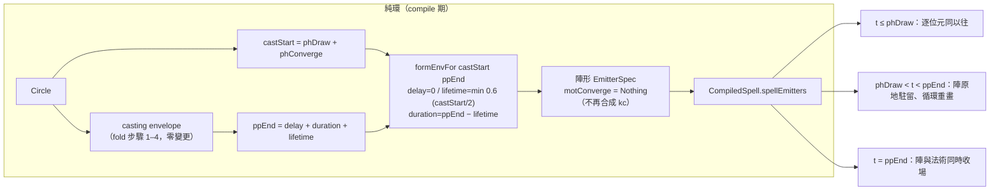

# Func-Spec 0017：陣的駐留（魔法陣持續存在到法術結束）

> 狀態：**已完成**（2026-08-15，驗收紀錄見 §9）
> 性質：一般 —— 交付後凍結 `formEnvFor` 的兩參數形狀與「陣形死於 `ppEnd`」這條時間軸律；同時**撤銷** spec 0006 §4.3 推導鏈第 2／3 步與 ADR-0014 D5 的一部分（見 §0.3）。
> 前置依賴：**spec 0016（需已完成）**——與 0016 同碰 `src/core/Magic/Compile.hs`／`test/{FormationSpec,PhaseSampleSpec,SigilWiringSpec}.hs`／兩個 golden，依 SKILL.md 規則 4 不得平行。本輪由 0016 的分支續開。
> 依據：architecture §3.3（生命週期——本輪修訂其狀態圖）；ADR-0003（槽位固定職責）、ADR-0010 D6（只有施放粒子吃力場）、ADR-0014 D5（逐位元豁免邊界——本輪由 ADR-0015 取代其中一句）；spec 0006 §4.3（陣形包絡推導鏈——本輪重證）、spec 0016 §1-5（Casting 相位零影響律——本輪**明文撤銷**）。生命週期語意變更屬架構級 → **本輪同步交付 ADR-0015**。
> 範圍：陣形發射器的生存窗由 `castStart` 延長至 `ppEnd`，且**不再合成收束曲線**。`Magic.Sigil` 零觸碰、`Magic.Codec` 零觸碰、schema 不升版、不加任何符文、不加任何 JSON 鍵。**沒有一行新的取樣器程式碼**——本輪只改編譯期算出來的兩個數字與一個 `Maybe`。

---

## 0. 起點

### 0.1 使用者需求與裁決（2026-08-15）

> 「魔法陣會存在持續到魔法施放完畢。」

現況（0006 交付、0016 沿用）是：陣被畫出來 → 向中軸塌縮 → 在 `castStart` 全數死盡 → 主效果才發射。玩家看到的是**陣被消耗掉**，而不是「法術從陣裡射出來」。三個裁決點：

| 問題 | 裁決 |
|---|---|
| 陣持續存在的話，Converging 改成什麼語意？ | **取消收束，原地駐留**——陣畫完後停在原地蓄力，不再塌縮。`phConverge` 保留其既有作用（決定 `castStart`＝施放起點），語意由「收攏時間」改為「蓄力時間」 |
| 「施放完畢」的終點取哪一個？ | **`ppEnd`**（整個法術結束，最後一批粒子死盡）——陣與法術一起收場 |
| 怎麼交付？ | 另開文檔＋後續 PR，不併進 PR #25（該 PR 維持它自己 ADR 的一致性） |

### 0.2 引用的凍結介面

| 凍結物 | 本 spec 的用法 |
|---|---|
| `firstBirth env n i = envDelay + (i/n)·envLifetime`（0002 §4.2 凍結） | **本輪的全部槓桿**：出生時刻只看 `envDelay` 與 `envLifetime`，**不看 `envDuration`**。所以延長 `envDuration` 不動任何粒子的出生時刻——Drawing 期逐位元不變由此結構性成立（§2 L1） |
| `particleAge` 的循環重生律（0002 §4.2） | 陣形以 `formLife` 為週期持續重生至窗口關閉——「駐留」的實作就是把窗口拉長，沒有新機制 |
| `Envelope` 三欄語意（0002 凍結） | 只改 `envDuration` 一欄的算式；`envDelay`／`envLifetime` 的算式一字不動 |
| `motConverge :: Maybe Expr` 的 `Nothing` 分支（0004 凍結） | 陣形改走 `Nothing`——取樣器**已有**的分支，不是新碼 |
| `emPhase` 純中繼資料＋ADR-0010 D6（力場只作用於 `Casting` 發射器） | 陣形維持 `emPhase = Drawing`，於是**駐留期間的陣不會被力場吹歪**——重力井吸得動法術，吸不動陣。這正是想要的語意，且零額外程式碼 |
| `Magic.Sigil` 全匯出面（0016 §9.3 凍結） | **零觸碰**。本輪不動幾何，只動時間 |
| `aliveRanges` 時間窗剔除（0010 S3） | 陣形活得久了，但剔除仍逐發射器 `O(log n)`；本輪不改 |

### 0.3 本輪撤銷的既有敘述（SKILL.md 衝突處理）

| 出處 | 原文要旨 | 本輪處置 |
|---|---|---|
| spec 0006 §4.3 推導鏈第 2 步 | 「陣形粒子恰於 `castStart` 全數死盡，Casting 起點與陣形殘影**零重疊**」 | **撤銷**。加修訂註記指向本 spec；推導鏈在 §2 重新證一次（結論改為「恰於 `ppEnd` 死盡」） |
| spec 0006 §4.3 推導鏈第 3 步、§4.4 共同欄位 | 收束曲線 `kcExpr` 把死點拉到軸上，使階段交界位置連續 | **撤銷**。不再合成 `kcExpr`；階段交界的連續性改由「陣不動」提供（不需要把陣拉到軸上，因為陣本來就還在） |
| spec 0016 §1-5「Casting 相位零影響律」 | 改變**只**發生在 Drawing／Converging 兩個相位 | **撤銷**（其前提正是陣形在 `castStart` 死盡）。新的逐位元邊界收窄為 Drawing 一個相位，見 §2 L1 |
| ADR-0014 D5 | 逐位元豁免只到 Drawing／Converging 為止 | 由 **ADR-0015 取代**該句；ADR-0014 加修訂註記（ADR 不改寫歷史，由後續決策取代） |
| architecture §3.3 狀態圖 | Converging：「陣形粒子向核心收束」 | 修訂狀態圖與該行敘述 |
| `docs/spell-schema.md` §8.1 | 「`converge`：畫好的陣往中軸收攏，收完的瞬間才真正施放」 | 修訂為蓄力語意（不加鍵，不觸發 0014 的鍵名守護） |

### 0.4 檔案盤點

**新增**：`test/PersistEnvelopeSpec.hs`、`test/PersistWiringSpec.hs`、`test/Acceptance17Spec.hs`、`docs/adr/adr-0015-sigil-persists-through-cast.md`。

**修改**：

| 檔案 | 變更 |
|---|---|
| `src/core/Magic/Compile.hs` | `formEnvFor` 加第二參數（法術終點）；`formationEmittersFor` 改簽名並丟掉 `PhaseConfig` 參數；`formationMotion` 丟掉 `Maybe Expr` 參數；**刪除 `kcExprFor`**（S1／S2） |
| `test/FormationSpec.hs` | 包絡推導鏈斷言改寫；兩條 kc 斷言刪除（被測語意已撤銷）（S2） |
| `test/PhaseSampleSpec.hs` | 「收束單調」「陣形不活過 castStart」「castStart 只剩一粒」三條改寫為駐留語意（S2） |
| `test/SigilWiringSpec.hs` | 「從 castStart 起只剩施放發射器」改寫為「陣形在 castStart 之後仍在，且逐幀不被力場位移」（S2） |
| `test/FieldPlumbingSpec.hs` | 兩個 phased 範例的 digest 重錄（S3） |
| `test/golden/perf-0010/{bare,grand}-sigil.txt` | 重錄；**Drawing 窗內的幀必須逐位元不變**（S3 的驗證條件，不是副作用） |
| `docs/architecture.md`、`docs/spell-schema.md`、`docs/spec/func-0006-*.md`、`docs/adr/adr-0014-*.md` | §0.3 的修訂註記（S3） |
| `particle-magic.cabal` | test other-modules +3 |

**共用（行級聯集合併）**：`SKILL.md`、`docs/roadmap.md`、`CHANGELOG.md`。

**明文不碰**：`src/core/Magic/Sigil.hs`、`src/boundary/*`（含 `Magic/Codec.hs`）、`src/core/Magic/{Circle,Rune,Expr,Project,Types}.hs`、`src/core/Magic/Particle/*`（**取樣器零變更**）、`src/ffi/*`、`include/*`、`bindings/*`、`app/*`、`bench/*`、`tools/*`、`assets/*`。

---

## 1. 目標與完成定義

**目標**：讓法術從陣裡**射出來**，而不是把陣**燒掉**。

**完成定義**：

1. 陣形發射器的最後一批粒子恰於 `ppEnd` 死盡（不是 `castStart`），且推導鏈的「全部索引都會出生」前提仍成立（S1）。
2. 陣形不再有收束曲線：`motConverge = Nothing`，陣在整個生命週期裡待在它被畫出來的位置（S1）。
3. **逐位元不變律**：`t < min(phDraw, castStart − formLife)` 的每一幀，`FrameOutput` 與本輪之前逐位元相同（§2 L1；設計時誤寫為整個 Drawing 窗，見 §9.4-1）。無 `phases` 的 8 個範例則**完全不受影響**（S1／S3）。
4. **駐留律**：對每個帶 `phases` 的範例陣，`(0, ppEnd)` 區間內的每個取樣時刻，陣形發射器都有活著的粒子（S2）。
5. **不塌縮律**：Casting 期間陣形粒子的半徑分布仍落在各自筆畫的 `strokeRadius` 帶內（不是塌在軸上）（S2）。
6. **陣不吃力場律**（ADR-0010 D6 的延伸驗證）：帶力場的法術在 Casting 期間，陣形列的位移恆為零——重力井吸得動法術，吸不動陣（S2）。
7. 預算零變更：`spellBudget` 與 `budgetPerEmitter` 與本輪之前**逐欄位相同**（`emCount` 一個都沒動）（S2）。
8. ADR-0015 交付；§0.3 六處修訂註記到位；手動 smoke 目視「法術從仍在的陣中射出」（S3）。

## 2. 使用到的架構與技巧

- **`envDuration` 不參與出生時刻，是本輪能這麼便宜的全部原因。** `firstBirth env n i = envDelay + (i/n)·envLifetime`——出生時刻只看 `envDelay` 與 `envLifetime`。`envDuration` 只出現在存活判定 `birth < envDelay + envDuration` 裡。所以把 `envDuration` 由 `castStart − formLife` 拉長到 `ppEnd − formLife`：
  - 沒有任何粒子的出生時刻改變 ⇒ **畫陣的節奏一字不動**；
  - 只是原本在 `castStart` 停止重生的粒子，繼續重生下去。

  這就是「駐留」的全部實作。**取樣器零變更、無新機制、無新狀態。**

- **L1（逐位元不變的邊界）**——設計時寫成「整個 Drawing 窗逐位元不變」，**實作時被 golden 推翻，修正如下**（§9.4-1 記錄始末）。

  位置那一半是對的：收束曲線 `kc = clamp((castStart − t)/phConverge, 0, 1)` 在 `t ≤ phDraw` 時**恰等於 1**，而取樣器寫的是 `position = rawPosition − (1 − kc)·trans`；`kc = 1` ⇒ 減去 `vscale 0 trans` ⇒ IEEE 上 `x − 0 = x` 逐位元恆等（`−0.0` 亦然）。取消收束走 `motConverge = Nothing` 分支，結果同樣是 `rawPosition`。

  漏掉的是**存活集合**那一半：`particleAge` 的存活條件是 `birth < envDelay + envDuration`，而 `birth` 會隨重生循環往後跳。舊的 `envDuration = castStart − formLife` 因此在 `t = castStart − formLife` 就開始砍掉重生——**而這個時刻可能落在 Drawing 窗之內**：`castStart − formLife < phDraw ⟺ phConverge < formLife`。`bare-sigil`（draw 1.0／converge 0.5／`formLife` 0.6）正是這種情形，它的生成窗在 0.9s 關閉，比 `phDraw = 1.0s` 還早——**舊碼的陣在還沒畫完的時候就已經開始消失了**。

  修正後的精確律：**`t < min(phDraw, castStart − formLife)` 的每一幀逐位元不變**。實測完全吻合（§9.2）：`grand-sigil`（converge 0.6 ≥ formLife 0.6）邊界＝`phDraw` = 1.2s ＝幀 71，`bare-sigil` 邊界＝`castStart − formLife` = 0.9s ＝幀 54。這條律仍是本輪最強的迴歸檢查，只是邊界比原本以為的早一點；而被它照出來的那個舊行為（陣提前開始消散）本身就是本輪要修掉的東西之一。

- **陣會「呼吸」而不是凍住**，這是刻意的。`envLifetime = formLife ≤ 0.6s` 保持不變，所以駐留期間陣以 `formLife` 為週期被**反覆重畫**（每一輪都是一次沿筆畫的掃描）。這比凍住的靜態陣好看得多，讀起來是「持續詠唱」而不是「貼了一張圖」；0006 §4.3 註 4 早就把這個效果記成「脈動閃爍的儀式感」，本輪只是讓它延續到法術結束。要真正靜止就得把 `envLifetime` 拉到整個法術長度，那會讓 `firstBirth` 把出生時刻攤到整場，陣要畫一整場才畫完——直接違反 0016 的「索引序＝繪製序」。列為非目標（§8-1）。

- **`emPhase = Drawing` 一個欄位同時買到兩件事**。它是純中繼資料（取樣器不讀），但力場層依它判斷（ADR-0010 D6：只有 `Casting` 發射器吃力場）。陣形維持 `Drawing`，於是駐留期間的陣**天然不被力場吹歪**——這正是想要的語意（陣是幾何，不是被吹的煙），而且**零額外程式碼**。§1-6 把它升格為受測律。

- **`phConverge` 換語意但不換算式**。它仍然是 `castStart = phDraw + phConverge` 的第二項，仍然決定主效果何時開始；改的只是這段時間裡陣在做什麼——原本是塌縮，現在是駐留蓄力。**沒有任何欄位、鍵名或驗證規則改變**，既有的 3 個帶 `phases` 的 asset 一字不動。

## 3. ADT

**本輪不新增、不修改任何型別。** 變更全部落在三個函數的簽名與本體：

```haskell
-- src/core/Magic/Compile.hs

-- 舊：formEnvFor :: Seconds -> Envelope                       （castStart）
-- 新：
formEnvFor :: Seconds -> Seconds -> Envelope                   -- castStart, 法術終點

-- 舊：formationEmittersFor :: Circle -> PhaseConfig -> Seconds -> Element -> [EmitterSpec]
-- 新：（PhaseConfig 參數消失——它先前只被 kcExprFor 用到）
formationEmittersFor :: Circle -> Seconds -> Seconds -> Element -> [EmitterSpec]

-- 舊：formationMotion :: SpawnPattern -> Maybe Expr -> Motion
-- 新：
formationMotion :: SpawnPattern -> Motion

-- 刪除：kcExprFor :: Seconds -> Seconds -> Expr
```

## 4. 資料結構與儲存方式

- **無新的跨幀狀態**（系統唯一的跨幀狀態仍是 0007 的 `FieldState`）。
- **無新的編譯期中間值**：`SigilPlan` 的角色不變。
- **預算零變更**：`emCount` 一個都沒動 ⇒ `spellBudget`／`ParticleBudget` 逐欄位相同。改變的只是**同時存活的列數**：駐留期間陣形滿編約 1600 列會與施放粒子並存。依 0010 量到的 65 ns/粒，約 **+0.1 ms/幀**，在 16384 的 `budgetCap` 與 2 ms 的單幀預算內可忽略；`aliveRanges` 的逐發射器剔除照常生效。
- **記憶體**：無新配置。

## 5. 資料流（pipeline）



## 6. 搭建方式（風險優先）

1. **S1 包絡與收束**——本輪的全部語意變更集中在這裡；先做、先用 golden 的 Drawing 幀驗證 L1 成立（若 Drawing 幀動了，代表推理錯了，立刻停）。
2. **S2 律的重寫**——把三份既有測試裡被撤銷的斷言改寫成駐留語意的等強斷言，並補上三條新律（駐留／不塌縮／不吃力場）。
3. **S3 端到端＋文檔修訂＋ADR-0015＋手動 smoke**。

## 7. Todo List 與 1-to-1 測試對應

| # | Todo | 測試 |
|---|---|---|
| S1 ✅ | `formEnvFor` 兩參數化（終點改 `ppEnd`）；刪 `kcExprFor`、陣形 `motConverge = Nothing`；`formationEmittersFor`／`formationMotion` 簽名收斂 | `test/PersistEnvelopeSpec.hs`（推導鏈重證：`envDelay = 0`、`envLifetime = min 0.6 (castStart/2)` **與改動前同式**、`envDuration + envLifetime = ppEnd`；「全部索引都會出生」前提（`envLifetime ≤ envDuration`）為 property；陣形 `motConverge` 恆為 `Nothing`；`ppDrawEnd`／`ppConvergeEnd`／`ppCastingEnd`／`ppEnd` 四界標**逐欄位不變**；`phConverge = 0` 與長前奏兩個邊界） |
| S2 ✅ | 三份既有測試的律改寫＋三條新律 | `test/PersistWiringSpec.hs`（**駐留律**：`(0, ppEnd)` 每個取樣時刻陣形皆有活粒子；**不塌縮律**：Casting 期陣形半徑仍落在 `strokeRadius` 帶內、且**不**集中於軸；**陣不吃力場律**：帶力場的法術在 Casting 期陣形列位移恆為 0；預算逐欄位不變；`bufferInvariant`；決定論）＋改寫 `FormationSpec`／`PhaseSampleSpec`／`SigilWiringSpec` |
| S3 ✅ | 端到端驗收＋golden／digest 重錄＋文檔六處修訂＋ADR-0015 | `test/Acceptance17Spec.hs`（三個 sigil：Drawing 期粒子數仍隨時間成長（0016 的律未被破壞）、Casting 期陣形與主效果**並存**、240 幀決定論、`isFinished` 於 `ppEnd` 翻轉不變）＋**手動 smoke**（目視「法術從仍在的陣中射出」，截圖描述入 §9）＋**golden 的 Drawing 幀逐位元不變**的實測比對 |

## 8. 非目標

1. **靜止不重畫的陣**——駐留期間陣以 `formLife` 為週期循環重畫（§2）。要真正靜止需把 `envLifetime` 拉到整場，會讓出生時刻攤到整場、陣要畫一整場才畫完，直接違反 0016 的「索引序＝繪製序」。若日後真的要，需要的是「畫完即凍結」的新排程語意，不是調參數。
2. **陣形旋轉／動態陣形**——0006 §9、0016 §8-3 既有記帳。本輪讓陣活得夠久，反而讓旋轉更值得做（一個只存在 1.5 秒的陣沒什麼好轉的）；仍不在本輪。
3. **陣的獨立時間軸**（陣比法術先收、或法術結束後陣還留一會）——本輪把終點釘在 `ppEnd`。要獨立控制需要新的 JSON 鍵（例如 `phases.linger`），屬 schema 擴充，另立 spec。
4. **收束作為可選效果**——本輪直接取消陣形收束曲線，而非做成開關。做成開關等於在 `phases` 加鍵並在兩種語意間分岔，成本高於它的價值；玩家夾層的 `ConvergeRune`（作用於主效果）完全不受影響，仍是 0004 凍結的語意。
5. **陣在 Casting 期的專屬外觀**（例如亮度隨施放起伏）——沿用 `formationAppearance`；屬 0015 的詞彙。

## 9. 驗收紀錄

**日期**：2026-08-15。**測試**：`cabal test` → **1156 examples, 0 failures**（0016 交付時 1123）。`cabal build all` 綠。

### 9.1 三個 Todo 的測試結果

| # | 測試模組 | 結果 |
|---|---|---|
| S1 | `test/PersistEnvelopeSpec.hs` | 綠。畫陣節奏未動（`envDelay = 0`、`envLifetime = min 0.6 (castStart/2)` 為 property）、`envDuration + envLifetime = ppEnd`、「全部索引都會出生」前提、陣形 `motConverge` 恆 `Nothing`（含 `phConverge = 0` 與 `> 0` 兩路）、四個 `PhasePlan` 界標逐欄位不變、預算不變 |
| S2 | `test/PersistWiringSpec.hs` | 綠。**駐留律**（4 個範例陣 × 25 個取樣時刻皆有陣形活粒子）、**不塌縮律**（Casting 期邊界環半徑仍 > 0.9×`skRadius` 且在 `strokeRadius` 界內；單粒在其整個生命中位移 < 1e-5）、**陣不吃力場律**（強力場下 4 個時刻陣形列位移恆為 0，同時施放列確實被扭曲）、預算逐欄位不變、`bufferInvariant`、決定論 |
| S3 | `test/Acceptance17Spec.hs` | 綠。Casting 期陣與主效果**並存**、陣於 `ppEnd` 才收場、0016 的「Drawing 期陣形粒子數成長」律仍成立、240 幀決定論、`isFinished` 於 `ppEnd` 翻轉、緩衝never 超預算 |

同步改寫（被撤銷語意的等強替代）：`FormationSpec`（包絡推導鏈終點、兩條 kc 斷言 → 「陣形無收束曲線」）、`PhaseSampleSpec`（收束單調 → 位置不變；`castStart` 死盡 → `ppEnd` 死盡＋全程存活）、`SigilWiringSpec`（「castStart 後只剩施放發射器」→「施放發射器的列不因陣的存在而改變」）。

### 9.2 逐位元邊界的實測（本輪最重要的一條）

`test/golden/perf-0010/{bare,grand}-sigil.txt` 逐幀比對（0016 版 vs 0017 版，240 幀）：

| 範例 | `phDraw` | `castStart − formLife` | 預測邊界 | **首個差異幀** | 相符 |
|---|---|---|---|---|---|
| `grand-sigil` | 1.2 s（幀 71） | 1.8 − 0.6 = 1.2 s | 1.2 s | **71** | ✅ |
| `bare-sigil` | 1.0 s | 1.5 − 0.6 = **0.9 s**（幀 54） | 0.9 s | **54** | ✅ |

幀 0–53（bare）／0–70（grand）**逐位元相同**，逐欄位比對確認。無 `phases` 的 8 個範例 golden **零重錄**。

比對同時照出一個沒人發現的舊行為：`bare-sigil` 在 0016 版的粒子數於幀 52→54→55 是 **232 → 226 → 220**，也就是**陣在 `phDraw = 1.0 s` 之前就已經開始消散**（生成窗 0.9 s 提早關閉）。0017 版同區間穩定在 232。這正是 §2 L1 被推翻的原因，也是本輪順手修掉的東西。

### 9.3 手動 smoke（開窗目視，2026-08-15）

以 3D 檢視＋滑鼠拖曳把相機仰角轉到 el 89（近俯視）逐幀截圖，讀 HUD 的 `age` 對照相位：

- **`lattice-seal`**（`castStart` 2.4 s、`ppEnd` 6.9 s）：`age 1.98s` 陣已畫滿且**維持在完整半徑**（1166 粒）——舊行為此刻應已塌縮過半；`age 3.02s`（Casting）陣完整存在、雷元素粒子在其中環繞（1272 粒）；`age 5.58s` 陣仍完整（1390 粒）。
- **`grand-sigil`**（`castStart` 1.8 s、施放 `delay` 2.1 s、`ppEnd` 8.1 s）：`age 1.83s` 多層陣完整；**`age 3.12s`（Casting 全開，1554 粒）火元素粒子從陣中噴出、穿過並越過陣，而陣的多層環與多邊形輪廓完好無損地留在底下**——這一張就是本輪要的畫面。

### 9.4 實作備註（與設計文件的偏差）

1. **§2 L1 在實作中被 golden 推翻並修正**。設計時寫「整個 Drawing 窗逐位元不變」，只考慮了收束曲線（`kc = 1` ⇒ 位置恆等），**漏掉存活集合**：舊的 `envDuration = castStart − formLife` 會提早關閉生成窗，而該時刻在 `phConverge < formLife` 時**早於 `phDraw`**。正確邊界為 `t < min(phDraw, castStart − formLife)`，已改寫入 §1-3、§2 L1 與 ADR-0015 D4，並由 §9.2 的實測釘死。
2. **`formationEmittersFor` 的 `PhaseConfig` 參數消失**（§3 只寫了加一個 `Seconds`）。該參數先前唯一的用途是餵 `kcExprFor`；收束取消後它不再被讀取，留著就是死參數。
3. **`docs/spell-schema.md` §8.1 的 `converge` 說明改寫**（§0.3 已預告，此處確認）：由「往中軸收攏」改為「原地駐留蓄力」，並加一句「魔法陣會一直留到法術結束、且不受力場影響」。**不加任何鍵**，未觸發 0014 的鍵名守護。
4. **`docs/spec/func-0006-*.md` §4.4 共同欄位一併加了 0016 的修訂註記**（§0.3 只列了 §4.3）。該表的幾何欄位早在 0016 就被整體取代，但當時只在 0016 內部記錄；既然這輪要動同一份文件的相鄰段落，順手把它補上比留一個已知過期的表好。

### 9.5 凍結清單（下游 spec 可引用）

- `formEnvFor :: Seconds -> Seconds -> Envelope` 的兩參數形狀，與「陣形最後一批粒子死於 `ppEnd`」的時間軸律。
- 陣形發射器 `motConverge = Nothing` 恆真；`kcExprFor` 已刪除，不得復活（要恢復收束需先修訂 ADR-0015）。
- 陣形發射器 `emPhase = Drawing`——它同時是力場層的判準（ADR-0010 D6），改它會讓陣開始吃力場。
- 逐位元邊界：`t < min(phDraw, castStart − formLife)`（ADR-0015 D4）。
