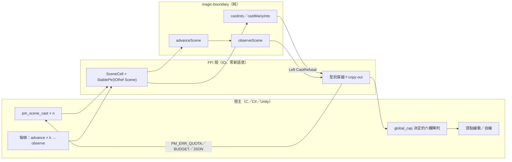

# Func-Spec 0018：場景層上 C ABI（`pm_scene_*`）

> 狀態：**已完成**（2026-08-16 驗收，見 §9）
> 性質：一般 —— 新增的 10 個 C 匯出、`PmScene` handle 與 `PM_ERR_QUOTA` 交付即凍結（只加不改，ADR-0011 D7 延續）。
> 前置依賴：**無**（0009 交付 C ABI 外殼、0011 交付契約守護與 C# 綁定、0012 交付 `Magic.Scene`，皆已完成；本 spec 全部是它們之上的加法；0016／0017 亦已交付，本 spec 不依賴其內容）。**與 spec 0019／0020 三方平行**：本 spec 鎖 `src/ffi`＋`include`＋`.def`＋契約測試＋`bindings/`＋`examples/`，0019 鎖 `.github/`＋README＋cabal metadata，0020 鎖 `src/core/Magic/{Sigil,Particle/Analytic}.hs`——檔案零交集（§0.2 附證明）。**與 spec 0025 則為序列**（它是本 spec 的下游，同碰 `src/ffi`＋`include`）。
> 依據：[ADR-0011](../adr/adr-0011-ffi-c-abi-boundary.md)（C ABI 消費模式全部決策沿用：handle 生命週期、copy-out、錯誤協定、跨界決定論）；[ADR-0012](../adr/adr-0012-multi-circle-scene.md) **D8**（「場景層 v1 不上 C ABI」——其延後條件是「場景層的 API 形狀應先在 Haskell 面用過一輪再凍結成 C 合約」，0012 已於 2026-08-15 交付並驗收，**該條件已達成，本 spec 解除延後**）；[roadmap.md](../roadmap.md) §3.3（`pm_scene_*` 不存在的記帳）、0009 §9-7、0011 §8-2、0012 §8-1；[integration.md](../integration.md) §3.2（目前明文「僅 Haskell 面」的那一節）。
> 範圍：把 `Magic.Scene` 整個匯出面送到非 Haskell 宿主手上——`PmScene*` handle、10 個純增補 C 匯出、1 個新錯誤碼，加上 C# 綁定與 C／Unity 範例的同步。**核心與 boundary 零觸碰**：本 spec 一行新語意都不加。

---

## 0. 起點：引用的凍結介面、檔案盤點

### 0.1 引用的凍結介面（全部唯讀 import 或 add-only 擴充）

| 凍結物 | 本 spec 的用法 |
|---|---|
| `include/particle_magic.h` 全文＋13 個宣告／11 個 Haskell 進入點（0009 §10、0011 §9.4 凍結，add-only） | 只加：1 個 opaque 型別、10 個函數宣告、1 個錯誤碼、1 段用法註解。**既有宣告、常數值與 `PM_BATCH_INFO_STRIDE 4` 一字不改** |
| `Magic.Scene` 匯出面（0012 §9.4 凍結）：`SpellId (..)`、`SceneConfig (..)`、`Scene`（抽象）、`newScene`、`sceneSpells`、`sceneBudget`、`CastRefusal (..)`、`castInto`、`castManyInto`、`dismiss`、`advanceScene`、`observeScene` | **本 spec 的 C 面就是這張表的逐項型別穿越**（§2 的對照規則）。零新語意 |
| `Magic.Interface`：`CastRequest (..)`、`CastContext (..)`、`FrameInput (..)`、`FrameOutput (batches)`、`RenderBatch (..)`、`ParticleBuffer` 欄位、`Seed`、`DeltaTime`、`V3 (..)`（0001／0005 凍結） | 與 `pm_cast`／`pm_observe` 現行用法完全相同的組裝與 copy-out |
| `Magic.Codec`：`loadCircle`、`renderLoadError`（0001 凍結） | `pm_scene_cast` 的 JSON 解碼與錯誤文字，與 `pm_cast_ex` 同一條路徑 |
| `Magic.FFI` 內部：`SpellCell`／`nullSpell`／`isNullSpell`／`withCell`／`writeErr`／`copyFloats`／`copyWords`／`peekV3`／`cfloatToDouble`（0009 §4.4 明文**不凍結**，可自由重構） | `PmScene` 沿用同一組 handle 與 marshalling 慣例；`writeErr` 的截斷安全性直接繼承 |
| `StablePtr` over `IORef` handle、copy-out never borrow、一 handle 一執行緒（ADR-0011 D3／D4） | `PmScene*` 逐條沿用（§2） |
| foreign-library 依賴白名單 {base, magic-boundary, bytestring, vector}（0009 M1，`BoundarySpec` 守護） | **不變**——`Magic.Scene` 已在 magic-boundary 的 `exposed-modules`，且 flib 已 `build-depends` 它。**本 spec 不需要任何 cabal 模組行變更** |
| `FFIContractSpec` 的五文本守護＋`BindingContractSpec` 的雙向集合相等（0009 S4／0011 S4） | 本 spec **修改**兩者：凍結清單 11→21、新錯誤碼、C# 綁定同步。契約測試是凍結介面的守衛，隨合約加法同步是它的本職 |

### 0.2 檔案盤點（與 0019／0020 的三方零交集證明）

**修改（6）**：

| 檔案 | 變更 |
|---|---|
| `src/ffi/Magic/FFI.hs` | +10 `foreign export`、+`SceneCell` handle、+`pmErrQuota` 常數、+`refusalCode`。既有 11 個進入點**零修改** |
| `include/particle_magic.h` | +`typedef struct PmScene PmScene;`、+10 宣告、+`PM_ERR_QUOTA (-5)`、+1 段場景用法註解（§3.2） |
| `particle-magic-ffi.def` | EXPORTS +10 行 |
| `test/FFIContractSpec.hs` | 凍結清單 11→21；`PM_ERR_QUOTA` 斷言；opaque 型別哨兵 |
| `test/BindingContractSpec.hs` | 無需改邏輯（雙向集合相等自動涵蓋新函數／新 `#define`），**但它會因 C# 綁定未同步而變紅**——這正是它存在的理由 |
| `bindings/csharp/ParticleMagic.cs` | +10 `DllImport`、+`ErrQuota` 常數、+`PmScene` 用法註解 |

**新增（4）**：`test/FFISceneSpec.hs`、`test/FFISceneCastSpec.hs`、`test/Acceptance18Spec.hs`、`examples/c/scene.c`。

**共用（行級聯集合併）**：`particle-magic.cabal`（test-suite `other-modules` +3 行、`extra-source-files` +1 行）；`SKILL.md`（索引 +0018 列）；`docs/roadmap.md`、`docs/integration.md`、`CHANGELOG.md`。

**明文不碰**：`src/core/*` 全部、`src/boundary/*` 全部（含 `Magic/Scene.hs` 本身）、`app/*` 全部、`bench/*`、`tools/*`、`cbits/pm_init.c`、`assets/*`、`docs/spell-schema.md`。

**三方交集**：0019 觸 `.github/workflows/`（新）＋`README.md`＋`docs/release.md`＋cabal 的 `version:`／`tested-with:` 行；0020 觸 `src/core/Magic/{Sigil,Particle/Analytic}.hs`＋四個 sigil 測試模組＋兩個 golden。與本清單逐檔比對：**交集 = ∅**（cabal 為同檔異行的聯集合併，與 0010／0011／0013 那一輪同款）。

### 0.3 一個設計約束：批次歸屬拿不到，而且刻意不補

`observeScene` 是 `concatMap (batches . observeSpell . snd)`——**它自己就丟掉了「這個 batch 屬於哪個 `SpellId`」**。C 面若要提供歸屬，只有兩條路：改 `PM_BATCH_INFO_STRIDE`（凍結為 4，破合約），或加一個平行的 out 陣列（合法的 add-only）。

第二條路合法，但它會讓 **C 面比 Haskell 面多知道一件事**，直接違反 0009 §2 立下、被 `Acceptance9Spec` 變成等價律的「零新語意」紀律。要做，正確順序是先在 boundary 加 `observeSceneBy :: Scene -> [(SpellId, FrameOutput)]`，再讓 C 面穿越它——兩者皆 add-only，形狀已知，但那是另一輪（§8-1）。

**本輪裁決（使用者，2026-08-15）：不提供歸屬。** `pm_scene_observe` 的輸出與 `observeScene` 逐位元對齊，一個 batch 都不多、一個欄位都不加。

---

## 1. 目標與完成定義

**目標**：非 Haskell 宿主獲得與 Haskell 宿主**同等**的多法術能力——多陣合成、全域配額、先到先得的拒收——而不必自己用多個 `PmSpell*` 記帳。

**完成定義**（全部可驗證）：

1. `pm_scene_*` 10 個進入點在 header／`.def`／`foreign export` 三份文本一致，`FFIContractSpec` 全綠（凍結清單 21 個 Haskell 進入點、header 23 個宣告）；`PM_ERR_QUOTA == -5` 與 Haskell `pmErrQuota` 一致（S1）。
2. **場景等價律**：對任意操作序列（`cast`／`cast_many`／`dismiss`／`advance` 的交錯），`pm_scene_*` 路徑的每一次 `pm_scene_observe` 輸出，與同序列施加於 `Magic.Scene` 後 `observeScene` 的結果**逐位元相同**（六欄＋batch 描述）；每一次 `pm_scene_cast` 的回傳碼與 `castInto` 的 `Either CastRefusal` 分類一致（S3／S6）。
3. **配額語意跨界成立**：`pm_scene_budget` 回報的 `(used, cap)` ≡ `sceneBudget`；超額 cast 回 `PM_ERR_QUOTA` 且**場景完全未變**（`pm_scene_count`／`pm_scene_spells`／`pm_scene_budget` 三者皆與拒收前相同）；法術自然結束後配額自動釋放（S2／S3）。
4. **NULL 與越界零崩潰**：每個 `pm_scene_*` 對 `NULL` 場景 handle 皆為 no-op 或中性值；`pm_scene_observe`／`pm_scene_spells` 容量不足回 `PM_ERR_CAPACITY` 且**零寫出**（0009 的 all-or-nothing 慣例）（S2／S3）。
5. `bindings/csharp/ParticleMagic.cs` 與 header 雙向一致，`BindingContractSpec` 全綠（S4）。
6. `examples/c/scene.c` 以真實 `.dll` 執行，輸出兩張陣共存、一張被配額拒收、其中一張結束後配額釋放的完整軌跡（**手動 smoke**，§9 回填）（S5）。
7. `PM_ABI_VERSION` 維持 **1**——本輪全部是加法（S1）。

## 2. 使用到的架構與技巧

- **匯出面對照規則（本輪的核心紀律）**：C 進入點集合 ≡ `Magic.Scene` 匯出面 ∪ {handle 生命週期}。逐項對照：

  | `Magic.Scene` | C 進入點 |
  |---|---|
  | `newScene` | `pm_scene_new` |
  | （handle 釋放，無 Haskell 對應） | `pm_scene_free` |
  | `castInto` | `pm_scene_cast` |
  | `castManyInto` | `pm_scene_cast_many` |
  | `dismiss` | `pm_scene_dismiss` |
  | `advanceScene` | `pm_scene_advance` |
  | `observeScene` | `pm_scene_observe` |
  | `sceneBudget` | `pm_scene_budget` |
  | `sceneSpells` | `pm_scene_spells`（＋容量探詢用的 `pm_scene_count`） |

  這條規則同時是**非目標的判準**：不在左欄的東西不上 C 面（§8）。

- **零新語意紀律（0009 §2 延續）**：每個進入點的實作是「型別穿越 → 呼叫 `Magic.Scene` 的凍結函數 → 型別穿越回去」，沒有第三件事。§1 完成定義 2 的等價律把這句話變成測試。
- **`SceneCell` = `StablePtr` over `IORef Scene`**：與 `SpellCell` 逐字同構。`Scene` 是不可變純值、宿主要就地推進，所以 handle 指向一個 read-compute-write-back 的 cell（ADR-0011 D4）。
- **場景獨佔其法術**：進了場景的法術**沒有** `PmSpell*`，也不能把既有 `PmSpell*` 移入場景。這不是省事，是排除雙重釋放——`pm_free` 與 `pm_scene_dismiss` 若能指向同一個法術，C 面就有了 Haskell 面不存在的別名。宿主二選一：單法術用 `pm_cast`，多法術用場景。
- **`SpellId` 遞增不重用**（0012 已保證），所以陳舊的 id **惰性而非歧義**：`pm_scene_dismiss` 對未知 id 是 no-op，與 `dismiss` 完全相同。C 面因此不需要 generation counter。
- **負的 `global_cap` 照收**：`newScene (SceneConfig (-1))` 在 Haskell 是「拒收一切的場景」，是完全定義的行為。C 面若把它改判成 `NULL`／`PM_ERR_ARGS`，等價律就會出現一個 Haskell 面沒有的洞。**照單全收**，在 header 註明其意義。這是「零新語意」比「參數驗證」優先的一個具體例子。
- **錯誤分類的映射**（`CastRefusal` → C 碼）：

  | 情況 | C 回傳 | 來源 |
  |---|---|---|
  | 成功 | `PM_OK`，`*out_id` 填 `SpellId` | `Right (sid, scene')` |
  | JSON 解不出 `Circle` | `PM_ERR_JSON` | `loadCircle` 的 `Left`（在 `castInto` 之前，與 `pm_cast_ex` 同路徑） |
  | 解得出但編譯失敗（含單陣超 `budgetCap`） | `PM_ERR_BUDGET` | `CompileFailed err` |
  | 編譯成功但場景配額不足 | **`PM_ERR_QUOTA`** | `QuotaExceeded need remaining` |
  | `NULL` 場景／`NULL out_id`／`count < 0` | `PM_ERR_ARGS` | 參數檢查（0011 的既有慣例） |

  四種失敗都寫人類可讀文字進 `err_buf`（`QuotaExceeded` 寫 `show` 的內容，含 `need` 與 `remaining`）。**機器可讀的 `need` 不在本輪**（§8-2）。

- **容量的兩個不同上限，必須講清楚**：`pm_max_particles()` 界定**單一法術**（`budgetCap`，目前 16384）；場景的六欄要開多大由**宿主自己選的 `global_cap`** 決定，兩者無關（`SceneConfig` 的 haddock 已明文）。header 註解必須寫這件事，否則宿主會拿 `pm_max_particles()` 配置場景緩衝然後在第二張陣就 `PM_ERR_CAPACITY`。
- **文字合約守護第三、四次使用**：新增 header 宣告 ⇒ `FFIContractSpec` 三向一致自動要求 `.def` 與 `foreign export` 跟上；新增 header `#define` ⇒ `BindingContractSpec` 的雙向集合相等自動要求 C# 綁定跟上。**兩份守護都不需要為本輪加新邏輯**，這是 0009／0011 那兩輪的複利。

## 3. ADT／C API

### 3.1 新增宣告（header add-only；值與佈局永久凍結）

```c
/* 場景配額拒收：法術本身編得起來，但場景的 global_cap 放不下。 */
#define PM_ERR_QUOTA (-5)

/* A scene: several casts alive at once under one global particle quota
   (func-spec 0012, ADR-0012). Opaque; created by pm_scene_new, released
   by pm_scene_free. A spell inside a scene has no PmSpell* of its own --
   pick one mode or the other, never both for the same cast. */
typedef struct PmScene PmScene;

/* global_cap = total particles the scene may hold across every live
   spell. Size YOUR six columns from this, not from pm_max_particles()
   (which bounds one spell). A negative cap is legal and means a scene
   that admits nothing. Never returns NULL in this generation. */
PmScene* pm_scene_new(int global_cap);
void     pm_scene_free(PmScene* scene);

/* Cast one circle into the scene. Returns PM_OK (with *out_id set to the
   new spell's id), PM_ERR_JSON, PM_ERR_BUDGET, PM_ERR_QUOTA or
   PM_ERR_ARGS, writing the reason into err_buf. On every failure path the
   scene is left exactly as it was. */
int pm_scene_cast(PmScene* scene, const char* circle_json,
                  const float caster_pos[3], const float caster_facing[3],
                  uint64_t seed, char* err_buf, int err_len, int* out_id);

/* The same, for `count` circles composed into ONE spell (the Monoid of
   func-spec 0012: emitters concatenated, budgets summed, phase landmarks
   maxed). circle_jsons is an array of `count` NUL-terminated UTF-8
   strings; count == 0 casts the empty composition. */
int pm_scene_cast_many(PmScene* scene, const char* const* circle_jsons, int count,
                       const float caster_pos[3], const float caster_facing[3],
                       uint64_t seed, char* err_buf, int err_len, int* out_id);

/* Remove a spell early. Unknown or already-finished ids are a no-op, so a
   host may dismiss without checking whether the spell outlived itself. */
void pm_scene_dismiss(PmScene* scene, int spell_id);

/* Advance every live spell by dt seconds and drop the ones that finished
   -- which is also how their share of the quota is released. */
void pm_scene_advance(PmScene* scene, float dt);

/* Sample every live spell into the caller's six columns, exactly as
   pm_observe does for one spell; batches are concatenated in spell-id
   order and are NOT merged across spells. Same batch_info layout, same
   PM_BATCH_INFO_STRIDE, same all-or-nothing error path. Which spell a
   batch came from is not reported (func-spec 0018 section 8). */
int pm_scene_observe(PmScene* scene,
                     float* pos_x, float* pos_y, float* pos_z,
                     float* size, float* life, uint32_t* color,
                     int capacity, int* batch_info, int max_batches);

/* *out_used = particles committed by the live spells, *out_cap =
   global_cap. Either pointer may be NULL. Returns PM_OK or PM_ERR_ARGS. */
int pm_scene_budget(const PmScene* scene, int* out_used, int* out_cap);

/* How many spells are live. 0 for a NULL scene. */
int pm_scene_count(const PmScene* scene);

/* The live spells' ids in admission order, into a caller-owned array.
   Returns the number written, or PM_ERR_CAPACITY (nothing written) when
   they do not fit in max_ids -- ask pm_scene_count first. */
int pm_scene_spells(const PmScene* scene, int* out_ids, int max_ids);
```

### 3.2 header 註解增補（純註解，仍 add-only）

在檔頭 Usage 區之後追加一段「Scenes」：單法術與場景兩種模式的取捨、`global_cap` 與 `pm_max_particles()` 的差別、一 scene 一執行緒、以及「場景內的法術沒有 `PmSpell*`」這條所有權規則。含固定哨兵詞 `global_cap`，由 `FFIContractSpec` 斷言存在（比照 0011 的 `right-handed`／`0xRRGGBBAA`）。

### 3.3 Haskell 側（`src/ffi/Magic/FFI.hs`，全部加法）

```haskell
-- 新 handle，與 SpellCell 同構
newtype SceneCell = SceneCell (IORef Scene)

nullScene   :: StablePtr SceneCell
isNullScene :: StablePtr SceneCell -> Bool
withScene   :: StablePtr SceneCell -> b -> (IORef Scene -> IO b) -> IO b

-- 新常數
pmErrQuota :: CInt
pmErrQuota = -5

-- CastRefusal → C 碼（純函數，可直接測）
refusalCode :: CastRefusal -> CInt
refusalCode = \case
  CompileFailed _   -> pmErrBudget
  QuotaExceeded _ _ -> pmErrQuota

foreign export ccall pm_scene_new      :: CInt -> IO (StablePtr SceneCell)
foreign export ccall pm_scene_free     :: StablePtr SceneCell -> IO ()
foreign export ccall pm_scene_cast     :: StablePtr SceneCell -> CString -> Ptr CFloat
                                       -> Ptr CFloat -> Word64 -> CString -> CInt
                                       -> Ptr CInt -> IO CInt
foreign export ccall pm_scene_cast_many :: StablePtr SceneCell -> Ptr CString -> CInt
                                       -> Ptr CFloat -> Ptr CFloat -> Word64
                                       -> CString -> CInt -> Ptr CInt -> IO CInt
foreign export ccall pm_scene_dismiss  :: StablePtr SceneCell -> CInt -> IO ()
foreign export ccall pm_scene_advance  :: StablePtr SceneCell -> CFloat -> IO ()
foreign export ccall pm_scene_observe  :: StablePtr SceneCell -> Ptr CFloat -> Ptr CFloat
                                       -> Ptr CFloat -> Ptr CFloat -> Ptr CFloat
                                       -> Ptr Word32 -> CInt -> Ptr CInt -> CInt -> IO CInt
foreign export ccall pm_scene_budget   :: StablePtr SceneCell -> Ptr CInt -> Ptr CInt -> IO CInt
foreign export ccall pm_scene_count    :: StablePtr SceneCell -> IO CInt
foreign export ccall pm_scene_spells   :: StablePtr SceneCell -> Ptr CInt -> CInt -> IO CInt
```

**`pm_scene_observe` 的 copy-out 直接重用 `pm_observe` 的內層**：把現行 `pm_observe` 的「`[RenderBatch]` → 六欄＋batch_info，含容量檢查與 all-or-nothing」抽成一個吃 `[RenderBatch]` 的私有函數，兩個進入點各自取得自己的 batch 清單後呼叫它。這是**純重構、零行為變更**——`FFIObserveSpec` 與 `Acceptance9Spec` 是它的回歸網。

## 4. 資料結構與儲存方式

| 東西 | 住哪 | 生命週期 |
|---|---|---|
| `Scene`（純值，含 `SceneConfig`＋`[(SpellId, ActiveSpell)]`＋next id） | `IORef`，由 `StablePtr` 指向 | `pm_scene_new` → `pm_scene_free`；宿主擁有 |
| 六欄／`batch_info` | **宿主擁有**（copy-out，ADR-0011 D3） | 每次 `pm_scene_observe` 覆寫 |
| `SpellId` | 場景內部；C 面以 `int` 傳遞 | 遞增不重用；法術結束或 `dismiss` 後該 id 永久惰性 |
| 錯誤文字 | 宿主的 `err_buf` | `writeErr` 截斷安全（0009 已 property-tested） |

## 5. 資料流（pipeline）



純／IO 分界與 0009 完全相同：只有 `IORef` 讀寫與 poke 是 IO，配額決策、合成、取樣全在 boundary 的純函數裡。

## 6. 搭建方式（風險優先）

1. **S1 header／`.def`／契約測試先行**——先把 21 個進入點的三向一致寫死，讓後續每一步都有紅燈可看（先例：0011 S1 先鋪管道）。此步 `FFI.hs` 只需 stub。
2. **S2 `SceneCell` 與無 cast 的部分**（`new`／`free`／`count`／`spells`／`budget`／`dismiss`／`advance`）——handle 生命週期與 NULL 容忍度是最容易出 UB 的地方，先單獨釘死。
3. **S3 `cast`／`cast_many`／`observe`**——主體。`pm_observe` 的 copy-out 抽取在此步發生（純重構，既有測試是回歸網）。
4. **S4 C# 綁定**——依賴前三步的最終 header。
5. **S5 `examples/c/scene.c`＋Unity 範例註記**——真實 DLL 手動 smoke。
6. **S6 端到端等價律**——操作序列的 property，涵蓋前五步。

## 7. Todo List 與 1-to-1 測試對應

| # | Todo | 測試 |
|---|---|---|
| **S1 ✅** | header +10 宣告 +`PmScene` opaque +`PM_ERR_QUOTA` +Scenes 註解段；`.def` +10 行；`FFI.hs` +10 `foreign export`（此步可為 stub）＋`pmErrQuota`；`FFIContractSpec` 凍結清單 11→21、新錯誤碼斷言、`global_cap` 哨兵 | `test/FFIContractSpec.hs`（更新後全綠：header↔export↔`.def` 三向一致 21 個、`PM_ERR_QUOTA == pmErrQuota == -5`、`PM_ABI_VERSION` 仍為 1、註解哨兵存在、依賴白名單不變） |
| **S2 ✅** | `SceneCell` handle＋`pm_scene_new`／`free`／`count`／`spells`／`budget`／`dismiss`／`advance` | `test/FFISceneSpec.hs`（新場景 `count==0`／`budget==(0,cap)`；`dismiss` 未知 id 是 no-op；`spells` 容量不足 → `PM_ERR_CAPACITY` 零寫出；每個進入點對 `NULL` handle 的中性值；負 `global_cap` 建得起來且拒收一切；`advance` 到法術結束後配額自動釋放） |
| **S3 ✅** | `pm_scene_cast`／`pm_scene_cast_many`／`pm_scene_observe`＋`refusalCode`＋`pm_observe` copy-out 抽取 | `test/FFISceneCastSpec.hs`（四種錯誤碼分類 ≡ `castInto` 的 `Either CastRefusal`；`PM_ERR_QUOTA` 後場景三項查詢與拒收前完全相同；`cast_many` ≡ `castManyInto`；`observe` 的六欄＋`batch_info` ≡ `observeScene` 逐位元；容量不足零寫出；`count == 0` 的空合成） |
| **S4 ✅** | `bindings/csharp/ParticleMagic.cs` +10 `DllImport` +`ErrQuota` +`PmScene` 用法註解 | `test/BindingContractSpec.hs`（既有邏輯不改；雙向集合相等要求新函數與新 `#define` 都同步——未同步即紅） |
| **S5 ✅** | `examples/c/scene.c`（兩張陣共存 → 第三張被 `PM_ERR_QUOTA` 拒 → 一張結束後配額釋放 → 第三張成功）＋`examples/unity/README.md` 補場景模式一節 | **手動 smoke**：以 `cabal build flib:particle-magic-ffi` 產出的真實 `.dll` 編譯連結執行，輸出軌跡貼入 §9 |
| **S6 ✅** | 端到端場景等價律 | `test/Acceptance18Spec.hs`（QuickCheck 產生 `cast`／`cast_many`／`dismiss`／`advance` 的操作序列，以既有範例陣為素材；每一步後 `pm_scene_observe` ≡ `observeScene` 逐位元、回傳碼分類一致、`pm_scene_budget` ≡ `sceneBudget`；120 幀） |

## 8. 非目標

1. **批次歸屬（哪個 batch 屬哪個 `SpellId`）**——§0.3 的裁決。要做的形狀已知且皆為 add-only：boundary 先加 `observeSceneBy :: Scene -> [(SpellId, FrameOutput)]`，C 面再加一個平行 out 陣列（**不動 `PM_BATCH_INFO_STRIDE`**）。留給有實際宿主需求時。
2. **機器可讀的 `QuotaExceeded need`**——目前只在 `err_buf` 的文字裡。宿主拿得到 `remaining`（`pm_scene_budget`）與拒收事實，足以「先 `dismiss` 再重試」。真要機器讀，形狀是 `pm_scene_cast_ex` 多兩個 out 參數（add-only）。
3. **不進場景的多陣合成**（`pm_cast_many` → `PmSpell*`）——`castSpells` 在 Haskell 面確實獨立於場景存在，但依 §2 的匯出面對照規則，本輪的 C 面只鏡射 `Magic.Scene`。想要合成的 C 宿主開一個 `global_cap` 夠大的場景即可。
4. **`PmSpell*` 與場景之間的搬移**（adopt／detach）——§2 的所有權規則明文排除；它會在 C 面造出 Haskell 面沒有的別名。
5. **進階配額策略**（按 power 加權、優先權搶佔）——ADR-0012 D6 已明文否決，理由是「重要性」屬遊戲層詞彙。C 面不會比 Haskell 面多一種策略。
6. **多執行緒安全／內部鎖**——ADR-0011 D4 立場不變：一個 scene handle 由一個執行緒擁有。0009 §9-2、0011 §8-4 的記帳延續。
7. **場景的熱重載 API**——政策已定（重載＝重施法）：宿主自行 `pm_scene_dismiss` 再 `pm_scene_cast`。
8. **GDScript／C++ 包裝層**——C# 是唯一的參考綁定（0011 §8-3 立場不變）。
9. **Unity 端的場景模式範例元件**（比照 `SpellRenderer.cs` 的 `SceneRenderer.cs`）——本輪只在 README 補一節說明；真要一個可跑的元件，等 Unity 宿主的實際需求。

## 9. 驗收紀錄

### 9.1 環境與結果

| | |
|---|---|
| 日期 | 2026-08-16 |
| 環境 | Windows 11 Pro 10.0.26200、GHC 9.14.1（ghcup）、cabal-install 3.16.1.0 |
| `cabal test` | **1191 examples, 0 failures**（29.7 s）。0017 交付時為 1156，本輪 +35 |
| `cabal build flib:particle-magic-ffi` | 綠。`Magic.FFI` 零警告（`-Wall`） |
| 本輪新增測試 | `FFISceneSpec` 13、`FFISceneCastSpec` 16、`Acceptance18Spec` 4（其一為 50 次 × 120 步的 QuickCheck 序列）；`FFIContractSpec` 由 16 → 18 |

§1 的七條完成定義逐條成立：三份文本一致且凍結清單 21 個（S1）、場景等價律（S6）、配額語意跨界（S2／S3）、NULL 與越界零崩潰（S2）、C# 雙向一致（S4）、真實 DLL 軌跡（S5，§9.2）、`PM_ABI_VERSION` 仍為 1。

### 9.2 S5：真實 DLL 的手動 smoke

```
cabal build flib:particle-magic-ffi
cp dist-newstyle/.../particle-magic-ffi.dll .
clang -Iinclude examples/c/scene.c particle-magic-ffi.dll -o pm_scene.exe
./pm_scene.exe assets/spells/ring-fire.json
```

（`gcc` 不在 PATH 上；GHC 9.14.1 隨附的 C 工具鏈是 `<ghcup>/ghc/9.14.1/mingw/bin/clang.exe`，與 h-raylib 用的是同一份。）

```
spell: assets/spells/ring-fire.json
one cast costs 384 particles; global_cap = 768 (room for two)

cast A -> id 0   (spells 1, quota 384/768)
frame  60  spells 1 [0]  batches  1  particles    97  quota 384/768
cast B -> id 1   (spells 2, quota 768/768)
frame  90  spells 2 [0 1]  batches  2  particles   193  quota 768/768
cast C -> PM_ERR_QUOTA (-5): scene quota exceeded: needs 384 particles, 0 left   (spells 2, quota 768/768)
   after the refusal, the scene is untouched: frame  90  spells 2 [0 1]  batches  2  particles   193  quota 768/768

running until A ends ...
frame 120  spells 2 [0 1]  batches  2  particles   290  quota 768/768
frame 180  spells 2 [0 1]  batches  2  particles   577  quota 768/768
frame 240  spells 2 [0 1]  batches  2  particles   768  quota 768/768
frame 300  spells 2 [0 1]  batches  2  particles   671  quota 768/768
frame 360  spells 2 [0 1]  batches  2  particles   478  quota 768/768
frame 390  spells 1 [1]  batches  1  particles   287  quota 384/768

cast C (retried) -> id 2   (spells 2, quota 768/768)

running to the end ...
frame 420  spells 2 [1 2]  batches  2  particles   192  quota 768/768
frame 480  spells 1 [2]  batches  1  particles   193  quota 384/768
frame 540  spells 1 [2]  batches  1  particles   384  quota 384/768
frame 600  spells 1 [2]  batches  1  particles   384  quota 384/768
frame 660  spells 1 [2]  batches  1  particles   383  quota 384/768
frame 720  spells 1 [2]  batches  1  particles   191  quota 384/768
frame 780  spells 0 []  batches  0  particles     0  quota 0/768

refused code -5, retried id 2, spells left 0
```

§1 完成定義 6 的四個事件全部在軌跡裡，順序如設計：**兩張共存**（frame 90，`quota 768/768`、`batches 2`）→ **第三張被 `PM_ERR_QUOTA` 拒且場景一位元未變**（同一幀的兩行輸出完全相同）→ **A 自然結束、配額自動回到 384/768**（frame 390，沒有任何 `dismiss`）→ **第三張成功**（id 2，且 id 不重用）。

一個順帶的觀察：frame 240 的 `particles 768` 剛好等於 `global_cap`——配額是**編譯期預算**的加總，而執行期的活粒子數在峰值恰好把它填滿。這正是「六欄要照 `global_cap` 開」那條 header 註解的實測依據：照 `pm_max_particles()`（單一法術上限）開會在這一幀溢位。

### 9.3 與計畫的差異

| # | 差異 | 說明 |
|---|---|---|
| 1 | S1 沒有走 stub 這一步 | §6 建議 S1 的 `FFI.hs` 先放 stub 以便看紅燈。實作時十個進入點的本體都是三五行的型別穿越，先 stub 再回填純屬改寫，於是一次寫到位;S1→S6 的**驗證**順序仍逐步進行（每一步各自跑到綠才進下一步）。純屬順序，設計零變更 |
| 2 | 測試共用碼放在 `FFISceneSpec` 而非新模組 | §0.2 的新增檔清單只有 4 個，且 `FFIHarness` 明文不在修改清單。三個新測試模組都需要同一組場景 marshalling helper（`withSceneHandle`／`sceneCast`／`sceneObserve`／…），於是照 `FFIContractSpec` → `BindingContractSpec` 的既有先例,由 `FFISceneSpec` 匯出、另外兩個 import。**`FFIHarness` 一行未改**，新增檔仍是 4 個 |
| 3 | `FFI.hs` 多了四個私有 helper | §3.3 只點名 `refusalCode`。實作另加 `refusalMessage`（`CastRefusal` → `err_buf` 文字）、`withCast`（兩個 cast 進入點共用的參數檢查＋`CastContext` 組裝）、`admitInto`（把 `Either CastRefusal` 落到 cell 與 `out_id`）、`castFail`。皆為私有、皆不進匯出面，屬 0009 §4.4 明文可自由重構的範圍 |
| 4 | `copyOut` 的抽取如計畫，且確認零行為變更 | §3.3 預告的純重構已完成:`pm_observe` 與 `pm_scene_observe` 現在呼叫同一個 `copyOut`。`FFIObserveSpec`／`Acceptance9Spec` 這張回歸網全綠，未動一行 |
| 5 | 文件改動比計畫多一節 | §0.2 記的是 `docs/integration.md`（其 §3.2）。實際上該文件新開了 **§4.6「一次好幾張陣:場景」**（C 宿主的完整用法),並修了 §4.3 錯誤表與 §8 限制表的兩列陳舊敘述;`examples/unity/README.md` 亦新增 §8（原 §8 順延為 §9）——後者是 S5 明列的工作 |
| 6 | `Acceptance18Spec` 用 `withNumTests` | `withMaxSuccess` 在此版 QuickCheck 已 deprecated |

實作中沒有遇到需要偏離設計的技術障礙：`Magic.Scene` 的匯出面直接可穿越，flib 的依賴白名單如 §0.1 所料完全不必動，`particle-magic.cabal` 只加了 test-suite 的 3 行 `other-modules` 與 1 行 `extra-source-files`。

**一個被等價律當場抓到的錯誤**（值得記一筆，因為它正是這條律存在的理由）：`FFISceneCastSpec` 的參照路徑起初寫 `DeltaTime (1/60)`——`Double` 的 1/60。C 路徑收的是 `float` 再加寬，`float2Double (1/60 :: Float)` 與 `1/60 :: Double` 是**不同的數**，於是第一次跑就在某一幀報「particle total: 1 vs 0」。逐位元的律沒有「差不多」這個選項,連測試自己的 dt 都得走宿主的捨入。

### 9.4 交付即凍結的清單

以下自本輪交付起只加不改（ADR-0011 D7 延續）：

1. **10 個 C 進入點的名稱與簽章**：`pm_scene_new`、`pm_scene_free`、`pm_scene_cast`、`pm_scene_cast_many`、`pm_scene_dismiss`、`pm_scene_advance`、`pm_scene_observe`、`pm_scene_budget`、`pm_scene_count`、`pm_scene_spells`（宣告見 §3.1，三份文本一致由 `FFIContractSpec` 守護）。
2. **`typedef struct PmScene PmScene;`** —— opaque，內部表示（目前 `StablePtr (IORef Scene)`）不是合約。
3. **`PM_ERR_QUOTA = -5`** —— 值永久凍結;宿主的 `switch` 會把數字編譯進去。
4. **所有權規則**：場景獨佔其法術（場景內法術無 `PmSpell*`;不可在兩種模式間搬移）。這是 API 形狀的一部分,不是實作細節——鬆綁它會在 C 面造出 Haskell 面沒有的別名。
5. **輸出佈局的沿用**：`pm_scene_observe` 的六欄與 `batch_info` 與 `pm_observe` **完全相同**（含 `PM_BATCH_INFO_STRIDE = 4`、all-or-nothing 錯誤路徑）。
6. **`PM_ABI_VERSION` 仍為 1**。

**未凍結**（`Magic.FFI` 內部，可自由重構）：`SceneCell`、`nullScene`／`isNullScene`／`withScene`、`copyOut`、`refusalCode`／`refusalMessage`、`withCast`／`admitInto`／`castFail`，以及 `err_buf` 裡的**文字內容**（分類碼才是合約）。

### 9.5 檔案盤點事後核對（與 0019／0020 的零交集）

實際觸及的檔案與 §0.2 的預測逐項比對：

- **修改（6）**：`src/ffi/Magic/FFI.hs`、`include/particle_magic.h`、`particle-magic-ffi.def`、`test/FFIContractSpec.hs`、`bindings/csharp/ParticleMagic.cs`——**如預測**。`test/BindingContractSpec.hs` **一行未改**即涵蓋新函數與新 `#define`（§0.2 預測「無需改邏輯」，事後成立;它確實在 C# 綁定同步之前先變紅了）。改為 6 的另一份是 `examples/unity/README.md`（S5 明列，§0.2 漏記在修改表裡）。
- **新增（4）**：`test/FFISceneSpec.hs`、`test/FFISceneCastSpec.hs`、`test/Acceptance18Spec.hs`、`examples/c/scene.c`——**如預測**。
- **共用**：`particle-magic.cabal`、`SKILL.md`、`docs/roadmap.md`、`docs/integration.md`、`CHANGELOG.md`——**如預測**，全為行級聯集。
- **明文不碰的部分全部沒碰**：`src/core/*`、`src/boundary/*`（含 `Magic/Scene.hs`）、`app/*`、`bench/*`、`tools/*`、`cbits/pm_init.c`、`assets/*`、`docs/spell-schema.md` 皆零改動。

與 0019（`.github/`＋`README.md`＋`docs/release.md`＋cabal metadata 行）、0020（`src/core/Magic/{Sigil,Particle/Analytic}.hs`＋四個 sigil 測試＋兩個 golden）逐檔比對：**交集 = ∅**，§0.2 的三方平行證明事後成立。

### 9.6 下游解除

spec **0025**（空間資訊輸出與多發動點，重大基建）的唯一前置是本 spec，**門檻自 2026-08-16 起解除**。它會再碰 `src/ffi`＋`include`，起點是本輪交付後的 header 形狀（23 → 30 個宣告）。
