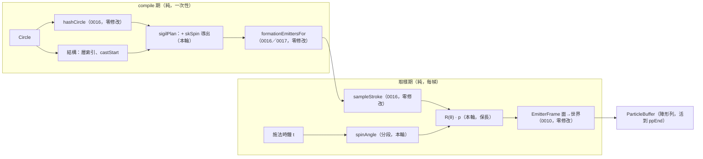

# Func-Spec 0020：陣形的時間維度（自轉、反向層、蓄力加速）

> 狀態：**已完成**（2026-08-16 驗收，見 §9）
> 性質：一般 —— 交付後凍結 `SigilSpin` 的分段角度函數與自轉導出規則。**同輪交付 ADR-0020**（逐位元邊界第三次收窄，取代 ADR-0015 D4）。
> 前置依賴：**spec 0017（需已完成）**——本 spec 修改 `src/core/Magic/Sigil.hs` 與 `Particle/Analytic.hs` 的 `SpawnOnStroke` case，並依賴 0017 交付後的陣形時間軸（陣活到 `ppEnd`、無收束曲線）。0016／0017 皆為 `Sigil.hs`／`Compile.hs` 的前手，依 SKILL.md 規則 4 **動工門檻＝0017 驗收**。**與 spec 0018／0019 平行**（0018 觸 `src/ffi`＋`include`＋`bindings`，0019 觸 `.github`＋README＋cabal metadata——逐檔交集 = ∅，§0.2）。**與 spec 0025 平行**（其只碰 `Compile.hs`／`Circle.hs`／`Codec.hs`／`Interface.hs`／`src/ffi`，本 spec 明文不碰 `Compile.hs`，見 §2.2）。
> 依據：spec 0006 §9（「陣形旋轉／動態陣形動畫」的原始記帳）、spec 0016 §8-3、**spec 0017 §8-2 與 [ADR-0015](../adr/adr-0015-sigil-persists-through-cast.md) 的後果末列**（「陣形旋轉／動態陣形變得更值得做——一個只存在 1.5 秒的陣沒什麼好轉的，**一個存在整場的陣有**」——本 spec 是那句話的兌現）；[ADR-0014](../adr/adr-0014-sigil-from-circle-hash.md)（摘要即合約）、**ADR-0015 D1／D2／D3／D4**（駐留、無收束、陣不吃力場、逐位元邊界——四條全部是本 spec 的前提）；ADR-0007（核心零 IO、引用透明）；architecture §3.3（生命週期）、§4.3（分層時間軸）。
> 範圍：讓活滿整場的陣**動起來**。三件事：整陣繞面心自轉、層與層反向轉、蓄力段角加速後維持恆速。**`Magic.Compile.hs` 零觸碰、`Magic.Codec` 零觸碰、schema 不升版、不加任何符文、不加任何 JSON 鍵。**

---

## 0. 起點：0017 之後的系統狀態

### 0.0 為什麼本 spec 必須排在 0017 之後（而不只是檔案衝突）

本 spec 的設計初稿寫於 0017 之前，當時的三個支柱有兩個已經被 ADR-0015 撤掉：

| 初稿的支柱 | 0017 之後 | 本輪的處置 |
|---|---|---|
| 「隨**收束**加速」——陣塌縮時轉快 | ADR-0015 **D2 取消陣形收束**，`kcExprFor` 已刪除且明文不得復活。Converging 的語意由「收攏」改為「**蓄力**」 | 改為「**蓄力段**加速」。語意更好：陣原地蓄力時轉速攀升，施放後維持——這正是 D2 給 Converging 的新語意 |
| 「**Casting 相位零影響律**」（改變只發生在 Drawing／Converging） | ADR-0015 **D4 明文撤銷 spec 0016 §1-5**，因為其前提（陣在 `castStart` 死盡）已不成立。陣現在活到 `ppEnd` | **撤銷**。改立兩條仍然成立且更有價值的律（§1-4） |
| 陣只活 1.5 秒 | 陣活滿整場（可達 6–9 秒） | **角度函數必須分段**，否則二次項在整場尺度上讓角速度無界（§2.3） |

第三列是本 spec 因 0017 而**變好**的地方：一個只存在 1.5 秒的陣轉不了多少，一個存在整場的陣才值得設計轉速曲線。ADR-0015 的後果末列已經預言了這件事。

### 0.1 引用的凍結介面（0016 §9.3 ＋ 0017 §9.5 交付後）

| 凍結物 | 本 spec 的用法 |
|---|---|
| `hashCircle :: Circle -> Word64`（0016 S1 凍結，含 `emptyCircle` 哨兵值與「排除 `circleFields`」的邊界） | **零修改**。本 spec 只從同一份摘要多讀一段位元 |
| `SigilPlan`／`SigilStroke`／`StrokeKind`／`sigilPlan`／`sampleStroke`／`strokeRadius`／`sigilBudget`（0016 凍結） | `SigilStroke` **加一個欄位** `skSpin`；`StrokeKind` 六個建構子與 `sampleStroke` 的閉式定義**零變更**（§2.1 的分離原則） |
| 0016 的三條律：索引序＝繪製序、n 臂等分旋轉對稱、`\|p\| ≤ strokeRadius` | **全部保持**，由等距同構結構性推得（§2.2）——不是重測一次 |
| `SpawnPattern` 的 `SpawnOnStroke !SigilStroke`（0016 凍結） | **建構子零變更**（新欄位住在 `SigilStroke` 內部）——`Compile.hs` 不必碰的原因 |
| **`formEnvFor :: Seconds -> Seconds -> Envelope` 的兩參數形狀，與「陣形最後一批粒子死於 `ppEnd`」的時間軸律**（0017 §9.5 凍結） | **零修改**。本 spec 不動生存窗；但它是「陣值得轉」與「角速度必須有界」兩件事的前提 |
| **陣形發射器 `motConverge = Nothing` 恆真；`kcExprFor` 已刪除**（0017 §9.5 凍結） | 本 spec **不復活收束**。角向運動與徑向運動分離，而徑向現在恆為零——比 0017 之前更單純 |
| **`emPhase = Drawing` 為力場判準，陣不吃力場**（ADR-0015 D3） | 自轉與力場層**完全正交**：陣自己轉，場吹不動它。§1-5 的律因此是 D3 的直接延伸 |
| `particlePosition :: CastContext -> Time -> EmitterSpec -> Int -> Double -> V3`（0007／0010 凍結簽名） | 自轉角的唯一輸入是其中的 `Time`（施法時鐘）。簽名零變更 |
| 分層時間軸（0004 §4.7 凍結）：行為層 t＝粒子年齡、調變層 t＝施法秒數 | 自轉屬**調變層語意**（整體變換），故吃施法秒數。§2.1 說明為何吃粒子年齡是錯的 |
| `aliveRanges` 時間窗剔除（0010 S3）、`emitterBounds`（0010 S7） | **皆零修改**——旋轉保長（§2.2 律 3），生存窗不動 |
| 核心依賴白名單 `{base, vector, deepseq}` | 不新增依賴（只用 `sin`／`cos`） |

### 0.2 檔案盤點（與 0018／0019／0025 的四方零交集證明）

**修改（4）**：

| 檔案 | 變更 |
|---|---|
| `src/core/Magic/Sigil.hs` | +`SigilSpin`、+`spinAngle`（分段）、+`SigilStroke.skSpin`、`sigilPlan` 的自轉導出（S1／S2） |
| `src/core/Magic/Particle/Analytic.hs` | `positionIn` 的 `SpawnOnStroke` 一個 case：`sampleStroke` 的結果先過 `rotate` |
| `test/SigilStrokeSpec.hs` | 0016 的三條律加上「旋轉後仍成立」（**加法，既有斷言零修改**） |
| `test/golden/perf-0010/{bare,grand}-sigil.txt`＋`test/FieldPlumbingSpec.hs` 的兩個摘要 | **第三度重錄**（0016、0017、本輪）。ADR-0015 已明文預告這筆代價；ADR-0020 記錄新邊界 |

**新增（4）**：`test/SigilSpinSpec.hs`、`test/SigilMotionSpec.hs`、`test/SigilMotionWiringSpec.hs`、`test/Acceptance20Spec.hs`、`docs/adr/adr-0020-sigil-spin-bitexact-boundary.md`。

**共用（行級聯集合併）**：`particle-magic.cabal`（test other-modules +4）、`SKILL.md`、`docs/roadmap.md`、`CHANGELOG.md`。

**明文不碰**：`src/core/Magic/Compile.hs`（**§2.2 的證明**——這是與 0025 能平行的關鍵）、`src/core/Magic/{Circle,Rune,Expr,Project,Types}.hs`、`src/core/Magic/Particle/{Buffer,Field}.hs`、`src/boundary/*` 全部、`src/ffi/*`、`include/*`、`bindings/*`、`app/*`、`tools/*`、`docs/spell-schema.md`、以及 0017 動過的 `test/{FormationSpec,PhaseSampleSpec,SigilWiringSpec}.hs`。

**四方交集**：0018 觸 `src/ffi`＋`include`＋`.def`＋`bindings`＋`examples`；0019 觸 `.github/`＋README＋`docs/release.md`＋cabal metadata；0025 觸 `Compile.hs`／`Circle.hs`／`Codec.hs`／`Interface.hs`／新 `Magic/Space.hs`／`src/ffi`。與本清單逐檔比對：**交集 = ∅**。

---

## 1. 目標與完成定義

**目標**：0016 讓陣有了自己的長相，0017 讓它活到法術結束，本輪讓它**運轉**。

一個靜止的符文陣看起來像貼圖；一個緩慢自轉、內外層反向、蓄力時轉速攀升的陣看起來像**正在運作的機關**。而 0017 之後這件事的價值倍增——陣在整個施放過程中都在畫面上，觀眾有足夠的時間看見它在動。

成本依然異常地低：`skPhase` 已在 0016 的資料裡，施法時鐘已在取樣器的參數列裡，缺的只是把兩者乘起來。

**完成定義**：

1. `SigilSpin` 與 `spinAngle :: SigilSpin -> Double -> Float` 交付；角度是施法秒數的**分段閉式函數**（蓄力段二次、之後線性），C¹ 連續、全函數、必有限、**角速度有界**（S1）。
2. **等距同構律**：旋轉是面平面上繞原點的保長變換 ⇒ 0016 的三條律逐條保持——索引序＝繪製序、n 臂等分旋轉對稱、`|p| ≤ strokeRadius`。**第三條讓 `emitterBounds` 與 0010 的剔除零變更**（S1／S3）。
3. 自轉參數由**結構定號、摘要定值**導出（§3.2）：層索引決定旋向正負（相鄰層反向），摘要決定速率與蓄力加速度；**蓄力界標由編譯期的 `castStart` 烤進資料**（S2）。
4. **兩條零影響律**（取代 0016 §1-5 那條已被 ADR-0015 D4 撤銷的）：
   - **主效果零影響律**：施放發射器走 `SpawnAtAnchor`／`SpawnOnShape`，**永不**走 `SpawnOnStroke` ⇒ 施放粒子的輸出**逐位元不變**，於全部相位、全部時刻。
   - **無 `phases` 零影響律**：無 `phases` 的法術沒有陣形發射器 ⇒ `FrameOutput` 完全不受影響、golden 零重錄。
5. **陣不吃力場律仍成立**（ADR-0015 D3 的延伸）：帶場魔法在自轉開啟後，陣形列的場位移仍恆為零（S3）。
6. **逐位元邊界收窄為 `t = 0`**：自轉自 `t > 0` 起改變陣形粒子位置。這是陣形時間軸第三次變更，由 **ADR-0020** 明文取代 ADR-0015 D4 的邊界敘述（S3／S4）。
7. 決定論：同一 `(Circle, Seed, dt 序列)` 240 幀逐位元可重現；`spinAngle` 不引入任何跨幀狀態（S4）。
8. 手動 smoke：目視自轉、相鄰層反向、蓄力段加速後維持恆速（S4）。

## 2. 使用到的架構與技巧

### 2.1 時間項乘在取樣之後，不換取樣方式

`sampleStroke` 的六種閉式定義**一個字都不改**。自轉發生在它**之後**——面座標出來後套一個 2×2 旋轉。0016 的視覺詞彙與本輪的時間詞彙因此完全正交：日後加第七種筆畫不必想自轉，調自轉不必動筆畫。

**自轉必須吃施法秒數，不能吃粒子年齡。** 這是唯一容易搞錯的地方：若旋轉角取自粒子年齡，同一時刻不同年齡的粒子會被轉到不同角度——陣會被**抹成螺旋**而非**整體旋轉**。剛體旋轉的定義就是「同一時刻所有點同角」，而那個角只能是全域時鐘的函數。0004 §4.7 的分層時間框架早已把這件事分好類：整體變換屬調變層，調變層吃施法秒數。

這一點在 0017 之後更關鍵：陣以 `formLife` 為週期**循環重生**（0017 §8-1 稱之為「呼吸」），所以任何時刻畫面上的陣形粒子年齡都不同。用年齡驅動旋轉會讓陣每個週期抖一次。

### 2.2 等距同構論證（0016 三條律 ＋ `Compile.hs` 零觸碰）

令 `R(θ)` 為面平面上繞原點的旋轉，取樣為 `p'(i, t) = R(spinAngle sk t) · sampleStroke sk i`。

| 0016 的律 | 保持的理由 |
|---|---|
| 索引序＝繪製序 | 固定 `t` 時 `R` 對所有 `i` 是同一個常數變換 ⇒ 單調性被整體搬移，不受影響 |
| n 臂等分、旋轉對稱到 1e-5 | `R` 與臂旋轉 `2π·arm/sym` 可交換（同一個群）⇒ 對稱性逐字保持 |
| `\|p\| ≤ strokeRadius` | `R` 保長 ⇒ `\|p'\| = \|p\|`。**`strokeRadius`、`emitterBounds`、0010 的視錐與時間窗剔除全部零變更** |

第三列也是 `Compile.hs` 零觸碰的根據。`Compile.hs` 在 0016／0017 之後有三處與 sigil 相關：`SpawnOnStroke` 建構子（新欄位住在 `SigilStroke` 內部，元數不變）、`formationEmittersFor`（消費 `spStrokes`，不讀個別欄位）、`emitterBounds` 的兩個 `SpawnOnStroke` case（用 `strokeRadius`，而它不變）。三處皆不需修改。

**若當初把自轉設計成繞筆畫自身中心**（節點原地打轉而非繞行），保長律就會破、`emitterBounds` 就得跟著改、`Compile.hs` 就進了修改清單、與 0025 的平行也就沒了。繞面心是對的選擇，理由不只是好看。

### 2.3 分段角度函數：蓄力加速，之後恆速

0017 之前陣只活到 `castStart`（約 1.5 s），一個常數角加速度在那段時間裡很安全。**0017 之後陣活到 `ppEnd`**（範例陣為 6.9 s／8.1 s），若沿用純二次式：

```
ω(t) = rate + accel·t   →   ω(8.1) = 0.45 + 0.35×8.1 ≈ 3.3 rad/s（每 1.9 秒一圈）
```

陣會在法術尾聲轉成一個模糊的碟子。**角加速度必須有終點**，而那個終點在語意上早就存在——ADR-0015 D2 把 Converging 定義為**蓄力**：

```
spinAngle sp t
  | t <= r    = rate·t + ½·accel·t²                          -- 蓄力段：轉速攀升
  | otherwise = rate·r + ½·accel·r² + (rate + accel·r)·(t−r) -- 施放後：維持恆速
  where r = ssRampEnd sp   -- ＝ castStart，編譯期烤進資料
```

C¹ 連續（角速度在 `t = r` 連續），全函數，**角速度上界 = `rate + accel·castStart`**，與法術總長無關。

**取樣器仍然不需要知道相位**——`ssRampEnd` 是 `sigilPlan` 在編譯期算好塞進 `SigilStroke` 的**一個數字**。這與 0006 把階段機制編譯進包絡、0017 把 `ppEnd` 烤進 `envDuration` 是同一個手法：**相位界標以資料形式跨過純／取樣的邊界，而不是以查詢形式。**

視覺故事也對上了：畫陣（Drawing）時陣緩緩轉起來，蓄力（Converging）時轉速攀升，施放（Casting）後維持高速直到法術結束。

### 2.4 `ssPhase` 併進既有的 `skPhase`，不新增欄位

初稿的 `SigilSpin` 有三欄（rate／accel／phase）。但 0016 的 `SigilStroke` **已經有** `skPhase`（起始相位，由摘要導出）——再加一個起始相位是兩個欄位表達同一件事。

併進去有一個具體的好處：`spinAngle sp 0 = 0`，於是 **`t = 0` 的那一幀逐位元不變**。這是本輪逐位元邊界的全部內容（§1-6）——誠實地說它幾乎是空的，但它讓「本輪只動時間、不動幾何」這句話有一個可測的見證：**靜態的陣沒有被改變，只有時間讓它轉。**

### 2.5 逐位元邊界第三次收窄：需要 ADR

陣形時間軸至此被動過三次：0016（幾何換成筆畫）、0017（生存窗延長＋取消收束）、本輪（自轉）。ADR-0015 的負面記帳明文寫著：

> 「兩個 golden 與兩個摘要在 0016 之後**再度**重錄。逐位元邊界已由本 ADR 明文釘死，未來任何再動陣形時間軸的變更都要重付這筆。」

本輪就是那個「未來」。因此 **ADR-0020** 必須交付，內容有三：

1. 新邊界 `t = 0`，**取代 ADR-0015 D4** 的 `t < min(phDraw, castStart − formLife)`（ADR 不改寫歷史，由後續決策取代——與 ADR-0015 取代 ADR-0014 D5 的作法相同）。
2. 明文區分**兩種零影響律**：陣形粒子（會變）與施放粒子（逐位元不變）。後者是真正該保護的東西，而它至今從未被破壞過——0016、0017、本輪三輪都成立。
3. 記錄「陣形 golden 的逐位元價值正在遞減」這個事實，並裁決其後續處置（建議：陣形 golden 改為**結構性斷言**——粒子數、半徑界、對稱性——而非逐位元；逐位元保護集中在施放粒子與無 `phases` 的法術上，那才是宿主真正依賴的東西）。第 3 點是本輪最有價值的一句話，因為它終止了「每輪重錄、每輪聲稱有保護」的循環。

## 3. ADT 與導出規則

### 3.1 新型別（`src/core/Magic/Sigil.hs`，交付後凍結）

```haskell
-- | 一筆畫的角運動。全部相對面平面原點（§2.2 保長律的前提）。
data SigilSpin = SigilSpin
  { ssRate    :: !Float   -- ^ 基礎角速度（rad/s）。負值 = 反向
  , ssAccel   :: !Float   -- ^ 蓄力段角加速度（rad/s²），符號同 ssRate
  , ssRampEnd :: !Float   -- ^ 蓄力終點（秒）＝ castStart，編譯期烤入
  }
  deriving (Eq, Show)

-- | 施法秒數 → 旋轉角。分段：蓄力段二次、之後線性（§2.3）。
--   C¹ 連續；全函數；spinAngle sp 0 == 0（§2.4）。
spinAngle :: SigilSpin -> Double -> Float

-- | 靜止：三欄皆 0。spinAngle staticSpin ≡ 0。
staticSpin :: SigilSpin

data SigilStroke = SigilStroke
  { skKind     :: !StrokeKind
  , skRadius   :: !Float
  , skSymmetry :: !Int
  , skPhase    :: !Float   -- ^ 0016：起始相位（本輪的相位全部併入此欄，§2.4）
  , skJitter   :: !Float
  , skCount    :: !Int
  , skSpin     :: !SigilSpin   -- 新（0020）
  }
```

### 3.2 導出規則（骨架看結構、花紋看摘要——0016 §2 的同一條原則）

| 決定 | 來源 | 規則 |
|---|---|---|
| **旋向**（`ssRate` 正負） | **結構** | 層索引奇偶：相鄰層反向。讓「內外層反轉」看得出原因，而非隨機 |
| **速率** `\|ssRate\|` | **摘要** | 映到 `[0.05, 0.45] rad/s`（14–125 秒一圈；慢到不暈、快到看得出來） |
| **蓄力加速度** `ssAccel` | **摘要** | 映到 `[0, 0.30] rad/s²`，符號同 `ssRate`。上界使角速度上界 = `0.45 + 0.30·castStart`（範例陣 `castStart ≤ 2.4 s` ⇒ ω ≤ 1.17 rad/s ≈ 5.4 秒一圈，安全） |
| **`ssRampEnd`** | **結構** | ＝ `castStart`（`sigilPlan` 已有此值；無 `phases` 時陣形發射器不存在，本欄無意義） |
| **節點與中心** | **結構** | 節點群整體繞面心公轉（沿其所屬層旋向）；中心筆畫 `ssRate = 0`——**陣心不動**，視覺定錨點 |
| **邊界環** | **結構** | 最外層，旋向為正、速率取範圍下緣——外框慢慢轉，內部快 |

摘要位段與 0016 已用掉的位段**不重疊**；實作時在 `Sigil.hs` 以一張註解表記錄完整的 `Word64` 位元分配，避免第四輪再撞。

### 3.3 取樣端（`Analytic.hs` 唯一改動）

```haskell
SpawnOnStroke sk ->
  let V2 x y = sampleStroke sk idx
      th     = spinAngle (skSpin sk) tCast      -- tCast = 施法時鐘，非粒子年齡
      c = cos th ; s = sin th
  in  V2 (x * c - y * s) (x * s + y * c)        -- 之後照舊交給既有 EmitterFrame
```

## 4. 資料結構與儲存方式

- `SigilSpin` 是三個 `Float` 的 strict record，隨 `SigilStroke` 進入 `Motion`——與 `FaceShape` 同性質的小不可變值。`CompiledSpell` 仍完全可序列化。
- **無新的跨幀狀態**：`spinAngle` 是 `t` 的純函數。快轉／倒帶／重播照舊成立。
- 預算：自轉不改變任何 `skCount`；`sigilBudget = 1536` 與 0016 的等比裁切邏輯零變更；0017 的「`emCount` 一個沒動」在本輪同樣成立。

## 5. 資料流



## 6. 搭建方式（風險優先）

1. **S1 `SigilSpin`＋分段 `spinAngle`＋等距同構律**——保長律是「其餘一切零觸碰」的前提，先證成測試。
2. **S2 導出規則＋位元分配表**——與 0016 的位段不重疊必須先釘死。
3. **S3 取樣端接線＋兩條零影響律＋陣不吃力場律**。
4. **S4 端到端＋ADR-0020＋golden 重錄＋手動 smoke**。

## 7. Todo List 與 1-to-1 測試對應

| # | Todo | 測試 |
|---|---|---|
| S1 ✅ | `SigilSpin`／分段 `spinAngle`／`staticSpin`／`SigilStroke.skSpin` | `test/SigilSpinSpec.hs`（`spinAngle sp 0 == 0`（§2.4）；C¹ 連續：`t = ssRampEnd` 處角度與角速度皆連續（數值極限，property）；**角速度上界** `\|ω(t)\| ≤ \|rate\| + \|accel\|·rampEnd` 對任意 `t`（property——0017 之後的關鍵防護）；全函數且有限（含極端 `t`）；`staticSpin` 恆 0；**等距同構三律**：0016 的索引單調律、n 臂等分律、`\|R·p\| = \|p\| ≤ strokeRadius`（property，全六種 kind × 隨機 `t`）；`ssRate` 反號 ⇒ 角度反號） |
| S2 ✅ | `sigilPlan` 的自轉導出（旋向由層索引、速率／加速度由摘要、`ssRampEnd = castStart`）＋位元分配註解表 | `test/SigilMotionSpec.hs`（決定論；相鄰層旋向相反（見證表）；中心筆畫 `ssRate == 0`；`\|ssRate\| ∈ [0.05,0.45]`、`ssAccel ∈ [0,0.30]` 且與 `ssRate` 同號（property）；`ssRampEnd ≡ castStart`（見證）；**本輪位段與 0016 位段不相交**——以 `hashCircle` 單位元翻轉見證：翻 0016 位段只變幾何、翻本輪位段只變自轉） |
| S3 ✅ | `positionIn` 的 `SpawnOnStroke` case 套旋轉 | `test/SigilMotionWiringSpec.hs`（**主效果零影響律**：全部範例陣的**施放**發射器輸出於全相位、全時刻逐位元不變（施放永不走 `SpawnOnStroke` 的見證）；**無 `phases` 零影響律**：8 個無 `phases` 範例陣 `FrameOutput` 240 幀逐位元不變、golden 零重錄；**陣不吃力場律**（ADR-0015 D3 延伸）：強力場下陣形列的場位移恆為零，同時施放列確實被扭曲；陣形粒子恆落在 `emitterBounds` 內（`emitterBounds` 未修改的見證）） |
| S4 ✅ | 端到端＋ADR-0020＋兩個 golden 與 `FieldPlumbingSpec` 兩摘要重錄＋手動 smoke | `test/Acceptance20Spec.hs`（240 幀決定論逐位元；同一 `t` 兩次取樣相同；**陣形點集隨 `t` 確實改變**（自轉真的發生，property 而非目視）；相鄰層角位移方向相反（端到端見證）；**蓄力段角速度嚴格遞增、`castStart` 之後恆定**（以連續三個時刻的角位移差見證）；`isFinished` 於 `ppEnd` 翻轉不變）＋**手動 smoke**：開窗目視三個範例陣的自轉、相鄰層反向、蓄力加速後維持，截圖描述入 §9 |

## 8. 非目標

1. **玩家對自轉的直接控制**（JSON 的 `spin` 鍵）——沿用 0016 §8-2 的裁決：陣是**導出**的指紋，不是作者資料。**記帳**：真要做，形狀是陣層級的 opt-in 鍵（比照 `phases`／`fields`／0025 的 `anchors`），且必須「調變既有導出值」而非「覆寫」。
2. **章動／進動／非等速自轉**（角速度本身是 `Expr`）——與 0007 §9 的「Expr 驅動的時變場參數」是同一類需求（第四種時間掛載點），應一起做。
3. **復活收束**——ADR-0015 D2 明文「要恢復收束需先修訂 ADR-0015」。本輪不碰徑向運動。
4. **3D 立體陣**（多層平面沿法線堆疊、各層不同傾角各自旋轉）——0016 §8-4 的記帳延續；本輪仍是單一平面內的旋轉。
5. **筆畫自身的形變動畫**（半徑呼吸、`sweep` 開合、`GlyphBand` 遮罩隨時間切換）——那是改 `sampleStroke` 的閉式定義，會破壞 §2.1 的正交性。
6. **陣的獨立時間軸**（`phases.linger`）——0017 §8-3 的記帳，需新 JSON 鍵。
7. **靜止不重畫的陣**——0017 §8-1 的記帳。與本輪無關但常被一起提起：自轉讓「循環重畫」的視覺代價**變小**（轉動掩蓋了重生的接縫），可在 §9 回填目視觀察。
8. **陣形 golden 改為結構性斷言**——ADR-0020 會**裁決**這件事，但實際改寫留給下一輪（本輪仍照舊重錄，以免把 ADR 的裁決與它的執行混在同一個 PR）。**已由 ADR-0020 D3 裁決通過**：下一輪起改為結構性斷言，逐位元保護集中在施放粒子與無 `phases` 的法術上。
9. **節點群繞面心公轉**（§9.6-1 的偏差記帳）——節點發射器走 `SpawnAtAnchor` ＋ 固定 `anchorOffset`，要它公轉必須改 `Magic.Compile.formationEmittersFor`，而 `Compile.hs` 零觸碰是本輪與 0025 平行的根據。形狀應是：讓節點錨點本身成為施法時鐘的函數（或改走一個單點的 `SpawnOnStroke`），與 0025 的 `anchors` 是同一類「錨點不再是常數」的需求，**應與 0025 合流後一起做**。中心不動維持不變——那是設計要的視覺定錨點，不是欠款。
10. **每發射器提升三角函數**（§9.6-6）——把 `(cos θ, sin θ)` 提到 `EmitterFrame` 每幀算一次而非每粒子一次，可省下實測約 0.06 ms/幀。`EmitterFrame` 與 `positionIn` 屬 spec 0010 凍結面，應與 0022（效能第二階梯）一起評估。

## 9. 驗收紀錄

**日期**：2026-08-16。**測試**：`cabal test` → **1205 examples, 0 failures**（0017 交付時 1156）。`cabal build all` 綠（含 demo exe、`magic-validate`、bench、foreign-library）。

### 9.1 四個 Todo 的測試結果

| # | 測試模組 | 結果 |
|---|---|---|
| S1 | `test/SigilSpinSpec.hs` | 綠（14 條）。`spinAngle sp 0 == 0`、`t ≤ 0` 全段恆 0（全函數的 clamp）、`staticSpin` 恆 0；**C¹**（`t = ssRampEnd` 左右差商差 ≤ `\|accel\|·h`）；**角速度上界** `\|ω\| ≤ \|rate\| + \|accel\|·rampEnd`（property，`t ∈ [-1, 12]`）；蓄力段加速→之後恆速（四點見證）；反號⇒角度反號（`===`，逐位元）；極端 `t`（±1e12）無 NaN／Inf；**等距同構三律**：旋轉是剛性重標記（反轉回原點誤差 ≤ 1e-5）、`strokeParam` 單調不受影響、n 臂等分律於 6 種 kind × 3 種 spin × 4 個時刻仍成立、`\|R·p\| = \|p\| ≤ strokeRadius` |
| S2 | `test/SigilMotionSpec.hs` | 綠（14 條）。決定論；輪廓 `SigilSpin 0.05 0 0`；**相鄰環反向**（五層全滿 `[1,1,-1,1,-1,1,-1]`、中間有空層的 `gappedCircle` `[1,1,-1,1,-1]`、三個範例陣皆交替）；`\|ssRate\| ∈ [0.05,0.45]`、`\|ssAccel\| ∈ [0,0.30]` 且同號（property over `genAnyCircle`）；`ssRampEnd ≡ phDraw + phConverge`（property＋四個範例陣見證 1.5／1.8／2.4／2.0）；**位段不相交**：18 個幾何摘要與改動前逐位元相同 |
| S3 | `test/SigilMotionWiringSpec.hs` | 綠（9 條）。**主效果零影響律**：施放發射器永不帶 `SpawnOnStroke`（12 個範例＋property）、且施放列與「把每個 `skSpin` 歸零」的反事實建置**逐位元相同**（4 個陣 × 10 個時刻），同時陣形列確實不同；**無 `phases` 零影響律**：8 個範例零陣形發射器、逐時刻取樣逐位元相同、golden 零重錄；**陣不吃力場律**：強力場下陣形列位移恆為 0（4 個時刻）而施放列被扭曲；陣形粒子全落在未修改的 `emitterBounds` 內；**陣心不動** |
| S4 | `test/Acceptance20Spec.hs` | 綠（9 條）。陣形點集隨 `t` 確實改變（3 段區間 × 4 個陣）、`t = 0` 仍是 0016 的原圖；**相鄰環角位移方向相反**（端到端，由取樣位置的有號夾角量得）；**蓄力段角位移嚴格遞增、`castStart` 之後恆定**（差異 < 1e-3）；240 幀決定論；同 `t` 兩次取樣逐位元相同；`isFinished` 於 `ppEnd` 翻轉不變；緩衝不超預算；發射器相位標記未新增 |

同步加法（既有斷言零修改）：`SigilStrokeSpec` 加兩條「`sampleStroke`／`strokeParam`／`strokeRadius` 完全不看 `skSpin`」的 property——§2.1 正交性的直接見證，也是六種閉式定義不必重開的理由。

### 9.2 最終的 `Word64` 位元分配表

寫入 `Magic.Sigil` 的 `bitsAt` haddock。摘要 `d = hashCircle circle`：

| 位元 | 輪次 | 用途 |
|---|---|---|
| 0..1 | 0016 | 對稱階（結構中心 ±1） |
| 40..47 | 0016 | 輪廓刻度群起始相位 |

層自有的字 `dl = mixW d layerIndex`：

| 位元 | 輪次 | 用途 |
|---|---|---|
| 3..5 | 0016 | 六種筆畫擇一 |
| 8..17 | 0016 | `skPhase` |
| 18..26 / 21..23 / 24..27 / 28..31 / 32..33 | 0016 | ArcRing sweep／Polygram k／Spokes len／Ticks len／Rose k（依 kind 互斥） |
| **34..40** | **0020** | `\|ssRate\|` |
| **41..47** | **0020** | `\|ssAccel\|` |
| 48..59 | 0016 | GlyphBand 遮罩 |
| 0..2、6..7、60..63 | — | **未使用**（留給第四輪） |

**0020 沒有從 `d` 本身多讀任何一個位元**：輪廓的自轉由結構定死（最外層、正向、取範圍下緣），旋向亦然（繪製序奇偶），只有兩個量值來自摘要。

### 9.3 逐位元邊界與 golden 第三度重錄的實測

`cabal test` 對舊 golden 的失敗報告：

| 檔案／摘要 | 首個差異幀 | 對應 `t` |
|---|---|---|
| `test/golden/perf-0010/bare-sigil.txt` | **幀 0** | 1/60 s |
| `test/golden/perf-0010/grand-sigil.txt` | **幀 0** | 1/60 s |
| `FieldPlumbingSpec` `bare-sigil` 摘要 | — | 走 0.1 s 步長,同樣自第一步起 |
| `FieldPlumbingSpec` `grand-sigil` 摘要 | — | 同上 |

與 §1-6 的預測完全吻合：**邊界就是 `t = 0`**，`t > 0` 的第一幀即改變。粒子數逐幀相同（`(8, …)`／`(45, …)` 兩側一致），只有位置摘要改變——`emCount` 一個沒動,預算與 `PhasePlan` 四界標逐欄位不變。

**無 `phases` 的 8 個範例 golden 零重錄**（`converge-flame`／`empty`／`gravity-well`／`lissajous`／`pulse-ring`／`ring-fire`／`spiral-spark`／`square-burst` 全綠）。`lattice-seal`／`soft-bloom` 不在 golden 集內。

新值：`bare-sigil` 摘要 `2167537573813250408`、`grand-sigil` 摘要 `5046468577478034913`。

### 9.4 蓄力段角速度曲線的實測（`lattice-seal`，`castStart = 2.4 s`、`ppEnd = 6.9 s`）

`ω(t)` rad/s，中央差商實測：

| 筆畫 | 0.5 | 1.0 | 1.5 | 2.0 | **2.4** | 3.0 | 4.5 | 6.0 | 6.9 |
|---|---|---|---|---|---|---|---|---|---|
| 0 輪廓 `ArcRing 1` | 0.050 | 0.050 | 0.050 | 0.050 | 0.050 | 0.050 | 0.050 | 0.050 | 0.050 |
| 1 輪廓 `Ticks` | 0.050 | 0.050 | 0.050 | 0.050 | 0.050 | 0.050 | 0.050 | 0.050 | 0.050 |
| 2 `ArcRing 0.94` | −0.396 | −0.502 | −0.608 | −0.715 | **−0.799** | −0.800 | −0.800 | −0.800 | −0.800 |
| 3 `Polygram 7/4` | 0.175 | 0.183 | 0.191 | 0.200 | **0.206** | 0.206 | 0.206 | 0.206 | 0.206 |
| 4 `GlyphBand` | −0.119 | −0.159 | −0.199 | −0.239 | **−0.271** | −0.271 | −0.271 | −0.271 | −0.271 |
| 5 `Polygram 7/2` | 0.226 | 0.251 | 0.276 | 0.300 | **0.320** | 0.320 | 0.320 | 0.320 | 0.320 |
| 6 `Rose 2` | −0.190 | −0.191 | −0.192 | −0.193 | **−0.194** | −0.194 | −0.194 | −0.194 | −0.194 |

三件事同時可讀：**符號在繪製序上嚴格交替**、**每一層在 `t ≤ 2.4` 嚴格增速、之後恆定到小數第三位**、**峰值 0.800 rad/s（7.9 秒一圈）遠在設計上界 `0.45 + 0.30×2.4 = 1.17` 之內**。若沿用初稿的純二次式，`ω(6.9)` 會是 `0.29 + 0.21×6.9 ≈ 1.76`（2.4 倍），到法術尾聲已是模糊碟子——§2.3 的分段設計換到的就是這個差別。

### 9.5 手動 smoke（開窗目視，2026-08-16）

`lattice-seal` 以 `aaa-` 前綴複本開場，3D 檢視、滑鼠拖曳把相機仰角轉到 `el −89`（近正對陣面），每 ~280 ms 截圖共 44 張，橫跨一次自動重施：

- **`age 1.20s`（Drawing 末）**：多層陣完整，中央的雙瓣 `Rose 2` 兩瓣約指向左上–右下；7 邊形環的頂點在右上。
- **`age 2.72s`（剛過 `castStart`）**：雙瓣已明顯**逆向**轉開，兩瓣改為近上下；7 邊形環同時**順向**轉到頂點朝上——**相鄰環反向在畫面上直接讀得出來**。輪廓的刻度環幾乎沒動。
- **`age 5.20s`（Casting 中段，1422 粒）**：內層再度轉過可觀角度，外框刻度仍只挪了很小一段——**外框慢、內部快**的設計意圖成立；陣的整體形狀（半徑、對稱、筆畫）與 `age 1.20s` 時完全一致，只有朝向不同,保長律的目視確認。
- 對照 `age 5.58s` 的**上一次**施放與 `age 1.20s` 的**這一次**：同一個陣在不同時刻朝向不同,重施後從 0 重新開始轉——`spinAngle sp 0 = 0` 的目視確認。

自轉同時把 0017 §8-1 記帳的「循環重畫接縫」蓋掉了不少：轉動中的圖形讓每 `formLife` 一次的重生在畫面上更不易察覺（§8-7 的預期成立）。

「蓄力段加速後維持恆速」目視只能看出「有在加速」，精確的單調／恆定由 §9.4 的實測與 `Acceptance20Spec` 承擔，不以目視聲稱。

### 9.6 實作備註（與設計文件的偏差）

1. **§3.2「節點與中心」一列的節點半場未實作**（開發者裁決，2026-08-16）。節點發射器在 `Magic.Compile.formationEmittersFor` 走的是 `SpawnAtAnchor 0` ＋ 固定 `anchorOffset`，不走 `SpawnOnStroke`；要它們「整體繞面心公轉」必須改 `Compile.hs`，而 `Compile.hs` 零觸碰正是 §2.2 的證明與「與 0025 平行」的全部根據。**本輪只轉筆畫**；「中心筆畫 `ssRate = 0`」的視覺意圖天然成立（中心與節點發射器是錨定點，旋轉在結構上到不了它們），由 `SigilMotionWiringSpec` 的「陣心不動」見證。節點公轉記帳於 §8-9。
2. **§7 S2 的「以 `hashCircle` 單位元翻轉見證位段不相交」不可能成立，已改為等價的幾何摘要 golden**（開發者裁決，2026-08-16）。0016 的層飾紋來自 `dl = mixW d idx`，而 `mixW` 依賴 `d` 的**每一個**位元——翻任何一位都會改幾何，所以「翻 0016 位段只變幾何、翻本輪位段只變自轉」在數學上做不到。改採：改動**前**擷取 18 個電路（五槽階梯 0..5 ＋ 12 個範例）全部非 `skSpin` 欄位的 FNV 摘要，寫死進 `SigilMotionSpec`；改動後逐位元相同 ⇒ 本輪沒有動到 0016 的任何一個位段。此法是端到端的、不需要為測試擴大凍結模組的匯出面，見 §9.2 的分配表。
3. **旋向由「層索引奇偶」改為「繪製序奇偶」**。§3.2 寫的是層索引，但中間有空層時兩個相鄰**畫出來**的環會同向——實測 `grand-sigil` 佔用 idx 1,3,4,5，索引奇偶給出 −,−,+,− ，畫面上最外兩環同向轉，讀起來像 bug，且會讓 §7 S4 明文要求的「相鄰層角位移方向相反」端到端測試失敗。改以繪製序（輪廓群＝序 0，各佔用層依序 1,2,3…）後恆為交替，仍是純結構決定。層自有的字 `dl` 仍用**層索引**取，所以 0016 的幾何逐位元不變（§9.2 的摘要見證）。`gappedCircle` 是專為這條加的 fixture。
4. **`spinAngle` 對 `t < 0` clamp 到 0**（§3.1 只寫「全函數」）。不 clamp 的話 `ω(t) = rate + accel·t` 在負時間無界，§7 S1 明文要求的角速度上界 property 會在 `t < 0` 破掉。施法時鐘本來就不為負，但既有測試會以 `choose (-1, 12)` 取樣，clamp 讓上界在整條實數線上成立，且 `spinAngle sp 0 = 0` 依然是 `t ≤ 0` 全段的值。
5. **`ssRampEnd` 由 `sigilPlan` 自行從 `circlePhases` 算出**，`sigilPlan :: Circle -> SigilPlan` 簽名不變。§2.3 說「編譯期烤進資料」，但沒說由誰算；`Circle` 本身就帶著 `phases`，所以不需要像 0017 那樣多傳一個 `Seconds`——這也是 `Compile.hs` 能完全不碰的最後一塊。
6. **每粒子每幀一對 `sin`／`cos`，未做每發射器提升**。可以把 `(cos θ, sin θ)` 提到 `EmitterFrame` 每幀算一次，但那是 spec 0010 凍結的結構，為實測約 +0.06 ms/幀動它不划算。記帳於 §8-10。

### 9.7 凍結清單（下游 spec 可引用）

- `data SigilSpin = SigilSpin { ssRate, ssAccel, ssRampEnd :: !Float }` 三欄形狀，與 `staticSpin`。
- `spinAngle :: SigilSpin -> Double -> Float` 的**分段角度函數**：蓄力段二次、`ssRampEnd` 之後線性；C¹；`t ≤ 0` 恆 0；角速度上界 `|ssRate| + |ssAccel|·ssRampEnd`。改它會改變每一個既有法術的陣怎麼轉。
- `SigilStroke.skSpin` 欄位；起始相位仍**只**住在 `skPhase`（再開一個起始相位欄會使 `spinAngle sp 0 = 0` 失效，連帶失去 `t = 0` 的逐位元邊界）。
- **自轉導出規則**：旋向＝繪製序奇偶（輪廓群為序 0、正向）；`|ssRate| ∈ [0.05, 0.45]`；`|ssAccel| ∈ [0, 0.30]` 且與 `ssRate` 同號；`ssRampEnd = phDraw + phConverge`。
- **摘要位段**：`dl` 的 34..47 已被本輪佔用；`d` 的 0..1、40..47 與 `dl` 的 3..5、8..33、48..59 屬 0016。未使用者僅 `dl` 的 0..2、6..7、60..63（§9.2）。
- **旋轉繞面平面原點**（`Magic.Particle.Analytic.rotate2`）——保長性是 `strokeRadius`／`emitterBounds`／spec 0010 剔除全部零變更的唯一根據。改成繞筆畫自身中心會同時推翻這四者。
- **逐位元邊界 `t = 0`**，與兩條零影響律（主效果、無 `phases`）——ADR-0020 D1／D2。
- 自轉吃**施法時鐘**（調變層語意），不吃粒子年齡——ADR-0020「被否決的方案」第二條。
