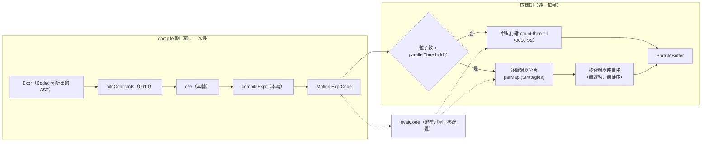

# Func-Spec 0022：效能第二階梯（Expr bytecode、共同子式消去、平行取樣）

> 狀態：**已交付（2026-08-16）**——驗收紀錄見 §9，與計畫的三處偏離見 §10。
> 性質：一般 —— 交付後凍結**兩條等價律**（bytecode ≡ AST 求值、平行 ≡ 單執行緒，皆逐位元）與 `Magic.Expr.Code` 的匯出面。**同輪交付 ADR-0017**（平行取樣的決定論保證＋核心依賴白名單的變更）。
> 前置依賴：**spec 0021（需已完成）**——本 spec 修改 `src/core/Magic/{Compile,Particle/Analytic}.hs`，與 0021 的新建構子 case 同檔，依 SKILL.md 規則 4 **動工門檻＝0021 驗收**（且 bytecode 求值器必須涵蓋 0021 加完之後的完整 `Expr` 值域）。**與 spec 0018／0019／0024 平行**（逐檔交集 = ∅，§0.2）。
> 依據：architecture **§8.2**（Expr 加速三階梯：「SPECIALIZE → 常數摺疊/共同子式消去 → 編成扁平 bytecode 陣列」，並明文「**AST 介面不變，只換求值器**」——第一階已由 0010 S6 交付，本輪做第二、三階）、**§7**（GHC 設定：「必要時 `-threaded` 讓 GC 與模擬並行」）、§9.4（GC 停頓）；ADR-0006（SoA＋unboxed）、**ADR-0007（核心零 IO、無 `Eff`——本輪的平行方案被這條唯一化，見 §2.3）**、ADR-0012 §後果（「若日後 Expr bytecode 或多執行緒取樣落地，`budgetCap` 應重新以同一條規則量測」）；[roadmap.md](../roadmap.md) §3.1 末兩列（「bytecode／共同子式消去未做」「多執行緒取樣未做——**下一次抬高上限的前提**」）；spec 0010 §8-4／§8-6（本輪的兩筆記帳來源）、§9.2（量測基線）。
> 範圍：把 0010 沒吃完的那一半吃完。三件事：`Expr` 編成扁平 bytecode、編譯期共同子式消去、以 `Control.Parallel.Strategies` 平行化逐發射器取樣。**兩條逐位元等價律是本輪的全部價值**——加速若以任何輸出差異換來，就是失敗而不是取捨。

---

## 0. 起點：引用的凍結介面、檔案盤點

### 0.1 引用的凍結介面

| 凍結物 | 本 spec 的用法 |
|---|---|
| `Magic.Expr` 的 AST 與語意合約（0003 §4.5 凍結）：`Expr`／`Var`／`BinOp`／`Fun1`／`Fun2`／`Fun3`／`ExprV3`／`ExprEnv`／`evalExpr`／`evalFinite` 的歸零規則 | **`Expr.hs` 零觸碰**（§2.1）。bytedcode 與 CSE 全部住在新模組 `Magic.Expr.Code`；`evalExpr` 保留為**參照實作**（等價律的右邊） |
| `foldConstants`（0010 S6，律：`evalExpr . foldConstants ≡ evalExpr` 逐位元） | 本輪的管線前置：`foldConstants → cse → compileExpr`。三者串起來仍須逐位元等於 `evalExpr` |
| `hashChan` 的 splitmix64 算術（0002；`Chan n` 的求值） | bytecode 的 `CHAN` 指令原樣呼叫同一個函數——**不重寫雜湊**，否則決定論在最深處斷掉 |
| `sample` 的 count-then-fill（0010 S2）：exact-size 六欄單趟寫入 | 平行化改變它的**寫入結構**（§2.4），但不改變任何**值**。0010 的 `SampleFillSpec` 是本輪的回歸網 |
| `aliveSlots`／`aliveRanges`／`emitterBounds`（0010 S3／S7） | 平行切分的依據——**逐發射器**切分，而發射器邊界與其存活區間都是編譯期／`O(log n)` 決定的純資料 |
| `particlePosition`／`aliveSlots` 的簽名（architecture §4.6，0007 凍結） | 零變更 |
| `FieldState` 的攤平 unboxed 欄（0010 S4；**表徵不凍結**，0007 §4.7） | 力場層**本輪不平行化**（§8-3），`Field.step` 零觸碰 |
| 核心依賴白名單 `{base, vector, deepseq}`（0001，`BoundarySpec` 守護） | **本輪變更：加入 `parallel`**。這是架構級決定 → ADR-0017（§2.3） |
| `PerfGoldenSpec`（0010）與 `bench/Bench.hs` 的量測形狀 | 本輪的驗收數字沿用同一套量測，才能與 0010 §9.2、0012 §9.2 直接比較 |

### 0.2 檔案盤點（與 0018／0019／0024 的四方零交集證明）

**新增（5）**：`src/core/Magic/Expr/Code.hs`、`test/ExprCodeSpec.hs`、`test/ExprCseSpec.hs`、`test/ParallelSampleSpec.hs`、`docs/adr/adr-0017-parallel-sampling-determinism.md`。
（**實際新增 6**：§6 S3 的測試檔 `test/ExprCodeWiringSpec.hs` 本節漏列，§6 表格有列。）

**修改（6）**：（**實際 7**：另加 `test/Acceptance10Spec.hs`，其手工 `EmitterSpec` fixture 需補一行 `emCode`——見 §10-1。仍與 0018／0019／0024 零交集。）

| 檔案 | 變更 |
|---|---|
| `src/core/Magic/Compile.hs` | `compile` 時把 `Motion` 內的 `Expr` 過 `foldConstants → cse → compileExpr`，存 bytecode（S3） |
| `src/core/Magic/Particle/Analytic.hs` | 求值改走 bytecode；`sample` 加平行路徑（S3／S4） |
| `test/BoundarySpec.hs` | 核心依賴白名單 +`parallel`（S5） |
| `test/PerfGoldenSpec.hs` | 量測基線更新（S6） |
| `bench/Bench.hs` | +bytecode 求值、+CSE 命中率、+平行取樣 ×核心數 三組 bgroup（S6） |
| `particle-magic.cabal` | `magic-core` build-depends +`parallel`；test-suite／bench／exe 的 `-threaded -rtsopts "-with-rtsopts=-N"`；test other-modules +3 |

**共用（行級聯集合併）**：`SKILL.md`、`docs/roadmap.md`、`CHANGELOG.md`、`docs/architecture.md`（§7／§8.2 的現況欄——見 §7 收尾）。

**明文不碰**：`src/core/Magic/Expr.hs`（**§2.1**）、`src/core/Magic/{Circle,Rune,Project,Types,Sigil}.hs`、`src/core/Magic/Particle/{Buffer,Field}.hs`、`src/boundary/*` 全部（含 `Magic/Expr/Parse.hs`——**剖析器一字不動**）、`src/ffi/*`、`include/*`、`bindings/*`、`app/*`、`tools/*`、`assets/*`。

**四方交集**：0018 觸 `src/ffi`＋`include`＋`.def`＋`bindings`＋`examples`；0019 觸 `.github/`＋README＋`docs/release.md`＋cabal metadata；0024 觸 `tools/`＋新 exe＋`docs/`＋`app/*`（其 `app/` 半場，門檻＝0023 驗收——**本 spec 明文不碰 `app/*`，故兩半皆無交集**）。與本清單逐檔比對：**交集 = ∅**（cabal 為同檔異行；`particle-magic.cabal` 本輪改的是 `magic-core` 的 build-depends 與各 stanza 的 ghc-options，0019 改的是 `version:`／`tested-with:`——不同行）。

---

## 1. 目標與完成定義

**目標**：把 0010 §8 記帳的兩筆吃完，並讓 ADR-0012 §後果指名的「下一次抬高上限的前提」成立。

0010 把取樣常數因子從 161 降到 65 ns/粒，代價是把單執行緒能做的都做完了。剩下兩條路：**每粒子做更少的事**（bytecode／CSE）與**同時做更多粒子**（平行）。本輪兩條都走。

**完成定義**（前兩條是全部，其餘是它們的條件）：

1. **bytecode 等價律**：對任意 `Expr` 與任意 `ExprEnv`，`evalCode (compileExpr (cse (foldConstants e))) env` **逐位元**等於 `evalExpr e env`——含 NaN、±Infinity、負零的位元模式（S1／S2）。
2. **平行等價律**：對任意 `CompiledSpell`、`CastContext`、`Time`，平行取樣的 `ParticleBuffer` 六欄**逐位元**等於單執行緒取樣（S4）。
3. `Magic.Expr.Code` 的 bytecode 為扁平 unboxed 陣列＋常數池，求值為緊密迴圈、零配置、無 boxed 中介（S1）。
4. CSE 以 hash-consing 建 DAG，重複子式只求值一次；命中率在 bench 中可觀測（S2）。
5. 平行切分**逐發射器**，各分片寫入不相交的索引區間；**無跨執行緒歸約**，因此無浮點重結合（§2.4——這是律 2 的證明，不是希望）（S4）。
6. **既有 11＋2 個範例陣 240 幀 `FrameOutput` 逐位元不變**（律 1 與律 2 的端到端見證）（S6）。
7. 量測回填：`Expr` 求值成本、取樣 ns/粒、100k 粒取樣時間、平行加速比 vs 核心數，全部以 0010 §9.2 的同一套量測取得（S6）。
8. **ADR-0017** 交付：平行的決定論論證、核心依賴白名單加 `parallel` 的裁決、被否決的方案（S5／S6）。

## 2. 使用到的架構與技巧

### 2.1 `Expr.hs` 零觸碰，`evalExpr` 降級為參照實作

architecture §8.2 寫的是「AST 介面不變，只換求值器」。本輪把這句話做到極致：**`Magic/Expr.hs` 一個字都不改**。bytecode 編譯器、CSE、求值器全部住在新模組 `Magic.Expr.Code`。

好處有二。其一，0003 凍結的語言合約在檔案層級可見地未被動過——語意沒有偷偷改的空間。其二，`evalExpr` 成為**等價律的參照實作**：它慢、樸素、直接對應 §4.3 的語意定義，正因為如此它才適合當那個「對的答案」。快的實作要證明自己等於慢的實作，而不是反過來。

這也決定了 `evalExpr` **不會被刪除**，即使沒有生產路徑再呼叫它。它是測試的一部分。

### 2.2 bytecode 的形狀

```
指令流：U.Vector Word32   -- opcode ＋ 內嵌小整數運算元
常數池：U.Vector Float
求值  ：定長 Float 堆疊（深度由編譯期算出，見下），單一 for 迴圈
```

- **堆疊深度編譯期已知**：`Expr` 是固定元數的封閉樹（0003 的設計），所以最大堆疊深度＝樹的加權高度，`compileExpr` 一趟算出。求值器因此可以配一個 exact-size 的 unboxed 陣列（或在 `ST` 中用 `MutableByteArray`），**零成長、零檢查**。
- **後序展平**：`Bin op a b` → `[code a, code b, OP_BIN op]`。CSE 之後是 DAG，重複節點編成 `LOAD_SLOT k`，第一次求值時 `STORE_SLOT k`。
- **`CHAN` 指令**呼叫既有 `hashChan`；`VAR` 指令從 `ExprEnv` 讀。兩者都是既有函數，本輪不重寫。
- **`evalFinite` 的歸零規則位置不變**：仍在消費端的單一入口做，不散進 bytecode。這保證 NaN 出現的位置與 AST 求值完全相同——律 1 的必要條件。

**為什麼 bytecode 會比 AST 快**：AST 求值每個節點是一次指標追蹤＋一次 case 分派，節點散在堆上；bytecode 是連續記憶體上的線性掃描，分支預測與快取都友善。0010 §9.2 量到目前熱點不在 Expr 而在 `sin`/`cos`/`hashChan`——所以**本輪對 Expr 的加速幅度預期有限**，這一點要誠實地寫進 §6 的排序理由與 §8 的驗收。真正的量級改善預期來自平行（S4）。

### 2.3 平行方案被 ADR-0007 唯一化

ADR-0007 要求核心零 IO、簽名中無 `Eff`。這排除了 `forkIO`／`MVar`／`unsafePerformIO` 這一整類方案——不是因為它們做不到，是因為它們會讓 `sample` 的型別說謊。

剩下的是 **`Control.Parallel.Strategies`**（`parallel` 套件）：它是**純的**（`using :: a -> Strategy a -> a`，`Strategy a = a -> Eval a`），只控制**求值順序**、不改變**求值結果**。這是本輪最重要的一句話：

> Strategies 的型別本身就保證了律 2 的一半——`x \`using\` s` 與 `x` 是同一個值，這是 `parallel` 套件的核心不變量。剩下的一半（各分片內部的浮點運算不變、分片邊界不引入歸約）由 §2.4 的切分方式保證。

代價是核心依賴白名單從 `{base, vector, deepseq}` 變成 `{base, vector, deepseq, parallel}`。這是本專案第一次擴充核心白名單，屬架構級決定 → **ADR-0017**。理由與被否決方案：

| 方案 | 裁決 |
|---|---|
| `Control.Parallel.Strategies`（`parallel`） | **採用**。純 API、決定論由型別保證、成熟穩定、僅依賴 `deepseq`（已在白名單內） |
| `unsafePerformIO` + `forkIO` | 否決。核心會出現一個謊言型別，且決定論要靠人工論證而非型別 |
| 把平行放在殼層（`App.Loop`）或宿主端 | 否決。它不幫助 FFI 宿主（roadmap 維度 B），而抬高 `budgetCap` 需要的是**庫本身**更快 |
| `async`／`stm` | 否決。並行（concurrency）不是本輪要的東西；要的是決定論的平行（parallelism） |
| GPU compute | architecture §7 的永久非目標 |

### 2.4 切分方式即決定論的證明

平行等價律不是靠測試碰運氣，是靠切分方式結構性成立：

1. **切分邊界是編譯期資料**：發射器清單是 `CompiledSpell.spellEmitters` 的固定順序；每個發射器在輸出緩衝中的索引區間由 `aliveRanges`（0010 S3）以 `O(log n)` 決定——**與執行緒數、排程順序完全無關**。
2. **各分片獨立**：發射器 `i` 的粒子位置只依賴 `(CastContext, Time, EmitterSpec_i, 索引)`，不讀其他發射器的輸出（解析式模型的根本性質，architecture §1.3）。
3. **無跨執行緒歸約**：分片結果不相加、不求和、不排序合併——只是按發射器順序**串接**。浮點加法的不可結合性因此沒有進入的縫隙。
4. **串接順序固定**：發射器順序決定，與完成順序無關。

四點合起來：任何執行緒數、任何排程，輸出的位元模式相同。**律 2 是這四點的推論，測試只是見證。**

**與 0010 S2 的取捨**：0010 的 count-then-fill 是「六欄 exact-size 單趟寫入、零中介」。平行化需要各分片先各自產出，再串接——多一趟 memcpy。這是本輪自覺付出的成本，理由是：memcpy 是頻寬受限的線性操作（幾十 µs 級），而被平行化掉的是 `sin`/`cos`/`hashChan` 的算術（100k 粒 6.5 ms）。§8 的驗收要回填這個取捨的實測差額，若 memcpy 的成本超過預期，**閾值機制**（§2.5）是退場方案。

### 2.5 閾值：小魔法不付平行的代價

粒子數低於閾值時走單執行緒路徑。這**不影響律 2**——兩條路徑的輸出逐位元相同，閾值只選擇走哪一條。閾值本身由 bench 選定（形狀比照 ADR-0012 D7 的「單幀純 CPU ≤ 2 ms 的最大 2 的冪」：這裡是「平行路徑的加速大於其 memcpy 與 spark 成本的最小粒子數」），寫進 ADR-0017 並由 `PerfGoldenSpec` 釘住。

### 2.6 CSE 的形狀

hash-consing：後序走訪 AST，對每個節點算一個結構雜湊（沿用 `hashChan` 的 splitmix64 算術，不引入第二套），以雜湊查表；命中則重用節點編號，未命中則新增。輸出是節點編號的拓樸序 DAG，直接餵給 `compileExpr`。

**碰撞處理**：雜湊命中後仍需比較結構相等（`Expr` 有 `Eq`），否則碰撞會把兩個不同的式子合併——那是靜默的錯誤答案。這一條在 S2 的測試中以人工建構的碰撞見證（或以高碰撞率的縮小雜湊建構）驗證。

`foldConstants`（0010）先跑：常數摺疊會讓更多子式變成相同的字面值，提高 CSE 命中率。順序是 `foldConstants → cse → compileExpr`，且三者串起來的複合必須逐位元等於 `evalExpr`（律 1）。

## 3. ADT

```haskell
-- src/core/Magic/Expr/Code.hs（新；交付後凍結匯出面與兩條律）

-- | 扁平化的求值程式。可序列化、無指標、exact-size。
data ExprCode = ExprCode
  { ecOps      :: !(U.Vector Word32)  -- ^ 指令流（opcode ＋ 內嵌運算元）
  , ecConsts   :: !(U.Vector Float)   -- ^ 常數池
  , ecSlots    :: !Int                -- ^ CSE 重用槽數（編譯期定）
  , ecMaxDepth :: !Int                -- ^ 堆疊深度上界（編譯期定）
  }
  deriving (Eq, Show)

-- | 共同子式消去：AST → 節點共享的等價 AST（或內部 DAG 表徵）。
--   律：evalExpr . cse ≡ evalExpr（逐位元）
cse :: Expr -> Expr

-- | 展平。律：evalCode . compileExpr ≡ evalExpr（逐位元）
compileExpr :: Expr -> ExprCode

-- | 緊密迴圈求值器。與 evalExpr 同為 IEEE-total。
evalCode :: ExprCode -> ExprEnv -> Float

-- | 三分量版（比照 evalFiniteV3 的位置）
data ExprCodeV3 = ExprCodeV3 !ExprCode !ExprCode !ExprCode
compileExprV3 :: ExprV3 -> ExprCodeV3
evalCodeV3    :: ExprCodeV3 -> ExprEnv -> V3

-- | 平行取樣的閾值（bench 選定，ADR-0017 記錄）
parallelThreshold :: Int
```

`Motion`（`Compile.hs`）內原本持有 `Expr`／`ExprV3` 的欄位改持 `ExprCode`／`ExprCodeV3`。`CompiledSpell` 因此**仍完全可序列化**（unboxed 向量＋Int），architecture §4.4 的性質保持。

## 4. 資料流



兩條路徑輸出的 buffer 逐位元相同（律 2）。整條管線仍是純函數——`Strategies` 不引入 `IO`。

## 5. 搭建方式（風險優先）

1. **S1 bytecode 求值器**——律 1 是本輪的地基，且它可以在完全不碰 `Compile`／`Analytic` 的情況下獨立完成並證明。先做、先讓 property 全綠。
2. **S2 CSE**——同樣獨立可測；碰撞處理是唯一的正確性陷阱，先釘死。
3. **S3 接線**——把 1、2 接進 `compile` 與取樣路徑；此步結束時律 1 的端到端見證（範例陣逐位元）就該成立。
4. **S4 平行取樣**——最大的預期收益，但也是唯一需要新依賴的一步。律 2 在此證成。
5. **S5 白名單與 RTS 設定**——`BoundarySpec` 更新、`-threaded -with-rtsopts=-N`。
6. **S6 量測、閾值選定、ADR-0017 定稿**——閾值必須由實測選，不能拍。

## 6. Todo List 與 1-to-1 測試對應

| # | Todo | 測試 |
|---|---|---|
| S1 | **[x]** `Magic.Expr.Code`：`ExprCode`／`compileExpr`／`evalCode`／`compileExprV3`／`evalCodeV3`（後序展平、常數池、exact-size 堆疊） | `test/ExprCodeSpec.hs`（**律 1 的核心**：`evalCode (compileExpr e) env` ≡ `evalExpr e env` **逐位元**（QuickCheck over 既有 `ExprGen`，含 NaN／±Inf／負零／極端指數）；`ecMaxDepth` ≥ 實際堆疊用量（property）；求值零配置（以 `exprSize` 大的式子測 allocation）；`Chan` 指令 ≡ `hashChan` 原值；`evalFinite` 的歸零位置不變） |
| S2 | **[x]** `cse`（hash-consing DAG、結構相等的碰撞防護） | `test/ExprCseSpec.hs`（**律**：`evalExpr (cse e) ≡ evalExpr e` 逐位元（property）；重複子式的節點數確實下降（見證）；`foldConstants → cse` 的複合仍逐位元等價；**碰撞見證**：以人工構造的雜湊碰撞驗證結構相等比較確實阻止了錯誤合併；`cse` 冪等（`cse . cse ≡ cse`）） |
| S3 | **[x]** `Compile` 於 `compile` 期產生 `ExprCode`；`Analytic` 求值改走 bytecode | `test/ExprCodeWiringSpec.hs`（既有 13 個範例陣 240 幀 `FrameOutput` **逐位元不變**（律 1 的端到端見證）；`CompiledSpell` 仍可序列化／可比較；`spellBudget` 與 `emitterBounds` 不受影響；含 `FormulaRune`／`ConvergeRune`／`AmplifyRune`／`RangeRune` 四種 Expr 符文各一見證） |
| S4 | **[x]** 平行取樣路徑（`Control.Parallel.Strategies`，逐發射器分片＋定序串接）＋`parallelThreshold` | `test/ParallelSampleSpec.hs`（**律 2**：平行 ≡ 單執行緒六欄逐位元（property，跨多種發射器數／粒子數／`Time`）；`+RTS -N1/-N2/-N4` 三種核心數輸出相同；閾值兩側各一見證；`aliveSlots` 的 row 順序不受影響；分片索引區間兩兩不相交且聯集完整（切分正確性，§2.4 論證的直接測試）） |
| S5 | **[x]** 核心依賴白名單 +`parallel`；test／bench／exe 的 `-threaded -rtsopts "-with-rtsopts=-N"` | `test/BoundarySpec.hs`（更新後全綠：`magic-core` 的 build-depends ≡ `{base, vector, deepseq, parallel}`；boundary／flib 白名單不變；exe 仍不依賴 `magic-core`；**新增**：核心與 boundary 仍無任何 `IO`／`Eff` 於簽名中——`parallel` 的引入不得破壞 ADR-0007） |
| S6 | **[x]** bench 三組新 bgroup＋閾值選定＋量測回填＋ADR-0017 | `test/PerfGoldenSpec.hs`（更新後全綠：golden 值逐位元不變（效能改動不得改變輸出，這是 0010 立下的慣例）；`parallelThreshold` 為正且被 bench 覆蓋）＋**量測回填**（§8）：Expr 求值 ns、取樣 ns/粒、100k 粒取樣、加速比 ×{1,2,4,8} 核心、memcpy 成本差額 |

## 7. 收尾：architecture.md 的三處現況更新

本輪結清 architecture 自己標成「緩解路徑」的兩項，交付後需回頭更新（列差異給開發者確認）：

1. **§7 的 GHC 設定列**：「`-fllvm` 與多執行緒取樣未做」→ 多執行緒已做（`-fllvm` 仍未做，記帳延續）。
2. **§8.2 的 Expr 加速階梯**：「bytecode 與共同子式消去仍未做」→ 三階全數交付；同時補上「實測顯示熱點不在 Expr」這個 0010 的發現在本輪之後是否仍成立。
3. **§7 的吞吐表**：以本輪的新數字更新，並註明 `budgetCap` 的再次提升現在有了前提（ADR-0012 §後果指名的兩件事都已到位）——**但本輪不改 `budgetCap` 的值**（§8-1）。

## 8. 非目標

1. **`budgetCap` 的再次提升**——前提由本輪備齊，但提升本身要依 ADR-0012 D7 的同一條規則（「單幀純 CPU ≤ 2 ms 的最大 2 的冪」）重新量測，且會觸及 `src/ffi/Magic/FFI.hs` 的 `pmMaxParticles`——那是 0018 的檔案。**分工比照 0010→0012 的先例**：本輪只交量測，改值另輪。
2. **`-fllvm`**——0010 §8-6 的記帳延續。它是建置環境的變數（LLVM 版本相依），與程式碼無關，應與 0019 的 CI 一起評估而非在此。
3. **力場層的平行化**——`Field.step` 是跨幀狀態轉移，平行化要處理槽位寫入的順序性，且 0010 §9.2 量到帶場成本 ≈ 38 ns／槽·步、零場路徑實質免費。收益不明而風險高於取樣層，另輪。
4. **`observeSpell` 之外的平行**（`compile` 期平行、`depthOrder` 平行）——`compile` 是一次性的；`depthOrder` 已由 0010 S5 的 in-place introsort 快 10×。
5. **GPU compute／transform feedback**——architecture §7 的永久非目標。
6. **`Expr` 的新運算子**——語言合約由 0003 凍結；本輪只換求值器，值域不動。
7. **bytecode 的跨版本序列化格式**（把 `ExprCode` 存進磁碟）——`CompiledSpell` 可序列化是型別性質，不是承諾的檔案格式。JSON 才是輸入介面（ADR-0005）。

## 9. 驗收紀錄

**日期**：2026-08-16
**環境**：Windows 11 Pro 26200，GHC 9.14.1 / cabal 3.16.1.0，AMD Ryzen 7 9800X3D（8 核 16 執行緒）。全部量測以 `-O2` 取得。
**測試**：`cabal test` → **1563 examples, 0 failures**（動工前 1478；本輪 **+85**：`ExprCodeSpec`＋`ExprCseSpec` 35、`ExprCodeWiringSpec` 26、`ParallelSampleSpec` 18、`BoundarySpec` +3、`PerfGoldenSpec` +3）。既有 15 個範例陣的 240 幀 `FrameOutput` golden **逐位元不變**；`cabal build all`（含 h-raylib demo 與 foreign library）零新增警告。

### 9.1 律 1（bytecode ≡ AST）

- `test/ExprCodeSpec.hs`：QuickCheck over `ExprGen`，含 NaN／±Inf／負零／極端指數／`FFloor` 的 ±2²³ 邊界／`Chan` 的 24-bit 溢位索引，全綠。
- `test/ExprCodeWiringSpec.hs`：**15 個範例陣 × 240 幀 × 六欄逐位元**，比對對象是「同一個 build 上把 `emCode` 清空後走 AST 參照路徑」的結果——比 golden 檔更強的說法（golden 只說「與某個舊 build 相同」）。
- 零配置：200 指令的程式與 4 指令的程式，每次求值配置的位元組數相同（差 < 64 B，絕對值 < 512 B）；每節點一個 boxed `Float` 會是 3.2 kB。

### 9.2 律 2（平行 ≡ 單執行緒）

`test/ParallelSampleSpec.hs`：property over 發射器數 × 粒子數 × 時間；`setNumCapabilities` 實跑 -N1／-N2／-N4 同輸出；閾值兩側各一見證；分片切分的四條性質（分割完整、無重疊、非空、≤ chunk）各自 property。

### 9.3 Expr 求值：bytecode vs AST（10k 次求值，單執行緒）

| 式子 | AST | bytecode | 比 |
|---|---|---|---|
| `wave`（11 節點，無重複子式） | 340 µs | 375 µs | **0.91×** |
| `shared`（16 節點，`sin(3t)` 出現三次） | 504 µs | 321 µs | **1.57×** |
| `deep`（193 節點鏈） | 10.8 ms | 10.5 ms | 1.03× |

CSE 命中率：`wave` 11 → 9 節點、`shared` 16 → 8、`deep` 193 → 130。編譯成本（每次施法一次，非每粒子）：0.6–8.9 µs。

**出貨範例陣的整體取樣時間（bytecode vs 清空 `emCode` 的 AST 路徑）**：`lissajous` 44.4 vs 39.7 µs（−12%）、`converge-flame` 59.9 vs 60.8 µs（+1%）、`pulse-ring` 59.1 vs 59.9 µs（+1%）。

**結論（§2.2 的預期被證實，且比預期更弱）**：0010 §9.2「熱點不在 Expr 而在 `sin`/`cos`/`hashChan`」**在本輪之後仍然成立**。bytecode 對已出貨的範例陣是**打平**；它的收益隨式子的重複度與長度成長，而玩家的式子只會愈寫愈長。

### 9.4 平行取樣加速比 vs 核心數（牆鐘，`syntheticSpell`，t = 2.5）

| 粒子數 | -N1 | -N2 | -N4 | -N8 | -N16 |
|---|---|---|---|---|---|
| 1024 | 0.89× | 0.92× | 0.91× | 0.91× | 0.92× |
| 2048 | 0.87× | 0.90× | 0.89× | 0.91× | 0.92× |
| 4096 | 0.91× | 0.98× | 1.06× | 1.08× | 1.06× |
| **8192**（閾值） | 0.93× | 1.06× | 1.16× | 1.36× | 1.40× |
| 16384（＝`budgetCap`） | 0.91× | 1.43× | 1.45× | 1.51× | 1.47× |
| 32768 | 0.90× | 1.44× | 2.84× | 2.69× | 2.78× |
| 100000 | 0.87× | 1.44× | 2.54× | 3.45× | **3.90×** |

絕對值：100k 粒單執行緒 8.4 ms（84 ns/粒）→ -N16 **2.5 ms（25 ns/粒）**；`budgetCap` 現值 16384 的一幀取樣 1.5 ms → -N8 **1.0 ms**。

**memcpy 取捨的實測差額**（§2.4 要求回填）＝ -N1 那一欄：**0.87–0.93×，即 7–13%**。這正是閾值存在的理由。

**`parallelThreshold` = 8192**，依據：在所有量測到的核心數上都確實變快的最小 2 的冪（4096 在 -N2 仍是 0.98×）。**`parallelChunk` = 1024**，依據：同機 -N8、16384 粒，chunk 512／1024／4096 = 1.54×／1.45×／1.24×，4096 明顯太粗，512 與 1024 在雜訊內。

### 9.5 量測方法上的一條教訓（已寫入 ADR-0017 D7）

`tasty-bench` 量的是 **CPU 時間**。本輪驗收的初稿據此讀出「100k 粒平行慢 15%」，而同一份工作在牆鐘上快 3.45 倍。`bench/Bench.hs` 的平行段因此改用 `GHC.Clock.getMonotonicTime`，並由 `PerfGoldenSpec` 釘住這件事；其餘單執行緒量測仍用 `tasty-bench`。

### 9.6 凍結清單

- `Magic.Expr.Code` 的匯出面（`ExprCode`／`ExprCodeV3`／`compileExpr`／`compileExprV3`／`evalCode`／`evalCodeV3`／`evalCodeFinite`／`evalCodeFiniteV3`／`ExprDag`／`DagNode`／`cse`／`cseBuckets`／`dagNodeCount`／`evalDag`／`compileDag`／`codeSize`）
- **律 1**：`evalCode (compileExpr (foldConstants e)) env ≡ evalExpr e env`，逐位元
- **律 2**：`sampleParallel ≡ sampleSequential`，六欄逐位元，任意核心數
- `parallelThreshold = 8192`、`parallelChunk = 1024`（改值須重跑 §9.4 的量測）
- `Magic.Compile.EmitterCode` 的形狀與 `emitterCodeOf` 的「快取，非第二真相來源」性質

## 10. 實作備註（與計畫的差異）

三處偏離，都在實作中發現計畫案行不通，均已在程式碼註解與 ADR-0017 內留下理由。

**10-1（§3）`Motion` 的 `Expr` 欄位保留，bytecode 以 `EmitterSpec.emCode` 併存，而非「改持 `ExprCode`」。** 計畫寫的是把 `motRange`／`motConverge`／`appAmplify` 換成 `ExprCode`。實作時三個理由同時否掉它：

1. `emitterBounds` 以**區間算術**走 `Expr` AST 求發射器包絡（`evalInterval`），扁平化後的指令流答不出這個問題；而 §6 S3 的驗收條件正是「`emitterBounds` 不受影響」。
2. `motTraject :: Trajectory`，而 `Formula ExprV3` 住在 `Magic.Rune` 裡——本 spec §0.2 明文不碰 `Rune.hs`。軌跡公式的 bytecode 本來就**必須**住在別處，於是「併存」對四個插入點之一是強制的，其餘三個跟著一致才是連貫的設計。
3. 既有的 `CompileExprSpec`／`ExprFoldSpec` 直接比對 `motRange (emMotion em) == Just eA`；換型別會波及 §0.2 盤點外的檔案。

採用的形狀：`EmitterSpec` 加**一個**欄位 `emCode :: EmitterCode`（四個 `Maybe` 槽），由 `compile` 的單一收斂點 `compileEmitterExprs` 從該發射器自己的 AST 產生。`Nothing` = 未編譯，取樣器退回 `evalFinite`——由律 1，那是同一個答案的較慢版本，於是手工建構的 `EmitterSpec`（bench／測試 fixture）不必自行編譯公式也能取樣。快取與 AST 的一致性由 `ExprCodeWiringSpec` 對全部範例陣斷言 `emCode em == emitterCodeOf em`。

**代價**：`bench/Bench.hs` 與 `test/Acceptance10Spec.hs` 兩處手工 `EmitterSpec` 各加一行 `emCode = noEmitterCode`。後者不在 §0.2 的盤點內（+1 檔）。

**10-2（§3）`cse :: Expr -> ExprDag`，而非 `Expr -> Expr`。** §3 的註解本身留了「或內部 DAG 表徵」這個選項，本輪取它，理由是**可觀察性**：`Expr` 裡的共享是物理的、不是結構的，`exprSize` 對共享後的樹仍數兩次——`Expr -> Expr` 的簽名沒有任何測試能見證「這個子式現在只求值一次」。S2 的驗收條件「重複子式的節點數確實下降（見證）」在 DAG 形式下才有意義。`compileExpr :: Expr -> ExprCode`（＝`compileDag . cse`）與律 1 的形狀不變。

**10-3（§2.4）平行切分：逐發射器**之外**再逐索引分塊。** §2.4 寫「逐發射器切分」。實作時量到：一張用滿 `budgetCap` 的陣通常只有個位數發射器，只按發射器切等於沒切。分片因此改為「一個發射器的一段連續索引區間，至多 `parallelChunk` 列」——分片**絕不跨發射器**，所以 §2.4 的四點論證逐字成立（它本來就是用「索引區間」寫的），這是同一個證明的更細用法而非新風險。`ParallelSampleSpec` 為此加了「分片不跨發射器」與「輸出列區間不重疊且恰好覆蓋緩衝」兩條見證。

**10-4（非偏離，但值得記帳）** `parallelThreshold` 放在 `Magic.Particle.Analytic` 而非 §3 列出的 `Magic.Expr.Code`——它是取樣層的常數，與公式語言無關。

**新的一筆帳**：取樣器每粒子配置約 **460 位元組**的中介 `V3`（位置公式的十餘個暫存值）。這是本輪量測過程中浮現的下一個瓶頸，也是平行加速在 -N8 之後趨緩的原因之一。已記入 ADR-0017 §後果與 roadmap。
