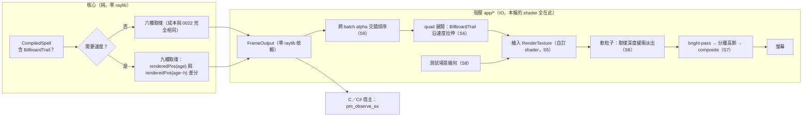

# Func-Spec 0023：產品級視覺（拖尾、軟粒子、後處理）

> 狀態：**設計定案，待實作**
> 性質：**重大基建功能** —— 本 spec **取代 ADR-0009 的「不自訂 shader」前提**並**鬆綁 ADR-0006 的六欄硬點**，交付後 `ParticleBuffer` 的九欄佈局、`pm_observe_ex` 的 C 合約、shader 資產的所在位置即凍結。同輪交付 **ADR-0018**。依 SKILL.md，本 spec 完成驗收前依賴它的 spec 不得動工。
> 前置依賴：**spec 0022（需已完成）＋ spec 0018（需已完成）**。前者：本 spec 加寬 `ParticleBuffer` 並改 `Analytic.hs` 的取樣路徑，與 0022 的平行取樣同檔且語意相依（速度欄必須納入平行等價律）；後者：本 spec 加 `pm_observe_ex` 與 `PM_SHAPE_TRAIL`，觸及 `src/ffi`＋`include`＋`.def`＋`bindings`——恰為 0018 鎖住的檔案集合。**與 spec 0019／0024 平行**（§0.2）。
> 依據：**[ADR-0009](../adr/adr-0009-dynamic-quad-mesh-rendering.md)**（其繪製路徑**保留**，其「不自訂 shader」前提**被取代**——使用者裁決 2026-08-15）、**[ADR-0006](../adr/adr-0006-soa-unboxed-buffer.md)**（六欄佈局的硬點——本輪以「加欄＋新查詢」而非「改既有簽名」的方式鬆綁）、[ADR-0013](../adr/adr-0013-billboard-vocabulary.md) **D1**（帶參數的拉伸 billboard 因 `PM_BATCH_INFO_STRIDE` 凍結而被否決——**本輪以速度欄解決同一個問題，且不動 stride**，見 §2.1）；ADR-0011 D7（header only-add）、ADR-0007（核心零 IO——shader 全部住殼層）；architecture §7「明確不做」清單、§11 第 3 列（SoA 欄位佈局硬點）、§5.2（輸出零 raylib 依賴）；[roadmap.md](../roadmap.md) §2（維度 C 產品級特效系統 50%）、§3.4（拖尾／軟粒子／後處理、跨 batch 深度交錯）；spec 0013 §8-3、0015 §8-1／§8-2／§8-3。
> 範圍：讓畫面從「看得清楚、看得出是什麼」變成**好看**。四件事：速度驅動的拖尾、bloom 後處理、軟粒子、跨 batch 深度交錯。**核心只多交出三欄速度**；shader、RenderTexture、後處理全部住 `app/*`——`FrameOutput` 仍零 raylib 依賴，庫外原則一字不動。

---

## 0. 起點：引用的凍結介面、檔案盤點

### 0.1 引用的凍結介面

| 凍結物 | 本 spec 的用法 |
|---|---|
| `ParticleBuffer` 六欄（ADR-0006、0001 凍結；architecture §11 第 3 列的硬點） | **加三欄，既有六欄的名稱、型別、順序、語意零變更**。九欄佈局交付後凍結（§2.2） |
| `pm_observe` 六欄簽名（0009 §4.4 凍結，add-only） | **一字不動**。速度走**新的** `pm_observe_ex`（§2.3）——既有 C 宿主零重編譯、零行為變更 |
| `PM_BATCH_INFO_STRIDE == 4`（0015 凍結） | **零變更**——這是 §2.1 的關鍵：拖尾的拉伸倍率來自**速度欄**而非 batch 參數，因此 ADR-0013 D1 的否決理由消失，而它保護的東西沒有被動 |
| `BillboardShape` 的建構子宣告序 ＝ `PM_SHAPE_*` wire code（0015 S3 凍結，`fromEnum` 自動導出） | 尾端加 `BillboardTrail`（wire 4）。既有四個位置不動 |
| `StyleRune`＋`"style"` JSON tag 與名稱表（0015 凍結） | 加一個名稱 `"trail"`；`docs/spell-schema.md` 同步（0014 的 `SchemaDocSpec` 強制） |
| ADR-0009 的**動態 quad mesh 繪製路徑**（`c'` 指標 API、draw call 數＝batch 數） | **保留**。本輪取代的只有「不自訂 shader」那條前提——mesh 上傳與繪製結構不變，只是繫結一個自訂 shader 而非預設 shader |
| `Magic.Columns.fromColumns`（0011 凍結，六欄） | 加 `fromColumnsWithVelocity`（九欄）。六欄版**簽名不變**——`pm_depth_order` 等既有消費者零受擾 |
| 0022 的平行取樣等價律（律 2） | **速度欄必須納入該律**：平行 ≡ 單執行緒，九欄逐位元（§2.4） |
| 0013 的 `App.Render.Order.viewOrder`、`App.Camera`；0015 的程序生成貼圖 | 跨 batch 交錯（S9）改寫前者的呼叫結構；後者的貼圖成為自訂 shader 的 diffuse 輸入 |
| `App` 效果層的 bracket 慣例（0005） | shader／RenderTexture 的生命週期沿用同一個 bracket 模式（§2.5） |

### 0.2 檔案盤點（與 0019／0024 的三方零交集證明）

**新增（11）**：`assets/shaders/particle.vs`／`particle.fs`／`bright.fs`／`blur.fs`／`composite.fs`、`app/App/Render/Shader.hs`、`app/App/Render/Post.hs`、`app/App/Scene.hs`（軟粒子的測試場景幾何，§2.6）、`docs/adr/adr-0018-custom-shader-and-columns.md`、`assets/spells/comet-trail.json`，＋九個測試模組（見 §6）。

**修改（12）**：

| 檔案 | 變更 |
|---|---|
| `src/core/Magic/Particle/Buffer.hs` | +`pbVelX/Y/Z` 三欄＋`bufferInvariant` 的 opt-in 條款（S1） |
| `src/core/Magic/Particle/Analytic.hs` | 速度的有限差分計算＋opt-in 跳過（S2） |
| `src/core/Magic/Rune.hs` | `BillboardShape` +`BillboardTrail`（S3） |
| `src/core/Magic/Compile.hs` | 拖尾 opt-in 偵測（有無 `BillboardTrail` 決定是否算速度）（S2／S3） |
| `src/boundary/Magic/Interface.hs` | 九欄的唯讀匯出（S1） |
| `src/boundary/Magic/Columns.hs` | +`fromColumnsWithVelocity`（S4） |
| `src/boundary/Magic/Codec.hs` | `"trail"` 名稱（S3） |
| `src/ffi/Magic/FFI.hs`／`include/particle_magic.h`／`particle-magic-ffi.def`／`bindings/csharp/ParticleMagic.cs` | `pm_observe_ex`＋`PM_SHAPE_TRAIL 4`（S4） |
| `app/App/Render/{Quads,Raylib3D,Order,Sprite}.hs`、`app/App/Effects.hs`、`app/App/Loop.hs`、`app/App/TestInterp.hs` | shader 管線、拖尾 quad、bloom、軟粒子、跨 batch 排序（S5–S9） |
| `docs/spell-schema.md` | `"trail"` 鍵名（`SchemaDocSpec` 強制） |
| `test/{FFIContractSpec,BindingContractSpec,ShapeVocabSpec,BufferSpec,ColumnsSpec}.hs` | 新進入點／新 wire code／九欄的既有斷言加法 |

**共用（行級聯集合併）**：`particle-magic.cabal`、`SKILL.md`、`docs/roadmap.md`、`CHANGELOG.md`、`docs/architecture.md`（§7／§11 的修訂，見 §7）。

**三方交集**：0019 觸 `.github/`＋README＋`docs/release.md`＋cabal metadata 兩行——與本清單**交集 = ∅**，可平行。0024 分兩半：`tools/` 半場與本清單**交集 = ∅**（可平行認領）；**`app/` 半場（demo 參數面板）觸 `app/App/{Main,Loop,Hud,Effects,TestInterp}.hs`，與本 spec 的 S5–S9 相交，故 0024 的該半場動工門檻＝本 spec 驗收**（見 0024 §0.3）。

---

## 1. 目標與完成定義

**目標**：roadmap 維度 C（產品級特效系統）目前 50%，欠的是「無拖尾／軟粒子／後處理」。0013 解決了「看得清楚」，0015 解決了「看的是什麼」，本輪解決**「好不好看」**。

**完成定義**：

1. **既有宿主零受擾律**：`pm_observe`（六欄）的行為逐位元不變；既有 C／C# 宿主不重編譯即可繼續運作；既有 13 個範例陣（無 `trail` 樣式者）的六欄輸出逐位元不變（S1／S4／S10）。
2. `ParticleBuffer` 九欄，速度欄為 **opt-in**：無拖尾的魔法其速度欄為空向量，取樣成本與加寬前**完全相同**（結構性跳過，比照 ADR-0010 D9 的零場快路徑）（S1／S2）。
3. 速度以**固定步長有限差分**定義並凍結（§2.4）：確定性、含力場位移的貢獻、與 0022 的平行等價律相容（九欄逐位元）（S2）。
4. `BillboardTrail`（wire code 4）＋`"trail"` 樣式名；拉伸倍率**完全由速度欄導出**，`PM_BATCH_INFO_STRIDE` 零變更（S3）。
5. `pm_observe_ex` 交付：九欄 copy-out，錯誤協定與 all-or-nothing 語意與 `pm_observe` 逐條相同（S4）。
6. 自訂 shader 管線落地於 `app/*`：GLSL 資產、RenderTexture、bracket 生命週期；**`FrameOutput` 仍零 raylib 依賴**（S5）。
7. 拖尾、bloom、軟粒子三者各自可獨立開關，headless 解譯器可觀測（S6／S7／S8）。
8. 跨 batch 深度交錯：alpha batch 的粒子跨批合併排序後再拆回，繪製順序正確（S9）。
9. **ADR-0018** 交付：取代 ADR-0009 的前提、鬆綁 ADR-0006 的硬點、shader 的所在位置與庫外原則的關係、被否決的方案（S10）。

## 2. 使用到的架構與技巧

### 2.1 速度欄讓 ADR-0013 D1 的否決理由消失

0015 想做拉伸 billboard，被 `PM_BATCH_INFO_STRIDE`（凍結為 4）擋下——拉伸倍率是 per-batch 參數，而 batch 描述沒有第五個欄位可放。ADR-0013 D1 記錄了兩個備案，都要動 wire 佈局。

本輪的解法**繞開了整個問題**：拖尾的拉伸方向與長度是**逐粒子**的，來自那顆粒子自己的速度。它根本不是 per-batch 參數。所以：

- `BillboardTrail` 是**無參數**建構子，完全符合 0015 凍結的「`BillboardShape` 永遠無參數」裁決；
- `PM_BATCH_INFO_STRIDE` 保持 4；
- 拉伸資訊走**已經要加的**速度欄，不需要第二個機制。

這是一個「等對的資料到位，原本擋路的約束就不再是約束」的例子。ADR-0018 記錄這條推理，因為它同時解釋了為什麼 0015 當時不做是對的。

### 2.2 加欄的代價，與為什麼付得起

architecture §11 第 3 列把 SoA 欄位佈局列為硬點：「欄位被熱路徑、FFI 傳遞、渲染後端三方依賴；加欄位＝三處同步改」。本輪逐處處理：

| 依賴方 | 影響 | 緩解 |
|---|---|---|
| 熱路徑（`sample`） | 每幀多三次 exact-size 配置與填寫 | **opt-in**：無拖尾的魔法速度欄為空向量，成本完全不變（§2.4） |
| FFI 傳遞 | `pm_observe` 的六欄簽名不能改 | **新增 `pm_observe_ex`**，六欄版一字不動（§2.3） |
| 渲染後端 | quad 展開要讀速度 | 只有 `BillboardTrail` 的 batch 讀；其餘走既有路徑 |

九欄佈局交付後凍結，且 `bufferInvariant` 增加一條：**每個速度欄的長度要嘛是 0（未計算），要嘛等於 `pbCount`**。這條讓「opt-in」是型別附近的不變量，而不是散在各處的 `if`。

### 2.3 `pm_observe_ex`：add-only 規則的第二次實戰

ADR-0011 D7 的「只加不改」在 0012 的上限提升時被檢驗過一次（header 零字元變更）。本輪是第二次，形式不同：這次真的要送新資料出去，而既有簽名放不下。

規則給的答案很清楚——**加一個新函數，不動舊的**：

```c
int pm_observe_ex(PmSpell* spell,
                  float* pos_x, float* pos_y, float* pos_z,
                  float* size, float* life, uint32_t* color,
                  float* vel_x, float* vel_y, float* vel_z,   /* 可為 NULL */
                  int capacity, int* batch_info, int max_batches);
```

三個速度指標**可為 `NULL`**——宿主不要拖尾就傳 `NULL`，行為與 `pm_observe` 逐位元相同。而 `pm_observe` 本身在實作上降級為「`vel_* = NULL` 的 `pm_observe_ex`」，兩者共用同一段 copy-out（0018 S3 已把它抽成私有函數——**那次重構在此收到第二次紅利**）。

若魔法沒有拖尾（速度欄為空）而宿主傳了非 NULL 的速度指標：寫入全零，而非報錯。理由：宿主不該為了「這個法術剛好沒拖尾」而改變呼叫形狀。

### 2.4 速度的定義（凍結）

解析式模型下，粒子位置是年齡的閉式函數，但**不是所有軌跡都有便宜的符號導數**（`FormulaRune` 是玩家寫的 `Expr`，符號微分要新增一整個 `Expr` 遍歷）。因此速度以**有限差分**定義並凍結：

```
vel(i) = (renderedPos(age) − renderedPos(age − h)) / h,   h = 1/240 秒（固定）
```

四個要點：

1. **`renderedPos` 而非 `analyticPos`**：差分作用在「解析位置＋力場位移」的**和**上，所以帶場魔法的拖尾會跟著場彎——這是正確的視覺，也讓速度與宿主實際看到的位置一致。
2. **`h` 是凍結常數**，不是 `dt`。若用 `dt`，同一個法術在不同幀率下拖尾長度不同——違反決定論的精神（ADR-0007）與固定時步公理（architecture §11）。
3. **`age − h < 0` 時**（粒子剛出生）取 `age = 0` 的單邊差分，避免負年齡進入取樣器。
4. **與 0022 的平行等價律相容**：差分是逐粒子的純函數，不跨粒子、不歸約——0022 §2.4 的四點論證逐條仍成立，只是每個分片多算一組值。**律 2 因此擴充為九欄逐位元，而不是被削弱。**

符號微分列為非目標（§8-2）。

### 2.5 shader 住在殼層，庫外原則一字不動

ADR-0009 的「不自訂 shader」被取代，但**它保護的東西不是「沒有 shader」，是「渲染細節不進庫」**。本輪嚴格維持後者：

- GLSL 檔案在 `assets/shaders/`，由 `app/App/Render/Shader.hs` 載入，生命週期走 0005 的 bracket 慣例（`beginDrawing`/`endDrawing` 同款配對）。
- `FrameOutput`／`RenderBatch`／`ParticleBuffer` **零 raylib 依賴**（architecture §5.2 不變）——它們多了三欄浮點數，沒有多任何渲染概念。
- C ABI 宿主拿到九欄之後要不要做拖尾、bloom、軟粒子，**完全是宿主的事**；庫不提供 shader，也不假設宿主用哪個圖形 API。

一句話：**本輪加的是資料，不是渲染。** demo 裡的 shader 是參考實作，與 `examples/unity/SpellRenderer.cs` 同一個定位。

### 2.6 軟粒子需要場景幾何——這是本輪發現的一個前提缺口

軟粒子的作法是：取樣深度緩衝，當粒子距離場景幾何很近時淡出，消除 billboard 穿插實體表面的硬邊。

**但 demo 目前不畫任何實體幾何**——它只畫粒子。沒有東西可以「穿插」，軟粒子就沒有可見效果，也無從驗證它是否正確。

因此本輪必須連帶交付一個最小的測試場景（`app/App/Scene.hs`）：一片地面加兩三個方塊，可開關。它的定位是**驗證台**而非美術——比照 0008 用俯視把深度重疊問題「暴露出來」的作法。沒有它，S8 就只能宣稱而不能驗收。

這個缺口沒有出現在任何既有 spec 的記帳裡，是本輪設計時發現的，記在此處供盤點採信。

### 2.7 跨 batch 深度交錯（S9）

0015 §8-3 記帳：「分批之後這件事的誘因變大，但它需要的是把所有 batch 的粒子併排再依序拆回」。加上 bloom 與拖尾之後誘因更大——alpha 拖尾與 alpha 光點若各自排序、批間不交錯，遠處的拖尾會蓋住近處的光點。

作法（全部在 `app/*` staging 層，核心零觸碰）：收集所有 `BlendAlpha` batch 的粒子 → 併成一個索引清單 → 以 0013 的 `viewOrder` 一次排序 → 依 `(batch, 原索引)` 拆回各 batch 的繪製順序。additive batch 不參與（可交換，無需排序，ADR-0009 的既有立場）。

代價是一次跨批排序取代 N 次批內排序——**總元素數相同**，而 0010 S5 的 in-place introsort 可直接套用（0013 §8-6 已預告這條路）。

## 3. ADT／C API

```haskell
-- src/core/Magic/Particle/Buffer.hs（九欄；交付後凍結）
data ParticleBuffer = ParticleBuffer
  { pbPosX, pbPosY, pbPosZ :: !(U.Vector Float)
  , pbSize, pbLife         :: !(U.Vector Float)
  , pbColor                :: !(U.Vector Word32)
  , pbVelX, pbVelY, pbVelZ :: !(U.Vector Float)   -- 新（0023）：空 = 未計算
  , pbCount                :: !Int
  }
-- 不變量（bufferInvariant 加一條）：
--   每個 pbVel* 的長度 ∈ {0, pbCount}，且三欄同時為 0 或同時為 pbCount。

-- src/core/Magic/Rune.hs（尾端加法）
data BillboardShape
  = BillboardSquare | BillboardSoftDot | BillboardRing | BillboardSpark
  | BillboardTrail                        -- 新（wire 4）：沿速度拉伸
  deriving (Eq, Show, Enum, Bounded)

-- src/boundary/Magic/Columns.hs（加法；六欄版簽名不變）
fromColumnsWithVelocity
  :: U.Vector Float -> U.Vector Float -> U.Vector Float   -- pos
  -> U.Vector Float -> U.Vector Float -> U.Vector Word32  -- size/life/color
  -> U.Vector Float -> U.Vector Float -> U.Vector Float   -- vel（可為空）
  -> Either ColumnError ParticleBuffer

-- src/core/Magic/Particle/Analytic.hs
velocityStep :: Double        -- ^ 凍結：1/240（§2.4）
```

```c
/* include/particle_magic.h（add-only） */
#define PM_SHAPE_TRAIL 4   /* 沿速度拉伸；拉伸量由 pm_observe_ex 的速度欄導出 */

int pm_observe_ex(PmSpell* spell,
                  float* pos_x, float* pos_y, float* pos_z,
                  float* size, float* life, uint32_t* color,
                  float* vel_x, float* vel_y, float* vel_z,
                  int capacity, int* batch_info, int max_batches);
/* 與 pm_observe 相同的批次語意與 all-or-nothing 錯誤路徑。三個速度指標
   可為 NULL（等同 pm_observe）；魔法無拖尾時速度欄填 0。 */
```

## 4. 資料流



## 5. 搭建方式（風險優先）

1. **S1 九欄與不變量**——加欄是 architecture §11 的硬點，先把 opt-in 條款釘成不變量，後面每一步才有安全網。
2. **S2 速度計算**——定義凍結、與 0022 平行律的相容性在此證成。
3. **S3 `BillboardTrail`＋樣式名**——小，但要先於 FFI（wire code 由它決定）。
4. **S4 `pm_observe_ex`＋C 合約**——add-only 的第二次實戰；`FFIContractSpec`／`BindingContractSpec` 自動要求四份文本同步。
5. **S5 shader 管線基礎建設**——**本輪的技術風險最高點**（h-raylib 的自訂 shader ＋ RenderTexture ＋ 深度紋理取樣路徑是否可用，比照 0005 S0 與 0015 S0 的 spike 作法：先做一個最小 spike 確證，不通則 §8-9 的退場方案生效）。
6. **S6 拖尾** → **S7 bloom** → **S8 軟粒子＋測試場景**——依賴 S5，且視覺收益遞減、風險遞增（軟粒子最依賴深度紋理路徑）。
7. **S9 跨 batch 交錯**——獨立於 shader，可與 S6–S8 併行。
8. **S10 端到端＋ADR-0018**。

## 6. Todo List 與 1-to-1 測試對應

| # | Todo | 測試 |
|---|---|---|
| S1 | `ParticleBuffer` +`pbVelX/Y/Z`＋`bufferInvariant` 的 opt-in 條款＋`Magic.Interface` 唯讀匯出 | `test/BufferVelocitySpec.hs`（不變量：速度欄長度 ∈ {0, `pbCount`} 且三欄同步（property）；六欄建構路徑產生的 buffer 速度欄為空；**既有 `BufferSpec` 全綠不改**——既有六欄語意零變更的見證） |
| S2 | 有限差分速度（`velocityStep = 1/240` 凍結）＋opt-in 偵測（無 `BillboardTrail` ⇒ 跳過整段） | `test/VelocitySampleSpec.hs`（差分定義的決定論；`age < h` 的單邊差分；帶場魔法的速度含場位移貢獻（見證）；**opt-in 律**：無拖尾魔法的九欄取樣輸出與六欄路徑逐位元相同且速度欄為空；**與 0022 律 2 相容**：平行 ≡ 單執行緒，九欄逐位元） |
| S3 | `BillboardShape` +`BillboardTrail`＋`"trail"` 樣式名＋`Compile` 接線 | `test/TrailVocabSpec.hs`（`fromEnum BillboardTrail == 4`；既有四個 wire code 不動；`"trail"` 的 JSON round-trip；`StyleRune "trail"` ⇒ 該發射器的 `appShape` 為 `BillboardTrail` ⇒ `compile` 開啟速度計算（見證）；`SchemaDocSpec` 連帶全綠） |
| S4 | `pm_observe_ex`＋`PM_SHAPE_TRAIL 4`＋header／`.def`／C# 綁定＋`fromColumnsWithVelocity` | `test/FFIObserveExSpec.hs`（`pm_observe_ex` 的速度指標為 NULL 時 ≡ `pm_observe` 逐位元；九欄 ≡ `observeSpell` 的九欄逐位元；無拖尾魔法 + 非 NULL 速度指標 ⇒ 填零；容量不足零寫出；**`FFIContractSpec`／`BindingContractSpec` 連帶更新後全綠**：進入點 21→22、`PM_SHAPE_*` 5 個） |
| S5 | 自訂 shader 管線：`App.Render.Shader`（載入／繫結／釋放的 bracket）、RenderTexture、五份 GLSL 資產。**含前置 spike**（h-raylib 的 shader／RenderTexture／深度紋理路徑實機確證） | `test/ShaderPipelineSpec.hs`（headless 解譯器可觀測：shader 載入與釋放成對出現（bracket 律，比照 0005）；RenderTexture 的建立／重建隨視窗 resize；shader 資產路徑存在且可讀；**零輸入零漣漪律**：全部特效關閉時的繪製指令序列 ≡ 0015 交付的既有序列） |
| S6 | 拖尾 quad 展開（沿速度方向拉伸，長度由 \|v\| 與凍結係數導出） | `test/TrailQuadSpec.hs`（速度為零 ⇒ 退化為既有正方 quad 逐位元；拉伸方向 ≡ 速度方向的投影；四頂點仍共面且順序不變（既有 quad 不變量）；拉伸長度有上界（避免高速粒子拉成整個畫面）） |
| S7 | bloom 後處理：bright-pass → 分離高斯 → composite | `test/BloomSpec.hs`（headless：三個 pass 的順序與 RenderTexture 繫結序列正確；強度為 0 時 composite ≡ 原圖（零漣漪）；解析度縮放的 pass 尺寸正確；開關切換不洩漏 RenderTexture（bracket 律）） |
| S8 | 軟粒子（深度緩衝取樣淡出）＋`App.Scene` 測試場景幾何（地面＋方塊，可開關） | `test/SoftParticleSpec.hs`（headless：深度紋理被繫結到粒子 shader；軟化距離為 0 時 ≡ 硬邊逐位元（零漣漪）；測試場景的幾何指令在粒子之前送出（深度必須先寫入）；場景關閉時軟粒子自動退化為硬邊而非黑畫面） |
| S9 | 跨 batch alpha 深度交錯（併排 → `viewOrder` 一次排序 → 拆回） | `test/CrossBatchOrderSpec.hs`（合併後的繪製順序為全體 alpha 粒子的深度非遞增序（property）；additive batch 不參與且順序不變；單一 alpha batch 時 ≡ 0013 的既有 `viewOrder` 逐位元；拆回後每個 batch 的粒子集合不變（置換律）） |
| S10 | 端到端＋`assets/spells/comet-trail.json`＋ADR-0018 | `test/Acceptance23Spec.hs`（**既有宿主零受擾律**：13 個既有範例陣的**六欄**輸出 240 幀逐位元不變；`comet-trail` 的九欄 240 幀決定論；`pm_observe` 路徑 ≡ `pm_observe_ex(NULL)` 路徑逐位元）＋**手動 smoke**：開窗目視拖尾／bloom／軟粒子三者各自開關的效果，截圖描述入 §9 |

## 7. 收尾：architecture.md 與 ADR 的修訂

本輪是唯一需要動既有決策的一輪，收尾必須明文完成（列差異給開發者確認後才改）：

1. **ADR-0009**：狀態改為部分被 ADR-0018 取代——**繪製路徑（動態 quad mesh、draw call 數＝batch 數）保留**，「不自訂 shader」前提被取代。原文不刪，加註取代關係與日期（SKILL.md 的 ADR 修訂規則）。
2. **ADR-0006**：六欄硬點鬆綁為九欄，並記錄鬆綁的**方式**（加欄＋新查詢函數，而非改既有簽名）——這是日後再加欄時的範本。
3. **architecture §7「明確不做」**：軟粒子與後處理原本不在該清單，但 ADR-0009 的前提實質禁止了它們；本輪之後要改寫。**GPU compute／粒子間碰撞／空間分割仍是永久非目標**，不因本輪而鬆動。
4. **architecture §11 第 3 列**（SoA 欄位佈局硬點）：註記本輪的鬆綁方式與其代價實測。
5. **architecture §4.5／§5.2**：`ParticleBuffer` 的欄位清單更新為九欄；§5.2「輸出不含任何 raylib 型別」的保證**維持不變**並強調（本輪加的是資料不是渲染）。

## 8. 非目標

1. **速度以外的新欄位**（旋轉角、per-particle 自訂資料、粒子 ID）——九欄佈局交付即凍結。每一欄都要付 §2.2 那張表的三處代價，不能因為「這次加過了」就變便宜。
2. **`Expr` 的符號微分**——速度用有限差分（§2.4）。符號微分要新增一整個 `Expr` 遍歷、處理 `Chan`（不可微）與 `floor`／`sign`（不連續），收益只是省下一次取樣。
3. **真正的歷史軌跡拖尾**（保存前 N 幀位置的 ribbon）——需要跨幀狀態，而系統目前唯一的跨幀狀態是 `FieldState`（0007）。速度拉伸是解析式模型下的正確作法；ribbon 屬於另一種模型。
4. **粒子間光照／陰影／體積散射**——需要空間查詢，architecture §7 的永久非目標。
5. **HDR 管線與色調映射**——bloom 在 LDR 下做。真 HDR 要換整條 RenderTexture 格式與色彩管理，另輪。
6. **shader 的作者可寫**（玩家在 JSON 裡寫 GLSL）——會把 GPU API 帶進輸入合約，直接破壞 ADR-0005 的可攜性與 §2.5 的庫外原則。**永久非目標**。
7. **Unity／C 宿主端的拖尾參考實作**——本輪只把速度欄送出去並更新 C# 綁定的宣告；`SpellRenderer.cs` 的拖尾網格生成等實際宿主需求（比照 0018 §8-9 對場景元件的處理）。
8. **`App.Scene` 的美術化**——它是軟粒子的驗證台（§2.6），不是遊戲場景。
9. **退場方案**：若 S5 的 spike 顯示 h-raylib 的自訂 shader 或深度紋理路徑不可用，則本輪縮為 S1–S4＋S6＋S9（拖尾與跨批排序，皆不需 shader），bloom 與軟粒子退回記帳並在 ADR-0018 中記錄失敗的技術原因。**ADR-0009 的前提在該情況下不被取代**——沒做成的事不改決策。

## 9. 驗收紀錄

（實作時回填：日期、環境；S5 spike 的結果與是否啟用退場方案；`cabal test` 結果；加欄的實測代價（有拖尾／無拖尾兩種魔法的每幀成本對照，證明 opt-in 確實免費）；拖尾／bloom／軟粒子的手動 smoke 截圖描述；凍結清單：九欄佈局、`velocityStep`、`pm_observe_ex` 簽名、`PM_SHAPE_TRAIL`、shader 資產位置；ADR-0009／ADR-0006 的修訂實際措辭；與計畫的差異。）
