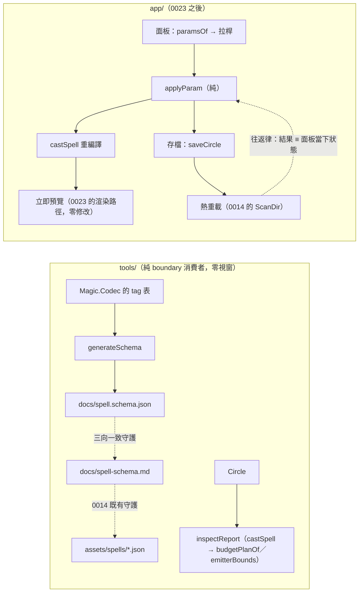

# Func-Spec 0024：作者工具第二輪（機器可讀 schema、檢視器、即時參數面板）

> 狀態：**設計定案，待實作**
> 性質：一般 —— 交付後凍結 `magic-schema`／`magic-inspect` 的命令列介面與輸出格式（工具的使用者是人與腳本，格式即合約——0014 §9.3 立下的慣例），以及 JSON Schema 的產生規則。
> 前置依賴：**spec 0023（需已完成）**——本 spec 的 S4／S5（demo 視窗內的參數面板）觸 `app/App/{Main,Loop,Hud,Effects,TestInterp}.hs`，與 0023 的 shader／後處理／排序改動同檔，依 SKILL.md 規則 4 不得平行。**S1–S3（`tools/` 半場）前置依賴為無**，可在 0023 之前先行分割認領（§0.3 的分割條款）。**與 spec 0019 平行**。
> 依據：[roadmap.md](../roadmap.md) §3.5（「視覺化編輯器／即時預覽 UI」「JSON Schema（draft-07 等機器格式）輸出」兩條未落地）、§2 作者流程維度 55%；spec 0014 **§8-1**（「等有非工程作者為止」）、**§8-3**（「等外部工具鏈需求」）、§9.2（**手動 smoke 的必要性**——本輪 S5 的往返直接繼承這個教訓）；ADR-0005（JSON 是輸入介面，工具是它的配套）；0010 §9.3（`budgetPlanOf`／`emitterBounds`／`maxSpellParticles` 的加法匯出——`magic-inspect` 的主要素材）。
> 範圍：把作者回饋圈從「改檔 → 存檔 → 等 2 秒熱重載 → 看畫面」縮短到「拉一個數值 → 立刻看到」，並讓 JSON 檔第一次有機器可讀的形狀描述供外部工具鏈消費。**不做獨立的編輯器應用**——面板長在既有 demo 裡（§2.3 的理由）。

---

## 0. 起點

### 0.1 引用的凍結介面

| 凍結物 | 本 spec 的用法 |
|---|---|
| `Magic.Codec`：`loadCircle`／`saveCircle`／`renderLoadError`（0001 凍結） | 面板的載入與寫回；`saveCircle` 是寫回的**唯一**路徑（§2.4） |
| `Magic.Interface`：`castSpell`／`budgetPlanOf`／`budgetTotal`／`emittersOf`／`emitterBounds`／`maxSpellParticles`（0010 §9.3 凍結） | `magic-inspect` 的全部素材——它不新增任何分析，只把既有查詢排版給人看 |
| `magic-validate` 的命令列與行格式（0014 §9.3 凍結） | **只加旗標，既有輸出格式一字不動**（§2.2） |
| `docs/spell-schema.md` 的鍵名機械守護（0014 `SchemaDocSpec`） | **本輪把它變成三向一致的中繼**（§2.1）：JSON Schema ↔ 作者文件 ↔ `Magic.Codec` 的 tag |
| `ScanDir` op 與 2 秒節流輪詢（0014 S3 凍結） | 面板與熱重載共存：面板改動走記憶體內的 `Circle`，存檔後才與熱重載匯流（§2.5） |
| demo 的 HUD、輸入、headless `TestInterp`（0005／0013／0014） | 面板是 HUD 的加法；零輸入零漣漪律沿用 0013 的慣例 |
| 0023 的 shader 管線與後處理（其 §9 凍結面） | **唯讀**：面板不改渲染，只改被渲染的 `Circle` |

### 0.2 檔案盤點

**新增（8）**：`tools/Schema.hs`、`tools/Inspect.hs`、`tools/SchemaMain.hs`、`tools/InspectMain.hs`、`app/App/Panel.hs`、`test/JsonSchemaSpec.hs`、`test/InspectSpec.hs`、`test/ValidateJsonSpec.hs`、`test/ParamPanelSpec.hs`、`test/PanelWriteBackSpec.hs`、`test/Acceptance24Spec.hs`、`docs/spell.schema.json`（產生物，入 repo 供外部工具鏈直接取用）。

**修改（7）**：

| 檔案 | 變更 |
|---|---|
| `tools/Validate.hs`／`tools/Main.hs` | +`--schema`／`--json` 兩個旗標（既有輸出零變更，§2.2） |
| `app/App/Main.hs`／`Loop.hs`／`Hud.hs`／`Effects.hs`／`TestInterp.hs` | 參數面板的輸入、狀態、繪製與 headless 對應（S4／S5） |
| `docs/spell-schema.md` | 補「機器可讀 schema 在哪」一節 |
| `particle-magic.cabal` | +2 executable stanza、test other-modules +6 |

**明文不碰**：`src/*` 全部（**核心／boundary／FFI 零觸碰**——本輪一行語意都不加）、`include/*`、`bindings/*`、`examples/*`、`assets/spells/*` 的既有內容、`bench/*`。

**與 0019 的交集**：0019 觸 `.github/`＋README＋`docs/release.md`＋cabal 的 `version:`／`tested-with:`。與本清單逐檔比對：**交集 = ∅**（cabal 同檔異行）。

### 0.3 分割條款：`tools/` 半場可提前動工

本 spec 的兩半在檔案上完全不相交：

- **S1–S3（`tools/` 半場）**：只觸 `tools/`、`docs/`、cabal 的 executable stanza。與 **0020／0021／0022／0023 全部零交集**，前置依賴為無——可由另一個 session 在 0023 之前先行認領，只要它不碰 S4／S5。
- **S4–S6（`app/` 半場）**：觸 `app/*` 五檔，與 0023 的 S5–S9 同檔，**動工門檻＝0023 驗收**。

若採分割，兩半各自獨立驗收，本文件的 §7 表格逐項標記完成者與日期。**這是本專案第一次在單一 spec 內做水平分割**，理由是兩半的作者面價值可以獨立交付（schema 對外部工具鏈有用，與面板無關），且分割線恰好落在既有的 `tools/` ↔ `app/` 邊界上。

> **對前序 spec 檔案盤點的更正**：0021 §0.2、0022 §0.2、0023 §0.2 曾記載「0024 觸 `tools/`＋新 exe＋`docs/`（明文避開 `app/*`）」。設計本 spec 時確認**面板必須長在既有 demo 裡**（§2.3），故 S4–S6 確實觸 `app/*`。三份 spec 的該行以本條為準：**0024 的 `tools/` 半場與它們零交集（宣稱成立）；`app/` 半場排在 0023 之後**。0021／0022 與 0024 的 `app/` 半場亦不相交於時間（0021 → 0022 → 0023 → 0024 的鏈序）。

---

## 1. 目標與完成定義

**目標**：roadmap 的作者流程維度停在 55%，欠的兩條是「無視覺化編輯器／即時預覽」與「無機器可讀 JSON Schema」。0014 當時的裁決是「等有非工程作者」與「等外部工具鏈需求」——那個等待現在結束，因為語彙已經大到手寫 JSON 開始痛：0021 之後有 9 種元素、8 種形狀、8 種軌跡、6 種力場、5 種 billboard 形態，外加 phases／fields／style／sigil 的互動。**值域擴張本身就是需求。**

**完成定義**：

1. `docs/spell.schema.json` 為合法的 JSON Schema draft-07，能驗證全部範例陣通過、能拒絕已知的壞檔（S1）。
2. **三向一致律**：schema 的列舉值 ≡ `docs/spell-schema.md` 的鍵名 ≡ `Magic.Codec` 接受的 tag。任一處新增而其餘未跟上即測試紅（S1）。
3. `magic-inspect <spell.json>` 輸出人類可讀的結構報告：相位時間軸、逐發射器表（粒子數、包絡、`emitterBounds`）、預算分解、樣式與 blend 分佈。**零新分析**——全部來自既有匯出（S2）。
4. `magic-validate --json` 輸出機器可讀的驗證報告（供編輯器與 CI 消費）；**既有的人類可讀輸出與 exit code 語意一字不變**（S3）。
5. demo 內參數面板：選中的魔法陣可即時調整數值型參數，**每次調整立即重編譯並套用**，無需存檔（S4）。
6. **寫回往返律**：面板的編輯結果經 `saveCircle` 寫回檔案後，`loadCircle` 得到的 `Circle` 與面板當下的 `Circle` **相等**（S5）。
7. 手動 smoke：拉動參數看到粒子立刻改變、存檔後熱重載不產生第二次跳變（S6）。

## 2. 使用到的架構與技巧

### 2.1 三向一致：把 0014 的守護變成中繼

0014 已經讓 `docs/spell-schema.md` 的鍵名被 `SchemaDocSpec` 釘在範例 JSON 上。本輪加入第三份文本（`spell.schema.json`），並**不建立第三套對照表**——而是讓新測試斷言「schema 的列舉值集合 ≡ 作者文件的鍵名集合」。加上 0014 既有的「作者文件 ≡ 範例 JSON 的鍵名」與 Codec 的 round-trip property，三者傳遞成立。

這是本專案第六次使用文字合約守護（`BoundarySpec` → `FFIContractSpec` → `BindingContractSpec` → `SchemaDocSpec` → 0019 的 `CIWorkflowSpec` → 本輪）。慣例已經穩固到可以直接說：**這個專案裡，任何兩份必須一致的文本，都要有一個讀兩邊的測試。**

`spell.schema.json` **入 repo 而非只由指令產生**：外部工具鏈（編輯器的 JSON 智慧提示、CI 的 schema 驗證）要的是一個可以直接 URL 引用的檔案。產生器 `magic-schema` 的職責是「產生並與 repo 內的檔案比對」，差異即測試紅——與 golden 檔同一個模式。

### 2.2 `magic-validate` 只加旗標

0014 把 `magic-validate` 的命令列與行格式凍結成合約（使用者是人與腳本）。本輪要的機器可讀輸出因此**不能改既有輸出**，只能加 `--json` 旗標。exit code 語意（＝失敗檔數）一字不動——0019 的 CI 依賴它。

### 2.3 面板長在 demo 裡，不做獨立編輯器

獨立編輯器要自己有視窗、渲染、相機、熱重載、spell 清單——而 demo 已經有這五樣（0005／0013／0014）。再寫一個是把 `app/*` 複製一份，然後兩份各自腐化。

代價是本 spec 的 `app/` 半場必須排在 0023 之後（同檔）。這個代價可接受，因為 0024 本來就在鏈的最後；而且面板要預覽的東西，**正好包含 0023 交付的拖尾與後處理**——先有畫面再有調參面板，順序是對的。

### 2.4 寫回走 `saveCircle`，不做文字層編輯

面板的寫回**不**嘗試保留作者原檔的格式、鍵序或空白，而是直接 `saveCircle` 產生正規形式。理由：文字層的最小差異編輯需要一個保留佈局的 JSON 剖析器（`Magic.Codec` 沒有，加一個是新的相依與新的錯誤面），而它換來的東西——「diff 好看」——在 POC 階段不值那個複雜度。

因此律是**語意往返**（`loadCircle . saveCircle ≡ id`，0001 已有的 property）而非位元組保存。這件事必須寫進面板的 UI 提示（存檔會重排檔案），否則作者會以為工具弄壞了他的檔案。位元組保存列為非目標（§8-3）。

### 2.5 面板與熱重載的匯流

兩者都會改變「當前的 `Circle`」，必須定義誰贏：

| 事件 | 行為 |
|---|---|
| 面板調參 | 記憶體內的 `Circle` 立即改變並重編譯；**檔案不動** |
| 面板存檔 | `saveCircle` 寫檔。熱重載隨後偵測到檔案變動並重載——**重載結果必須與面板當下狀態相同**（往返律，S5），所以作者看不到跳變 |
| 檔案被外部改動（編輯器、git） | 熱重載照舊生效，**面板的未存檔編輯被丟棄**並在 HUD 明示 |
| 面板有未存檔編輯時切換魔法陣 | 明示丟棄（不做自動存檔——自動寫作者的檔案是危險的預設） |

第二列是 0014 §9.2 那個教訓的直接繼承：**「IO 端產生、純端比較相等」的地方都要有打真檔案系統的守護測試**。S5 的測試因此必須真的寫檔再讀回，而不是在記憶體裡模擬。

### 2.6 面板只調數值，不改結構

面板可調的是**已存在槽位的數值型參數**（半徑、速度、強度、頻率、包絡秒數、`essPower`…），**不能**增刪槽位、不能改符文種類、不能編輯 `Expr` 字串。

理由是回饋圈的價值集中在「這個數字該多大」，而那正是手寫 JSON 最痛的部分；而結構編輯需要完整的樹狀 UI 與合法性即時驗證，那是真正的編輯器，屬另一輪（§8-1）。這條界線讓面板的狀態模型退化成「一張 (路徑, Double) 的表」——小到可以完全被 headless 測試覆蓋。

## 3. 介面

```haskell
-- tools/Schema.hs（新；交付後凍結產生規則）
-- | 由 Codec 接受的 tag 與參數表產生 JSON Schema draft-07。
generateSchema :: BS.ByteString

-- tools/Inspect.hs（新；交付後凍結輸出格式）
-- | 一份魔法陣的結構報告（純函數：Circle → 報告行）。
inspectReport :: Circle -> Either CompileError [String]

-- app/App/Panel.hs（新）
-- | 面板可調的參數：一條路徑（用於寫回）與其當前值域。
data ParamPath           -- 指向 Circle 內某個數值欄位
data ParamSpec = ParamSpec { psPath :: !ParamPath, psLabel :: !String
                           , psMin, psMax, psValue :: !Double }
paramsOf   :: Circle -> [ParamSpec]          -- 純：列舉可調參數
applyParam :: ParamPath -> Double -> Circle -> Circle   -- 純：套用
```

```
$ magic-schema                       # 印出 schema 到 stdout
$ magic-schema --check <file>        # 與 repo 內檔案比對，差異即 exit 1
$ magic-inspect assets/spells/x.json # 結構報告
$ magic-validate --json <files...>   # 機器可讀驗證報告（既有輸出不變）
```

## 4. 資料流



## 5. 搭建方式（風險優先）

1. **S1 schema 產生器＋三向一致守護**——`tools/` 半場的地基，且可完全獨立於其他一切完成。
2. **S2 `magic-inspect`**、**S3 `--json`**——同為 `tools/`，彼此獨立。
3. **S4 面板狀態模型與純函數**（`paramsOf`／`applyParam`）——先做純的那半，headless 全覆蓋。
4. **S5 寫回與熱重載匯流**——0014 §9.2 教訓的所在地，必須打真檔案系統。
5. **S6 端到端＋手動 smoke**。

## 6. Todo List 與 1-to-1 測試對應

| # | Todo | 測試 | 半場 |
|---|---|---|---|
| S1 | `tools/Schema.hs`＋`magic-schema` exe＋`docs/spell.schema.json` | `test/JsonSchemaSpec.hs`（產生物 ≡ repo 內檔案（golden 模式）；**三向一致律**：schema 列舉值 ≡ `docs/spell-schema.md` 鍵名（雙向集合相等）；全部範例陣通過 schema 驗證；已知壞檔被 schema 拒絕（見證）；schema 本身為合法 draft-07） | `tools/` |
| S2 | `tools/Inspect.hs`＋`magic-inspect` exe（相位時間軸、逐發射器表、預算分解、樣式／blend 分佈） | `test/InspectSpec.hs`（`inspectReport` 為純函數且決定論；報告的預算總和 ≡ `budgetTotal . budgetPlanOf`；發射器列數 ≡ `V.length . emittersOf`；編譯失敗時回 `Left` 而非部分報告；輸出格式的哨兵行（格式即合約，0014 慣例）） | `tools/` |
| S3 | `magic-validate --json` 機器可讀報告 | `test/ValidateJsonSpec.hs`（**既有輸出零變更律**：無 `--json` 時逐位元 ≡ 0014 交付的格式；`--json` 輸出為合法 JSON 且逐檔含 path／ok／error；exit code 語意不變（＝失敗檔數）；`--json` 與人類可讀輸出的成敗判定完全一致（property）） | `tools/` |
| S4 | `app/App/Panel.hs` 的純半場（`paramsOf`／`applyParam`／`ParamPath`）＋面板輸入與 HUD 繪製 | `test/ParamPanelSpec.hs`（`applyParam p v . applyParam p v' ≡ applyParam p v`（冪等／覆寫）；`paramsOf` 只列出存在的槽位（空 `Circle` ⇒ 空清單）；`applyParam` 不改變 `Circle` 的結構（槽位佔用集合不變，property）；值域夾制；**零輸入零漣漪律**：面板未開啟時繪製指令序列 ≡ 0023 交付的既有序列） | `app/` |
| S5 | 存檔寫回與熱重載匯流（§2.5 的四列行為） | `test/PanelWriteBackSpec.hs`（**往返律，打真檔案系統**：面板編輯 → `saveCircle` 寫實體檔 → 熱重載讀回 ⇒ `Circle` 相等；外部改檔時未存檔編輯被丟棄且 HUD 有提示（headless 可觀測）；切換魔法陣時不自動存檔（見證）；寫檔失敗時不損毀原檔） | `app/` |
| S6 | 端到端＋手動 smoke | `test/Acceptance24Spec.hs`（`magic-schema --check` 對 repo 現況 exit 0；`magic-inspect` 對全部範例陣 exit 0；`magic-validate --json` 對全部範例陣 exit 0；面板編輯序列的 240 幀決定論）＋**手動 smoke**：開窗拉動參數看粒子即時改變、存檔後**不出現第二次跳變**（§2.5 第二列的人眼確認），描述入 §9 | `app/` |

## 7. 非目標

1. **結構編輯**（增刪槽位、換符文種類、編輯 `Expr` 字串、視覺化拖曳魔法陣）——§2.6 的界線。那是真正的編輯器，需要樹狀 UI、即時合法性驗證與復原堆疊。本輪的面板是「調數值」，不是「編魔法」。
2. **獨立的編輯器應用**——§2.3。
3. **寫回時保留原檔格式／鍵序／空白**——§2.4；律是語意往返而非位元組保存。
4. **復原／重做堆疊**——面板的每次調整都立即生效且無歷史。作者的復原機制是「不存檔」與 git。
5. **schema 的自動產生自 Haskell 型別**（Generic／TH 導出）——產生器是一張明文的宣告表，理由與 0011 的 C# 常數守護相同：**明文表＋雙向守護**比反射導出更容易看懂，且新增 tag 時漏掉會被當場抓到。TH 會把「漏掉」變成「靜默正確」，反而失去守護。
6. **編輯器的 LSP／IDE 整合**——`spell.schema.json` 入 repo 已足以讓 VS Code 等編輯器自動提供補全；再往上是外部工具鏈的事。
7. **非工程作者的完整流程**（素材庫、預設集、範本精靈）——0014 §8-1 的原始理由仍部分成立：本輪服務的是**寫 JSON 的人**（含工程作者），把最痛的「調數字」解掉；完整的非工程作者流程仍未到需求。
8. **面板參數的動畫／關鍵影格**——那是時間軸編輯，另一個維度。

## 8. 驗收紀錄

（實作時回填：日期、是否採用 §0.3 的水平分割與兩半各自的完成日；`cabal test` 結果；面板手動 smoke 的描述，特別是**存檔後有無第二次跳變**；`docs/spell.schema.json` 的最終大小與涵蓋的 tag 數；凍結清單：`magic-schema`／`magic-inspect` 的命令列與輸出格式、schema 產生規則、往返律；與計畫的差異。）
