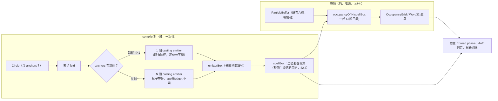

# Func-Spec 0025：空間資訊輸出與多發動點

> 狀態：**設計定案，待實作**
> 性質：**重大基建功能** —— 本 spec 定義系統對外的**第三種輸出**（前兩種是 `RenderBatch` 與錯誤）：空間摘要。`OrientedBox`／`OccupancyGrid` 的語意、格網的索引序與框的決定方式、`"anchors"` 的 JSON 形狀交付即凍結，且它們是未來碰撞偵測、AoE 判定、視錐剔除的共同地基。同輪交付 **ADR-0019**。
> 前置依賴：**spec 0018（需已完成）**；0016／0017 亦須已交付（**兩者已於 2026-08-15 完成**）。前者：本 spec 加 7 個 C 匯出，觸及 `src/ffi`＋`include`＋`.def`＋`bindings`，恰為 0018 鎖住的檔案集合。後者：本 spec 改 `src/core/Magic/Compile.hs` 的 `compile` fold 與 `emitterBounds` 鄰近——該檔在 0016（`SpawnPattern`／`formationEmittersFor`）與 0017（`formEnvFor` 兩參數化、`kcExprFor` 刪除、`formationEmittersFor` 去參數）之後才定形，本 spec 以其**交付後**的形狀為起點。7 個匯出中的 `pm_scene_spell_bounds` 另建立在 0018 的 `PmScene*` 之上。**與 spec 0020 平行**（0020 明文只碰 `Sigil.hs`／`Analytic.hs` 且其 §2.2 證明不碰 `Compile.hs`——逐檔交集 = ∅，§0.2）。**與 spec 0019、0024 的 `tools/` 半場亦平行**。
> 依據：architecture **§7**（「發射器層級剔除……**視錐判定本身是宿主責任**——核心沒有相機概念」，0010 §8-3 的分工）、**§4.7**（`RenderBatch` 是目前唯一的輸出格式）、§5.2（輸出零 raylib 依賴）、§7「明確不做」的**空間分割結構**與 §11 的**粒子對粒子互動**（本 spec 為何**不**牴觸這兩條，見 §2.1）；ADR-0003（槽位固定職責與九宮格——格網座標系的語意根據）、ADR-0006（SoA——一趟掃描即得格網）、ADR-0007（核心零 IO、引用透明）、ADR-0008（核心在抽象 3D、投影屬外殼）、ADR-0011 D7（header only-add）、ADR-0012（合成與場景層）；spec 0006 §9（**「`Anchor` 的玩家面 JSON 控制」的原始記帳**）、0010 §9.3（`emitterBounds` 凍結）、0018 §8（`pm_scene_*` 的既有面）。
> 範圍：把系統目前**只在 Haskell 面、只有 per-emitter、只有同半徑立方體**的空間資訊，補成完整的對外合約——貼合的有向盒、spell 級聯集、面座標系對齊的 N³ 佔用格網（N=3 時剛好是一個 `Word32` 遮罩）——並讓主效果**第一次可以有多個發動點**。**`emitterBounds` 逐位元不變**（凍結就是凍結，§2.3）。

---

## 0. 起點：引用的凍結介面、檔案盤點

### 0.1 引用的凍結介面

| 凍結物 | 本 spec 的用法 |
|---|---|
| `emitterBounds :: CastContext -> Seconds -> EmitterSpec -> (V3, V3)`（0010 §9.3 凍結） | **逐位元不變**。新的貼合盒是**另一個函數** `emitterBox`（§2.3 的理由） |
| `Anchor { anchorOffset :: V3, anchorNormal :: V3 }`（0002 凍結） | **型別零變更**——它本來就支援任意位置與法線（§2.4）。本輪只是第一次讓主效果用到不只一個 |
| `Circle` 的陣層級屬性慣例：`circlePhases`（0006）、`circleFields`（0007）皆為 opt-in、缺鍵＝無、既有檔逐位元照舊 | `circleAnchors` 是**第三個**同款屬性，逐條沿用該慣例（§2.5） |
| `basisFromNormal`／`EmitterFrame` 的面座標系（0002／0010 S2） | 有向盒與格網的座標系**就是它**——不引入第二套座標系 |
| `ParticleBuffer` 六欄（ADR-0006、0001 凍結） | 格網以**唯讀單趟掃描**取得。**零欄位變更**（0023 才加欄，本 spec 不碰） |
| `FrameOutput { batches :: [RenderBatch] }`（0001 凍結） | **零變更**——空間摘要是**查詢**而非輸出欄位（§2.2 的理由） |
| `interpretCore`／`compile` 五步 fold、`spellBudget`／`ParticleBudget`（0002／0010 凍結） | 多發動點在步驟 4 之後展開；**總粒子數不變**（§2.6 的能量等分律） |
| `CompiledSpell` 的 `Monoid`／`compileMany`／`castSpells`（0012 §9.4 凍結） | 各成分陣各自帶 anchors，合成即自然疊加——**零額外機制** |
| 0018 交付的 `PmScene*` handle、`pm_scene_spells`、`PM_ERR_*` 協定 | `pm_scene_spell_bounds` 建立其上（§3.2） |
| `FFIContractSpec` 三向一致＋`BindingContractSpec` 雙向集合相等（0009／0011） | 本輪 7 個新匯出自動被兩者要求同步四份文本 |
| 核心依賴白名單 `{base, vector, deepseq}`（0001） | **不新增依賴** |

### 0.2 檔案盤點（與 0020／0019／0024 的四方零交集證明）

**新增（8）**：`src/core/Magic/Space.hs`、`docs/adr/adr-0019-spatial-summary-and-anchors.md`、`assets/spells/twin-lance.json`，＋`test/{SpaceBoundsSpec,OccupancySpec,AnchorCodecSpec,MultiAnchorSpec,SpaceInterfaceSpec,FFISpaceSpec,Acceptance25Spec}.hs`。

**修改（9）**：

| 檔案 | 變更 |
|---|---|
| `src/core/Magic/Circle.hs` | +`circleAnchors :: Maybe [Anchor]`（陣層級屬性，opt-in） |
| `src/core/Magic/Compile.hs` | fold 產出 N 個 casting emitter（§2.6）；`emitterBox` 的分軸半徑（`emitterBounds` **不動**） |
| `src/boundary/Magic/Codec.hs` | `"anchors"` 鍵的編解碼與驗證 |
| `src/boundary/Magic/Interface.hs` | 加法匯出：`emitterBoxOf`／`spellBoundsOf`／`spellBoxOf`／`occupancyOf`／`occupancyMask` |
| `src/ffi/Magic/FFI.hs`／`include/particle_magic.h`／`particle-magic-ffi.def`／`bindings/csharp/ParticleMagic.cs` | 7 個純增補匯出＋`PM_OCCUPANCY_DIM_DEFAULT`（§3.2） |
| `docs/spell-schema.md` | `"anchors"` 鍵名段落（0014 `SchemaDocSpec` 強制） |
| `test/{FFIContractSpec,BindingContractSpec,CullSpec}.hs` | 進入點 21→28；`CullSpec` 加「`emitterBounds` 逐位元不變」的見證 |

**共用（行級聯集合併）**：`particle-magic.cabal`（`magic-core` exposed-modules +1、test other-modules +7）、`SKILL.md`、`docs/roadmap.md`、`docs/integration.md`（對外介面變動必須同步）、`CHANGELOG.md`。

**明文不碰**：`src/core/Magic/{Rune,Expr,Project,Types,Sigil}.hs`、`src/core/Magic/Particle/{Buffer,Analytic,Field}.hs`（**取樣器與緩衝零觸碰**——格網是唯讀消費者）、`src/boundary/{Projection,Scene,Columns,Step,Expr/Parse}.hs`、`app/*` 全部、`tools/*`、`bench/*`。

**四方交集**：0020 觸 `src/core/Magic/Sigil.hs`＋`Particle/Analytic.hs`＋四個 sigil 測試模組（其 §2.2 逐條證明**不碰 `Compile.hs`**）；0019 觸 `.github/`＋README＋`docs/release.md`＋cabal metadata；0024 的 `tools/` 半場觸 `tools/`＋`docs/spell.schema.json`。與本清單逐檔比對：**交集 = ∅**。

> **`docs/spell-schema.md` 的併行**：本 spec 與 0024 的 `tools/` 半場都會碰它（本 spec 加 `"anchors"` 段落，0024 加「機器可讀 schema 在哪」一節）——同檔異段，行級聯集合併。0024 的 `magic-schema` 產生器若先落地，本 spec 的新鍵須同步進 `spell.schema.json`（其三向一致律會當場抓到）。

---

## 1. 目標與完成定義

**目標**：回答一個目前答不出來的問題——**「這個法術現在佔據哪裡？」**

現況（實測自程式碼，非推測）：

1. 唯一的空間資訊是 `emitterBounds`，而它是**同半徑立方體**（`Compile.hs:818`：`corner = V3 radius radius radius`）。一道沿法線射出 8 units 的光束，X／Y 兩軸也被撐到 8——鬆到幾乎不可用。
2. **沒有 spell 級聯集**，宿主要自己摺疊 `emittersOf`。
3. **完全沒有上 C ABI**——Unity／C++ 宿主一個位元組都拿不到。
4. **沒有任何佔用資訊**：`emitterBounds` 說「粒子不會超出這裡」，不說「這裡有粒子」。
5. 主效果**只有一個發動點**：`compile` 只產出一個 `castingEmitter` 且固定 `originAnchor`；連 `compileMany` 合成的三張陣也全部疊在同一點。（陣形的節點發射器**已經**是多 anchor——機制在，主效果沒用到。）

**完成定義**：

1. `emitterBox` 交付：在**發射器面座標系**中分軸計算半徑的有向盒（中心、三軸、三半長）。對範例陣的體積比 `emitterBounds` 的立方體**顯著更小**，且仍是保守上界（S1）。
2. `emitterBounds` **逐位元不變**（`CullSpec` 的見證）——凍結就是凍結（S1）。
3. `spellBoundsOf`／`spellBoxOf`：全發射器的聯集（S1）。
4. `OccupancyGrid`：面座標系對齊的 N³ 計數格網，**框由編譯期的保守盒決定、不隨每幀粒子分佈變動**（§2.7 的可比較性律）；一趟 O(粒子數) 掃描、零跨幀狀態（S2）。
5. `occupancyMask :: ... -> Word32`：**N=3 時 27 格恰好塞進 32 位元**，宿主一次查詢就拿到「哪些格子是活的」（S2）。
6. `"anchors"` 陣層級屬性：缺鍵／`null` ⇒ 單一 `originAnchor` ⇒ **既有 13 個範例陣逐位元不變**（opt-in 律，本專案第四次使用）（S3／S4）。
7. **能量等分律**：N 個發動點的法術，`spellBudget` 與單發動點時**相同**（粒子在發動點間等分，非複製）（S4）。
8. 7 個 C 匯出交付，`FFIContractSpec`／`BindingContractSpec` 全綠；`PM_ABI_VERSION` 維持 1（全部加法）（S6）。
9. **ADR-0019** 交付：空間摘要為何是輸出而非模擬結構、格網框的決定方式、能量等分的裁決與被否決方案（S7）。

## 2. 使用到的架構與技巧

### 2.1 為什麼這不牴觸「不做空間分割」

architecture §7 明文把**空間分割結構**列在 POC 範圍外，§11 把**粒子對粒子互動**列為永久非目標。乍看本 spec 正在做被禁止的事。它不是，而區別必須寫清楚，否則日後會有人拿本 spec 當先例去做真正被禁止的東西：

| | 被禁止的東西 | 本 spec 做的東西 |
|---|---|---|
| 目的 | **模擬加速器**——讓粒子能互相查詢鄰居 | **對外摘要**——讓宿主知道法術佔哪裡 |
| 方向 | 進入模擬迴圈，影響下一幀的粒子狀態 | 從已算好的 buffer 讀出去，**不影響任何粒子** |
| 狀態 | 需要跨幀維護的加速結構 | 純函數，零跨幀狀態，可隨時丟棄重算 |
| 複雜度 | 改變模型的複雜度等級 | O(粒子數) 一趟掃描 |
| 若移除 | 模擬壞掉 | 宿主少一個查詢，粒子輸出**逐位元相同** |

一句話：**它是 `RenderBatch` 的兄弟，不是 `FieldState` 的兄弟。** ADR-0019 記錄此界線，並明文：本 spec **不**為「粒子對粒子」開任何門——那條線在 §7 與 §11 原地不動。

### 2.2 空間摘要是查詢，不是 `FrameOutput` 的欄位

格網每幀掃一次 16384 顆粒子是幾十微秒，不貴——但**絕大多數法術不需要它**（沒有碰撞需求的純視覺特效佔多數）。而且 `FrameOutput` 加欄位會讓所有既有的 pattern match 失效，是破壞性變更。

因此：**`FrameOutput` 零變更**，空間摘要走獨立查詢（`spellBoundsOf`／`occupancyOf`）。宿主要碰撞就呼叫，不要就零成本。這與 0007 零場結構性跳過、0015 opt-in 分批、0023 opt-in 速度欄是同一條紀律：**沒人用的東西不該有人付錢。**

### 2.3 `emitterBounds` 一個位元都不改

新的分軸有向盒**更緊**，因此「把 `emitterBounds` 改成回傳有向盒的世界 AABB」在數學上仍然是合法的保守上界——很誘人，因為那樣宿主的視錐剔除立刻變好。

否決。`emitterBounds` 是 0010 §9.3 的凍結匯出，外部 Haskell 宿主可能已經依賴它的具體數值（例如以它的體積做 LOD 判斷）。凍結的意義不是「語意不變」而是「輸出不變」——0015 的 `BillboardShape` 遷入核心、0012 的上限提升、0023 的 `pm_observe` 六欄，全都走「加新的、不動舊的」，本輪沒有理由破例。

所以 `emitterBox` 是**新函數**，`emitterBounds` 保持逐位元（S1 有見證測試）。宿主想要更緊的界，改呼叫新的那個。

### 2.4 多發動點的機制早就在了

`Anchor { anchorOffset :: V3, anchorNormal :: V3 }`（`Compile.hs:283`）本來就能表達任意位置與任意法線，而且**陣形的節點發射器已經在用**（`nodeSlotEmitter` 給四個節點各自的 offset，`Compile.hs:728`）。

缺的只有三件事，沒有一件是架構問題：

1. `compile` 的 fold 只產出**一個** `castingEmitter`（`Compile.hs:457`，寫死 `emAnchor = originAnchor`）；
2. `Circle` 沒有地方放玩家指定的 anchors；
3. `Codec` 沒有對應的鍵。

這解釋了為什麼 0006 §9 把它記成一筆待辦而非風險——它一直只是「還沒接線」。

### 2.5 `circleAnchors` 是第三個陣層級屬性

`phases`（0006）與 `fields`（0007）已經建立了完整的慣例：不是符文槽、不佔用任何 ring、缺鍵或 `null` 等同「無」、既有檔逐位元照舊。`anchors` 逐條沿用，schema **不升版**（v1 的加法演進，ADR-0005）。

它**不是符文**這件事有語意理由：發動點是「這個法術從哪裡出來」，不是「這個法術是什麼」。ADR-0003 的槽位職責（核心＝本質、內圈＝行為、夾層＝調變、外圈＝展現）沒有一格在講位置——硬塞進外圈會污染「展現」的定義。ADR-0019 記錄此裁決。

### 2.6 能量等分，不是複製

N 個發動點時，`castingEmitter` 的 `emCount` 如何分配？兩個選項：

| 方案 | 結果 | 裁決 |
|---|---|---|
| **等分**（各 `⌈count/N⌉`，總量守恆） | 同樣的能量從 N 個點射出。`spellBudget` **不變** | **採用** |
| 複製（各 `count`，總量 ×N） | N 倍粒子＝N 倍強度 | 否決 |

理由：`essPower`（核心的強度）已經是決定能量的那個參數（架構 §6 步驟 1：「強度→能量預算」）。若加一個 anchor 就自動變兩倍強，玩家會發現**加發動點是繞過 `essPower` 的作弊路徑**，而 `budgetCap` 也會隨陣列大小線性膨脹。等分讓「幾個發動點」是**形狀**的選擇而非**強度**的選擇——與 ADR-0012 D3 拒絕「用合成繞過上限」是同一個立場。

想要更強就調 `essPower`；那條路徑會照舊撞 `budgetCap`，如設計。

### 2.7 格網的框由編譯期決定（可比較性律）

格網需要一個框來切格子。用**當幀粒子的實際範圍**來切很誘人（格子最貼合），但那會讓格子的意義**每幀都在變**——第 5 格在第 10 幀和第 11 幀指的是不同的空間，宿主無法比較連續兩幀，也無法用它做「粒子進入某區域」的事件偵測。

因此：**框 = `spellBoxOf`（編譯期的保守有向盒），整個法術生命週期固定**。格子的意義穩定，代價是法術早期粒子還沒擴散開時多數格子是空的——那是正確的資訊，不是浪費。

ADR-0019 記錄此律，因為它是格網「可以拿來做什麼」的邊界條件。

### 2.8 N=3 剛好是一個 `Word32`

3³ = 27 ≤ 32。所以「哪些格子有粒子」在預設維度下是**一個 32 位元整數**：

- C 面一次查詢回一個 `uint32_t`，零配置、零緩衝管理；
- 宿主做 broad-phase 只要一次 `popcount` 或位元 AND；
- 而 27 這個數字**不是巧合**——它就是這個系統自己的九宮格（ADR-0003 的上下左右＋中心、`HollowSquare` 的口字型）沿法線擠出立體之後的格數。architecture §3.3 的「初始面沿法線擴充立體」在空間摘要上的自然離散化就是 3×3×3。

N > 3 時走 `pm_occupancy` 的計數陣列版本；N = 3 的遮罩是它的特例快路徑。

## 3. ADT 與 C API

### 3.1 核心（`src/core/Magic/Space.hs`，新；交付後凍結）

```haskell
-- | 一個有向盒：中心、三個單位軸（面座標系：右、上、法線）、三個半長。
data OrientedBox = OrientedBox
  { obCenter :: !V3
  , obAxisU, obAxisV, obAxisN :: !V3   -- 單位正交；N = 面法線
  , obHalfU, obHalfV, obHalfN :: !Float
  }
  deriving (Eq, Show)

-- | 貼合的分軸界。與 emitterBounds 同樣走區間算術，但把半徑拆成
--   面內兩軸與法線軸——行進距離只算進法線軸，橫向擴散只算進面內兩軸。
emitterBox :: CastContext -> Seconds -> EmitterSpec -> OrientedBox

-- | 世界軸對齊的外接盒（供不想處理有向盒的宿主）。
boxToAABB  :: OrientedBox -> (V3, V3)

-- | 全發射器的聯集。
spellBounds :: CastContext -> Seconds -> CompiledSpell -> (V3, V3)
spellBox    :: CastContext -> Seconds -> CompiledSpell -> OrientedBox

-- | N³ 佔用格網。索引 = (k*N + j)*N + i，i 沿 U、j 沿 V、k 沿 N 軸。
data OccupancyGrid = OccupancyGrid
  { ogDim    :: !Int                -- ^ N（≥ 1）
  , ogFrame  :: !OrientedBox        -- ^ 格網所在的框（編譯期決定，§2.7）
  , ogCounts :: !(U.Vector Int)     -- ^ N³ 個計數
  }
  deriving (Eq, Show)

-- | 一趟 O(粒子數) 掃描。框外的粒子夾制到邊界格（保守盒理論上涵蓋
--   全部粒子，夾制是對浮點邊界情況的防禦，不是語意）。
occupancyOf :: Int -> OrientedBox -> ParticleBuffer -> OccupancyGrid

-- | N = 3 的快路徑：27 格的佔用位元遮罩（§2.8）。
occupancyMask :: OrientedBox -> ParticleBuffer -> Word32

-- src/core/Magic/Circle.hs（加法，陣層級屬性）
data Circle = Circle { …既有欄位…, circleAnchors :: !(Maybe [Anchor]) }
```

JSON（`"anchors"`，缺鍵／`null` ⇒ 單一原點發動）：

```json
"anchors": [
  { "offset": [ 0.6, 0, 0], "normal": [0, 0, 1] },
  { "offset": [-0.6, 0, 0], "normal": [0, 0, 1] }
]
```

驗證（比照 0007 的場參數）：`normal` 非零；陣列非空（空陣列＝錯誤而非「無」，避免與缺鍵混淆）；長度上限 16（超過即 `budgetCap` 之外的第二道閘門，避免等分到每點 0 粒）。

### 3.2 C ABI（7 個純增補匯出）

```c
#define PM_OCCUPANCY_DIM_DEFAULT 3   /* 27 格恰好是一個 uint32_t 遮罩 */

/* 全法術的世界軸對齊界。回 PM_OK 或 PM_ERR_ARGS。 */
int pm_spell_bounds(const PmSpell* spell, float out_min[3], float out_max[3]);

/* 全法術的有向盒：中心、三軸（3×3，列主序）、三半長。 */
int pm_spell_box(const PmSpell* spell, float out_center[3],
                 float out_axes[9], float out_half[3]);

/* 發射器數量，與 pm_emitter_box 的索引範圍。 */
int pm_emitter_count(const PmSpell* spell);
int pm_emitter_box(const PmSpell* spell, int index, float out_center[3],
                   float out_axes[9], float out_half[3]);

/* N³ 佔用計數，索引 (k*N + j)*N + i。capacity < N³ ⇒ PM_ERR_CAPACITY，
   零寫出。回寫入的格數。 */
int pm_occupancy(PmSpell* spell, int dim, int* out_counts, int capacity);

/* N = 3 的快路徑：低 27 位元＝哪些格子有粒子。NULL handle ⇒ 0。 */
uint32_t pm_occupancy_mask(PmSpell* spell);

/* 場景內某個法術的界（0018 的 pm_scene_spells 給 id，這裡給界）。 */
int pm_scene_spell_bounds(const PmScene* scene, int spell_id,
                          float out_min[3], float out_max[3]);
```

## 4. 資料流



粒子輸出路徑（`observeSpell` → `FrameOutput`）**完全不受影響**——空間摘要是旁支查詢，不在渲染關鍵路徑上。

## 5. 搭建方式（風險優先）

1. **S1 `emitterBox`＋`emitterBounds` 不變見證**——分軸區間算術是本輪唯一「算錯不會被編譯器擋、只會讓宿主漏掉碰撞」的地方；且「凍結函數不動」要先釘死才敢改鄰近程式碼。
2. **S2 佔用格網**——獨立可測，與 S1 只透過 `OrientedBox` 相接。
3. **S3 `"anchors"` 的 Circle／Codec／schema**——資料先進來。
4. **S4 fold 的多發動點展開**——本輪唯一動 `compile` 語意的一步；opt-in 逐位元律在此證成。
5. **S5 boundary 匯出** → **S6 C ABI**——依賴前四步的最終形狀。
6. **S7 端到端＋ADR-0019**。

## 6. Todo List 與 1-to-1 測試對應

| # | Todo | 測試 |
|---|---|---|
| S1 | `Magic.Space`：`OrientedBox`／`emitterBox`（分軸區間算術）／`boxToAABB`／`spellBounds`／`spellBox` | `test/SpaceBoundsSpec.hs`（**保守性 property**：任意 `t ≤ horizon`、任意粒子，`particlePosition` 落在 `emitterBox` 內（全部範例陣 × 隨機時刻）；三軸正交且為單位向量；**`emitterBounds` 逐位元不變**（對全部範例陣的每個發射器逐值比對——凍結見證）；`boxToAABB . emitterBox` 的體積 ≤ `emitterBounds` 的體積（貼合度見證，含「沿法線行進」的具體案例）；`spellBox` 涵蓋每個 `emitterBox`） |
| S2 | `OccupancyGrid`／`occupancyOf`／`occupancyMask`（N=3 的 `Word32` 快路徑） | `test/OccupancySpec.hs`（計數總和 ≡ `pbCount`（property，無粒子遺漏或重複計數）；索引序 `(k*N+j)*N+i` 的見證；`occupancyMask` 的第 c 位為 1 ⟺ `ogCounts ! c > 0`（N=3，property）；框外粒子被夾制到邊界格；`N = 1` 退化為單格＝全部粒子；空 buffer ⇒ 全零與遮罩 0；決定論；**框不隨幀變動**：同一法術不同 `t` 的 `ogFrame` 相同（§2.7 的可比較性律）） |
| S3 | `Circle.circleAnchors`＋`"anchors"` 的 Codec 編解碼與驗證＋`docs/spell-schema.md` | `test/AnchorCodecSpec.hs`（round-trip `saveCircle`→`loadCircle` 恆等（property）；缺鍵、`null`、空陣列三者的分別（前二為「無」，第三為錯誤）；零 `normal`／超過 16 個各一個失敗見證＋錯誤訊息含鍵路徑；**既有 13 個範例陣的解碼結果 `circleAnchors == Nothing`**；`SchemaDocSpec` 連帶全綠） |
| S4 | `compile` fold 產出 N 個 casting emitter（能量等分、預算守恆） | `test/MultiAnchorSpec.hs`（**opt-in 逐位元律**：`circleAnchors == Nothing` 的 13 個範例陣 `FrameOutput` 240 幀逐位元不變；**能量等分律**：N 個 anchor 的 `spellBudget` ≡ 同陣單 anchor 時的值（property）；casting emitter 數 ≡ `length anchors`；各 emitter 的 `emAnchor` ≡ 對應的 anchor；陣形發射器不受影響（仍由 `circlePhases` 決定）；`compileMany` 下各成分陣的 anchors 各自生效） |
| S5 | boundary 加法匯出：`emitterBoxOf`／`spellBoundsOf`／`spellBoxOf`／`occupancyOf`／`occupancyMask` | `test/SpaceInterfaceSpec.hs`（boundary 匯出 ≡ 核心函數逐位元（型別穿越無語意）；`ActiveSpell` 的當前 `Time` 被正確當成 horizon；**`FrameOutput` 零變更**的見證（其建構子與欄位集合不變）；`BoundarySpec` 連帶全綠——`Magic.Space` 屬 magic-core，boundary 不外洩其內部） |
| S6 | 7 個 C 匯出＋`PM_OCCUPANCY_DIM_DEFAULT`＋header／`.def`／C# 綁定 | `test/FFISpaceSpec.hs`（各進入點 ≡ 對應的 Haskell 函數逐位元；`pm_occupancy` 容量不足 → `PM_ERR_CAPACITY` 零寫出；`pm_occupancy_mask` 對 NULL handle 回 0；`pm_emitter_box` 索引越界 → `PM_ERR_ARGS`；`pm_scene_spell_bounds` 對未知 id → `PM_ERR_ARGS`；軸矩陣的列主序見證；**`FFIContractSpec`／`BindingContractSpec` 連帶更新後全綠**：進入點 21→28、`PM_ABI_VERSION` 仍為 1） |
| S7 | 端到端＋`assets/spells/twin-lance.json`（雙發動點）＋ADR-0019 | `test/Acceptance25Spec.hs`（`twin-lance` 240 幀決定論；其兩束粒子確實分居兩側（以 `occupancyMask` 見證：左右格有粒子、中央格空）；`spellBounds` 涵蓋兩束；`magic-validate` exit 0；**空間查詢零副作用**：呼叫任何空間查詢前後，`observeSpell` 的輸出逐位元相同） |

## 7. 非目標

1. **碰撞偵測本身**——本 spec 交的是**資訊**，不是判定。「粒子撞到牆會怎樣」是遊戲層的規則，而且真要做碰撞回饋（粒子反彈）需要把結果送回模擬，那是完全不同的一輪，且會第一次讓輸出影響輸入。
2. **粒子對粒子互動**——architecture §11 的永久非目標，本 spec **不為它開任何門**（§2.1 的界線表）。
3. **精確的凸包／膠囊體／每幀貼合盒**——保守有向盒是 broad phase 的正確粒度。精確幾何需要每幀掃全部粒子求極值，而且會違反 §2.7 的可比較性律。
4. **視錐剔除本身**——architecture §7／0010 §8-3 的分工不變：核心沒有相機概念，只交包絡，判定是宿主的事。本 spec 只是把包絡變緊、變成 spell 級、送上 C ABI。
5. **`emitterBounds` 的收緊**——§2.3 的裁決。
6. **格網進 `FrameOutput`**——§2.2 的裁決。
7. **時間參數化的界**（「此刻」而非「至此刻為止」的盒）——`emitterBox` 沿用 `emitterBounds` 的 horizon 語意（涵蓋 `[0, horizon]` 的全部歷程）。「只要此刻」需要對區間算術重做一次下界分析，收益是更緊的界，成本是另一套區間環境。記帳。
8. **anchor 的時變**（發動點隨時間移動、跟隨施法者）——`Anchor` 是編譯期常數。時變 anchor 屬「第四種時間掛載點」，與 0007 §9 的時變場參數是同一筆記帳，應一起做。
9. **每個 anchor 各自的符文／屬性**（左手火、右手冰）——本輪的 N 個發動點共用同一份 fold 結果，只有位置與法線不同。異質發動點等於「N 張陣」，而那是 `compileMany` 已經做的事（各陣自帶 anchors 即可）。
10. **場景層的聚合空間查詢**（`pm_scene_bounds` 全場景聯集）——`pm_scene_spell_bounds` 逐法術已足以讓宿主自行摺疊；全場景聯集在宿主端是三行。

## 8. 驗收紀錄

（實作時回填：日期、`cabal test` 結果；**貼合度實測**——各範例陣 `emitterBox` 與 `emitterBounds` 的體積比；`occupancyOf` 在 16384 粒下的單次成本；`twin-lance` 的手動 smoke 描述；凍結清單：`OrientedBox`／`OccupancyGrid` 的語意與索引序、格網框的決定方式、`"anchors"` JSON 形狀、能量等分律、7 個 C 進入點；與計畫的差異。）
